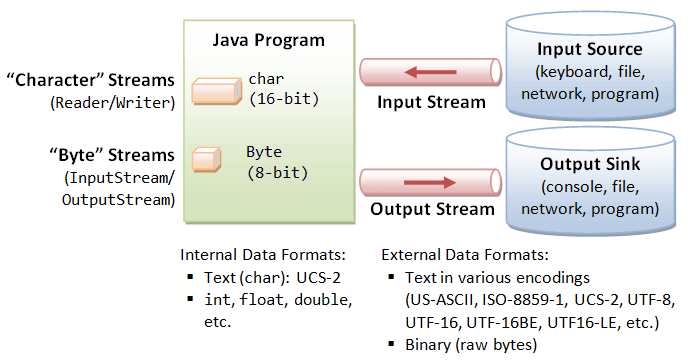
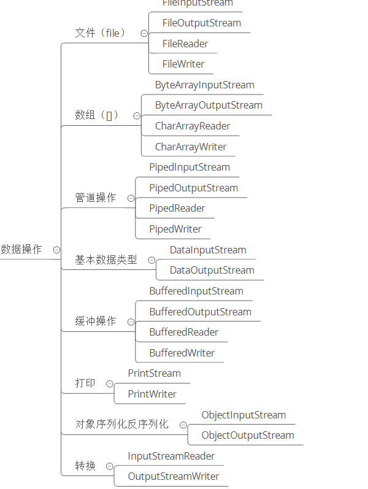
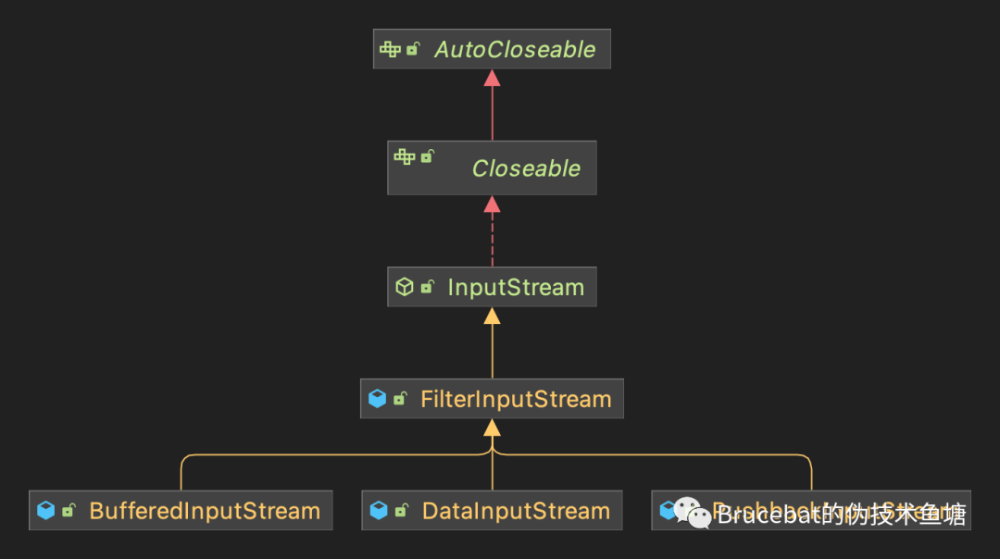

# 1 - Java IO 知识体系&分类&设计模式


------


## 知识体系


------


## 分类

### IO理解分类 - 从传输方式上

从数据传输方式或者说是运输方式角度看，可以将 IO 类分为:

- 字节流
- 字符流

`字节`是个计算机看的，`字符`才是给人看的

**字节流**

(整体结构如下，部分派生类有缺失)


**字符流**

(整体结构如下，部分派生类有缺失)


**字节流和字符流的区别**

- 字节流读取单个字节，字符流读取单个字符(一个字符根据编码的不同，对应的字节也不同，如 UTF-8 编码中文汉字是 3 个字节，GBK编码中文汉字是 2 个字节。)
- 字节流用来处理二进制文件(图片、MP3、视频文件)，字符流用来处理文本文件(可以看做是特殊的二进制文件，使用了某种编码，人可以阅读)。

> 简而言之，字节是给计算机看的，字符才是给人看的。

**字节转字符Input/OutputStreamReader/Writer**

编码就是把字符转换为字节，而解码是把字节重新组合成字符。

如果编码和解码过程使用不同的编码方式那么就出现了乱码。

- GBK 编码中，中文字符占 2 个字节，英文字符占 1 个字节；
- UTF-8 编码中，中文字符占 3 个字节，英文字符占 1 个字节；
- UTF-16be 编码中，中文字符和英文字符都占 2 个字节。

UTF-16be 中的 be 指的是 Big Endian，也就是大端。相应地也有 UTF-16le，le 指的是 Little Endian，也就是小端。

Java 使用双字节编码 UTF-16be，这不是指 Java 只支持这一种编码方式，而是说 char 这种类型使用 UTF-16be 进行编码。char 类型占 16 位，也就是两个字节，Java 使用这种双字节编码是为了让一个中文或者一个英文都能使用一个 char 来存储。




### IO理解分类 - 从数据操作上

从数据来源或者说是操作对象角度看，IO 类可以分为:



**文件**

FileInputStream、FileOutputStream、FileReader、FileWriter

**数组**

- 字节数组(byte[]): ByteArrayInputStream、ByteArrayOutputStream
- 字符数组(char[]): CharArrayReader、CharArrayWriter

**管道操作**

PipedInputStream、PipedOutputStream、PipedReader、PipedWriter

**基本数据类型**

DataInputStream、DataOutputStream

**缓冲操作**

BufferedInputStream、BufferedOutputStream、BufferedReader、BufferedWriter

**打印**

PrintStream、PrintWriter

**对象序列化反序列化**

ObjectInputStream、ObjectOutputStream

**转换**

InputStreamReader、OutputStreamWriter


------


## IO中的设计模式

  总的来看，Java IO类库在进行编码设计时使用两种设计模式：**装饰者模式**和**适配器模式**。这两种模式均属于结构型模式，也就是说IO类库在进行设计时将关注点放在类和对象的组合上。下面我们就来分别分析一下这两种设计模式在IO类库中的使用。

（注：NIO等IO还存在工厂模式、观察者模式等，此处暂时讨论基本IO）

### **装饰者模式**

  使用装饰者模式最大的目的就是在给一个已经存在的对象添加新的功能时，不需要改变现有的数据结构，也即不会出现类的数量爆炸的情况。和一般装饰者模式的使用略有不同的是，IO类库是通过使用一个中间类`FilterInputStream`及其子类来实现对于装饰者模式的使用。下面我们通过IO类库中的`FilterInputStream`及其子类来看一下装饰者模式的使用情况。



  上图是在IO类库中`FilterInputStream`及其子类，让我们结合装饰者模式的基本概念及其编程范式先来看一下`FilterInputStream`。

```java
public
class FilterInputStream extends InputStream {
    /**
     * The input stream to be filtered.
     */
    protected volatile InputStream in;

    protected FilterInputStream(InputStream in) {
        this.in = in;
    }
  
 		... 
}
```

将其他基本方法刨除之后可以看到，在`FilterInputStream`当中引入了一个由外部传入的输入流对象，而这个对象才是`FilterInputStream`及其子类实际操作的数据源。

从代码不难看出，这里遵循了设计模式的两个原则。

- 其一，里氏代换原则，也即面向抽象编程。这里引入的对象类并不是某个明确具体的类，而是所有输入流的父类`InputStream`，这也意味着其所有子类均可作为`FilterStream`及其子类的数据源。
- 其二，合成复用原则，也即使用组合方式来替代继承。这里使用外部引入的输入流对象作为实际的数据源，在进行对应数据源读取之前，`FilterInputSrream`及其子类可以进行额外的数据操作逻辑（是不是感觉有点像代理模式，需要注意这里的逻辑实现是在结构上，而代理模式则是针对对象而言），这里可以简单参考下面的demo案例：

```java
public synchronized int read() throws IOException {
  // 进行前置处理
  int data = super.read();
  // 进行后置处理
  return data;
}
```

相信讲到这里，大家应该能够通过继承`FilterInputStream`来实现一个能够对原生的输入流进行一些功能增强的自定义输入流。


### **适配器模式**

  适配器模式存在的意义是为了解决两个不兼容接口或者是输出目标对象不兼容的兼容性问题。在实际的IO操作中，我们可能会遇到原始数据为字节流，但是却需要使用到字符流相关的API，这里IO类库为我们提供一个现成的适配器工具`InputStreamReader`。这里我们看一下`InputStreamReader`的构造函数：

```java
public InputStreamReader(InputStream in) {
        super(in);
        try {
            sd = StreamDecoder.forInputStreamReader(in, this, (String)null); // ## check lock object
        } catch (UnsupportedEncodingException e) {
            // The default encoding should always be available
            throw new Error(e);
        }
    }

    public InputStreamReader(InputStream in, String charsetName)
        throws UnsupportedEncodingException
    {
        super(in);
        if (charsetName == null)
            throw new NullPointerException("charsetName");
        sd = StreamDecoder.forInputStreamReader(in, this, charsetName);
    }
```

从上面的两个构造函数我们可以看出，这里实际上是将输入的字节流按照默认的编码集或者指定的编码集进行解码操作，在进行实际读取操作的时候将字节数据转换成字符数据。这部分内容的实现全部放置在了`StreamDecoder`当中，这里就不展示具体的代码，有兴趣的同学可以自己阅读一下。在阅读过代码之后会发现，在`InputStreamReader`当中真正进行数据读取操作的实际上是内部引入的`StreamDecode`对象。


