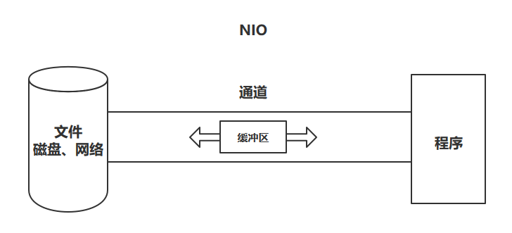
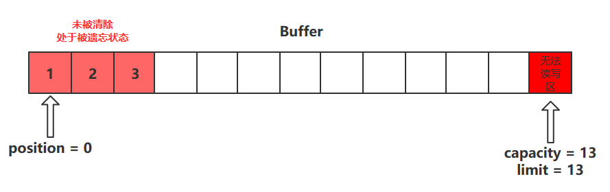
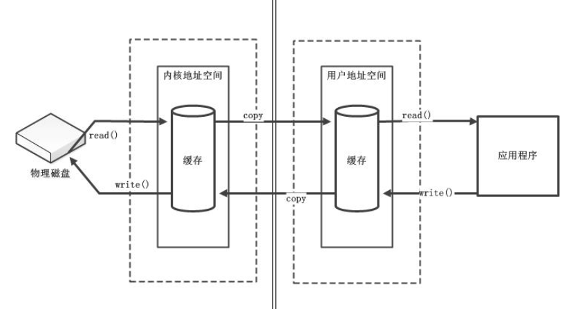

# Netty预备知识1 - Java NIO简介


## 一、简介

Java NIO（New IO）是从Java 1.4版本开始引入的一个新的IO API，**可以替代标准的Java IO API**。NIO与原来的IO有同样的作用和目的，但是使用的方式完全不同，NIO支持**面向缓冲区的、基于通道的IO操作**。NIO将以更加高效的方式进行文件的读写操作。

## 二、IO与NIO的区别

| IO                      | NIO                         |
| ----------------------- | --------------------------- |
| 面向流(Stream Oriented) | 面向缓冲区(Buffer Oriented) |
| 阻塞IO(Blocking IO)     | 非阻塞IO(Non-Blocking IO)   |
|                         | 选择器(Selectors)           |

### 面向流和缓冲区

**IO**

传统IO在传输数据时，根据输入输出的不同需要分别建立不同的链接，而且传输的数据是以流的形式在链接上进行传输的

就像自来水要通过水管将自来水厂和家连接起来一样


**NIO**

NIO在传输数据时，会在输入输出端之间建立**通道**，然后将数据放入到**缓冲区**中。缓冲区通过通道来传输数据

这里通道就像是铁路，能够连通两个地点。缓冲区就像是火车，能够真正地进行数据的传输



## 三、通道与缓冲区

Java NIO系统的核心在于：**通道(Channel)和缓冲区(Buffer)**。通道表示打开到 IO 设备(例如：文件、套接字)的连接。若需要使用 NIO 系统，需要获取用于连接 IO 设备的通道以及用于容纳数据的缓冲区。然后操作缓冲区，对数据进行处理

简而言之，**通道负责传输，缓冲区负责存储**

## 四、缓冲区(Buffer)

### 1、缓冲区类型

Buffer 就像一个数组，可以保存多个相同类型的数据。根据数据类型不同(**boolean 除外**) ，有以下Buffer 常用子类

- ByteBuffer
- CharBuffer
- ShortBuffer
- IntBuffer
- LongBuffer
- FloatBuffer
- DoubleBuffer

**各种类型的缓冲区中，都有一个对应类型的数组**，如

ByteBuffer

```java
final byte[] hb;                  // Non-null only for heap buffers
```

IntBuffer

```java
final int[] hb;                  // Non-null only for heap buffers
```

**他们的继承关系如下**


### 2、获取缓冲区

通过**allocate方法**可以获取一个对应缓冲区的对象，它是缓冲区类的一个静态方法

例

```java
// 获取一个容量大小为1024字节的字节缓冲区
ByteBuffer byteBuffer = ByteBuffer.allocate(1024);
```

### 3、核心属性

缓冲区的父类Buffer中有几个核心属性，如下

```java
// Invariants: mark <= position <= limit <= capacity
private int mark = -1;
private int position = 0;
private int limit;
private int capacity;
```

- capacity：缓冲区的容量。通过构造函数赋予，一旦设置，无法更改
- limit：缓冲区的界限。位于limit 后的数据不可读写。缓冲区的限制不能为负，并且**不能大于其容量**
- position：**下一个**读写位置的索引（类似PC）。缓冲区的位置不能为负，并且**不能大于limit**
- mark：记录当前position的值。**position被改变后，可以通过调用reset() 方法恢复到mark的位置。**

以上四个属性必须满足以下要求

**mark <= position <= limit <= capacity**

### 4、核心方法

#### put()方法

- put()方法可以将一个数据放入到缓冲区中。
- 进行该操作后，postition的值会+1，指向下一个可以放入的位置。capacity = limit ，为缓冲区容量的值。


- flip()方法会**切换对缓冲区的操作模式**，由写->读 / 读->写
- 进行该操作后
  - 如果是写模式->读模式，position = 0 ， limit 指向最后一个元素的下一个位置，capacity不变
  - 如果是读->写，则恢复为put()方法中的值


#### get()方法

- get()方法会读取缓冲区中的一个值
- 进行该操作后，position会+1，如果超过了limit则会抛出异常


#### rewind()方法

- 该方法**只能在读模式下使用**
- rewind()方法后，会恢复position、limit和capacity的值，变为进行get()前的值


#### clear()方法

- clear()方法会将缓冲区中的各个属性恢复为最初的状态，position = 0, capacity = limit
- **此时缓冲区的数据依然存在**，处于“被遗忘”状态，下次进行写操作时会覆盖这些数据



#### mark()和reset()方法

- mark()方法会将postion的值保存到mark属性中
- reset()方法会将position的值改为mark中保存的值

#### 使用展示

```java
public class Demo1 {
	public static void main(String[] args) {
		ByteBuffer byteBuffer = ByteBuffer.allocate(1024);

		System.out.println("放入前参数");
		System.out.println("position " + byteBuffer.position());
		System.out.println("limit " + byteBuffer.limit());
		System.out.println("capacity " + byteBuffer.capacity());
		System.out.println();

		System.out.println("------put()------");
		System.out.println("放入3个数据");
		byte bt = 1;
		byteBuffer.put(bt);
		byteBuffer.put(bt);
		byteBuffer.put(bt);

		System.out.println("放入后参数");
		System.out.println("position " + byteBuffer.position());
		System.out.println("limit " + byteBuffer.limit());
		System.out.println("capacity " + byteBuffer.capacity());
		System.out.println();

		System.out.println("------flip()-get()------");
		System.out.println("读取一个数据");
		// 切换模式
		byteBuffer.flip();
		byteBuffer.get();

		System.out.println("读取后参数");
		System.out.println("position " + byteBuffer.position());
		System.out.println("limit " + byteBuffer.limit());
		System.out.println("capacity " + byteBuffer.capacity());
		System.out.println();

		System.out.println("------rewind()------");
		byteBuffer.rewind();
		System.out.println("恢复后参数");
		System.out.println("position " + byteBuffer.position());
		System.out.println("limit " + byteBuffer.limit());
		System.out.println("capacity " + byteBuffer.capacity());
		System.out.println();

		System.out.println("------clear()------");
		// 清空缓冲区，这里只是恢复了各个属性的值，但是缓冲区里的数据依然存在
		// 但是下次写入的时候会覆盖缓冲区中之前的数据
		byteBuffer.clear();
		System.out.println("清空后参数");
		System.out.println("position " + byteBuffer.position());
		System.out.println("limit " + byteBuffer.limit());
		System.out.println("capacity " + byteBuffer.capacity());
		System.out.println();
		System.out.println("清空后获得数据");
		System.out.println(byteBuffer.get());

	}
}
```

打印结果

```java
放入前参数
position 0
limit 1024
capacity 1024

------put()------
放入3个数据
放入后参数
position 3
limit 1024
capacity 1024

------flip()-get()------
读取一个数据
读取后参数
position 1
limit 3
capacity 1024

------rewind()------
恢复后参数
position 0
limit 3
capacity 1024

------clear()------
清空后参数
position 0
limit 1024
capacity 1024

清空后获得数据
1
```

### 5、非直接缓冲区和直接缓冲区

#### 非直接缓冲区

通过**allocate()**方法获取的缓冲区都是非直接缓冲区。这些缓冲区是建立在JVM**堆内存**之中的。

```java
public static ByteBuffer allocate(int capacity) {
    if (capacity < 0)
    throw new IllegalArgumentException();

    // 在堆内存中开辟空间
    return new HeapByteBuffer(capacity, capacity);
}

HeapByteBuffer(int cap, int lim) {        // package-private
    // new byte[cap] 创建数组，在堆内存中开辟空间
    super(-1, 0, lim, cap, new byte[cap], 0);
    /*
    hb = new byte[cap];
    offset = 0;
    */
}
```



通过非直接缓冲区，想要将数据写入到物理磁盘中，或者是从物理磁盘读取数据。**都需要经过JVM和操作系统**，数据在两个地址空间中传输时，会**copy**一份保存在对方的空间中。所以费直接缓冲区的读取效率较低

#### 直接缓冲区

**只有ByteBuffer可以获得直接缓冲区**，通过allocateDirect()获取的缓冲区为直接缓冲区，这些缓冲区是建立在**物理内存**之中的。

```java
public static ByteBuffer allocateDirect(int capacity) {
    return new DirectByteBuffer(capacity);
}

DirectByteBuffer(int cap) {                   // package-private
	...
    // 申请物理内存
	boolean pa = VM.isDirectMemoryPageAligned();
	...
}
```


直接缓冲区通过在操作系统和JVM之间创建**物理内存映射文件**加快缓冲区数据读/写入物理磁盘的速度。放到物理内存映射文件中的数据就不归应用程序控制了，操作系统会自动将物理内存映射文件中的数据写入到物理内存中

## 五、通道(Channel)

### 1、简介

Channel由java.nio.channels 包定义的。Channel 表示**IO 源与目标打开的连接**。Channel 类似于传统的“流”。只不过**Channel 本身不能直接访问数据，Channel 只能与Buffer 进行交互**

### 2、图解

应用程序进行读写操作调用函数时，**底层调用的操作系统提供给用户的读写API**，调用这些API时会生成对应的指令，CPU则会执行这些指令。在计算机刚出现的那段时间，**所有读写请求的指令都有CPU去执行**，过多的读写请求会导致CPU无法去执行其他命令，从而CPU的利用率降低


后来，**DMA**(Direct Memory Access，直接存储器访问)出现了。当IO请求传到计算机底层时，**DMA会向CPU请求，让DMA去处理这些IO操作**，从而可以让CPU去执行其他指令。DMA处理IO操作时，会请求获取总线的使用权。**当IO请求过多时，会导致大量总线用于处理IO请求，从而降低效率**


于是便有了**Channel(通道)**，Channel相当于一个**专门用于IO操作的独立处理器**，它具有独立处理IO请求的能力，当有IO请求时，它会自行处理这些IO请求


### 3、Java Channel

#### 常用实现类

本地文件IO

- - FileChannel
- 网络IO
  - SocketChanel、ServerSocketChannel：用于TCP传输
  - DatagramChannel：用于UDP传输

#### 获得通道的方法

获取通道的一种方式是对支持通道的**对象调用getChannel() 方法**。支持通道的类如下：

- FileInputStream
- FileOutputStream
- RandomAccessFile
- DatagramSocket
- Socket
- ServerSocket

```java
public class Demo2 {
   public static void main(String[] args) throws IOException {
      // 本地通道
      FileInputStream fileInputStream = new FileInputStream("");
      FileChannel channel1 = fileInputStream.getChannel();

      FileOutputStream fileOutputStream = new FileOutputStream("");
      FileChannel channel2 = fileOutputStream.getChannel();
   
      // 网络通道
      Socket socket = new Socket();
      SocketChannel channel3 = socket.getChannel();
      
      ServerSocket serverSocket = new ServerSocket();
      ServerSocketChannel channel4 = serverSocket.getChannel();

      DatagramSocket datagramSocket = new DatagramSocket();
      DatagramChannel channel5 = datagramSocket.getChannel();
       
      // 最后要关闭通道
       
   }
}
```

**也可以通过通道的静态方法open()来获取**

```java
public static void main(String[] args) throws IOException {
   FileChannel open = FileChannel.open(Paths.get(""));
   
   SocketChannel open1 = SocketChannel.open();
   
   ...
}
```

#### getChannel()+非直接缓冲区

- getChannel()获得通道
- allocate()获得**非直接缓冲区**

通过非直接缓冲区读写数据，需要通过通道来传输缓冲区里的数据

```java
public class Demo4 {
   public static void main(String[] args) {
      FileInputStream is = null;
      FileOutputStream os = null;
      // 获得通道
      FileChannel inChannel = null;
      FileChannel outChannel = null;
       
      // 利用 try-catch-finally 保证关闭
      try {
         is = new FileInputStream("F:\\JDKLearning\\src\\main\\NIO\\day1\\1.jpg");
         os = new FileOutputStream("F:\\JDKLearning\\src\\main\\NIO\\day1\\2.jpg");

         // 获得通道
         inChannel = is.getChannel();
         outChannel = os.getChannel();

         // 获得缓冲区，用于在通道中传输数据
         ByteBuffer byteBuffer = ByteBuffer.allocate(1024);

         // 循环将字节数据放入到buffer中，然后写入磁盘中
         while (inChannel.read(byteBuffer) != -1) {
            // 切换模式
            byteBuffer.flip();
            outChannel.write(byteBuffer);
            byteBuffer.clear();
         }
      } catch (IOException e) {
         e.printStackTrace();
      } finally {
         if (inChannel != null) {
            try {
               inChannel.close();
            } catch (IOException e) {
               e.printStackTrace();
            }
         }
         if (outChannel != null) {
            try {
               outChannel.close();
            } catch (IOException e) {
               e.printStackTrace();
            }
         }
         if (is != null) {
            try {
               is.close();
            } catch (IOException e) {
               e.printStackTrace();
            }
         }
         if (os != null) {
            try {
               os.close();
            } catch (IOException e) {
               e.printStackTrace();
            }
         }
      }
   }
}
```

**图片读取后，被写入到了指定位置**

#### open()+直接缓冲区

- 通过open获得通道
- 通过FileChannel.map()获取直接缓冲区

使用直接缓冲区时，无需通过通道来传输数据，直接将数据放在缓冲区内即可

```java
public class Demo5 {
   public static void main(String[] args) throws IOException {
      // 通过open()方法来获得通道
      FileChannel inChannel = FileChannel.open(Paths.get("F:\\JDKLearning\\src\\main\\NIO\\day1\\1.jpg"), StandardOpenOption.READ);

      // outChannel需要为 READ WRITE CREATE模式
      // READ WRITE是因为后面获取直接缓冲区时模式为READ_WRITE模式
      // CREATE是因为要创建新的文件
      FileChannel outChannel = FileChannel.open(Paths.get("F:\\JDKLearning\\src\\main\\NIO\\day1\\3.jpg"), StandardOpenOption.READ, StandardOpenOption.WRITE, StandardOpenOption.CREATE);

      // 获得直接缓冲区
      MappedByteBuffer inMapBuf = inChannel.map(FileChannel.MapMode.READ_ONLY, 0, inChannel.size());
      MappedByteBuffer outMapBuf = outChannel.map(FileChannel.MapMode.READ_WRITE, 0, inChannel.size());

      // 字节数组
      byte[] bytes = new byte[inMapBuf.limit()];

      // 因为是直接缓冲区，可以直接将数据放入到内存映射文件，无需通过通道传输
      inMapBuf.get(bytes);
      outMapBuf.put(bytes);

      // 关闭缓冲区，这里没有用try-catch-finally
      inChannel.close();
      outChannel.close();
   }
}
```

**运行结果，图片被创建**

#### 通道间直接传输

```java
public static void channelToChannel() throws IOException {
   long start = System.currentTimeMillis();
   // 通过open()方法来获得通道
   FileChannel inChannel = FileChannel.open(Paths.get("F:\\JDKLearning\\src\\main\\NIO\\day1\\1.mp4"), StandardOpenOption.READ);

   // outChannel需要为 READ WRITE CREATE模式
   // READ WRITE是因为后面获取直接缓冲区时模式为READ_WRITE模式
   // CREATE是因为要创建新的文件
   FileChannel outChannel = FileChannel.open(Paths.get("F:\\JDKLearning\\src\\main\\NIO\\day1\\4.mp4"), StandardOpenOption.READ, StandardOpenOption.WRITE, StandardOpenOption.CREATE);

   // 通道间直接传输
   inChannel.transferTo(0, inChannel.size(), outChannel);
   // 对应的还有transferFrom
   // outChannel.transferFrom(inChannel, 0, inChannel.size());

   inChannel.close();
   outChannel.close();
}
```

#### 直接缓冲区VS非直接缓冲区

**效率**

读取一个MP4文件，通过二者花费时间的多少来判定执行的速度

```java
// getChannel() + 非直接缓冲区耗时
708
// open() + 直接缓冲区耗时
115
// channel transferTo channel耗时
47
```

**内存占用**

直接缓冲区的读写速度虽然很快，但是会占用很多很多内存空间。如果文件过大，会使得计算机运行速度变慢

### 4、分散和聚集

#### 分散读取

分散读取（Scattering Reads）是指**从Channel 中读取的数据“分散”到多个Buffer 中**

**注意**：按照缓冲区的**顺序**，从Channel 中读取的数据依次将 Buffer 填满


#### 聚集写入

聚集写入（Gathering Writes）是指将**多个Buffer 中的数据“聚集”到Channel**

按照缓冲区的**顺序**，写入position 和limit 之间的数据到Channel


**代码**

```java
public class Demo2 {
   public static void main(String[] args) throws IOException {
      FileInputStream is = new FileInputStream("F:\\JDKLearning\\src\\main\\nio\\day2\\计划.txt");
      FileOutputStream os = new FileOutputStream("F:\\JDKLearning\\src\\main\\nio\\day2\\计划2.txt");

      FileChannel inChannel = is.getChannel();
      FileChannel outChannel = os.getChannel();

      // 获得多个缓冲区，并且放入到缓冲区数组中
      ByteBuffer byteBuffer1 = ByteBuffer.allocate(50);
      ByteBuffer byteBuffer2 = ByteBuffer.allocate(1024);
      ByteBuffer[] byteBuffers = {byteBuffer1, byteBuffer2};

      // 分散读取
      inChannel.read(byteBuffers);
      
      byteBuffer1.flip();
      byteBuffer2.flip();
      
      // 聚集写入
      outChannel.write(byteBuffers);
   }
}
```


## 六、非阻塞式网络通信

### 1、概念

#### 举例

双11买的快递到了，快递小哥给你打电话说马上到小区门口，麻烦在门口等一下，方便签收快递

- 若为**阻塞式**的，你到了小区门口以后，快递小哥还没到的期间，你什么事儿也做不了
- 若为**非阻塞式**的，快递小哥将快递放到门卫处，门卫给你发消息说快递到了，麻烦去取一下。当快递还没到的时候你可以做你自己的事儿

#### 阻塞式网络通信

传统的IO 流都是阻塞式的。也就是说，当一个线程调用read() 或write() 时，**该线程被阻塞**，直到有一些数据被读取或写入，该线程在此期间不能执行其他任务

因此，在完成网络通信进行IO 操作时，由于线程会阻塞，所以**服务器端必须为每个客户端都提供一个独立的线程进行处理**，当服务器端需要处理大量客户端时，**性能急剧下降**

也就是说，服务器在等待IO准备就绪的期间，**线程处于阻塞状态**，若为单线程，等待期间CPU未执行任何任务，效率降低。所以需要开启多个线程，当某些线程因为等待IO准备就绪时，CPU可以去执行其他线程中的任务。但是线程的创建、切换与销毁的开销也是不小的。当大量的任务到来时，服务器性能也急剧下降。


#### 非阻塞式网络通信

Java NIO 是非阻塞模式的。当线程从某通道进行读写数据时，**若没有数据可用时，该线程可以进行其他任务**。线程通常将非阻塞IO 的空闲时间用于在其他通道上执行IO 操作，所以**单独的线程可以管理多个输入和输出通道**

因此，NIO 可以让服务器端**使用一个或有限几个线程来同时处理连接到服务器端的所有客户端**


### 2、使用

#### 阻塞式网络通信演示

```java
public class Demo1 {
   public static void main(String[] args) throws IOException {
      Thread thread1 = new Thread(()->{
         try {
            server();
         } catch (IOException e) {
            e.printStackTrace();
         }
      });

      Thread thread2 = new Thread(()->{
         try {
            client();
         } catch (IOException e) {
            e.printStackTrace();
         }
      });

      thread1.start();
      thread2.start();
   }

   public static void client() throws IOException {
      // 创建客户端通道
      SocketChannel socketChannel = SocketChannel.open(new InetSocketAddress("127.0.0.1", 2022));

      // 读取信息
      FileChannel fileChannel = FileChannel.open(Paths.get("F:\\JDKLearning\\src\\main\\nio\\day3\\1.jpg"), StandardOpenOption.READ);

      // 创建缓冲区
      ByteBuffer byteBuffer = ByteBuffer.allocate(1024);

      // 写入数据
      while (fileChannel.read(byteBuffer) != -1) {
         byteBuffer.flip();
         socketChannel.write(byteBuffer);
         byteBuffer.clear();
      }

      fileChannel.close();
      socketChannel.close();
   }

   public static void server() throws IOException {
      // 创建服务端通道
      ServerSocketChannel serverSocketChannel = ServerSocketChannel.open();

      FileChannel fileChannel = FileChannel.open(Paths.get("F:\\JDKLearning\\src\\main\\nio\\day3\\2.jpg"), StandardOpenOption.WRITE, StandardOpenOption.CREATE);

      // 绑定链接
      serverSocketChannel.bind(new InetSocketAddress(2022));

      // 获取客户端的通道
      SocketChannel socketChannel = serverSocketChannel.accept();

      // 创建缓冲区
      ByteBuffer byteBuffer = ByteBuffer.allocate(1024);

      while (socketChannel.read(byteBuffer) != -1) {
         byteBuffer.flip();
         fileChannel.write(byteBuffer);
         byteBuffer.clear();
      }

      socketChannel.close();
      fileChannel.close();
      serverSocketChannel.close();
   }
}
```

#### 非阻塞式网络通信演示

```java
public class DemoNIO {
	public static void main(String[] args) {
		Thread thread1 = new Thread(()->{
			try {
				server();
			} catch (IOException e) {
				e.printStackTrace();
			}
		});

		Thread thread2 = new Thread(()->{
			try {
				client();
			} catch (IOException e) {
				e.printStackTrace();
			}
		});
		thread1.start();
		thread2.start();
	}

	public static void client() throws IOException {
		SocketChannel socketChannel = SocketChannel.open(new InetSocketAddress("127.0.0.1", 2020));

		// 设置为非阻塞模式
		socketChannel.configureBlocking(false);

		ByteBuffer byteBuffer = ByteBuffer.allocate(1024);

		Scanner scanner = new Scanner(System.in);
		while (scanner.hasNext()) {
			String str = scanner.next();
			byteBuffer.put(str.getBytes());
			byteBuffer.flip();
			socketChannel.write(byteBuffer);
			byteBuffer.clear();
		}

		byteBuffer.clear();

		socketChannel.close();
	}

	public static void server() throws IOException {
		ServerSocketChannel serverSocketChannel = ServerSocketChannel.open();
		serverSocketChannel.configureBlocking(false);
		serverSocketChannel.bind(new InetSocketAddress(2020));

		// 获得选择器
		Selector selector = Selector.open();

		// 将通道注册到选择器中，设定为接收操作
		serverSocketChannel.register(selector, SelectionKey.OP_ACCEPT);

		// 轮训接受
		while (selector.select() > 0) {
			Iterator<SelectionKey> iterator = selector.selectedKeys().iterator();
			// 获得事件的key
			while (iterator.hasNext()) {
				SelectionKey key = iterator.next();
				if (key.isAcceptable()) {
					SocketChannel socketChannel = serverSocketChannel.accept();
					socketChannel.configureBlocking(false);
					socketChannel.register(selector, SelectionKey.OP_READ);
				} else if (key.isReadable()) {
					// 从选择器中获取通道
					SocketChannel socketChannel = (SocketChannel) key.channel();

					ByteBuffer byteBuffer = ByteBuffer.allocate(10);

					while (socketChannel.read(byteBuffer) != -1) {
						int len = byteBuffer.limit();
						byteBuffer.flip();
						System.out.println(new String(byteBuffer.array(), 0, len));
						byteBuffer.clear();
					}
					socketChannel.close();
				}
				iterator.remove();
			}
		}
		serverSocketChannel.close();
	}
}
```

##### 选择器

选择器（Selector）是**SelectableChannle** 对象的多路复用器，Selector 可以同时监控多个SelectableChannel 的IO 状况，也就是说，利用Selector 可使一个单独的线程管理多个Channel。**Selector 是非阻塞IO 的核心**


**选择器的创建**

```java
// 创建一个选择器
Selector selector = Selector.open();
```

**绑定选择器**

通过调用通道的register方法可以绑定选择器，register方法有两个参数

- Selector：即绑定哪个选择器

- ops：监听事件类型。ops有4个值可以选择，为**SelectionKey**的静态属性

  

```java
// 让选择器监听一种状态
myChannel.register(selector, SelectionKey.OP_READ);
// 让选择器监听多种状态
myChannel.register(selector, SelectionKey.OP_READ | SelectionKey.OP_ACCEPT);
```


**SelectionKey**

**表示SelectableChannel 和Selector 之间的注册关系**。每次向选择器注册通道时就会选择一个事件(选择键)。选择键包含两个表示为整数值的操作集。操作集的每一位都表示该键的通道所支持的一类可选择操作