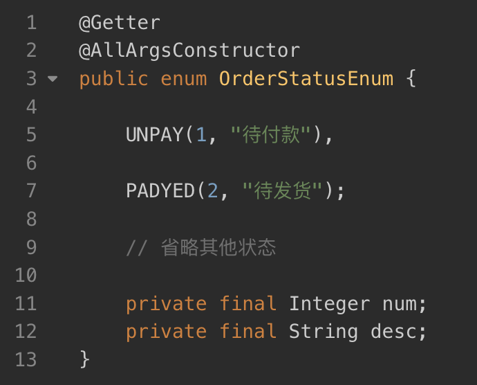

# 都有常量了，为啥还要有枚举？


常量存在的问题：

1、参数值得不到约束（存在非法传值）

2、对程序员提示不够友好（不知道传递的数值是什么含义）

例如以下常量

```java
public class Sex1 {
	public static final  int BOY = 0;
	public static final  int GIRL = 1;
}
```

使用常量：`select(Sex1.BOY);`

不明含义：select(0);

非法传值：select(2);


```JAVA
public enum Sex2 {
	BOY, GIRL;
}
```

使用：`select(Sex2.BOY);`

对枚举类反编译，其实枚举本质就是一个存放常量且不能继承的，不能对外创建对象的类

```JAVA
public final class Sex2 {
	public static final  Sex2 BOY = new Sex2();
	public static final  Sex2 GIRL = new Sex2();
    
    private Sex2() {
    }
}
```

枚举的优势：

1、参数得到约束

2、对程序员提示友好

3、switch对其支持得很友好


枚举毕竟是对象，对象能玩的它都能玩，而常量类只能提供一个个字段变量，是很单薄的。

当然不是常量的定义就此无用，有些情况还是建议用常量的


## 对象 VS 字段

日常开发中，大家对这俩货的认识，其实都仅仅停留在“可穷尽状态集合”的层面。什么意思呢？就是当你发现某个字段存在有限的若干种状态时，你就下意识地选择使用常量类或者枚举。比如对于订单状态，你可以用枚举表示：



也可以用常量表示：


有些人可能更骚一点：


但实际上，**枚举和常量不是一个维度的东西，枚举是对象，常量是字段。**常量能做的，枚举都能做，枚举能做的常量不一定能做。比如，枚举可以实现自定义的方法：


上面逻辑如果用常量类来做，就是这样：


**但上面计算价格的逻辑不能复用，需要计算会员价格时，就要拷贝一份上面的代码。**当然，你可能会抽取到[工具类](https://www.zhihu.com/search?q=工具类&search_source=Entity&hybrid_search_source=Entity&hybrid_search_extra={"sourceType"%3A"answer"%2C"sourceId"%3A2435277785})中，但既然如此为什么不直接用枚举呢？枚举状态和计算方法放在一块，统一性更强、更合理。

这里并不是为了突出枚举优点而一味贬低常量类，只是想和大家说，枚举毕竟是对象，对象能玩的它都能玩，而常量类只能提供一个个[字段变量](https://www.zhihu.com/search?q=字段变量&search_source=Entity&hybrid_search_source=Entity&hybrid_search_extra={"sourceType"%3A"answer"%2C"sourceId"%3A2435277785})，是很单薄的。

## [入参约束](https://www.zhihu.com/search?q=入参约束&search_source=Entity&hybrid_search_source=Entity&hybrid_search_extra={"sourceType"%3A"answer"%2C"sourceId"%3A2435277785})

对于常量，其实很难**约束调用者**按你的意图传参。比如上面计算会员价格：


你并不能约束我传 666，尽管666不代表任何一种会员类型

但枚举不仅可以约束入参，还能很好的提示调用者：


## 搭配switch，结构更清晰

这个理由其实是网上找的，switch和[if else](https://www.zhihu.com/search?q=if else&search_source=Entity&hybrid_search_source=Entity&hybrid_search_extra={"sourceType"%3A"answer"%2C"sourceId"%3A2435277785})，我觉得八斤八两。


## 什么时候用枚举、什么时候用常量？

最后说一下个人平时对枚举和常量类的取舍：

- 错误码的定义用枚举
- 字段状态用枚举或常量类都可以，个人更倾向于使用枚举，可玩性会比常量类高
- 一些全局变量的定义可以使用常量类，比如USER_INFO_CACHE_KEY、SESSION_KEY