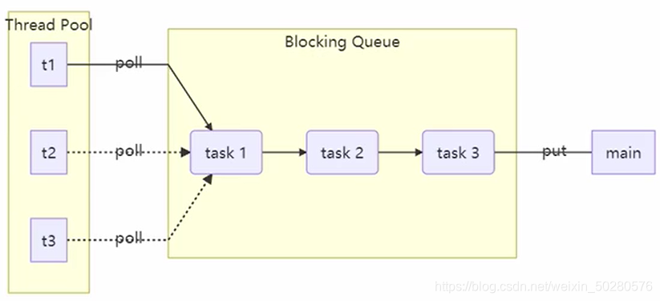
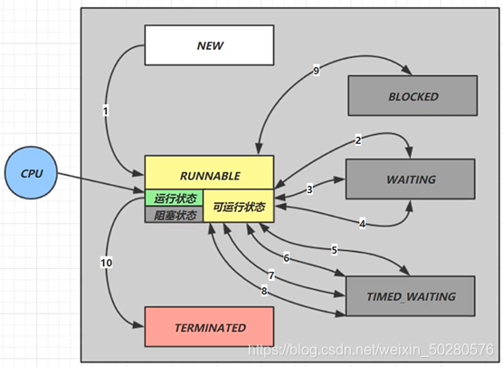
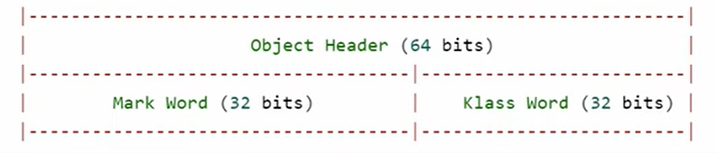
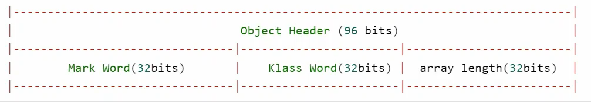
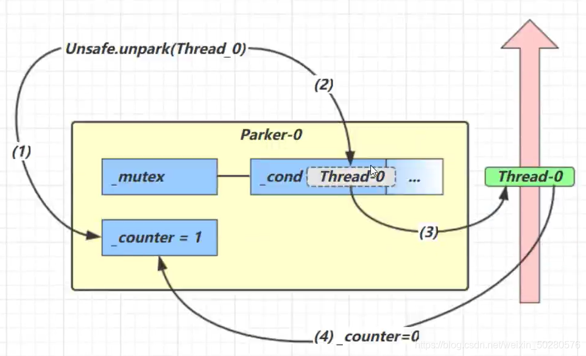

# Java 并发编程 1 - Synchronized 、LockSupport 、ReentrantLock 原理


## 一、基本概念

### 1、进程与线程

**进程**

- 程序由指令和数据组成，但这些指令要运行，数据要读写，就必须将指令加载至 CPU，数据加载至内存。在指令运行过程中还需要用到磁盘、网络等设备。进程就是用来加载指令、管理内存、管理 IO 的。
- 当一个程序被运行，从磁盘加载这个程序的代码至内存，这时就开启了一个进程。
- 进程就可以视为程序的一个实例。大部分程序可以同时运行多个实例进程（例如记事本、画图、浏览器 等），也有的程序只能启动一个实例进程（例如网易云音乐、360 安全卫士等）

**线程**

- 一个进程之内可以分为一到多个线程。
- 一个线程就是一个指令流，将指令流中的一条条指令以一定的顺序交给 CPU 执行 。
- Java 中，线程作为小调度单位，进程作为资源分配的最小单位。 在 windows 中进程是不活动的，只是作 为线程的容器

**两者对比**

- 进程基本上相互独立的，而线程存在于进程内，是进程的一个子集 进程拥有共享的资源，如内存空间等，供其内部的线程共享
  - 进程间通信较为复杂 同一台计算机的进程通信称为 IPC（Inter-process communication）
  - 不同计算机之间的进程通信，需要通过网络，并遵守共同的协议，例如 HTTP
- 线程通信相对简单，因为它们共享进程内的内存，一个例子是多个线程可以访问同一个共享变量 线程更轻量，线程上下文切换成本一般上要比进程上下文切换低

### 2、并发与并行

并发是一个CPU在不同的时间去不同线程中执行指令。
并行是多个CPU同时处理不同的线程。
引用 Rob Pike 的一段描述：

- 并发（concurrent）是同一时间应对（dealing with）多件事情的能力
- 并行（parallel）是同一时间动手做（doing）多件事情的能力

### 3、应用

**同步和异步的概念**
以调用方的角度讲，如果

- 需要等待结果返回才能继续运行的话就是**同步**
- 不需要等待就是**异步**

1）设计
多线程可以使方法的执行变成异步的，比如说读取磁盘文件时，假设读取操作花费了5秒，如果没有线程的调度机制，那么 cpu 只能等 5 秒，啥都不能做。
\2) 结论
比如在项目中，视频文件需要转换格式等操作比较费时，这时开一个新线程处理视频转换，避免阻塞主线程
tomcat 的异步 servlet 也是类似的目的，让用户线程处理耗时较长的操作，避免阻塞 tomcat 的工作线程
ui 程序中，开线程进行其他操作，避免阻塞 ui 线程

### 结论

1） 单核 cpu 下，多线程不能实际提高程序运行效率，只是为了能够在不同的任务之间切换，不同线程轮流使用 cpu ，不至于一个线程总占用 cpu，别的线程没法干活
2）多核 cpu 可以并行跑多个线程，但能否提高程序运行效率还是要分情况的

- 有些任务，经过精心设计，将任务拆分，并行执行，当然可以提高程序的运行效率。但不是所有计算任 务都能拆分（参考后文的【阿姆达尔定律】）
- 也不是所有任务都需要拆分，任务的目的如果不同，谈拆分和效率没啥意义

3）IO 操作不占用 cpu，只是我们一般拷贝文件使用的是【阻塞 IO】，这时相当于线程虽然不用 cpu，但需要一 直等待 IO 结束，没能充分利用线程。所以才有后面的【非阻塞 IO】和【异步 IO】优化

## 二、Java 线程

### 1、线程创建与运行

**方法一，使用 Thread**

```java
public static void main(String[] args) {
        // 匿名内部类方式创建 Thread
        Thread t = new Thread("t1") {
            @Override
            public void run() {
                log.debug("running");
            }
        };
        
        t.start();
        log.debug("running");
    }
123456789101112
```

**方法二，使用 Runnable 配合 Thread（推荐）**

```java
public static void main(String[] args) {
        // 使用 lambda 表达式，因为 Runnable 接口 
        // 标注了 @FunctionalInterface 这个注解，表示是一个函数式接口，可以使用 lambda 表达式
        Runnable r = () -> log.debug("running");
        new Thread(r, "t1").start();
    }
123456
```

**比较方法一和方法二：**
方法 1 是把线程和任务合并在了一起
方法 2 是把线程和任务分开了，用 Runnable 更容易与线程池等高级 API 配合，用 Runnable 让任务类脱离了 Thread 继承体系，更灵活。
通过查看源码可以发现，方法二其实还是通过使用 Thread 类中的 run 方法执行的！
**方法三，FutureTask 配合 Thread**

```java
public static void main(String[] args) throws ExecutionException, InterruptedException {
        // 1. 使用 FutureTask 传入 Callable 接口方式创建
        FutureTask<Integer> future = new FutureTask<Integer>(() -> {
            log.debug("running...");
            Thread.sleep(2000); // 休眠
            return 100;
        });
        // 2. 传入 future, 因为 FutureTask 这个类是实现了 RunnableFuture 接口，RunnableFuture 继承了 Runnable 接口
        Thread t1 = new Thread(future, "t1");
        t1.start();
        // 3. 获取返回结果时
        // 当主线程获取 t1 线程的返回值时, 需要等 2 秒，此时主线程进入阻塞状态
        log.debug("{}",  future.get());
    }
1234567891011121314
```

Future 就是对于具体的 Runnable 或者 Callable 任务的执行结果进行取消、查询是否完成、获取结果。必要时可以通过 get 方法获取执行结果，该方法会阻塞直到任务返回结果。

```java
public interface Future<V> {
	// 取消任务
	boolean cancel(boolean mayInterruptIfRunning);
	// 获取任务执行结果
	V get() throws InterruptedException, ExecutionException;
	// 获取任务执行结果，带有超时时间限制
	V get(long timeout, TimeUnit unit) throws InterruptedException,                             ExecutionException,  TimeoutException;
	// 判断任务是否已经取消
	boolean isCancelled();
	// 判断任务是否已经结束
	boolean isDone();
}
123456789101112
```

FutureTask 类是 Future 接口和 Runable 接口的实现弥补 runnable 创建线程没有返回值的缺陷，[点这里了解](https://mp.weixin.qq.com/s/RX5rVuGr6Ab0SmKigmZEag)

### 2、线程运行原理

**栈与栈帧**
拟机栈描述的是Java方法执行的内存模型：
每个方法被执行的时候都会同时创建一个栈帧(stack frame)用于存储局部变量表、操作数栈、动态链接、方法出口等信息，是属于线程的私有的。
当java中使用多线程时，每个线程都会维护它自己的栈帧！每个线程只能有一个活动栈帧，对应着当前正在执行的那个方法，当方法执行完会来到栈帧中的方法出口地址位置，然后从栈中 pop 出栈帧。
**线程上下文切换（Thread Context Switch）**
因为以下一些原因导致 cpu 不再执行当前的线程，转而执行另一个线程的代码
**被动原因：**

- 线程的 cpu 时间片用完(每个线程轮流执行，看前面并行的概念)
- 垃圾回收
- 有更高优先级的线程需要运行

**主动原因：**

- 线程自己调用了 sleep、yield、wait、join、park、synchronized、lock 等方法

当 Context Switch 发生时，需要由操作系统保存当前线程的状态，并恢复另一个线程的状态，Java 中对应的概念 就是程序计数器（Program Counter Register），它的作用是记住下一条 jvm 指令的执行地址，是线程私有的。

### 3、Thread 的常见方法

| 方法名           | static | 功能说明                                                     | 注意                                                         |
| ---------------- | ------ | ------------------------------------------------------------ | ------------------------------------------------------------ |
| start()          |        | 启动一个新线程，在新线程中运行 run 方法中的代码              | start 方法只是让线程进入就绪状态，里面代码不一定立刻运行，只有当 CPU 将时间片分给线程时，才能进入运行状态，执行代码。每个线程的 start 方法只能调用一次，调用多次就会出现 IllegalThreadStateException |
| run()            |        | 新线程启动会调用的方法                                       | 如果在构造 Thread 对象时传递了 Runnable 参数，则线程启动后会调用 Runnable 中的 run 方法，否则默认不执行任何操作。但可以创建 Thread 的子类对象，来覆盖默认行为 |
| join()           |        | 等待线程运行结束                                             |                                                              |
| join(long n)     |        | 等待线程运行结束,最多等待 n 毫秒                             |                                                              |
| getId()          |        | 获取线程长整型的 id                                          | id 唯一                                                      |
| getName()        |        | 获取线程名                                                   |                                                              |
| setName(String)  |        | 修改线程名                                                   |                                                              |
| getPriority()    |        | 获取线程优先级                                               |                                                              |
| setPriority(int) |        | 修改线程优先级                                               | java中规定线程优先级是1~10 的整数，较大的优先级能提高该线程被 CPU 调度的机率 |
| getState()       |        | 获取线程状态                                                 | Java 中线程状态是用 6 个 enum 表示，分别为：NEW, RUNNABLE, BLOCKED, WAITING, TIMED_WAITING, TERMINATED |
| isInterrupted()  |        | 判断是否被打断                                               | 不会清除 打断标记                                            |
| isAlive()        |        | 线程是否存活（还没有运行完毕）                               |                                                              |
| interrupt()      |        | 打断线程                                                     | 如果被打断线程正在 sleep，wait，join 会导致被打断的线程抛出 InterruptedException，并清除 打断标记 ；如果打断的正在运行的线程，则会设置 打断标记，park 的线程被打断，也会设置 打断标记 |
| interrupted()    | static | 判断当前线程是否被打断                                       | 会清除 打断标记                                              |
| currentThread()  | static | 获取当前正在执行的线程                                       |                                                              |
| sleep(long n)    | static | 让当前执行的线程休眠n毫秒，休眠时让出 cpu 的时间片给其它线程 |                                                              |
| yield()          | static | 提示线程调度器让出当前线程对CPU的使用                        | 主要是为了测试和调试                                         |

#### 1）start() VS run()

直接调用 run() 方法

```java
public static void main(String[] args) {

        Thread t1 = new Thread(new Runnable() {
            @Override
            public void run() {
                log.info(Thread.currentThread().getName() + " running....");
            }
        }, "t1");

        // 测试通过 Thread 类实例 t1 对象直接调用 run 方法
        t1.run();

        log.info(Thread.currentThread().getName() + " running...");
    }
1234567891011121314
```

结果

```java
14:56:56 [main] c.Code_05_Test - main running....
14:56:56 [main] c.Code_05_Test - main running...
12
```

调用 start() 方法

```java
public static void main(String[] args) {

        Thread t1 = new Thread(new Runnable() {
            @Override
            public void run() {
                log.info(Thread.currentThread().getName() + " running....");
            }
        }, "t1");

        // 测试通过 Thread 类实例 t1 对象直接调用 run 方法
//        t1.run();
        // 调用 start 方法
        t1.start();

        log.info(Thread.currentThread().getName() + " running...");
    }
12345678910111213141516
```

结果

```java
14:59:35 [main] c.Code_05_Test - main running...
14:59:35 [t1] c.Code_05_Test - t1 running....

123
```

发现两种结果是不一样的，使用 start 方式，CPU 会为创建的线程分配时间片，线程进入运行状态，然后线程调用 run 方法执行逻辑。直接使用 run 的方式，虽然会创建了线程，但是它是直接调用方法，而不是像 start 方式那样触发的，这个线程对象会处一直处在新建状态，从结果上也可以看出，run 方法是 main 线程调用，而不是 t1 线程。

#### 2）sleep()与yield()

**sleep (使线程阻塞)**

1. 调用 sleep 会让当前线程从 Running 进入 Timed Waiting 状态（阻塞），可通过state()方法查看
2. 其它线程可以使用 interrupt 方法打断正在睡眠的线程，这时 sleep 方法会抛出 InterruptedException
3. 睡眠结束后的线程未必会立刻得到执行
4. 建议用 TimeUnit 的 sleep 代替 Thread 的 sleep 来获得更好的可读性

**yield （让出当前线程）**

1. 调用 yield 会让当前线程从 Running 进入 Runnable 就绪状态（仍然有可能被执行），然后调度执行其它线程
2. 具体的实现依赖于操作系统的任务调度器

**线程优先级**
线程优先级会提示（hint）调度器优先调度该线程，但它仅仅是一个提示，调度器可以忽略它 如果 cpu 比较忙，那么优先级高的线程会获得更多的时间片，但 cpu 闲时，优先级几乎没作用

#### 3）join() 方法

用于等待某个线程结束。哪个线程内调用join()方法，就等待哪个线程结束，然后再去执行其他线程。
如在主线程中调用ti.join()，则是主线程等待t1线程结束，join 采用同步。

```java
Thread t1 = new Thread();
//等待 t1 线程执行结束
t1.join();
// 最多等待 1000ms,如果 1000ms 内线程执行完毕，则会直接执行下面的语句，不会等够 1000ms
t1.join(1000);
12345
```

#### 4）interrupt() 方法

**interrupt 打断线程有两种情况，如下：**

- 如果一个线程在在运行中被打断，打断标记会被置为 true 。
- 如果是打断因sleep wait join 方法而被阻塞的线程，会将打断标记置为 false 。

**isInterrupted() 与 interrupted() 比较，如下：**
首先，isInterrupted 是实例方法，interrupted 是静态方法，它们的用处都是查看当前打断的状态，但是 isInterrupted 方法查看线程的时候，不会将打断标记清空，也就是置为 false，interrupted 查看线程打断状态后，会将打断标志置为 false，也就是清空打断标记，简单来说，interrupt() 方法类似于 setter 设置中断值，isInterrupted() 类似于 getter 获取中断值，interrupted() 类似于 getter + setter 先获取中断值，然后清除标志。
用代码测试如下：

```java
/**
 * 测试 isInterrupted 与 interrupted
 */
@Slf4j(topic = "c.Code_14_Test")
public class Code_14_Test {

    public static void main(String[] args) throws InterruptedException {

        Thread t1 = new Thread(() -> {
            log.info("park");
            LockSupport.park();
            log.info("unpark");
//            log.info("打断标记为:{}", Thread.currentThread().isInterrupted());
            log.info("打断标记为:{}", Thread.interrupted());

            // 使用 Thread.currentThread().isInterrupted() 查看打断标记为 true, LockSupport.park() 失效
            /**
             * 执行结果：
             * 11:54:17 [t1] c.Code_14_Test - park
             * 11:54:18 [t1] c.Code_14_Test - unpark
             * 11:54:18 [t1] c.Code_14_Test - 打断标记为:true
             * 11:54:18 [t1] c.Code_14_Test - unpark
             */
            // 使用 Thread.interrupted() 查看打断标记为 true, 然后清空打断标记为 false, LockSupport.park() 不失效
            /**
             * 执行结果：
             * 11:58:12 [t1] c.Code_14_Test - park
             * 11:58:13 [t1] c.Code_14_Test - unpark
             * 11:58:13 [t1] c.Code_14_Test - 打断标记为:true
             */
            LockSupport.park();
            log.info("unpark");

        }, "t1");

        t1.start();
        Thread.sleep(1000); // 主线程休眠 1 秒
        t1.interrupt();
    }

}
1234567891011121314151617181920212223242526272829303132333435363738394041
```

**终止模式之两阶段终止模式，如下：**
Two Phase Termination，就是考虑在一个线程T1中如何优雅地终止另一个线程T2？这里的优雅指的是给T2一个料理后事的机会（如释放锁）。

代码实现如下：

```java
/**
 * 使用 interrupt 进行两阶段终止模式
 */
@Slf4j(topic = "c.Code_13_Test")
public class Code_13_Test {

    public static void main(String[] args) throws InterruptedException {
        TwoParseTermination twoParseTermination = new TwoParseTermination();
        twoParseTermination.start();
        Thread.sleep(3500);
        twoParseTermination.stop();
    }

}

@Slf4j(topic = "c.TwoParseTermination")
class TwoParseTermination {

    private Thread monitor;

    // 启动线程
    public void start() {
        monitor = new Thread(() -> {
            while (true) {
                Thread thread = Thread.currentThread();
                if(thread.isInterrupted()) { // 调用 isInterrupted 不会清除标记
                    log.info("料理后事 ...");
                    break;
                } else {
                    try {
                        Thread.sleep(1000);
                        log.info("执行监控的功能 ...");
                    } catch (InterruptedException e) {
                        log.info("设置打断标记 ...");
                        thread.interrupt();
                        e.printStackTrace();
                    }
                }
            }
        }, "monitor");
        monitor.start();
    }

    // 终止线程
    public void stop() {
        monitor.interrupt();
    }
}
123456789101112131415161718192021222324252627282930313233343536373839404142434445464748
```

#### 5）sleep，yiled，wait，join 对比

参考文章：[点这里](https://www.cnblogs.com/aspirant/p/8876670.html)

#### 6）守护线程

默认情况下，java进程需要等待所有的线程结束后才会停止，但是有一种特殊的线程，叫做守护线程，在其他线程全部结束的时候即使守护线程还未结束代码未执行完java进程也会停止。普通线程t1可以调用 **t1.setDeamon(true);** 方法变成守护线程。

```java
注意 垃圾回收器线程就是一种守护线程 Tomcat 中的 Acceptor 和 Poller 线程都是守护线程，所以 Tomcat 接收到 shutdown 命令后，不会等 待它们处理完当前请求
1
```

### 4、线程状态

#### 1）线程的 5 种状态

从操作系统层划分，线程有 5 种状态


1. 初始状态，仅仅是在语言层面上创建了线程对象，即Thead thread = new Thead();，还未与操作系统线程关联
2. 可运行状态，也称就绪状态，指该线程已经被创建，与操作系统相关联，等待cpu给它分配时间片就可运行
3. 运行状态，指线程获取了CPU时间片，正在运行
   当CPU时间片用完，线程会转换至【可运行状态】，等待 CPU再次分配时间片，会导致我们前面讲到的上下文切换
4. 阻塞状态
   1. 如果调用了阻塞API，如BIO读写文件，那么线程实际上不会用到CPU，不会分配CPU时间片，会导致上下文切换，进入【阻塞状态】
   2. 等待BIO操作完毕，会由操作系统唤醒阻塞的线程，转换至【可运行状态】
   3. 与【可运行状态】的区别是，只要操作系统一直不唤醒线程，调度器就一直不会考虑调度它们，CPU就一直不会分配时间片
5. 终止状态，表示线程已经执行完毕，生命周期已经结束，不会再转换为其它状态

#### 2）线程的 6 种状态

这是从 Java API 层面来描述的，我们主要研究的就是这种。可以参考文章，[点这里](https://blog.csdn.net/pange1991/article/details/53860651)


- NEW 跟五种状态里的初始状态是一个意思
- RUNNABLE 是当调用了 start() 方法之后的状态，注意，Java API 层面的 RUNNABLE 状态涵盖了操作系统层面的【可运行状态】、【运行状态】和【io阻塞状态】（由于 BIO 导致的线程阻塞，在 Java 里无法区分，仍然认为是可运行）
- BLOCKED ， WAITING ， TIMED_WAITING 都是 Java API 层面对【阻塞状态】的细分。

演示线程的 6 种状态，代码如下：

```java
/**
 * 演示 java 线程的 6 种状态(NEW, RUNNABLE, TERMINATED, BLOCKED, WAITING, TIMED_WAITING)
 */
@Slf4j(topic = "c.Code_15_Test")
public class Code_15_Test {

    public static void main(String[] args) {

        // NEW
        Thread t1 = new Thread(() -> {
            log.info("NEW 状态");
        }, "t1");

        // RUNNABLE
        Thread t2 = new Thread(() -> {
            while (true) {

            }
        }, "t2");

        t2.start();

        // TERMINATED
        Thread t3 = new Thread(() -> {
            log.info("running");
        }, "t3");
        t3.start();

        // TIMED_WAITING
        Thread t4 = new Thread(() -> {
            synchronized (Code_15_Test.class) {
                try {
                    Thread.sleep(100000);
                } catch (InterruptedException e) {
                    e.printStackTrace();
                }
            }
        }, "t4");
        t4.start();

        // WAITING
        Thread t5 = new Thread(() -> {
            try {
                t2.join();
            } catch (InterruptedException e) {
                e.printStackTrace();
            }
        }, "t5");
        t5.start();

        Thread t6 = new Thread(() -> {
            synchronized (Code_15_Test.class) {
                try {
                    Thread.sleep(100000);
                } catch (InterruptedException e) {
                    e.printStackTrace();
                }
            }
        }, "t6");
        t6.start();

        // 主线程休眠 1 秒, 目的是为了等待 t3 线程执行完
        try {
            Thread.sleep(1000);
        } catch (InterruptedException e) {
            e.printStackTrace();
        }

        log.info("t1 线程状态: {}", t1.getState());
        log.info("t2 线程状态: {}", t2.getState());
        log.info("t3 线程状态: {}", t3.getState());
        log.info("t4 线程状态: {}", t4.getState());
        log.info("t5 线程状态: {}", t5.getState());
        log.info("t6 线程状态: {}", t6.getState());
    }

}

123456789101112131415161718192021222324252627282930313233343536373839404142434445464748495051525354555657585960616263646566676869707172737475767778
```

### 结论

本章的重点在于掌握
1）线程的创建
2）线程重要的 API，如 start、run、sleep、yield、join、interrupt 等
3）线程的状态
4）原理方面，线程的运行流程，栈、栈帧、上下文切换、程序计数器等知识。
5）Thread 两种创建线程的源码
6）使用 interrupt 来编写两阶段终止

## 三、共享模型之管程

### 1、线程共享带来的问题

线程出现问题的根本原因是因为线程上下文切换，导致线程里的指令没有执行完就切换执行其它线程了。

```java
	public static int count = 0;
    public static void main(String[] args) throws InterruptedException {
        Thread t1 = new Thread(() -> {
            for (int i = 1;i < 5000; i++){
                count++;
            }
        });
        Thread t2 = new Thread(() -> {
            for (int i = 1;i < 5000; i++){
                count--;
            }
        });
        t1.start();
        t2.start();
        t1.join();
        t2.join();
        log.debug("count的值是{}",count);
    }
123456789101112131415161718
```

如上代码，当执行 count++ 或者 count-- 操作的时候，从字节码分析，实际上是 4 步操作。

```java
count++; // 操作字节码如下：
getstatic i // 获取静态变量i的值
iconst_1 // 准备常量1
iadd // 自增
putstatic i // 将修改后的值存入静态变量i

count--; // 操作字节码如下：
getstatic i // 获取静态变量i的值
iconst_1 // 准备常量1
isub // 自减
putstatic i // 将修改后的值存入静态变量i
1234567891011
```

当 CPU 时间片分给 t1 线程时，t1 线程去读取变量值为 0 并且执行 ++ 的操作，如上在字节码自增操作中，当 t1 执行完自增，还没来得急将修改后的值存入静态变量时，假如线程的时间片用完了，并且 CPU 将时间片分配给 t2 线程，t2 线程拿到时间片执行自减操作，并且将修改后的值存入静态变量，此时 count 的值为 -1，但是当 CPU 将时间片分给经历了上下文切换的 t1 线程时，t1 将修改后的值存入静态变量，此时 counter 的值为 1，覆盖了 t2 线程执行的结果，出现了丢失更新，这就是多线对共享资源读取的问题。
**1）临界区 Critical Section**

- 一个程序运行多个线程本身是没有问题的
- 问题出在多个线程访问共享资源
  - 多个线程读共享资源其实也没有问题
  - 在多个线程对共享资源读写操作时发生指令交错，就会出现问题
- 一段代码块内如果存在对共享资源的多线程读写操作，称这段代码块为临界区
  例如，下面代码中的临界区

```java
static int counter = 0;
 
static void increment() 
// 临界区 
{   
    counter++; 
}
 
static void decrement() 
// 临界区 
{ 
    counter--; 
}
12345678910111213
```

**2）竞态条件 Race Condition**
多个线程在临界区内执行，由于代码的执行序列不同而导致结果无法预测，称之为发生了竞态条件

### 2、synchronized 解决方案

#### 1）解决手段

为了避免临界区中的竞态条件发生，由多种手段可以达到。

- 阻塞式解决方案：synchronized ，Lock
- 非阻塞式解决方案：原子变量

现在讨论使用 **synchronized** 来进行解决，即俗称的**对象锁**，它采用互斥的方式让同一时刻至多只有一个线程持有对象锁，其他线程如果想获取这个锁就会阻塞住，这样就能保证拥有锁的线程可以安全的执行临界区内的代码，不用担心线程上下文切换。

#### 2）synchronized 语法

```java
synchronized(对象) {
	//临界区
}
123
```

#### 3）synchronized 加在方法上

- 加在成员方法上，锁住的是对象

```java
public class Test {
	// 在方法上加上synchronized关键字
	public synchronized void test() {
	
	}
	// 等价于
	public void test() {
		synchronized(this) { // 锁住的是对象
		
		}
	}
}
123456789101112
```

- 加在静态方法上，锁住的是类

```java
public class Test {
	// 在静态方法上加上 synchronized 关键字
	public synchronized static void test() {
	
	}
	//等价于
	public void test() {
		synchronized(Test.class) { // 锁住的是类
		
		}
	}
}
123456789101112
```

### 3、变量的线程安全分析

#### 1）成员变量和静态变量的线程安全分析

- 如果变量没有在线程间共享，那么线程对该变量操作是安全的
- 如果变量在线程间共享
  - 如果只有读操作，则线程安全
  - 如果有读写操作，则这段代码就是临界区，需要考虑线程安全问题

#### 2）局部变量线程安全分析

- 局部变量【局部变量被初始化为基本数据类型】是安全的
- 局部变量是引用类型或者是对象引用则未必是安全的
  - 如果局部变量引用的对象没有引用线程共享的对象，那么是线程安全的
  - 如果局部变量引用的对象引用了一个线程共享的对象，那么要考虑线程安全问题

#### 3）线程安全的情况

局部变量被初始化为基本数据类型是安全的，代码如下，因为每个线程都会有一份 test() 放在线程私有的栈中，多个线程就有多个，是不被多个线程共享的，所有就没有线程安全问题。

```java
public static void test() {
     int i = 10;
     i++;
}
1234
```

#### 4）线程不安全的情况

如果局部变量引用的对象逃离方法的范围，那么要考虑线程安全的，分析如下代码：

```java
@Slf4j(topic = "c.Code_18_Test")
public class Code_18_Test {

    public static void main(String[] args) {
        UnsafeTest unsafeTest = new UnsafeTest();
        for(int i = 0; i < 10; i++) {
            new Thread(() -> {
                unsafeTest.method1();
            }, "t" + i).start();
        }
    }

}

class UnsafeTest {

    List<Integer> list = new ArrayList<>();

    public void method1() {
        for (int i = 0; i < 200; i++) {
            method2();
            method3();
        }
    }

    public void method2() {
        list.add(1);
    }

    public void method3() {
        list.remove(0);
    }

}
12345678910111213141516171819202122232425262728293031323334
```

#### 5）不安全原因分析


如图所示，因为 list 是实例变量，则多个线程都会使用到这个共享的实例变量，就会出现线程安全问题，为什么会有安全问题呢，首先要理解 list 添加元素的几步操作，第一步会获取添加元素的下标 index，第二步对指定的 index 位置添加元素，第三步将 index 往后移。
当 t0 线程从 list 拿到 index = 0 后，t0 线程的时间片用完，出现上下文切换，t1 获取时间片开始执行，从 list 也拿到 index =
0，然后将元素添加到 index 位置，然后将 index 值加 1，然后 t0 线程获取时间片，对 index = 0 位置添加元素，此时 index = 0 已经存在元素，就会出现报错。

#### 6）解决方法

可以将 list 修改成局部变量，然后将 list 作为引用传入方法中，因为局部变量是每个线程私有的，不会出现共享问题，那么就不会有上述问题了。修改的代码如下：

```java
class SafeTest {

    public void method1() {
 
        List<Integer> list = new ArrayList<>();
        for (int i = 0; i < 200; i++) {
            method2(list);
            method3(list);
        }
    }

    public void method2(List<Integer> list) {
        list.add(1);
    }

    public void method3(List<Integer> list) {
        list.remove(0);
    }

}
123456789101112131415161718192021
```

#### 7）思考 private 或 final的重要性

在上诉代码中，其实存在线程安全的问题，因为 method2，method3 方法都是用 public 声明的，如果一个类继承 SafeTest 类，对 method2，method3 方法进行了重写，比如重写 method3 方法，代码如下：

```java
class UnsafeSubTest extends UnsafeTest {

    @Override
    public void method3(List<Integer> list) {
        new Thread(() -> {
            list.remove(0);
        }).start();
    }
}
123456789
```

可以看到重写的方法中又使用到了线程，当主线程和重写的 method3 方法的线程同时存在，此时 list 就是这两个线程的共享资源了，就会出现线程安全问题，我们可以用 private 访问修饰符解决此问题，代码实现如下：

```java
class ThreadSafe {
    public final void method1(int loopNumber) {
        ArrayList<String> list = new ArrayList<>();
        for (int i = 0; i < loopNumber; i++) {
            method2(list);
            method3(list);
        }
    }
    private void method2(ArrayList<String> list) {
        list.add("1");
    }
    private void method3(ArrayList<String> list) {
        list.remove(0);
    }
}
class ThreadSafeSubClass extends ThreadSafe{
    @Override
    public void method3(ArrayList<String> list) {
        new Thread(() -> {
            list.remove(0);
        }).start();
    }
}
1234567891011121314151617181920212223
```

从这个例子可以看出 private 或 final 提供【安全】的意义所在，请体会开闭原则中的【闭】。

#### 8）常见线程安全类

- String
- Integer
- StringBuffer
- Random
- Vector （List的线程安全实现类）
- Hashtable （Hash的线程安全实现类）
- java.util.concurrent 包下的类

这里说它们是线程安全的是指，多个线程调用它们**同一个实例的某个方法时**，是线程安全的。如：

```java
Hashtable table = new Hashtable();
new Thread(()->{
 	table.put("key1", "value1");
}).start();
new Thread(()->{
 	table.put("key2", "value2");
}).start();
1234567
```

##### 线程安全类方法的组合

但注意它们多个方法的组合不是原子的，看如下代码

```java
Hashtable table = new Hashtable();
// 线程1，线程2
if( table.get("key") == null) {
 table.put("key", value);
}
12345
```


如上图所示，当使用方法组合时，出现了线程安全问题，当线程 1 执行完 get(“key”) ，这是一个原子操作没出问题，但是在 get(“key”) == null 比较时，如果线程的时间片用完了，线程 2 获取时间片执行了 get(“key”) == null 操作，然后进行 put(“key”, “v2”) 操作，结束后，线程 1 被分配 cpu 时间片继续执行，执行 put 操作就会出现线程安全问题。

##### 不可变类的线程安全

String和Integer类都是不可变的类，因为其类内部状态是不可改变的，因此它们的方法都是线程安全的，有同学或许有疑问，String 有 replace，substring 等方法【可以】改变值啊，其实调用这些方法返回的已经是一个新创建的对象了！

```java
public String substring(int beginIndex, int endIndex) {
        if (beginIndex < 0) {
            throw new StringIndexOutOfBoundsException(beginIndex);
        }
        if (endIndex > value.length) {
            throw new StringIndexOutOfBoundsException(endIndex);
        }
        int subLen = endIndex - beginIndex;
        if (subLen < 0) {
            throw new StringIndexOutOfBoundsException(subLen);
        }
        return ((beginIndex == 0) && (endIndex == value.length)) ? this
                : new String(value, beginIndex, subLen); // 新建一个对象，然后返回，没有修改等操作，是线程安全的。
    }
1234567891011121314
```

##### 示例分析-是否线程安全

**示例一：**
分析线程是否安全，先对类的成员变量，类变量，局部变量进行考虑，如果变量会在各个线程之间共享，那么就得考虑线程安全问题了，如果变量A引用的是线程安全类的实例，并且只调用该线程安全类的一个方法，那么该变量A是线程安全的的。下面对实例一进行分析：此类不是线程安全的，MyAspect切面类只有一个实例，成员变量start 会被多个线程同时进行读写操作

```java
@Aspect
@Component
public class MyAspect {
        // 是否安全？
        private long start = 0L;

        @Before("execution(* *(..))")
        public void before() {
            start = System.nanoTime();
        }

        @After("execution(* *(..))")
        public void after() {
            long end = System.nanoTime();
            System.out.println("cost time:" + (end-start));
        }
    }
1234567891011121314151617
```

**示例二：**
此例是典型的三层模型调用，MyServlet UserServiceImpl UserDaoImpl类都只有一个实例，UserDaoImpl类中没有成员变量，update方法里的变量引用的对象不是线程共享的，所以是线程安全的；UserServiceImpl类中只有一个线程安全的UserDaoImpl类的实例，那么UserServiceImpl类也是线程安全的，同理 MyServlet也是线程安全的

```java
public class MyServlet extends HttpServlet {
 // 是否安全
 private UserService userService = new UserServiceImpl();

 public void doGet(HttpServletRequest request, HttpServletResponse response) {
 userService.update(...);
 }
}
public class UserServiceImpl implements UserService {
 // 是否安全
 private UserDao userDao = new UserDaoImpl();
 public void update() {
 userDao.update();
 }
}
public class UserDaoImpl implements UserDao {
 public void update() {
 String sql = "update user set password = ? where username = ?";
 // 是否安全
 try (Connection conn = DriverManager.getConnection("","","")){
 // ...
 } catch (Exception e) {
 // ...
 }
 }
}
1234567891011121314151617181920212223242526
```

**示例三：**
跟示例二大体相似，UserDaoImpl类中有成员变量，那么多个线程可以对成员变量conn 同时进行操作，故是不安全的

```java
public class MyServlet extends HttpServlet {
    // 是否安全
    private UserService userService = new UserServiceImpl();

    public void doGet(HttpServletRequest request, HttpServletResponse response) {
        userService.update(...);
    }
}
public class UserServiceImpl implements UserService {
    // 是否安全
    private UserDao userDao = new UserDaoImpl();
    public void update() {
        userDao.update();
    }
}
public class UserDaoImpl implements UserDao {
    // 是否安全
    private Connection conn = null;
    public void update() throws SQLException {
        String sql = "update user set password = ? where username = ?";
        conn = DriverManager.getConnection("","","");
        // ...
        conn.close();
    }
}
12345678910111213141516171819202122232425
```

**示例四：**
跟示例三大体相似，UserServiceImpl类的update方法中 UserDao是作为局部变量存在的，所以每个线程访问的时候都会新建有一个UserDao对象，新建的对象是线程独有的，所以是线程安全的

```java
public class MyServlet extends HttpServlet {
    // 是否安全
    private UserService userService = new UserServiceImpl();
    public void doGet(HttpServletRequest request, HttpServletResponse response) {
        userService.update(...);
    }
}
public class UserServiceImpl implements UserService {
    public void update() {
        UserDao userDao = new UserDaoImpl();
        userDao.update();
    }
}
public class UserDaoImpl implements UserDao {
    // 是否安全
    private Connection = null;
    public void update() throws SQLException {
        String sql = "update user set password = ? where username = ?";
        conn = DriverManager.getConnection("","","");
        // ...
        conn.close();
    }
}
1234567891011121314151617181920212223
```

**示例五：**

```java
public abstract class Test {
    public void bar() {
        // 是否安全
        SimpleDateFormat sdf = new SimpleDateFormat("yyyy-MM-dd HH:mm:ss");
        foo(sdf);
    }
    public abstract foo(SimpleDateFormat sdf);
    public static void main(String[] args) {
        new Test().bar();
    }
}
1234567891011
```

其中 foo 的行为是不确定的，可能导致不安全的发生，被称之为外星方法，因为 foo 方法可以被重写，导致线程不安全。在 String 类中就考虑到了这一点，String 类是 final 关键字声明的，子类不能重写它的方法。

```java
    public void foo(SimpleDateFormat sdf) {
        String dateStr = "1999-10-11 00:00:00";
        for (int i = 0; i < 20; i++) {
            new Thread(() -> {
                try {
                    sdf.parse(dateStr);
                } catch (ParseException e) {
                    e.printStackTrace();
                }
            }).start();
        }
    }
123456789101112
```

### 4、Monitor 概念

#### 1）Java 对象头

以 32 位虚拟机为例,普通对象的对象头结构如下，其中的 Klass Word 为指针，指向对应的 Class 对象；
普通对象

数组对象

其中 Mark Word 结构为

所以一个对象的结构如下：


#### 2）Monitor 原理

Monitor 被翻译为监视器或者说管程
每个 java 对象都可以关联一个 Monitor ，如果使用 synchronized 给对象上锁（重量级），该对象头的 Mark Word 中就被设置为指向 Monitor 对象的指针。


- 刚开始时 Monitor 中的 Owner 为 null
- 当 Thread-2 执行 synchronized(obj){} 代码时就会将 Monitor 的所有者Owner 设置为 Thread-2，上锁成功，Monitor 中同一时刻只能有一个 Owner
- 当 Thread-2 占据锁时，如果线程 Thread-3 ，Thread-4 也来执行synchronized(obj){} 代码，就会进入 EntryList（阻塞队列） 中变成BLOCKED（阻塞） 状态
- Thread-2 执行完同步代码块的内容，然后唤醒 EntryList 中等待的线程来竞争锁，竞争时是非公平的
- 图中 WaitSet 中的 Thread-0，Thread-1 是之前获得过锁，但条件不满足进入 WAITING 状态的线程，后面讲 wait-notify 时会分析

注意：synchronized 必须是进入同一个对象的 monitor 才有上述的效果不加 synchronized 的对象不会关联监视器，不遵从以上规则

### 5、synchronized 原理进阶

#### 1）synchronized 用于同步代码块与同步方法原理

[参考这篇文章](https://www.cnblogs.com/aspirant/p/11470858.html)

#### 2）轻量级锁

轻量级锁的使用场景是：如果一个对象虽然有多个线程要对它进行加锁，但是加锁的时间是错开的（也就是没有人可以竞争的），那么可以使用轻量级锁来进行优化。轻量级锁对使用者是透明的，即语法仍然是 synchronized ，假设有两个方法同步块，利用同一个对象加锁

```java
static final Object obj = new Object();
public static void method1() {
     synchronized( obj ) {
         // 同步块 A
         method2();
     }
}
public static void method2() {
     synchronized( obj ) {
         // 同步块 B
     }
}
123456789101112
```

1. 每次指向到 synchronized 代码块时，都会创建锁记录（Lock Record）对象，每个线程都会包括一个锁记录的结构，锁记录内部可以储存对象的 Mark Word 和对象引用 reference
   
2. 让锁记录中的 Object reference 指向对象，并且尝试用 cas(compare and sweep) 替换 Object 对象的 Mark Word ，将 Mark Word 的值存入锁记录中。
   
3. 如果 cas 替换成功，那么对象的对象头储存的就是锁记录的地址和状态 00 表示轻量级锁，如下所示
   
4. 如果cas失败，有两种情况
   1. 如果是其它线程已经持有了该 Object 的轻量级锁，那么表示有竞争，首先会进行自旋锁，自旋一定次数后，如果还是失败就进入锁膨胀阶段。
   2. 如果是自己的线程已经执行了 synchronized 进行加锁，那么再添加一条 Lock Record 作为重入的计数。
      
5. 当线程退出 synchronized 代码块的时候，如果获取的是取值为 null 的锁记录，表示有重入，这时重置锁记录，表示重入计数减一
   
6. 当线程退出 synchronized 代码块的时候，如果获取的锁记录取值不为 null，那么使用 cas 将 Mark Word 的值恢复给对象
   1. 成功则解锁成功
   2. 失败，则说明轻量级锁进行了锁膨胀或已经升级为重量级锁，进入重量级锁解锁流程

#### 3）锁膨胀

如果在尝试加轻量级锁的过程中，cas 操作无法成功，这是有一种情况就是其它线程已经为这个对象加上了轻量级锁，这是就要进行锁膨胀，将轻量级锁变成重量级锁。

1. 当 Thread-1 进行轻量级加锁时，Thread-0 已经对该对象加了轻量级锁
   
2. 这时 Thread-1 加轻量级锁失败，进入锁膨胀流程，
   - 即为对象申请Monitor锁，让Object指向重量级锁地址
   - 然后自己进入Monitor 的EntryList 变成BLOCKED状态
     
3. 当 Thread-0 退出 synchronized 同步块时，使用 cas 将 Mark Word 的值恢复给对象头，对象的对象头指向 Monitor，那么会进入重量级锁的解锁过程，即按照 Monitor 的地址找到 Monitor 对象，将 Owner 设置为 null ，唤醒 EntryList 中的 Thread-1 线程

#### 4）自旋优化

重量级锁竞争的时候，还可以使用自旋来进行优化，如果当前线程自旋成功（即在自旋的时候持锁的线程释放了锁），那么当前线程就可以不用进行上下文切换就获得了锁

1. 自旋重试成功的情况
   
2. 自旋重试失败的情况，自旋了一定次数还是没有等到持锁的线程释放锁
   

自旋会占用 CPU 时间，单核 CPU 自旋就是浪费，多核 CPU 自旋才能发挥优势。在 Java 6 之后自旋锁是自适应的，比如对象刚刚的一次自旋操作成功过，那么认为这次自旋成功的可能性会高，就多自旋几次；反之，就少自旋甚至不自旋，总之，比较智能。Java 7 之后不能控制是否开启自旋功能

#### 5）偏向锁

在轻量级的锁中，我们可以发现，如果同一个线程对同一个对象进行重入锁时，也需要执行 CAS 操作，这是有点耗时滴，那么 java6 开始引入了偏向锁的东东，只有第一次使用 CAS 时将对象的 Mark Word 头设置为偏向线程 ID，之后这个入锁线程再进行重入锁时，发现线程 ID 是自己的，那么就不用再进行CAS了。
**分析代码，比较轻量级锁与偏向锁**

```java
static final Object obj = new Object();
public static void m1() {
	synchronized(obj) {
		// 同步块 A
		m2();
	}
}
public static void m2() {
	synchronized(obj) {
		// 同步块 B
		m3();
	}
}
public static void m3() {
	synchronized(obj) {
		// 同步块 C
	}
}
123456789101112131415161718
```

分析如图：


##### 偏向状态

对象头格式如下：

一个对象的创建过程

- 如果开启了偏向锁（默认是开启的），那么对象刚创建之后，Mark Word 最后三位的值101，并且这是它的 Thread，epoch，age 都是 0 ，在加锁的时候进行设置这些的值.
- 偏向锁默认是延迟的，不会在程序启动的时候立刻生效，如果想避免延迟，可以添加虚拟机参数来禁用延迟：
  -XX:BiasedLockingStartupDelay=0 来禁用延迟
- 注意：处于偏向锁的对象解锁后，线程 id 仍存储于对象头中

##### 撤销偏向

以下几种情况会使对象的偏向锁失效

- 调用对象的 hashCode 方法
- 多个线程使用该对象
- 调用了 wait/notify 方法（调用wait方法会导致锁膨胀而使用重量级锁）

#### 6）批量重偏向

- 如果对象虽然被多个线程访问，但是线程间不存在竞争，这时偏向 t1 的对象仍有机会重新偏向 t2
  - 重偏向会重置Thread ID
- 当撤销超过20次后（超过阈值），JVM 会觉得是不是偏向错了，这时会在给对象加锁时，重新偏向至加锁线程。

#### 7）批量撤销

当撤销偏向锁的阈值超过 40 以后，就会将**整个类的对象都改为不可偏向的**

#### 小结

从JDK1.6开始，synchronized锁的实现发生了很大的变化；JVM引入了相应的优化手段来提升synchronized锁的性能，这种提升涉及到偏向锁，轻量级锁以及重量级锁，从而减少锁的竞争带来的用户态与内核态之间的切换；这种锁的优化实际上是通过java对象头中的一些标志位去实现的；对于锁的访问与改变，实际上都是与java对象头息息相关。

对象实例在堆中会被划分为三个部分：对象头，实例数据与对其填充。对象头也是由三块内容来构成：

1. Mark Word
2. 指向类的指针
3. 数组长度

其中Mark Word（它记录了对象，锁及垃圾回收的相关信息，在64位的JVM中，其长度也是 64bit 的）的位信息包括如下组成部分：

1. 无锁标记（hashcode、分代年龄、偏向锁标志）
2. 偏向锁标记 （偏向线程 id）
3. 轻量级锁标记 （锁记录）
4. 重量级锁标记 （Monitor）
5. GC标记

对于 synchronized 锁来说，锁的升级主要是通过 Mark Word 中的锁标记位与是否是偏向锁标记为来达成的；synchronized 关键字所对象的锁都是先从偏向锁开始，随着锁竞争的不断升级，逐步演化至轻量级锁，最后变成了重量级锁。

1. 偏向锁：针对一个线程来说的，主要作用是优化同一个线程多次获取一个锁的情况， 当一个线程执行了一个 synchronized 方法的时候，肯定能得到对象的 monitor ，这个方法所在的对象就会在 Mark Work 处设为偏向锁标记，还会有一个字段指向拥有锁的这个线程的线程 ID 。当这个线程再次访问同一个 synchronized 方法的时候，如果按照通常的方法，这个线程还是要尝试获取这个对象的 monitor ，再执行这个 synchronized 方法。但是由于 Mark Word 的存在，当第二个线程再次来访问的时候，就会检查这个对象的 Mark Word 的偏向锁标记，再判断一下这个字段记录的线程 ID 是不是跟第二个线程的 ID 是否相同的。如果相同，就无需再获取 monitor 了，直接进入方法体中。

如果是另一个线程访问这个 synchronized 方法，那么实际情况会如何呢？：偏向锁会被取消掉。

1. 轻量级锁：若第一个线程已经获取到了当前对象的锁，这是第二个线程又开始尝试争抢该对象的锁，由于该对象的锁已经被第一个线程获取到，因此它是偏向锁，而第二个线程再争抢时，会发现该对象头中的 Mark Word 已经是偏向锁，但里面储存的线程 ID 并不是自己（是第一个线程），那么她会进行 CAS(Compare and Swap)，从而获取到锁，这里面存在两种情况：
   1. 获取到锁成功（一共只有两个线程）：那么它会将 Mark Word 中的线程 ID 由第一个线程变成自己(偏向锁标记位保持不表)，这样该对象依然会保持偏向锁的状态
   2. 获取锁失败（一共不止两个线程）：则表示这时可能会有多个线程同时再尝试争抢该对象的锁，那么这是偏向锁就会进行升级，升级为轻量级锁
2. 旋锁，若自旋失败，那么锁就会转化为重量级锁，在这种情况下，无法获取到锁的线程都会进入到 moniter(即内核态)，自旋最大的特点是避免了线程从用户态进入到内核态。

### 6、Wait/Notify

#### 1）原理


- 锁对象调用wait方法（obj.wait），就会使当前线程进入 WaitSet 中，变为 WAITING 状态。
- 处于BLOCKED和 WAITING 状态的线程都为阻塞状态，CPU 都不会分给他们时间片。但是有所区别：
  - BLOCKED 状态的线程是在竞争对象时，发现 Monitor 的 Owner 已经是别的线程了，此时就会进入 EntryList 中，并处于 BLOCKED 状态
  - WAITING 状态的线程是获得了对象的锁，但是自身因为某些原因需要进入阻塞状态时，锁对象调用了 wait 方法而进入了 WaitSet 中，处于 WAITING 状态
- BLOCKED 状态的线程会在锁被释放的时候被唤醒，但是处于 WAITING 状态的线程只有被锁对象调用了 notify 方法(obj.notify/obj.notifyAll)，才会被唤醒。

注：只有当对象加锁以后，才能调用 wait 和 notify 方法

#### 2）Wait 与 Sleep 的区别

- Sleep 是 Thread 类的静态方法，Wait 是 Object 的方法，Object 又是所有类的父类，所以所有类都有Wait方法。
- Sleep 在阻塞的时候不会释放锁，而 Wait 在阻塞的时候会释放锁，它们都会释放 CPU 资源。
- Sleep 不需要与 synchronized 一起使用，而 Wait 需要与 synchronized 一起使用（对象被锁以后才能使用）
- 使用 wait 一般需要搭配 notify 或者 notifyAll 来使用，不然会让线程一直等待。

#### 3）优雅地使用 wait/notify

**什么时候适合使用wait**

- 当线程**不满足某些条件**，需要暂停运行时，可以使用 wait 。这样会**将对象的锁释放**，让其他线程能够继续运行。如果此时使用 sleep，**会导致所有线程都进入阻塞**，导致所有线程都没法运行，直到当前线程 sleep 结束后，运行完毕，才能得到执行。
  **使用wait/notify需要注意什么**
- 当有多个线程在运行时，对象调用了 wait 方法，此时这些线程都会进入 WaitSet 中等待。如果这时使用了 notify 方法，可能会**造成虚假唤醒**（唤醒的不是满足条件的等待线程），这时就需要使用 notifyAll 方法

```java
synchronized (lock) {
	while(//不满足条件，一直等待，避免虚假唤醒) {
		lock.wait();
	}
	//满足条件后再运行
}

synchronized (lock) {
	//唤醒所有等待线程
	lock.notifyAll();
}
1234567891011
```

#### 4）同步模式之保护性暂停

即 Guarded Suspension，用在一个线程等待另一个线程的执行结果，要点：

- 有一个结果需要从一个线程传递到另一个线程，让他们关联同一个 GuardedObject
- 如果有结果不断从一个线程到另一个线程那么可以使用消息队列（见生产者/消费者）
- JDK 中，join 的实现、Future 的实现，采用的就是此模式
- 因为要等待另一方的结果，因此归类到同步模式

多任务版 GuardedObject 图中 Futures 就好比居民楼一层的信箱（每个信箱有房间编号），左侧的 t0，t2，t4 就好比等待邮件的居民，右侧的 t1，t3，t5 就好比邮递员如果需要在多个类之间使用 GuardedObject 对象，作为参数传递不是很方便，因此设计一个用来解耦的中间类，这样不仅能够解耦【结果等待者】和【结果生产者】，还能够同时支持多个任务的管理。和生产者消费者模式的区别就是：这个生产者和消费者之间是一一对应的关系，但是生产者消费者模式并不是。rpc 框架的调用中就使用到了这种模式。

代码如下：

```java
/**
 * 同步模式-保护性暂停 (Guarded-Suspension-pattern)
 */
@Slf4j(topic = "c.Code_23_Test")
public class Code_23_Test {

    public static void main(String[] args) {

        for (int i = 0; i < 3; i++) {
            new People().start();
        }

        try {
            Thread.sleep(1000);
        } catch (InterruptedException e) {
            e.printStackTrace();
        }

        for(Integer id : Mailboxes.getIds()) {
            new Postman(id, "内容 " + id).start();
        }
    }

}

@Slf4j(topic = "c.People")
class People extends Thread {

    @Override
    public void run() {
        GuardedObject guardedObject = Mailboxes.createGuardedObject();
        log.info("收信的为 id: {}", guardedObject.getId());
        Object o = guardedObject.get(5000);
        log.info("收到信的 id: {}, 内容: {}", guardedObject.getId(), o);
    }
}

@Slf4j(topic = "c.Postman")
class Postman extends Thread {

    private int id;
    private String mail;

    public Postman(int id, String mail) {
        this.id = id;
        this.mail = mail;
    }

    @Override
    public void run() {
        GuardedObject guardedObject = Mailboxes.getGuardedObject(id);
        log.info("送信的 id: {}, 内容: {}", id, mail);
        guardedObject.complete(mail);
    }
}

class Mailboxes {

    private static int id = 1;
    private static Map<Integer, GuardedObject> boxes = new Hashtable<>();

    public static synchronized int generateId() {
        return id++;
    }

    // 用户会进行投信
    public static GuardedObject createGuardedObject() {
        GuardedObject guardedObject = new GuardedObject(generateId());
        boxes.put(guardedObject.getId(), guardedObject);
        return guardedObject;
    }

    // 派件员会派发信
    public static GuardedObject getGuardedObject(int id) {
        return boxes.remove(id);
    }

    public static Set<Integer> getIds() {
        return boxes.keySet();
    }
}

class GuardedObject {

    private int id;

    public GuardedObject(int id) {
        this.id = id;
    }

    public int getId() {
        return this.id;
    }

    private Object response;

    // 优化等待时间
    public Object get(long timeout) {
        synchronized (this) {
            long begin = System.currentTimeMillis();
            long passTime = 0;
            while (response == null) {
                long waitTime = timeout - passTime; // 剩余等待时间
                if(waitTime <= 0) {
                    break;
                }
                try {
                    this.wait(waitTime);
                } catch (InterruptedException e) {
                    e.printStackTrace();
                }
                passTime = System.currentTimeMillis() - begin;
            }
            return response;
        }
    }

    public void complete(Object response) {
        synchronized (this) {
            this.response = response;
            this.notify();
        }
    }

}

123456789101112131415161718192021222324252627282930313233343536373839404142434445464748495051525354555657585960616263646566676869707172737475767778798081828384858687888990919293949596979899100101102103104105106107108109110111112113114115116117118119120121122123124125126
```

5）异步模式之生产者/消费者
要点

- 与前面的保护性暂停中的 GuardObject 不同，不需要产生结果和消费结果的线程一一对应
- 消费队列可以用来平衡生产和消费的线程资源
- 生产者仅负责产生结果数据，不关心数据该如何处理，而消费者专心处理结果数据
- 消息队列是有容量限制的，满时不会再加入数据，空时不会再消耗数据
- JDK 中各种阻塞队列，采用的就是这种模式

“异步”的意思就是生产者产生消息之后消息没有被立刻消费，而“同步模式”中，消息在产生之后被立刻消费了。


#### 小结

1. 当调用 wait 时，首先需要确保调用了 wait 方法的线程已经持有了对象的锁(调用 wait 方法的代码片段需要放在 sychronized 块或者时 sychronized 方法中，这样才可以确保线程在调用wait方法前已经获取到了对象的锁)
2. 当调用 wait 时，该线程就会释放掉这个对象的锁，然后进入等待状态 (wait set)
3. 当线程调用了 wait 后进入到等待状态时，它就可以等待其他线程调用相同对象的 notify 或者 notifyAll 方法使得自己被唤醒
4. 一旦这个线程被其它线程唤醒之后，该线程就会与其它线程以同开始竞争这个对象的锁(公平竞争)；只有当该线程获取到对象的锁后，线程才会继续往下执行
5. 当调用对象的 notify 方法时，他会随机唤醒对象等待集合 (wait set) 中的任意一个线程，当某个线程被唤醒后，它就会与其它线程一同竞争对象的锁
6. 当调用对象的 notifyAll 方法时，它会唤醒该对象等待集合 (wait set) 中的所有线程，这些线程被唤醒后，又会开始竞争对象的锁
7. 在某一时刻，只有唯一的一个线程能拥有对象的锁

### 7、park & unpark

#### 1）基本使用

park & unpark 是 LockSupport 线程通信工具类的静态方法。

```java
// 暂停当前线程
LockSupport.park();
// 恢复某个线程的运行
LockSupport.unpark;
```

#### 2）park unpark 原理

每个线程都有自己的一个 Parker 对象，由三部分组成 _counter， _cond 和 _mutex

- 打个比喻线程就像一个旅人，Parker 就像他随身携带的背包，条件变量 _ cond 就好比背包中的帐篷。_counter 就好比背包中的备用干粮（0 为耗尽，1 为充足）
- 调用 park 就是要看需不需要停下来歇息
  - 如果备用干粮耗尽，那么钻进帐篷歇息
  - 如果备用干粮充足，那么不需停留，继续前进
- 调用 unpark，就好比令干粮充足
  - 如果这时线程还在帐篷，就唤醒让他继续前进
  - 如果这时线程还在运行，那么下次他调用 park 时，仅是消耗掉备用干粮，不需停留继续前进
    - 因为背包空间有限，多次调用 unpark 仅会补充一份备用干粮

**先调用park再调用upark的过程**

1. 先调用 park
   1. 当前线程调用 Unsafe.park() 方法
   2. 检查 _counter ，本情况为 0，这时，获得 _mutex 互斥锁(mutex对象有个等待队列 _cond)
   3. 线程进入 _cond 条件变量阻塞
   4. 设置 _counter = 0
      
2. 调用 upark
   1. 调用 Unsafe.unpark(Thread_0) 方法，设置 _counter 为 1
   2. 唤醒 _cond 条件变量中的 Thread_0
   3. Thread_0 恢复运行
   4. 设置 _counter 为 0
      

**先调用upark再调用park的过程**

1. 调用 Unsafe.unpark(Thread_0) 方法，设置 _counter 为 1
2. 当前线程调用 Unsafe.park() 方法
3. 检查 _counter ，本情况为 1，这时线程无需阻塞，继续运行
4. 设置 _counter 为 0
   

### 8、线程状态转换


- **情况一：NEW –> RUNNABLE**
  当调用了 t.start() 方法时，由 NEW –> RUNNABLE

- 情况二： RUNNABLE <–> WAITING

  - 当调用了t 线程用 synchronized(obj) 获取了对象锁后，调用 obj.wait() 方法时，t 线程从 RUNNABLE –> WAITING
  - 调用 obj.notify() ， obj.notifyAll() ， t.interrupt() 时，会在 WaitSet 等待队列中出现锁竞争，非公平竞争
    - 竞争锁成功，t 线程从 WAITING –> RUNNABLE
    - 竞争锁失败，t 线程从 WAITING –> BLOCKED

- 情况三：RUNNABLE <–> WAITING

  - 当前线程调用 t.join() 方法时，当前线程从 RUNNABLE –> WAITING
    - 注意是当前线程在 t 线程对象的监视器上等待
  - t 线程运行结束，或调用了当前线程的 interrupt() 时，当前线程从 WAITING –> RUNNABLE

- 情况四： RUNNABLE <–> WAITING

  - 当前线程调用 LockSupport.park() 方法会让当前线程从 RUNNABLE –> WAITING
  - 调用 LockSupport.unpark(目标线程) 或调用了线程 的 interrupt() ，会让目标线程从 WAITING –> RUNNABLE

- 情况五： RUNNABLE <–> TIMED_WAITING

  t 线程用 synchronized(obj) 获取了对象锁后

  - 调用 obj.wait(long n) 方法时，t 线程从 RUNNABLE –> TIMED_WAITING
  - t 线程等待时间超过了 n 毫秒，或调用 obj.notify() ， obj.notifyAll() ， t.interrupt() 时
    - 竞争锁成功，t 线程从 TIMED_WAITING –> RUNNABLE
    - 竞争锁失败，t 线程从 TIMED_WAITING –> BLOCKED

- 情况六：RUNNABLE <–> TIMED_WAITING

  - 当前线程调用 t.join(long n) 方法时，当前线程从 RUNNABLE –> TIMED_WAITING
    注意是当前线程在 t 线程对象的监视器上等待
  - 当前线程等待时间超过了 n 毫秒，或 t 线程运行结束，或调用了当前线程的 interrupt() 时，当前线程从 TIMED_WAITING –> RUNNABLE

- 情况七：RUNNABLE <–> TIMED_WAITING

  - 当前线程调用 Thread.sleep(long n) ，当前线程从 RUNNABLE –> TIMED_WAITING
  - 当前线程等待时间超过了 n 毫秒，当前线程从 TIMED_WAITING –> RUNNABLE

- 情况八：RUNNABLE <–> TIMED_WAITING

  - 当前线程调用 LockSupport.parkNanos(long nanos) 或 LockSupport.parkUntil(long millis) 时，当前线 程从 RUNNABLE –> TIMED_WAITING
  - 调用 LockSupport.unpark(目标线程) 或调用了线程 的 interrupt() ，或是等待超时，会让目标线程从 TIMED_WAITING–> RUNNABLE

- 情况九：RUNNABLE <–> BLOCKED

  - t 线程用 synchronized(obj) 获取了对象锁时如果竞争失败，从 RUNNABLE –> BLOCKED
  - 持 obj 锁线程的同步代码块执行完毕，会唤醒该对象上所有 BLOCKED 的线程重新竞争，如果其中 t 线程竞争 成功，从 BLOCKED –> RUNNABLE ，其它失败的线程仍然 BLOCKED

- **情况十： RUNNABLE <–> TERMINATED**
  当前线程所有代码运行完毕，进入 TERMINATED

### 9、活跃性

#### 1）定义

线程因为某些原因，导致代码一直无法执行完毕，这种的现象叫做活跃性。

#### 2）死锁

有这样的情况：一个线程需要同时获取多把锁，这时就容易发生死锁
如：t1 线程获得 A 对象锁，接下来想获取 B 对象的锁 t2 线程获得 B 对象锁，接下来想获取 A 对象的锁。

```java
public static void main(String[] args) {
		final Object A = new Object();
		final Object B = new Object();
		new Thread(()->{
			synchronized (A) {
				try {
					Thread.sleep(2000);
				} catch (InterruptedException e) {
					e.printStackTrace();
				}
				synchronized (B) {

				}
			}
		}).start();

		new Thread(()->{
			synchronized (B) {
				try {
					Thread.sleep(1000);
				} catch (InterruptedException e) {
					e.printStackTrace();
				}
				synchronized (A) {

				}
			}
		}).start();
	}
1234567891011121314151617181920212223242526272829
```

**发生死锁的必要条件**

- 互斥条件
  在一段时间内，一种资源只能被一个进程所使用
- 请求和保持条件
  进程已经拥有了至少一种资源，同时又去申请其他资源。因为其他资源被别的进程所使用，该进程进入阻塞状态，并且不释放自己已有的资源
- 不可抢占条件
  进程对已获得的资源在未使用完成前不能被强占，只能在进程使用完后自己释放
- 循环等待条件
  发生死锁时，必然存在一个进程——资源的循环链。

**定位死锁的方法**
检测死锁可以使用 jconsole工具；或者使用 jps 定位进程 id，再用 jstack 根据进程 id 定位死锁。
**哲学家就餐问题**
有五位哲学家，围坐在圆桌旁。 他们只做两件事，思考和吃饭，思考一会吃口饭，吃完饭后接着思考。 吃饭时要用两根筷子吃，桌上共有 5 根筷子，每位哲学家左右手边各有一根筷子。 如果筷子被身边的人拿着，自己就得等待 。
当每个哲学家即线程持有一根筷子时，他们都在等待另一个线程释放锁，因此造成了死锁。这种线程没有按预期结束，执行不下去的情况，归类为【活跃性】问题，除了死锁以外，还有活锁和饥饿者两种情况。
**避免死锁的方法**
在线程使用锁对象时，**顺序加锁**即可避免死锁


#### 3）活锁

活锁出现在两个线程**互相改变对方的结束条件**，谁也无法结束。

**避免活锁的方法**
在线程执行时，中途给予**不同的间隔时间**即可。

**死锁与活锁的区别**

- 死锁是因为线程互相持有对象想要的锁，并且都不释放，最后到时**线程阻塞，停止运行的现**象。
- 活锁是因为线程间修改了对方的结束条件，而导致代码**一直在运行，却一直运行不完**的现象。

#### 4）饥饿

某些线程因为优先级太低，导致一直无法获得资源的现象。
在使用顺序加锁时，可能会出现饥饿现象

### 10、ReentrantLock

和 synchronized 相比具有的的特点

- 可中断
- 可以设置超时时间
- 可以设置为公平锁 (先到先得)
- 支持多个条件变量( 具有多个 WaitSet)

```java
// 获取ReentrantLock对象
private ReentrantLock lock = new ReentrantLock();
// 加锁
lock.lock();
try {
	// 需要执行的代码
}finally {
	// 释放锁
	lock.unlock();
}
12345678910
```

#### 1）可重入

- 可重入是指同一个线程如果首次获得了这把锁，那么因为它是这把锁的拥有者，因此有权利再次获取这把锁
- 如果是不可重入锁，那么第二次获得锁时，自己也会被锁挡住

#### 2）可打断

如果某个线程处于阻塞状态，可以调用其 interrupt 方法让其停止阻塞，获得锁失败
简而言之就是：处于阻塞状态的线程，被打断了就不用阻塞了，直接停止运行

```java
public static void main(String[] args) {
		ReentrantLock lock = new ReentrantLock();
		Thread t1 = new Thread(() -> {
			try {
				// 加锁，可打断锁
				lock.lockInterruptibly();
			} catch (InterruptedException e) {
				e.printStackTrace();
                // 被打断，返回，不再向下执行
				return;
			}finally {
				// 释放锁
				lock.unlock();
			}

		});

		lock.lock();
		try {
			t1.start();
			Thread.sleep(1000);
			// 打断
			t1.interrupt();
		} catch (InterruptedException e) {
			e.printStackTrace();
		} finally {
			lock.unlock();
		}
	}
1234567891011121314151617181920212223242526272829
```

#### 3）锁超时

使用 **lock.tryLock** 方法会返回获取锁是否成功。如果成功则返回 true ，反之则返回 false 。
并且 tryLock 方法可以指定等待时间，参数为：tryLock(long timeout, TimeUnit unit), 其中 timeout 为最长等待时间，TimeUnit 为时间单位
简而言之就是：获取锁失败了、获取超时了或者被打断了，不再阻塞，直接停止运行。
**不设置等待时间**

```java
public static void main(String[] args) {
		ReentrantLock lock = new ReentrantLock();
		Thread t1 = new Thread(() -> {
            // 未设置等待时间，一旦获取失败，直接返回false
			if(!lock.tryLock()) {
				System.out.println("获取失败");
                // 获取失败，不再向下执行，返回
				return;
			}
			System.out.println("得到了锁");
			lock.unlock();
		});


		lock.lock();
		try{
			t1.start();
			Thread.sleep(3000);
		} catch (InterruptedException e) {
			e.printStackTrace();
		} finally {
			lock.unlock();
		}
	}
123456789101112131415161718192021222324
```

**设置等待时间**

```java
public static void main(String[] args) {
		ReentrantLock lock = new ReentrantLock();
		Thread t1 = new Thread(() -> {
			try {
				// 判断获取锁是否成功，最多等待1秒
				if(!lock.tryLock(1, TimeUnit.SECONDS)) {
					System.out.println("获取失败");
					// 获取失败，不再向下执行，直接返回
					return;
				}
			} catch (InterruptedException e) {
				e.printStackTrace();
				// 被打断，不再向下执行，直接返回
				return;
			}
			System.out.println("得到了锁");
			// 释放锁
			lock.unlock();
		});


		lock.lock();
		try{
			t1.start();
			// 打断等待
			t1.interrupt();
			Thread.sleep(3000);
		} catch (InterruptedException e) {
			e.printStackTrace();
		} finally {
			lock.unlock();
		}
	}
123456789101112131415161718192021222324252627282930313233
```

#### 4）公平锁

在线程获取锁失败，进入阻塞队列时，先进入的会在锁被释放后先获得锁。这样的获取方式就是公平的。

```java
// 默认是不公平锁，需要在创建时指定为公平锁
ReentrantLock lock = new ReentrantLock(true);
12
```

#### 5）条件变量

synchronized 中也有条件变量，就是我们讲原理时那个 waitSet 休息室，当条件不满足时进入waitSet 等待。
ReentrantLock 的条件变量比 synchronized 强大之处在于，它是支持多个条件变量的，这就好比

- synchronized 是那些不满足条件的线程都在一间休息室等消息
- 而 ReentrantLock 支持多间休息室，有专门等烟的休息室、专门等早餐的休息室、唤醒时也是按休息室来唤醒

使用要点：

- await 前需要获得锁
- await 执行后，会释放锁，进入 conditionObject 等待
- await 的线程被唤醒（或打断、或超时）取重新竞争 lock 锁
- 竞争 lock 锁成功后，从 await 后继续执

### 11、同步模式之顺序控制

线程 1 输出 a 5 次，线程 2 输出 b 5 次，线程 3 输出 c 5 次。现在要求输出 abcabcabcabcabc 怎么实现。

#### 1）Wait/Notify 实现

```java
public class Code_32_Test {

    public static void main(String[] args) {
        WaitAndNotify waitAndNotify = new WaitAndNotify(1, 5);

        new Thread(()->{
            waitAndNotify.run("a", 1, 2);
        }).start();
        new Thread(()->{
            waitAndNotify.run("b", 2, 3);
        }).start();
        new Thread(()->{
            waitAndNotify.run("c", 3, 1);
        }).start();
    }
}

class WaitAndNotify {
    public void run(String str, int flag, int nextFlag) {
        for(int i = 0; i < loopNumber; i++) {
            synchronized(this) {
                while (flag != this.flag) {
                    try {
                        this.wait();
                    } catch (InterruptedException e) {
                        e.printStackTrace();
                    }
                }
                System.out.print(str);
                // 设置下一个运行的线程标记
                this.flag = nextFlag;
                // 唤醒所有线程
                this.notifyAll();
            }
        }
    }

    private int flag;
    private int loopNumber;

    public WaitAndNotify(int flag, int loopNumber) {
        this.flag = flag;
        this.loopNumber = loopNumber;
    }
}
123456789101112131415161718192021222324252627282930313233343536373839404142434445
```

#### 2）park/unpary 实现

```java
public class Code_33_Test {

    public static Thread t1, t2, t3;
    public static void main(String[] args) {
        ParkAndUnPark obj = new ParkAndUnPark(5);
        t1 = new Thread(() -> {
            obj.run("a", t2);
        });

        t2 = new Thread(() -> {
            obj.run("b", t3);
        });

        t3 = new Thread(() -> {
            obj.run("c", t1);
        });
        t1.start();
        t2.start();
        t3.start();

        LockSupport.unpark(t1);
    }
}

class ParkAndUnPark {
    public void run(String str, Thread nextThread) {
        for(int i = 0; i < loopNumber; i++) {
            LockSupport.park();
            System.out.print(str);
            LockSupport.unpark(nextThread);
        }
    }

    private int loopNumber;

    public ParkAndUnPark(int loopNumber) {
        this.loopNumber = loopNumber;
    }
}
123456789101112131415161718192021222324252627282930313233343536373839
```

#### 3）await/signal 实现

```java
public class Code_34_Test {

    public static void main(String[] args) {
        AwaitAndSignal lock = new AwaitAndSignal(5);
        Condition a = lock.newCondition();
        Condition b = lock.newCondition();
        Condition c = lock.newCondition();
        new Thread(() -> {
            lock.run("a", a, b);
        }).start();

        new Thread(() -> {
            lock.run("b", b, c);
        }).start();

        new Thread(() -> {
            lock.run("c", c, a);
        }).start();

        try {
            Thread.sleep(1000);
        } catch (InterruptedException e) {
            e.printStackTrace();
        }

        lock.lock();
        try {
            a.signal();
        }finally {
            lock.unlock();
        }
    }
}

class AwaitAndSignal extends ReentrantLock {
    public void run(String str, Condition current, Condition nextCondition) {
        for(int i = 0; i < loopNumber; i++) {
            lock();
            try {
                current.await();
                System.out.print(str);
                nextCondition.signal();
            } catch (InterruptedException e) {
                e.printStackTrace();
            } finally {
                unlock();
            }
        }
    }

    private int loopNumber;

    public AwaitAndSignal(int loopNumber) {
        this.loopNumber = loopNumber;
    }
}
1234567891011121314151617181920212223242526272829303132333435363738394041424344454647484950515253545556
```

### 结论

本章我们需要重点掌握的是

- 分析多线程访问共享资源时，哪些代码片段属于临界区
- 使用 synchronized 互斥解决临界区的线程安全问题
  - 掌握 synchronized 锁对象语法
  - 掌握 synchronzied 加载成员方法和静态方法语法
  - 掌握 wait/notify 同步方法
- 使用 lock 互斥解决临界区的线程安全问题 掌握 lock 的使用细节：可打断、锁超时、公平锁、条件变量
- 学会分析变量的线程安全性、掌握常见线程安全类的使用
- 了解线程活跃性问题：死锁、活锁、饥饿
- 应用方面
  - 互斥：使用 synchronized 或 Lock 达到共享资源互斥效果，实现原子性效果，保证线程安全。
  - 同步：使用 wait/notify 或 Lock 的条件变量来达到线程间通信效果。
- 原理方面
  - monitor、synchronized 、wait/notify 原理
  - synchronized 进阶原理
  - park & unpark 原理
- 模式方面
  - 同步模式之保护性暂停
  - 异步模式之生产者消费者
  - 同步模式之顺序控制