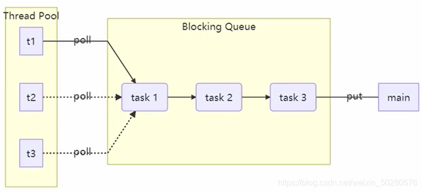
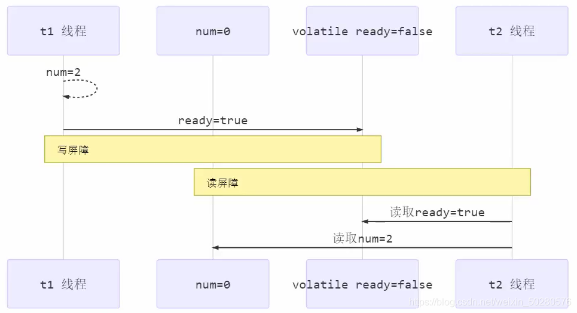
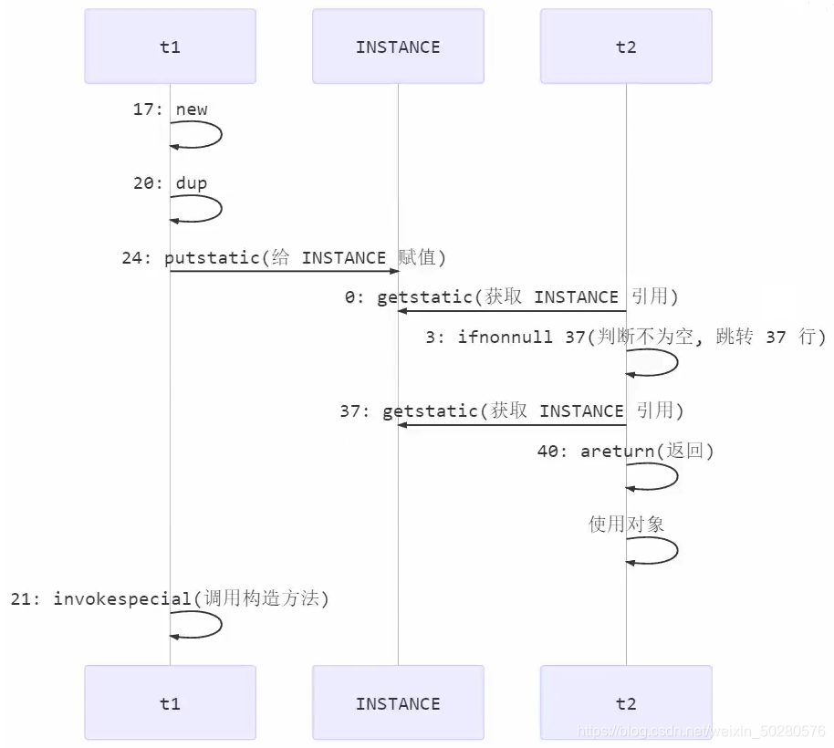
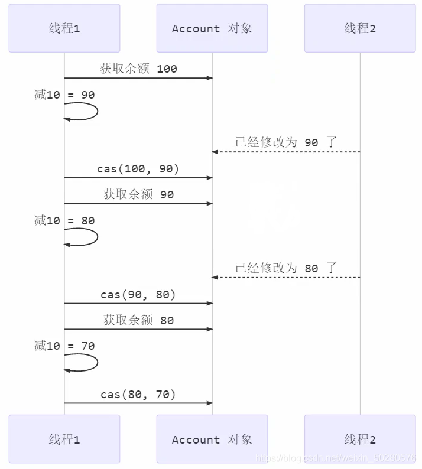
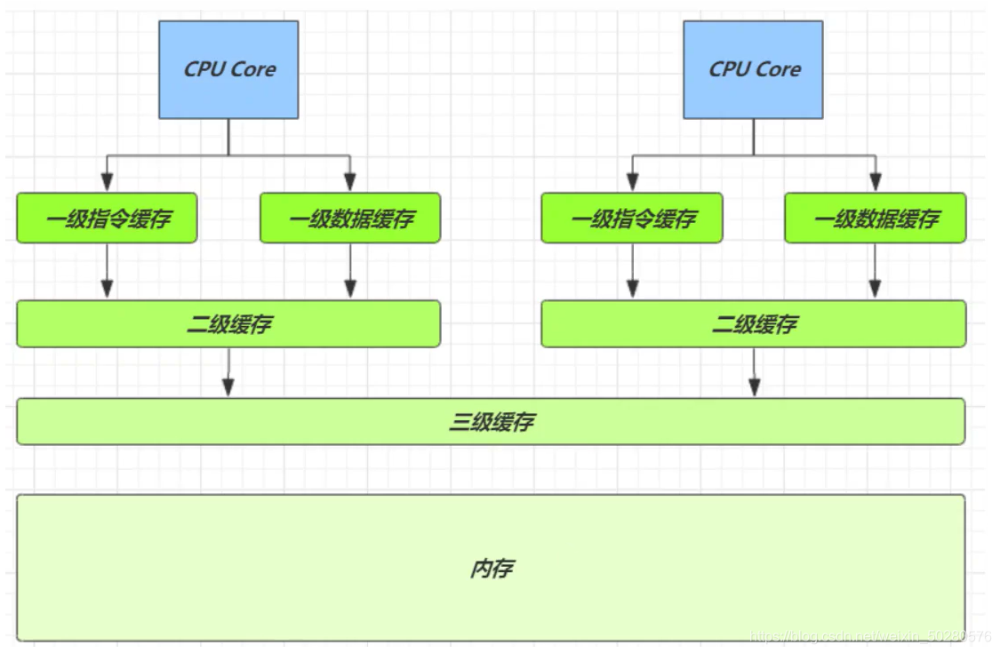
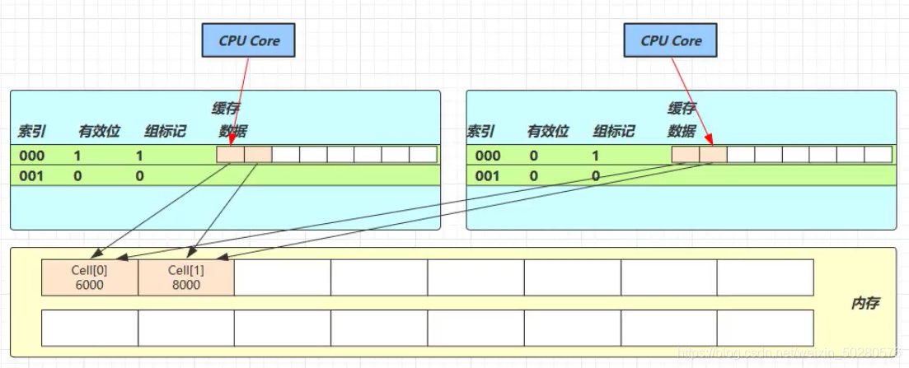
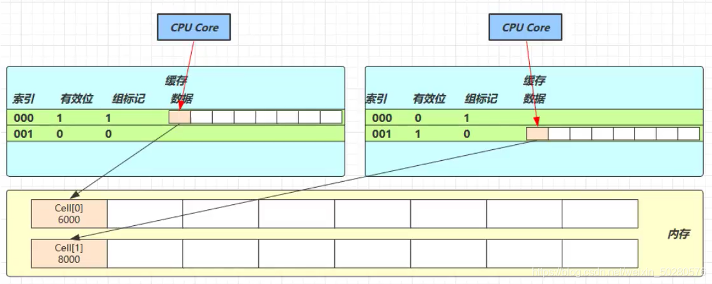
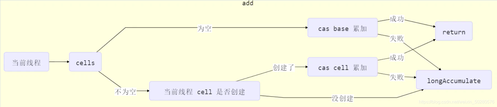
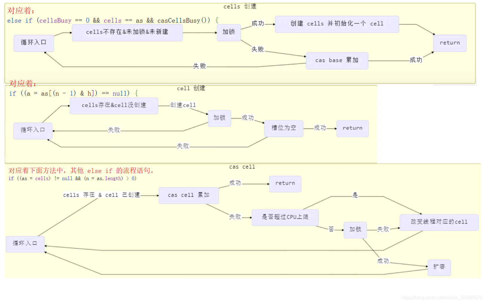

# Java 并发编程 2 - JMM、CAS 、Volatile 原理


## 四、共享模型之内存

### 1、Java 内存模型（JMM）

JMM 即 Java Memory Model，它定义了主存（共享内存）、工作内存（线程私有）抽象概念，底层对应着 CPU 寄存器、缓存、硬件内存、 CPU 指令优化等。
JMM 体现在以下几个方面

- 原子性 - 保证指令不会受到线程上下文切换的影响
- 可见性 - 保证指令不会受 cpu 缓存的影响
- 有序性 - 保证指令不会受 cpu 指令并行优化的影响

### 2、可见性

#### 1）退不出的循环

首先看一段代码：

```java
public static boolean run = true;

    public static void main(String[] args) {

        Thread t1 = new Thread(() -> {
            while(run) {

            }
        }, "t1");

        t1.start();

        try {
            Thread.sleep(1000);
        } catch (InterruptedException e) {
            e.printStackTrace();
        }
        log.info("t1 Stop");
        run = false;
    }
1234567891011121314151617181920
```

首先 t1 线程运行，然后过一秒，主线程设置 run 的值为 false，想让 t1 线程停止下来，但是 t1 线程并没有停，分析如下图：

**解决方法**

- 使用 volatile （易变关键字）
- 它可以用来修饰成员变量和静态成员变量（放在主存中的变量），他可以避免线程从自己的工作缓存中查找变量的值，必须到主存中获取它的值，线程操作 volatile 变量都是直接操作主存

```java
 public static volatile boolean run = true; // 保证内存的可见性
1
```

#### 2）可见性与原子性

上面例子体现的实际就是可见性，它保证的是在多个线程之间，一个线程对[volatile](https://so.csdn.net/so/search?q=volatile&spm=1001.2101.3001.7020) 变量的修改对另一个线程可见， 不能保证原子性，仅用在一个写线程，多个读线程的情况。

- 注意 synchronized 语句块既可以保证代码块的原子性，也同时保证代码块内变量的可见性。但缺点是 synchronized 是属于重量级操作，性能相对更低。
- 如果在前面示例的死循环中加入 System.out.println() 会发现即使不加 volatile 修饰符，线程 t 也能正确看到 对 run 变量的修改了，想一想为什么？
- 因为 printIn() 方法使用了 synchronized 同步代码块，可以保证原子性与可见性，它是 PrintStream 类的方法。

#### 3）模式之两阶段终止

使用 volatile 关键字来实现两阶段终止模式。

```java
public class Code_02_Test {
	public static void main(String[] args) throws InterruptedException {
		Monitor monitor = new Monitor();
		monitor.start();
		Thread.sleep(3500);
		monitor.stop();
	}
}

class Monitor {

	Thread monitor;
	// 设置标记，用于判断是否被终止了
	private volatile boolean stop = false;
	/**
	 * 启动监控器线程
	 */
	public void start() {
		// 设置线控器线程，用于监控线程状态
		monitor = new Thread() {
			@Override
			public void run() {
				// 开始不停的监控
				while (true) {
					if(stop) {
						System.out.println("处理后续任务");
						break;
					}
					System.out.println("监控器运行中...");
					try {
						// 线程休眠
						Thread.sleep(1000);
					} catch (InterruptedException e) {
						System.out.println("被打断了");
					}
				}
			}
		};
		monitor.start();
	}

	/**
	 * 	用于停止监控器线程
	 */
	public void stop() {
		// 修改标记
		stop = true;
		// 打断线程
		monitor.interrupt();        
	}
}
123456789101112131415161718192021222324252627282930313233343536373839404142434445464748495051
```

#### 4）模式之 Balking

Balking （犹豫）模式用在一个线程发现另一个线程或本线程已经做了某一件相同的事，那么本线程就无需再做 了，直接结束返回，有点类似单例。

- 用一个标记来判断该任务是否已经被执行过了
- 需要避免线程安全问题
- 加锁的代码块要尽量的小，以保证性能

```java
public class Code_03_Test {
	public static void main(String[] args) throws InterruptedException {
		Monitor monitor = new Monitor();
		monitor.start();
		monitor.start();
		Thread.sleep(3500);
		monitor.stop();
	}
}

class Monitor {

	Thread monitor;
	// 设置标记，用于判断是否被终止了
	private volatile boolean stop = false;
	// 设置标记，用于判断是否已经启动过了
	private boolean starting = false;
	/**
	 * 启动监控器线程
	 */
	public void start() {
		// 上锁，避免多线程运行时出现线程安全问题
		synchronized (this) {
			if (starting) {
				// 已被启动，直接返回
				return;
			}
			// 启动监视器，改变标记
			starting = true;
		}
		// 设置线控器线程，用于监控线程状态
		monitor = new Thread() {
			@Override
			public void run() {
				// 开始不停的监控
				while (true) {
					if(stop) {
						System.out.println("处理后续任务");
						break;
					}
					System.out.println("监控器运行中...");
					try {
						// 线程休眠
						Thread.sleep(1000);
					} catch (InterruptedException e) {
						System.out.println("被打断了");
					}
				}
			}
		};
		monitor.start();
	}

	/**
	 * 	用于停止监控器线程
	 */
	public void stop() {
		// 打断线程
		monitor.interrupt();
		stop = true;
	}
}
1234567891011121314151617181920212223242526272829303132333435363738394041424344454647484950515253545556575859606162
```

### 3、有序性

#### 1）指令重排

首先看一个例子：

```java
// 可以重排的例子 
int a = 10; 
int b = 20; 
System.out.println( a + b );

// 不能重排的例子 
int a = 10;
int b = a - 5;
12345678
```

指令重排简单来说可以，在程序结果不受影响的前提下，可以调整指令语句执行顺序。多线程下指令重排会影响正确性。

#### 2）多线程下指令重排问题

首先看一段代码：

```java
int num = 0;

// volatile 修饰的变量，可以禁用指令重排 volatile boolean ready = false; 可以防止变量之前的代码被重排序
boolean ready = false; 
// 线程1 执行此方法
public void actor1(I_Result r) {
 if(ready) {
 	r.r1 = num + num;
 } 
 else {
 	r.r1 = 1;
 }
}
// 线程2 执行此方法
public void actor2(I_Result r) {
 num = 2;
 ready = true;
}
123456789101112131415161718
```

在多线程环境下，以上的代码 r1 的值有三种情况：
第一种：线程 2 先执行，然后线程 1 后执行，r1 的结果为 4
第二种：线程 1 先执行，然后线程 2 后执行，r1 的结果为 1
第三种：线程 2 先执行，但是发送了指令重排，num = 2 与 ready = true 这两行代码语序发生装换，

```java
ready = true; // 前
num = 2; // 后
12
```

然后执行 ready = true 后，线程 1 运行了，那么 r1 的结果是为 0。

#### 3）解决方法

volatile 修饰的变量，可以禁用指令重排，禁止的是加 volatile 关键字变量**之前的代码**重排序

### 4、volatile 原理

volatile 的底层实现原理是**内存屏障**，Memory Barrier（Memory Fence）
对 volatile 变量的写指令**后会加入写屏障**
对 volatile 变量的读指令**前会加入读屏障**

#### 1）如何保证可见性

- 写屏障（sfence）保证在该屏障之前的，对共享变量的改动，都同步到主存当中

```java
public void actor2(I_Result r) {
     num = 2;
     ready = true; // ready 是被 volatile 修饰的，赋值带写屏障
     // 写屏障
}

123456
```

- 而读屏障（lfence）保证在该屏障之后，对共享变量的读取，加载的是主存中最新数据

```java
public void actor1(I_Result r) {
 // 读屏障
 // ready是被 volatile 修饰的，读取值带读屏障
 if(ready) {
 	r.r1 = num + num;
 } else {
 	r.r1 = 1;
 }
}
123456789
```

分析如图：


#### 2）如何保证有序性

- 写屏障会确保指令重排序时，不会将写屏障之前的代码排在写屏障之后

```java
public void actor2(I_Result r) {
 num = 2;
 ready = true; // ready 是被 volatile 修饰的，赋值带写屏障
 // 写屏障
}
12345
```

- 读屏障会确保指令重排序时，不会将读屏障之后的代码排在读屏障之前

```java
public void actor1(I_Result r) {
 // 读屏障
 // ready 是被 volatile 修饰的，读取值带读屏障
 if(ready) {
 	r.r1 = num + num;
 } else {
 	r.r1 = 1;
 }
}
123456789
```

注意：volatile 不能解决指令交错
写屏障仅仅是保证之后的读能够读到最新的结果，但不能保证其它线程的读跑到它前面去。
而有序性的保证也只是保证了本线程内相关代码不被重排序

#### 3）double-checked locking 问题

看如下代码：

```java
	// 最开始的单例模式是这样的
    public final class Singleton {
        private Singleton() { }
        private static Singleton INSTANCE = null;
        public static Singleton getInstance() {
        // 首次访问会同步，而之后的使用不用进入synchronized
        synchronized(Singleton.class) {
        	if (INSTANCE == null) { // t1
        		INSTANCE = new Singleton();
            }
        }
            return INSTANCE;
        }
    }
// 但是上面的代码块的效率是有问题的，因为即使已经产生了单实例之后，之后调用了getInstance()方法之后还是会加锁，这会严重影响性能！因此就有了模式如下double-checked lockin：
    public final class Singleton {
        private Singleton() { }
        private static Singleton INSTANCE = null;
        public static Singleton getInstance() {
            if(INSTANCE == null) { // t2
                // 首次访问会同步，而之后的使用没有 synchronized
                synchronized(Singleton.class) {
                    if (INSTANCE == null) { // t1
                        INSTANCE = new Singleton();
                    }
                }
            }
            return INSTANCE;
        }
    }
//但是上面的if(INSTANCE == null)判断代码没有在同步代码块synchronized中，不能享有synchronized保证的原子性，可见性。所以
12345678910111213141516171819202122232425262728293031
```

以上的实现特点是：

- 懒惰实例化
- 首次使用 getInstance() 才使用 synchronized 加锁，后续使用时无需加锁
- 有隐含的，但很关键的一点：第一个 if 使用了 INSTANCE 变量，是在同步块之外
  但在多线程环境下，上面的代码是有问题的，getInstance 方法对应的字节码为：

```java
0: getstatic #2 // Field INSTANCE:Lcn/itcast/n5/Singleton;
3: ifnonnull 37
// ldc是获得类对象
6: ldc #3 // class cn/itcast/n5/Singleton
// 复制操作数栈栈顶的值放入栈顶, 将类对象的引用地址复制了一份
8: dup
// 操作数栈栈顶的值弹出，即将对象的引用地址存到局部变量表中
// 将类对象的引用地址存储了一份，是为了将来解锁用
9: astore_0
10: monitorenter
11: getstatic #2 // Field INSTANCE:Lcn/itcast/n5/Singleton;
14: ifnonnull 27
// 新建一个实例
17: new #3 // class cn/itcast/n5/Singleton
// 复制了一个实例的引用
20: dup
// 通过这个复制的引用调用它的构造方法
21: invokespecial #4 // Method "<init>":()V
// 最开始的这个引用用来进行赋值操作
24: putstatic #2 // Field INSTANCE:Lcn/itcast/n5/Singleton;
27: aload_0
28: monitorexit
29: goto 37
32: astore_1
33: aload_0
34: monitorexit
35: aload_1
36: athrow
37: getstatic #2 // Field INSTANCE:Lcn/itcast/n5/Singleton;
40: areturn
123456789101112131415161718192021222324252627282930
```

其中

- 17 表示创建对象，将对象引用入栈 // new Singleton
- 20 表示复制一份对象引用 // 复制了引用地址
- 21 表示利用一个对象引用，调用构造方法 // 根据复制的引用地址调用构造方法
- 24 表示利用一个对象引用，赋值给 static INSTANCE

也许 jvm 会优化为：先执行 24，再执行 21。如果两个线程 t1，t2 按如下时间序列执行：

关键在于 0: getstatic 这行代码在 monitor 控制之外，它就像之前举例中不守规则的人，可以越过 monitor 读取 INSTANCE 变量的值 这时 t1 还未完全将构造方法执行完毕，如果在构造方法中要执行很多初始化操作，那么 t2 拿到的是将是一个未初 始化完毕的单例 对 INSTANCE 使用 volatile 修饰即可，可以禁用指令重排，但要注意在 JDK 5 以上的版本的 volatile 才会真正有效。

#### 4）double-checked locking 解决

加volatile就行了。

```java
public final class Singleton {
        private Singleton() { }
        private static volatile Singleton INSTANCE = null;
        public static Singleton getInstance() {
            // 实例没创建，才会进入内部的 synchronized代码块
            if (INSTANCE == null) {
                synchronized (Singleton.class) { // t2
                    // 也许有其它线程已经创建实例，所以再判断一次
                    if (INSTANCE == null) { // t1
                        INSTANCE = new Singleton();
                    }
                }
            }
            return INSTANCE;
        }
    }
12345678910111213141516
```

如上面的注释内容所示，读写 volatile 变量操作（即 getstatic 操作和 putstatic 操作）时会加入内存屏障（Memory Barrier（Memory Fence）），保证下面两点：

1. 可见性
   1. 写屏障（sfence）保证在该屏障之前的 t1 对共享变量的改动，都同步到主存当中
   2. 而读屏障（lfence）保证在该屏障之后 t2 对共享变量的读取，加载的是主存中最新数据
2. 有序性
   1. 写屏障会确保指令重排序时，不会将写屏障之前的代码排在写屏障之后
   2. 读屏障会确保指令重排序时，不会将读屏障之后的代码排在读屏障之前
3. 更底层是读写变量时使用 lock 指令来多核 CPU 之间的可见性与有序性

### 5、happens-before

下面说的变量都是指成员变量或静态成员变量
1）线程解锁 m 之前对变量的写，对于接下来对 m 加锁的其它线程对该变量的读可见

```java
	 static int x;
	 static Object m = new Object();
	 new Thread(()->{
	     synchronized(m) {
	         x = 10;
	     }
	 },"t1").start();
	 new Thread(()->{
	     synchronized(m) {
	         System.out.println(x);
	     }
	 },"t2").start();
         
12345678910111213
```

2）线程对 volatile 变量的写，对接下来其它线程对该变量的读可见

```java
volatile static int x;
new Thread(()->{
 x = 10;
},"t1").start();
new Thread(()->{
 System.out.println(x);
},"t2").start();
1234567
```

3）线程 start 前对变量的写，对该线程开始后对该变量的读可见

```java
static int x;
x = 10;
new Thread(()->{
 System.out.println(x);
},"t2").start();
12345
```

4）线程结束前对变量的写，对其它线程得知它结束后的读可见（比如其它线程调用 t1.isAlive() 或 t1.join()等待它结束）

```java
static int x;
Thread t1 = new Thread(()->{
 x = 10;
},"t1");
t1.start();
t1.join();
System.out.println(x);
1234567
```

5）线程 t1 打断 t2（interrupt）前对变量的写，对于其他线程得知 t2 被打断后对变量的读可见（通过 t2.interrupted 或 t2.isInterrupted）

```java
	static int x;
    public static void main(String[] args) {
        Thread t2 = new Thread(()->{
            while(true) {
                if(Thread.currentThread().isInterrupted()) {
                    System.out.println(x);
                    break;
                }
            }
        },"t2");
        t2.start();
        new Thread(()->{
            sleep(1);
            x = 10;
            t2.interrupt();
        },"t1").start();
        while(!t2.isInterrupted()) {
            Thread.yield();
        }
        System.out.println(x);
    }
123456789101112131415161718192021
```

6）对变量默认值（0，false，null）的写，对其它线程对该变量的读可见
7）具有传递性，如果 x hb-> y 并且 y hb-> z 那么有 x hb-> z ，配合 volatile 的防指令重排，有下面的例子

```java
	volatile static int x;  
	static int y;  
	new Thread(() -> {  
		y = 10;  
		x = 20;  
	},"t1").start();  
		new Thread(() -> {  
		// x=20 对 t2 可见, 同时 y=10 也对 t2 可见  
		System.out.println(x);  
	},"t2").start(); 
12345678910
```

### 6、练习

**1）balking 模式习题**
希望 doInit() 方法仅被调用一次，下面的实现是否有问题，为什么？

```java
public class TestVolatile {
    volatile boolean initialized = false;
    void init() {
        if (initialized) {
            return;
        }
        doInit();
        initialized = true;
    }
    private void doInit() {
    }
} 
123456789101112
```

volatile 可以保存线程的可见性，有序性，但是不能保证原子性，doInit 方法没加锁，可能会被调用多次。
**2）线程安全单例习题**
单例模式有很多实现方法，饿汉、懒汉、静态内部类、枚举类，试着分析每种实现下获取单例对象（即调用 getInstance）时的线程安全，并思考注释中的问题

- 饿汉式：类加载就会导致该单实例对象被创建
- 懒汉式：类加载不会导致该单实例对象被创建，而是首次使用该对象时才会创建

**实现1： 饿汉式**

```java
// 问题1：为什么加 final，防止子类继承后更改
// 问题2：如果实现了序列化接口, 还要做什么来防止反序列化破坏单例，如果进行反序列化的时候会生成新的对象，这样跟单例模式生成的对象是不同的。要解决直接加上readResolve()方法就行了，如下所示
public final class Singleton implements Serializable {
    // 问题3：为什么设置为私有? 放弃其它类中使用new生成新的实例，是否能防止反射创建新的实例?不能。
    private Singleton() {}
    // 问题4：这样初始化是否能保证单例对象创建时的线程安全?没有，这是类变量，是jvm在类加载阶段就进行了初始化，jvm保证了此操作的线程安全性
    private static final Singleton INSTANCE = new Singleton();
    // 问题5：为什么提供静态方法而不是直接将 INSTANCE 设置为 public, 说出你知道的理由。
    //1.提供更好的封装性；2.提供范型的支持
    public static Singleton getInstance() {
        return INSTANCE;
    }
    public Object readResolve() {
        return INSTANCE;
    }
}
12345678910111213141516
```

**实现2： 饿汉式**

```java
// 问题1：枚举单例是如何限制实例个数的：创建枚举类的时候就已经定义好了，每个枚举常量其实就是枚举类的一个静态成员变量
// 问题2：枚举单例在创建时是否有并发问题：没有，这是静态成员变量
// 问题3：枚举单例能否被反射破坏单例：不能
// 问题4：枚举单例能否被反序列化破坏单例：枚举类默认实现了序列化接口，枚举类已经考虑到此问题，无需担心破坏单例
// 问题5：枚举单例属于懒汉式还是饿汉式：饿汉式
// 问题6：枚举单例如果希望加入一些单例创建时的初始化逻辑该如何做：加构造方法就行了
enum Singleton {
 INSTANCE;
}
123456789
```

**实现3：懒汉式**

```java
public final class Singleton {
    private Singleton() { }
    private static Singleton INSTANCE = null;
    // 分析这里的线程安全, 并说明有什么缺点：synchronized加载静态方法上，可以保证线程安全。缺点就是锁的范围过大，每次访问都会加锁，性能比较低。
    public static synchronized Singleton getInstance() {
        if( INSTANCE != null ){
            return INSTANCE;
        }
        INSTANCE = new Singleton();
        return INSTANCE;
    }
}
123456789101112
```

**实现4：DCL 懒汉式**

```java
public final class Singleton {
    private Singleton() { }
    // 问题1：解释为什么要加 volatile ?为了防止重排序问题
    private static volatile Singleton INSTANCE = null;

    // 问题2：对比实现3, 说出这样做的意义：提高了效率
    public static Singleton getInstance() {
        if (INSTANCE != null) {
            return INSTANCE;
        }
        synchronized (Singleton.class) {
            // 问题3：为什么还要在这里加为空判断, 之前不是判断过了吗？这是为了第一次判断时的并发问题。
            if (INSTANCE != null) { // t2
                return INSTANCE;
            }
            INSTANCE = new Singleton();
            return INSTANCE;
        }
    }
}
1234567891011121314151617181920
```

**实现5：静态内部类懒汉式**

```java
public final class Singleton {
    private Singleton() { }
    // 问题1：属于懒汉式还是饿汉式：懒汉式，这是一个静态内部类。类加载本身就是懒惰的，在没有调用getInstance方法时是没有执行LazyHolder内部类的类加载操作的。
    private static class LazyHolder {
        static final Singleton INSTANCE = new Singleton();
    }
    // 问题2：在创建时是否有并发问题，这是线程安全的，类加载时，jvm保证类加载操作的线程安全
    public static Singleton getInstance() {
        return LazyHolder.INSTANCE;
    }
}
1234567891011
```

### 结论

本章重点讲解了 JMM 中的

1. 可见性 - 由 JVM 缓存优化引起
2. 有序性 - 由 JVM 指令重排序优化引起
3. happens-before 规则
4. 原理方面
   1. volatile
5. 模式方面
   1. 两阶段终止模式的 volatile 改进
   2. 同步模式之 balking

## 五、共享模型之无锁

管程即 monitor 是阻塞式的悲观锁实现并发控制，这章我们将通过非阻塞式的乐观锁的来实现并发控制

### 1、无锁解决线程安全问题

如下代码，通过 synchronized 解决线程安全问题。

```java
public class Code_04_UnsafeTest {

    public static void main(String[] args) {
        Account acount = new AccountUnsafe(10000);
        Account.demo(acount);
    }

}
class AccountUnsafe implements Account {

    private Integer balance;

    public AccountUnsafe(Integer balance) {
        this.balance = balance;
    }

    @Override
    public Integer getBalance() {
        return this.balance;
    }

    @Override
    public void withdraw(Integer amount) {
        synchronized (this) { // 加锁。
            this.balance -= amount;
        }
    }
}

interface Account {

    // 获取金额的方法
    Integer getBalance();
    // 取款的方法
    void withdraw(Integer amount);

    static void demo(Account account) {
        List<Thread> list = new ArrayList<>();
        long start = System.nanoTime();
        for(int i = 0; i < 1000; i++) {
            list.add(new Thread(() -> {
                account.withdraw(10);
            }));
        }
        list.forEach(Thread::start);
        list.forEach(t -> {
            try {
                t.join();
            } catch (InterruptedException e) {
                e.printStackTrace();
            }
        });
        long end = System.nanoTime();
        System.out.println(account.getBalance()
                + " cost: " + (end-start)/1000_000 + " ms");
    }
}

12345678910111213141516171819202122232425262728293031323334353637383940414243444546474849505152535455565758
```

如上代码加锁会造成线程堵塞，堵塞的时间取决于临界区代码执行的时间，这使用加锁的性能不高，我们可以使用无锁来解决此问题。

```java
class AccountSafe implements Account{

    AtomicInteger atomicInteger ;
    
    public AccountSafe(Integer balance){
        this.atomicInteger =  new AtomicInteger(balance);
    }
    
    @Override
    public Integer getBalance() {
        return atomicInteger.get();
    }

    @Override
    public void withdraw(Integer amount) {
        // 核心代码
        while (true){
            int pre = getBalance();
            int next = pre - amount;
            if (atomicInteger.compareAndSet(pre,next)){
                break;
            }
        }
    }
}
12345678910111213141516171819202122232425
```

### 2、CAS 与 volatile

#### 1）cas

前面看到的 AtomicInteger 的解决方法，内部并没有用锁来保护共享变量的线程安全。那么它是如何实现的呢？
其中的关键是 compareAndSwap（比较并设置值），它的简称**就是 CAS** （也有 Compare And Swap 的说法），它必须**是原子操作**。

如图所示，它的工作流程如下：
当一个线程要去修改 Account 对象中的值时，先获取值 preVal（调用get方法），然后再将其设置为新的值 nextVal（调用 cas 方法）。在调用 cas 方法时，会将 pre 与 Account 中的余额进行比较。

- 如果两者相等，就说明该值还未被其他线程修改，此时便可以进行修改操作。
- 如果两者不相等，就不设置值，重新获取值 preVal（调用get方法），然后再将其设置为新的值 nextVal（调用cas方法），直到修改成功为止。

注意：

- 其实 CAS 的底层是 lock cmpxchg 指令（X86 架构），在单核 CPU 和多核 CPU 下都能够保证【比较-交换】的原子性。
- 在多核状态下，某个核执行到带 lock 的指令时，CPU 会让总线锁住，当这个核把此指令执行完毕，再开启总线。这个过程中不会被线程的调度机制所打断，保证了多个线程对内存操作的准确性，是原子的 。

#### 2）volatile

获取共享变量时，为了保证该变量的**可见性**，需要使用 volatile 修饰。
它可以用来修饰成员变量和静态成员变量，他可以避免线程从自己的工作缓存中查找变量的值，必须到主存中获取 它的值，线程操作 volatile 变量都是直接操作主存。即一个线程对 volatile 变量的修改，对另一个线程可见。
注意
volatile 仅仅保证了共享变量的可见性，让其它线程能够看到新值，但不能解决指令交错问题（不能保证原子性）
CAS 是原子性操作借助 volatile 读取到共享变量的新值来实现【比较并交换】的效果

#### 3）为什么无锁效率高

- 无锁情况下，即使重试失败，线程始终在高速运行，没有停歇，而 synchronized 会让线程在没有获得锁的时候，发生上下文切换，进入阻塞。打个比喻：线程就好像高速跑道上的赛车，高速运行时，速度超快，一旦发生上下文切换，就好比赛车要减速、熄火，等被唤醒又得重新打火、启动、加速… 恢复到高速运行，代价比较大
- 但无锁情况下，因为线程要保持运行，需要额外 CPU 的支持，CPU 在这里就好比高速跑道，没有额外的跑道，线程想高速运行也无从谈起，虽然不会进入阻塞，但由于没有分到时间片，仍然会进入可运行状态，还是会导致上下文切换。

#### 4）CAS 的特点

结合 CAS 和 volatile 可以实现无锁并发，适用于线程数少、多核 CPU 的场景下。

- CAS 是基于乐观锁的思想：最乐观的估计，不怕别的线程来修改共享变量，就算改了也没关系，我吃亏点再重试呗。
- synchronized 是基于悲观锁的思想：最悲观的估计，得防着其它线程来修改共享变量，我上了锁你们都别想改，我改完了解开锁，你们才有机会。
- CAS 体现的是无锁并发、无阻塞并发，请仔细体会这两句话的意思
  - 因为没有使用 synchronized，所以线程不会陷入阻塞，这是效率提升的因素之一
  - 但如果竞争激烈(写操作多)，可以想到重试必然频繁发生，反而效率会受影响

### 3、原子整数

java.util.concurrent.atomic并发包提供了一些并发工具类，这里把它分成五类：
使用原子的方式更新基本类型

- AtomicInteger：整型原子类
- AtomicLong：长整型原子类
- AtomicBoolean ：布尔型原子类

上面三个类提供的方法几乎相同，所以我们将以 AtomicInteger 为例子来介绍。
原子引用
原子数组
字段更新器
原子累加器
下面先讨论原子整数类，以 AtomicInteger 为例讨论它的api接口：通过观察源码可以发现，AtomicInteger 内部都是通过cas的原理来实现的。

```java
    public static void main(String[] args) {
        AtomicInteger i = new AtomicInteger(0);
        // 获取并自增（i = 0, 结果 i = 1, 返回 0），类似于 i++
        System.out.println(i.getAndIncrement());
        // 自增并获取（i = 1, 结果 i = 2, 返回 2），类似于 ++i
        System.out.println(i.incrementAndGet());
        // 自减并获取（i = 2, 结果 i = 1, 返回 1），类似于 --i
        System.out.println(i.decrementAndGet());
        // 获取并自减（i = 1, 结果 i = 0, 返回 1），类似于 i--
        System.out.println(i.getAndDecrement());
        // 获取并加值（i = 0, 结果 i = 5, 返回 0）
        System.out.println(i.getAndAdd(5));
        // 加值并获取（i = 5, 结果 i = 0, 返回 0）
        System.out.println(i.addAndGet(-5));
        // 获取并更新（i = 0, p 为 i 的当前值, 结果 i = -2, 返回 0）
        // 函数式编程接口，其中函数中的操作能保证原子，但函数需要无副作用
        System.out.println(i.getAndUpdate(p -> p - 2));
        // 更新并获取（i = -2, p 为 i 的当前值, 结果 i = 0, 返回 0）
        // 函数式编程接口，其中函数中的操作能保证原子，但函数需要无副作用
        System.out.println(i.updateAndGet(p -> p + 2));
        // 获取并计算（i = 0, p 为 i 的当前值, x 为参数1, 结果 i = 10, 返回 0）
        // 函数式编程接口，其中函数中的操作能保证原子，但函数需要无副作用
        // getAndUpdate 如果在 lambda 中引用了外部的局部变量，要保证该局部变量是 final 的
        // getAndAccumulate 可以通过 参数1 来引用外部的局部变量，但因为其不在 lambda 中因此不必是 final
        System.out.println(i.getAndAccumulate(10, (p, x) -> p + x));
        // 计算并获取（i = 10, p 为 i 的当前值, x 为参数1值, 结果 i = 0, 返回 0）
        // 函数式编程接口，其中函数中的操作能保证原子，但函数需要无副作用
        System.out.println(i.accumulateAndGet(-10, (p, x) -> p + x));
    }
1234567891011121314151617181920212223242526272829
```

### 4、原子引用

为什么需要原子引用类型？保证引用类型的共享变量是线程安全的（确保这个原子引用没有引用过别人）。
基本类型原子类只能更新一个变量，如果需要原子更新多个变量，需要使用引用类型原子类。

- AtomicReference：引用类型原子类
- AtomicStampedReference：原子更新带有版本号的引用类型。该类将整数值与引用关联起来，可用于解决原子的更新数据和数据的版本号，可以解决使用 CAS 进行原子更新时可能出现的 ABA 问题。
- AtomicMarkableReference ：原子更新带有标记的引用类型。该类将 boolean 标记与引用关联起。

#### 1）AtomicReference

先看如下代码的问题：

```java
class DecimalAccountUnsafe implements DecimalAccount {
    BigDecimal balance;
    public DecimalAccountUnsafe(BigDecimal balance) {
        this.balance = balance;
    }
    @Override
    public BigDecimal getBalance() {
        return balance;
    }
    // 取款任务
    @Override
    public void withdraw(BigDecimal amount) {
        BigDecimal balance = this.getBalance();
        this.balance = balance.subtract(amount);
    }
}
12345678910111213141516
```

当执行 withdraw 方法时，可能会有线程安全，我们可以加锁解决或者是使用无锁的方式 CAS 来解决，解决方式是用 AtomicReference 原子引用解决。
代码如下：

```java
class DecimalAccountCas implements DecimalAccount {

    private AtomicReference<BigDecimal> balance;

    public DecimalAccountCas(BigDecimal balance) {
        this.balance = new AtomicReference<>(balance);
    }

    @Override
    public BigDecimal getBalance() {
        return balance.get();
    }

    @Override
    public void withdraw(BigDecimal amount) {
        while (true) {
            BigDecimal preVal = balance.get();
            BigDecimal nextVal = preVal.subtract(amount);
            if(balance.compareAndSet(preVal, nextVal)) {
                break;
            }
        }
    }
}
12345678910111213141516171819202122232425
```

#### 2）ABA 问题

看如下代码：

```java
	public static AtomicReference<String> ref = new AtomicReference<>("A");

    public static void main(String[] args) throws InterruptedException {
        log.debug("main start...");
        String preVal = ref.get();
        other();
        TimeUnit.SECONDS.sleep(1);
        log.debug("change A->C {}", ref.compareAndSet(preVal, "C"));
    }

    private static void other() throws InterruptedException {
        new Thread(() -> {
            log.debug("change A->B {}", ref.compareAndSet(ref.get(), "B"));
        }, "t1").start();
        TimeUnit.SECONDS.sleep(1);
        new Thread(() -> {
            log.debug("change B->A {}", ref.compareAndSet(ref.get(), "A"));
        }, "t2").start();
    }
12345678910111213141516171819
```

主线程仅能判断出共享变量的值与最初值 A 是否相同，不能感知到这种从 A 改为 B 又改回 A 的情况，如果主线程希望：只要有其它线程【动过了】共享变量，那么自己的 cas 就算失败，这时，仅比较值是不够的，需要再加一个版本号。使用AtomicStampedReference来解决。

#### 3）AtomicStampedReference

使用 AtomicStampedReference 加 stamp （版本号或者时间戳）的方式解决 ABA 问题。代码如下：

```java
// 两个参数，第一个：变量的值 第二个：版本号初始值
    public static AtomicStampedReference<String> ref = new AtomicStampedReference<>("A", 0);

    public static void main(String[] args) throws InterruptedException {
        log.debug("main start...");
        String preVal = ref.getReference();
        int stamp = ref.getStamp();
        log.info("main 拿到的版本号 {}",stamp);
        other();
        TimeUnit.SECONDS.sleep(1);
        log.info("修改后的版本号 {}",ref.getStamp());
        log.info("change A->C:{}", ref.compareAndSet(preVal, "C", stamp, stamp + 1));
    }

    private static void other() throws InterruptedException {
        new Thread(() -> {
            int stamp = ref.getStamp();
            log.info("{}",stamp);
            log.info("change A->B:{}", ref.compareAndSet(ref.getReference(), "B", stamp, stamp + 1));
        }).start();
        TimeUnit.SECONDS.sleep(1);
        new Thread(() -> {
            int stamp = ref.getStamp();
            log.info("{}",stamp);
            log.debug("change B->A:{}", ref.compareAndSet(ref.getReference(), "A",stamp,stamp + 1));
        }).start();
    }
123456789101112131415161718192021222324252627
```

#### 4）AtomicMarkableReference

AtomicStampedReference 可以给原子引用加上版本号，追踪原子引用整个的变化过程，如：A -> B -> A ->C，通过AtomicStampedReference，我们可以知道，引用变量中途被更改了几次。但是有时候，并不关心引用变量更改了几次，只是单纯的关心是否更改过，所以就有了AtomicMarkableReference 。

### 5、原子数组

使用原子的方式更新数组里的某个元素

- AtomicIntegerArray：整形数组原子类
- AtomicLongArray：长整形数组原子类
- AtomicReferenceArray ：引用类型数组原子类

上面三个类提供的方法几乎相同，所以我们这里以 AtomicIntegerArray 为例子来介绍，代码如下：

```java
public class Code_10_AtomicArrayTest {

    public static void main(String[] args) throws InterruptedException {
        /**
         * 结果如下：
         * [9934, 9938, 9940, 9931, 9935, 9933, 9944, 9942, 9939, 9940]
         * [10000, 10000, 10000, 10000, 10000, 10000, 10000, 10000, 10000, 10000]
         */
        demo(
                () -> new int[10],
                (array) -> array.length,
                (array, index) -> array[index]++,
                (array) -> System.out.println(Arrays.toString(array))
        );
        TimeUnit.SECONDS.sleep(1);
        demo(
                () -> new AtomicIntegerArray(10),
                (array) -> array.length(),
                (array, index) -> array.getAndIncrement(index),
                (array) -> System.out.println(array)
        );
    }

    private static <T> void demo(
            Supplier<T> arraySupplier,
            Function<T, Integer> lengthFun,
            BiConsumer<T, Integer> putConsumer,
            Consumer<T> printConsumer) {
        ArrayList<Thread> ts = new ArrayList<>(); // 创建集合
        T array = arraySupplier.get(); // 获取数组
        int length = lengthFun.apply(array); // 获取数组的长度
        for(int i = 0; i < length; i++) {
            ts.add(new Thread(() -> {
                for (int j = 0; j < 10000; j++) {
                    putConsumer.accept(array, j % length);
                }
            }));
        }
        ts.forEach(Thread::start);
        ts.forEach((thread) -> {
            try {
                thread.join();
            } catch (InterruptedException e) {
                e.printStackTrace();
            }
        });
        printConsumer.accept(array);
    }

}
1234567891011121314151617181920212223242526272829303132333435363738394041424344454647484950
```

使用原子数组可以保证元素的线程安全。

### 6、字段更新器

- AtomicReferenceFieldUpdater // 域 字段
- AtomicIntegerFieldUpdater
- AtomicLongFieldUpdater

注意：利用字段更新器，可以针对对象的某个域（Field）进行原子操作，只能配合 volatile 修饰的字段使用，否则会出现异常

```java
Exception in thread "main" java.lang.IllegalArgumentException: Must be volatile type
1
```

代码如下：

```java
public class Code_11_AtomicReferenceFieldUpdaterTest {

    public static AtomicReferenceFieldUpdater ref =
            AtomicReferenceFieldUpdater.newUpdater(Student.class, String.class, "name");

    public static void main(String[] args) throws InterruptedException {
        Student student = new Student();

        new Thread(() -> {
            System.out.println(ref.compareAndSet(student, null, "list"));
        }).start();
        System.out.println(ref.compareAndSet(student, null, "张三"));
        System.out.println(student);
    }

}

class Student {

    public volatile String name;

    @Override
    public String toString() {
        return "Student{" +
                "name='" + name + '\'' +
                '}';
    }
}
12345678910111213141516171819202122232425262728
```

字段更新器就是为了保证类中某个属性线程安全问题。

### 7、原子累加器

#### 1）AtomicLong Vs LongAdder

```java
	public static void main(String[] args) {
        for(int i = 0; i < 5; i++) {
            demo(() -> new AtomicLong(0), (ref) -> ref.getAndIncrement());
        }
        for(int i = 0; i < 5; i++) {
            demo(() -> new LongAdder(), (ref) -> ref.increment());
        }
    }

    private static <T> void demo(Supplier<T> supplier, Consumer<T> consumer) {
        ArrayList<Thread> list = new ArrayList<>();

        T adder = supplier.get();
        // 4 个线程，每人累加 50 万
        for (int i = 0; i < 4; i++) {
            list.add(new Thread(() -> {
                for (int j = 0; j < 500000; j++) {
                    consumer.accept(adder);
                }
            }));
        }
        long start = System.nanoTime();
        list.forEach(t -> t.start());
        list.forEach(t -> {
            try {
                t.join();
            } catch (InterruptedException e) {
                e.printStackTrace();
            }
        });
        long end = System.nanoTime();
        System.out.println(adder + " cost:" + (end - start)/1000_000);
    }

12345678910111213141516171819202122232425262728293031323334
```

执行代码后，发现使用 LongAdder 比 AtomicLong 快2，3倍，使用 LongAdder 性能提升的原因很简单，就是在有竞争时，设置多个累加单元(但不会超过cpu的核心数)，Therad-0 累加 Cell[0]，而 Thread-1 累加Cell[1]… 最后将结果汇总。这样它们在累加时操作的不同的 Cell 变量，因此减少了 CAS 重试失败，从而提高性能。

### 8、LongAdder 原理

LongAdder 类有几个关键域
public class LongAdder extends Striped64 implements Serializable {}
下面的变量属于 Striped64 被 LongAdder 继承。

```java
// 累加单元数组, 懒惰初始化
transient volatile Cell[] cells;
// 基础值, 如果没有竞争, 则用 cas 累加这个域
transient volatile long base;
// 在 cells 创建或扩容时, 置为 1, 表示加锁
transient volatile int cellsBusy; 
123456
```

#### 1）使用 cas 实现一个自旋锁

```java
public class Code_13_LockCas {

    public AtomicInteger state = new AtomicInteger(0); // 如果 state 值为 0 表示没上锁, 1 表示上锁

    public void lock() {
        while (true) {
            if(state.compareAndSet(0, 1)) {
                break;
            }
        }
    }

    public void unlock() {
        log.debug("unlock...");
        state.set(0);
    }

    public static void main(String[] args) {
        Code_13_LockCas lock = new Code_13_LockCas();
        new Thread(() -> {
            log.info("begin...");
            lock.lock();
            try {
                log.info("上锁成功");
                TimeUnit.SECONDS.sleep(1);
            } catch (InterruptedException e) {
                e.printStackTrace();
            } finally {
                lock.unlock();
            }
        }, "t1").start();
        new Thread(() -> {
            log.info("begin...");
            lock.lock();
            try {
                log.info("上锁成功");
                TimeUnit.SECONDS.sleep(1);
            } catch (InterruptedException e) {
                e.printStackTrace();
            } finally {
                lock.unlock();
            }
        }, "t2").start();
    }

}
```

#### 2）原理之伪共享

其中 Cell 即为累加单元

```java
// 防止缓存行伪共享
@sun.misc.Contended
static final class Cell {
    volatile long value;
    Cell(long x) { value = x; }
    // 最重要的方法, 用来 cas 方式进行累加, prev 表示旧值, next 表示新值
    final boolean cas(long prev, long next) {
        return UNSAFE.compareAndSwapLong(this, valueOffset, prev, next);
    }
    // 省略不重要代码
}
1234567891011
```

下面讨论 @sun.misc.Contended 注解的重要意义
得从缓存说起，缓存与内存的速度比较

因为 CPU 与 内存的速度差异很大，需要靠预读数据至缓存来提升效率。缓存离 cpu 越近速度越快。 而缓存以缓存行为单位，每个缓存行对应着一块内存，一般是 64 byte（8 个 long），缓存的加入会造成数据副本的产生，即同一份数据会缓存在不同核心的缓存行中，CPU 要保证数据的一致性，如果某个 CPU 核心更改了数据，其它 CPU 核心对应的整个缓存行必须失效。

因为 Cell 是数组形式，在内存中是连续存储的，一个 Cell 为 24 字节（16 字节的对象头和 8 字节的 value），因 此缓存行可以存下 2 个的 Cell 对象。这样问题来了： Core-0 要修改 Cell[0]，Core-1 要修改 Cell[1]

无论谁修改成功，都会导致对方 Core 的缓存行失效，比如 Core-0 中 Cell[0]=6000, Cell[1]=8000 要累加 Cell[0]=6001, Cell[1]=8000 ，这时会让 Core-1 的缓存行失效，@sun.misc.Contended 用来解决这个问题，它的原理是在使用此注解的对象或字段的前后各增加 128 字节大小的padding，从而让 CPU 将对象预读至缓存时占用不同的缓存行，这样，不会造成对方缓存行的失效


#### 3）add 方法分析

LongAdder 进行累加操作是调用 increment 方法，它又调用 add 方法。

```java
public void increment() {
        add(1L);
    }
123
```

**第一步：add 方法分析，流程图如下**

源码如下：

```java
public void add(long x) {
        // as 为累加单元数组, b 为基础值, x 为累加值
        Cell[] as; long b, v; int m; Cell a;
        // 进入 if 的两个条件
        // 1. as 有值, 表示已经发生过竞争, 进入 if
        // 2. cas 给 base 累加时失败了, 表示 base 发生了竞争, 进入 if
        // 3. 如果 as 没有创建, 然后 cas 累加成功就返回，累加到 base 中 不存在线程竞争的时候用到。
        if ((as = cells) != null || !casBase(b = base, b + x)) {
            // uncontended 表示 cell 是否有竞争，这里赋值为 true 表示有竞争
            boolean uncontended = true;
            if (
                // as 还没有创建
                    as == null || (m = as.length - 1) < 0 ||
                            // 当前线程对应的 cell 还没有被创建，a为当线程的cell
                            (a = as[getProbe() & m]) == null ||
       // 给当前线程的 cell 累加失败 uncontended=false ( a 为当前线程的 cell )
                            !(uncontended = a.cas(v = a.value, v + x))
            ) {
                // 当 cells 为空时，累加操作失败会调用方法，
                // 当 cells 不为空，当前线程的 cell 创建了但是累加失败了会调用方法，
                // 当 cells 不为空，当前线程 cell 没创建会调用这个方法
                // 进入 cell 数组创建、cell 创建的流程
                longAccumulate(x, null, uncontended);
            }
        }
    }
1234567891011121314151617181920212223242526
```

**第二步：longAccumulate 方法分析，流程图如下：**

源码如下：

```java
final void longAccumulate(long x, LongBinaryOperator fn,
                              boolean wasUncontended) {
        int h;
        // 当前线程还没有对应的 cell, 需要随机生成一个 h 值用来将当前线程绑定到 cell
        if ((h = getProbe()) == 0) {
            // 初始化 probe
            ThreadLocalRandom.current();
            // h 对应新的 probe 值, 用来对应 cell
            h = getProbe();
            wasUncontended = true;
        }
        // collide 为 true 表示需要扩容
        boolean collide = false;
        for (;;) {
            Cell[] as; Cell a; int n; long v;
            // 已经有了 cells
            if ((as = cells) != null && (n = as.length) > 0) {
                // 但是还没有当前线程对应的 cell
                if ((a = as[(n - 1) & h]) == null) {
                    // 为 cellsBusy 加锁, 创建 cell, cell 的初始累加值为 x
                    // 成功则 break, 否则继续 continue 循环
                    if (cellsBusy == 0) {       // Try to attach new Cell
                        Cell r = new Cell(x);   // Optimistically create
                        if (cellsBusy == 0 && casCellsBusy()) {
                            boolean created = false;
                            try {               // Recheck under lock
                                Cell[] rs; int m, j;
                                if ((rs = cells) != null &&
                                    (m = rs.length) > 0 &&
                                    // 判断槽位确实是空的
                                    rs[j = (m - 1) & h] == null) {
                                    rs[j] = r;
                                    created = true;
                                }
                            } finally {
                                cellsBusy = 0;
                            }
                            if (created)
                                break;
                            continue;           // Slot is now non-empty
                        }
                }
                // 有竞争, 改变线程对应的 cell 来重试 cas
                else if (!wasUncontended)
                    wasUncontended = true;
                    // cas 尝试累加, fn 配合 LongAccumulator 不为 null, 配合 LongAdder 为 null
                else if (a.cas(v = a.value, ((fn == null) ? v + x : fn.applyAsLong(v, x))))
                    break;
                    // 如果 cells 长度已经超过了最大长度, 或者已经扩容, 改变线程对应的 cell 来重试 cas
                else if (n >= NCPU || cells != as)
                    collide = false;
                    // 确保 collide 为 false 进入此分支, 就不会进入下面的 else if 进行扩容了
                else if (!collide)
                    collide = true;
                    // 加锁
                else if (cellsBusy == 0 && casCellsBusy()) {
                    // 加锁成功, 扩容
                    continue;
                }
                // 改变线程对应的 cell
                h = advanceProbe(h);
            }
            // 还没有 cells, cells==as是指没有其它线程修改cells，as和cells引用相同的对象，使用casCellsBusy()尝试给 cellsBusy 加锁
            else if (cellsBusy == 0 && cells == as && casCellsBusy()) {
                // 加锁成功, 初始化 cells, 最开始长度为 2, 并填充一个 cell
                // 成功则 break;
                boolean init = false;
                try {                           // Initialize table
                    if (cells == as) {
                        Cell[] rs = new Cell[2];
                        rs[h & 1] = new Cell(x);
                        cells = rs;
                        init = true;
                    }
                } finally {
                    cellsBusy = 0;
                }
                if (init)
                    break;
            }
            // 上两种情况失败, 尝试给 base 使用casBase累加
            else if (casBase(v = base, ((fn == null) ? v + x : fn.applyAsLong(v, x))))
                break;
        }
    }
12345678910111213141516171819202122232425262728293031323334353637383940414243444546474849505152535455565758596061626364656667686970717273747576777879808182838485
```

#### 4）sum 方法分析

获取最终结果通过 sum 方法，将各个累加单元的值加起来就得到了总的结果。

```java
public long sum() {
        Cell[] as = cells; Cell a;
        long sum = base;
        if (as != null) {
            for (int i = 0; i < as.length; ++i) {
                if ((a = as[i]) != null)
                    sum += a.value;
            }
        }
        return sum;
    }
1234567891011
```

### 5、Unsafe

#### 1）Unsafe 对象的获取

Unsafe 对象提供了非常底层的，操作内存、线程的方法，Unsafe 对象不能直接调用，只能通过反射获得。LockSupport 的 park 方法，cas 相关的方法底层都是通过Unsafe类来实现的。

```java
public static void main(String[] args) throws NoSuchFieldException, IllegalAccessException {
		// Unsafe 使用了单例模式，unsafe 对象是类中的一个私有的变量 
        Field theUnsafe = Unsafe.class.getDeclaredField("theUnsafe");
        theUnsafe.setAccessible(true);
        Unsafe unsafe = (Unsafe)theUnsafe.get(null);
        
    }
1234567
```

#### 2）Unsafe 模拟实现 cas 操作

```java
public class Code_14_UnsafeTest {

    public static void main(String[] args) throws NoSuchFieldException, IllegalAccessException {

        // 创建 unsafe 对象
        Field theUnsafe = Unsafe.class.getDeclaredField("theUnsafe");
        theUnsafe.setAccessible(true);
        Unsafe unsafe = (Unsafe)theUnsafe.get(null);

        // 拿到偏移量
        long idOffset = unsafe.objectFieldOffset(Teacher.class.getDeclaredField("id"));
        long nameOffset = unsafe.objectFieldOffset(Teacher.class.getDeclaredField("name"));

        // 进行 cas 操作
        Teacher teacher = new Teacher();
        unsafe.compareAndSwapLong(teacher, idOffset, 0, 100);
        unsafe.compareAndSwapObject(teacher, nameOffset, null, "lisi");

        System.out.println(teacher);
    }

}

@Data
class Teacher {

    private volatile int id;
    private volatile String name;

}

12345678910111213141516171819202122232425262728293031
```

#### 3）Unsafe 模拟实现原子整数

```java
public class Code_15_UnsafeAccessor {

    public static void main(String[] args) {
        Account.demo(new MyAtomicInteger(10000));
    }
}

class MyAtomicInteger implements Account {

    private volatile Integer value;
    private static final Unsafe UNSAFE = Unsafe.getUnsafe();
    private static final long valueOffset;

    static {
        try {
            valueOffset = UNSAFE.objectFieldOffset
                    (AtomicInteger.class.getDeclaredField("value"));
        } catch (Exception ex) { throw new Error(ex); }
    }

    public MyAtomicInteger(Integer value) {
        this.value = value;
    }

    public Integer get() {
        return value;
    }

    public void decrement(Integer amount) {
        while (true) {
            Integer preVal = this.value;
            Integer nextVal = preVal - amount;
            if(UNSAFE.compareAndSwapObject(this, valueOffset, preVal, nextVal)) {
                break;
            }
        }
    }

    @Override
    public Integer getBalance() {
        return get();
    }

    @Override
    public void withdraw(Integer amount) {
        decrement(amount);
    }
}
123456789101112131415161718192021222324252627282930313233343536373839404142434445464748
```

### 结论

本章重点讲解

1. CAS 与 volatile
2. juc 包下 API
   1. 原子整数
   2. 原子引用
   3. 原子数组
   4. 字段更新器
   5. 原子累加器
3. Unsafe
4. 原理方面
   1. LongAdder 源码
   2. 伪共享

## 六、共享模型之不可变

### 1、日期转换的问题

问题提出，下面的代码在运行时，由于 SimpleDateFormat 不是线程安全的，有很大几率出现 java.lang.NumberFormatException 或者出现不正确的日期解析结果。

```java
  SimpleDateFormat sdf = new SimpleDateFormat("yyyy-MM-dd");
        for (int i = 0; i < 10; i++) {
            new Thread(() -> {
                try {
                    log.debug("{}", sdf.parse("1951-04-21"));
                } catch (Exception e) {
                    log.error("{}", e);
                }
            }).start();
        }
12345678910
```

思路 - 不可变对象
如果一个对象在不能够修改其内部状态（属性），那么它就是线程安全的，因为不存在并发修改啊！这样的对象在 Java 中有很多，例如在 Java 8 后，提供了一个新的日期格式化类 DateTimeFormatter

```java
    DateTimeFormatter dtf = DateTimeFormatter.ofPattern("yyyy-MM-dd");
        for (int i = 0; i < 10; i++) {
            new Thread(() -> {
                LocalDate date = dtf.parse("2018-10-01", LocalDate::from);
                log.debug("{}", date);
            }).start();
        }
1234567
```

### 2、不可变设计

String类中不可变的体现

```java
public final class String
    implements java.io.Serializable, Comparable<String>, CharSequence {
    /** The value is used for character storage. */
    private final char value[];
    /** Cache the hash code for the string */
    private int hash; // Default to 0
    // ...
}
12345678
```

#### 1）final 的使用

发现该类、类中所有属性都是 final 的

- 属性用 final 修饰保证了该属性是只读的，不能修改
- 类用 final 修饰保证了该类中的方法不能被覆盖，防止子类无意间破坏不可变性

#### 2）保护性拷贝

但有同学会说，使用字符串时，也有一些跟修改相关的方法啊，比如 substring 等，那么下面就看一看这些方法是 如何实现的，就以 substring 为例：

```java
public String substring(int beginIndex, int endIndex) {
        if (beginIndex < 0) {
            throw new StringIndexOutOfBoundsException(beginIndex);
        }
        if (endIndex > value.length) {
            throw new StringIndexOutOfBoundsException(endIndex);
        }
        int subLen = endIndex - beginIndex;
        if (subLen < 0) {
            throw new StringIndexOutOfBoundsException(subLen);
        }
        // 上面是一些校验，下面才是真正的创建新的String对象
        return ((beginIndex == 0) && (endIndex == value.length)) ? this
                : new String(value, beginIndex, subLen);
    }
123456789101112131415
```

发现其内部是调用 String 的构造方法创建了一个新字符串

```java
 public String(char value[], int offset, int count) {
        if (offset < 0) {
            throw new StringIndexOutOfBoundsException(offset);
        }
        if (count <= 0) {
            if (count < 0) {
                throw new StringIndexOutOfBoundsException(count);
            }
            if (offset <= value.length) {
                this.value = "".value;
                return;
            }
        }
        // Note: offset or count might be near -1>>>1.
        if (offset > value.length - count) {
            throw new StringIndexOutOfBoundsException(offset + count);
        }
        // 上面是一些安全性的校验，下面是给String对象的value赋值，新创建了一个数组来保存String对象的值
        this.value = Arrays.copyOfRange(value, offset, offset+count);
    }
1234567891011121314151617181920
```

构造新字符串对象时，会生成新的 char[] value，对内容进行复制 。这种通过创建副本对象来避免共享的手段称之为【保护性拷贝（defensive copy）】

### 3、模式之享元

#### 1）简介

简介定义英文名称：Flyweight pattern. 当需要重用数量有限的同一类对象时，归类为：Structual patterns

#### 2）体现

**包装类**
在JDK中 Boolean，Byte，Short，Integer，Long，Character 等包装类提供了 valueOf 方法。
例如 Long 的 valueOf 会缓存 -128~127 之间的 Long 对象，在这个范围之间会重用对象，大于这个范围，才会新建 Long 对象：

```java
public static Long valueOf(long l) {
 final int offset = 128;
 if (l >= -128 && l <= 127) { // will cache
 return LongCache.cache[(int)l + offset];
 }
 return new Long(l);
}
```

Byte, Short, Long 缓存的范围都是 -128~127
Character 缓存的范围是 0~127
Integer 的默认范围是 -128~127，最小值不能变，但最大值可以通过调整虚拟机参数 "-Djava.lang.Integer.IntegerCache.high "来改变
Boolean 缓存了 TRUE 和 FALSE
**String 池**
参考如下文章：[JDK1.8关于运行时常量池, 字符串常量池的要点](https://blog.csdn.net/q5706503/article/details/84640762?utm_medium=distribute.pc_relevant.none-task-blog-BlogCommendFromMachineLearnPai2-3.control&depth_1-utm_source=distribute.pc_relevant.none-task-blog-BlogCommendFromMachineLearnPai2-3.control)
**BigDecimal、BigInteger**

#### 3）DIY 实现简单的数据库连接池

例如：一个线上商城应用，QPS 达到数千，如果每次都重新创建和关闭数据库连接，性能会受到极大影响。 这时预先创建好一批连接，放入连接池。一次请求到达后，从连接池获取连接，使用完毕后再还回连接池，这样既节约了连接的创建和关闭时间，也实现了连接的重用，不至于让庞大的连接数压垮数据库。
代码实现如下：

```java
public class Code_17_DatabaseConnectionPoolTest {

    public static void main(String[] args) {
        Pool pool = new Pool(2);
        for(int i = 0; i < 5; i++) {
            new Thread(() -> {
                Connection connection = pool.borrow();
                try {
                    Thread.sleep(new Random().nextInt(1000));
                } catch (InterruptedException e) {
                    e.printStackTrace();
                }
                pool.free(connection);
            }).start();
        }
    }

}

@Slf4j(topic = "c.Pool")
class Pool {

    // 连接池的大小, 因为没有实现连接池大小的扩容, 用 final 表示池的大小是一个固定值。
    private final int poolSize;
    // 连接池
    private Connection[] connections;
    // 表示连接状态, 如果是 0 表示没连接, 1 表示有连接
    private AtomicIntegerArray status;
    // 初始化连接池
    public Pool(int poolSize) {
        this.poolSize = poolSize;
        status = new AtomicIntegerArray(new int[poolSize]);
        connections = new Connection[poolSize];
        for(int i = 0; i < poolSize; i++) {
            connections[i] = new MockConnection("连接" + (i + 1));
        }
    }

    // 从连接池中获取连接
    public Connection borrow() {
        while (true) {
            for(int i = 0; i < poolSize; i++) {
                if(0 == status.get(i)) {
                    if(status.compareAndSet(i,0, 1)) {
                        log.info("获取连接:{}", connections[i]);
                        return connections[i];
                    }
                }
            }
            synchronized (this) {
                try {
                    log.info("wait ...");
                    wait();
                } catch (InterruptedException e) {
                    e.printStackTrace();
                }
            }
        }
    }

    // 从连接池中释放指定的连接
    public void free(Connection connection) {
        for (int i = 0; i < poolSize; i++) {
            if(connections[i] == connection) {
                status.set(i, 0);
                log.info("释放连接:{}", connections[i]);
                synchronized (this) {
                    notifyAll();
                }
            }
        }
    }

}

class MockConnection implements Connection {

    private String name;

    public MockConnection(String name) {
        this.name = name;
    }

    @Override
    public String toString() {
        return "MockConnection{" +
                "name='" + name + '\'' +
                '}';
    }
}
```

以上实现没有考虑：

- 连接的动态增长与收缩
- 连接保活（可用性检测）
- 等待超时处理
- 分布式 hash

对于关系型数据库，有比较成熟的连接池的实现，例如 c3p0、druid 等
对于更通用的对象池，可以考虑用 apache commons pool，例如 redis 连接池可以参考 jedis 中关于连接池的实现。

### 4、final的原理

#### 1）设置 final 变量的原理

理解了 volatile 原理，再对比 final 的实现就比较简单了

```java
public class TestFinal {
	final int a = 20;
}

```

字节码

```java
0: aload_0
1: invokespecial #1 // Method java/lang/Object."<init>":()V
4: aload_0
5: bipush 20
7: putfield #2 // Field a:I
 <-- 写屏障
10: return
```

final 变量的赋值操作都必须在定义时或者构造器中进行初始化赋值，并发现 final 变量的赋值也会通过 putfield 指令来完成，同样在这条指令之后也会加入写屏障，保证在其它线程读到它的值时不会出现为 0 的情况。

#### 2）获取 final 变量的原理

需要从字节码层面去理解，可以参考如下文章：
[深入理解final关键字](https://weihubeats.blog.csdn.net/article/details/87708198?utm_medium=distribute.pc_relevant.none-task-blog-BlogCommendFromMachineLearnPai2-2.control&depth_1-utm_source=distribute.pc_relevant.none-task-blog-BlogCommendFromMachineLearnPai2-2.control)

### 结论

- 不可变类使用
- 不可变类设计
- 原理方面：final
- 模式方面
  - 享元模式-> 设置线程池