# Java 并发编程 4 - JUC、AQS 、ReentrantLock 源码


## 5、J.U.C

### AQS 原理

#### 1、概述

全称是 AbstractQueuedSynchronizer，是阻塞式锁和相关的同步器工具的框架

#### 2、特点

- 用 state 属性来表示资源的状态（分独占模式和共享模式），子类需要定义如何维护这个状态，控制如何获取锁和释放锁
  - getState - 获取 state 状态
  - setState - 设置 state 状态
  - compareAndSetState - cas 机制设置 state 状态
  - 独占模式是只有一个线程能够访问资源，而共享模式可以允许多个线程访问资源
- 提供了基于 FIFO 的等待队列，类似于 Monitor 的 EntryList
- 条件变量来实现等待、唤醒机制，支持多个条件变量，类似于 Monitor 的 WaitSet

子类主要实现这样一些方法（默认抛出 UnsupportedOperationException）

- tryAcquire
- tryRelease
- tryAcquireShared
- tryReleaseShared
- isHeldExclusively

```java
// 获取锁的姿势
// 如果获取锁失败
if (!tryAcquire(arg)) {
 // 入队, 可以选择阻塞当前线程 park unpark
}

// 释放锁的姿势
// 如果释放锁成功
if (tryRelease(arg)) {
 // 让阻塞线程恢复运行
}
1234567891011
```

#### 3、自定义同步器

下面实现一个不可重入的阻塞式锁：使用 AbstractQueuedSynchronizer 自定义一个同步器来实现自定义锁，代码如下：

```java
@Slf4j(topic = "c.Code_11_UnRepeatLockTest")
public class Code_11_UnRepeatLockTest {

    public static void main(String[] args) {

        MyLock myLock = new MyLock();
        new Thread(() -> {
            myLock.lock();
            log.info("lock ... ");
            // 测试是否不可重入
            myLock.lock();
            try {
                log.info("starting ... ");
                Thread.sleep(1000);
            } catch (InterruptedException e) {
                e.printStackTrace();
            } finally {
                log.info("unlock ... ");
                myLock.unlock();
            }
        }, "t1").start();

    }

}

// 自定义锁（不可重入锁）
class MyLock implements Lock {

    class MySync extends AbstractQueuedSynchronizer {
        @Override
        protected boolean tryAcquire(int arg) {
            if(compareAndSetState(0, 1)) {
                setExclusiveOwnerThread(Thread.currentThread());
                return true;
            }
            return false;
        }

        @Override
        protected boolean tryRelease(int arg) {
            if (compareAndSetState(1, 0)) {
                setExclusiveOwnerThread(null);
                setState(0);
                return true;
            }
            return false;
        }

        public Condition newCondition() {
            return new ConditionObject();
        }

        @Override
        protected boolean isHeldExclusively() {
            return getState() == 1;
        }
    }

    private MySync mySync = new MySync();

    // 加锁
    @Override
    public void lock() {
        mySync.acquire(1);
    }

    // 可中断的锁
    @Override
    public void lockInterruptibly() throws InterruptedException {
        mySync.acquireInterruptibly(1);
    }

    // 只会尝试一次加锁
    @Override
    public boolean tryLock() {
        return mySync.tryAcquire(1);
    }

    // 带超时时间的
    @Override
    public boolean tryLock(long time, TimeUnit unit) throws InterruptedException {
        return mySync.tryAcquireNanos(1, unit.toNanos(time));
    }

    // 解锁
    @Override
    public void unlock() {
        mySync.release(1);
    }

    // 创建条件变量
    @Override
    public Condition newCondition() {
        return mySync.newCondition();
    }
}
12345678910111213141516171819202122232425262728293031323334353637383940414243444546474849505152535455565758596061626364656667686970717273747576777879808182838485868788899091929394959697
```

### ReentrantLock 原理

可以看到 ReentrantLock 提供了两个同步器，实现公平锁和非公平锁，默认是非公平锁！


#### 1、非公平锁实现原理

##### 1）加锁解锁流程

先从构造器开始看，默认为非公平锁实现

```java
	public ReentrantLock() {
        sync = new NonfairSync();
    }
123
```

NonfairSync 继承自 AQS
没有竞争时

```java
		final void lock() {
		 	// 没有竞争时, 直接加锁
            if (compareAndSetState(0, 1))
            	// 设置持有锁的线程
                setExclusiveOwnerThread(Thread.currentThread());
            else
            	// 有竞争, 会调用这个方法
                acquire(1);
        }
123456789
```

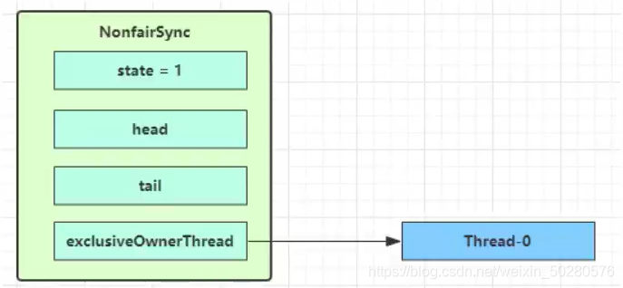
第一个竞争出现时

```java
	public final void acquire(int arg) {
		// 再次尝试加锁, 然后为 true 就不走下面逻辑，为 false，则创建一个 Node 节点对象加入到等待队列中去
        if (!tryAcquire(arg) &&
            acquireQueued(addWaiter(Node.EXCLUSIVE), arg))
            selfInterrupt();
    }
123456
```

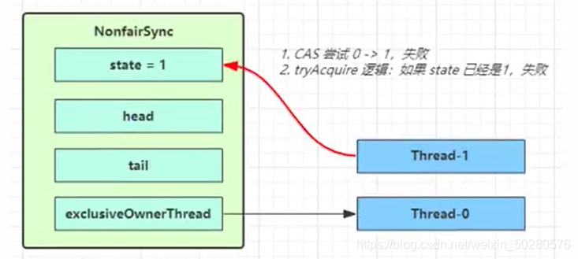
Thread-1 执行了

1. ock方法中CAS 尝试将 state 由 0 改为 1，结果失败
2. lock方法中进一步调用acquire方法，进入 tryAcquire 逻辑，这里我们认为这时 state 已经是1，结果仍然失败
3. 接下来进入 acquire方法的addWaiter 逻辑，构造 Node 队列
   - 图中黄色三角表示该 Node 的 waitStatus 状态，其中 0 为默认正常状态
   - Node 的创建是懒惰的
   - 其中第一个 Node 称为 Dummy（哑元）或哨兵，用来占位，并不关联线程

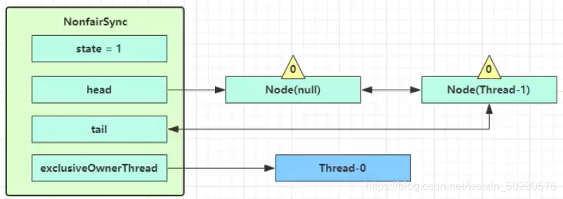
当前线程进入 acquire方法的 acquireQueued 逻辑

1. acquireQueued 会在一个死循环中不断尝试获得锁，失败后进入 park 阻塞
2. 如果自己是紧邻着 head（排第二位），那么再次 tryAcquire 尝试获取锁，我们这里设置这时 state 仍为 1，失败
3. 进入 shouldParkAfterFailedAcquire 逻辑，将前驱 node，即 head 的 waitStatus 改为 -1，这次返回 false
   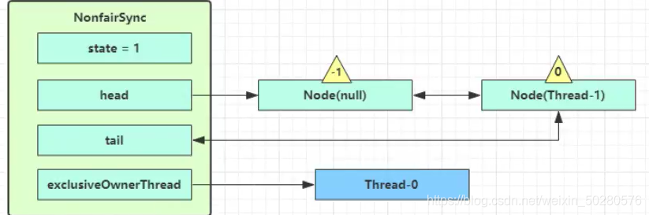
4. shouldParkAfterFailedAcquire 执行完毕回到 acquireQueued ，再次 tryAcquire 尝试获取锁，当然这时 state 仍为 1，失败
5. 当再次进入 shouldParkAfterFailedAcquire 时，这时因为其前驱 node 的 waitStatus 已经是 -1，这次返回 true
6. 进入 parkAndCheckInterrupt， Thread-1 park（灰色表示已经阻塞）
   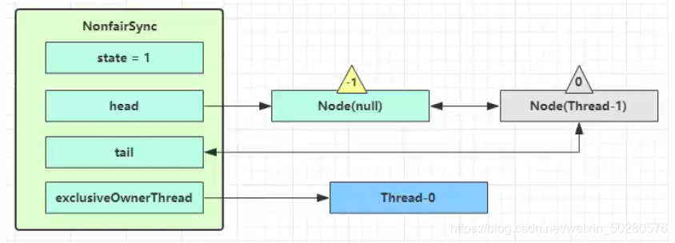

再从次有多个线程经历上述过程竞争失败，变成这个样子
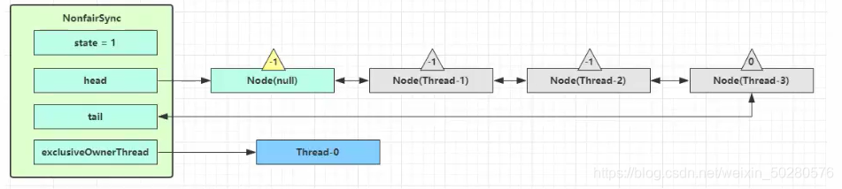
Thread-0 释放锁，进入 tryRelease 流程，如果成功

- 设置 exclusiveOwnerThread 为 null
- state = 0

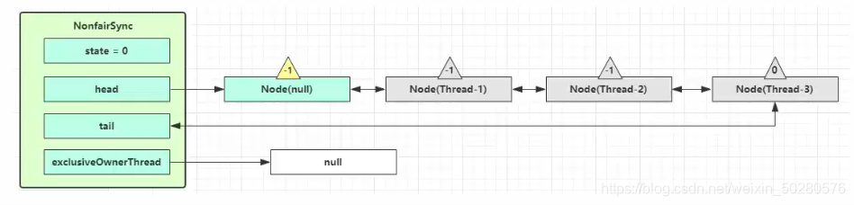
如果当前队列不为 null，并且 head 的 waitStatus = -1，进入 unparkSuccessor 流程：

unparkSuccessor 中会找到队列中离 head 最近的一个 Node（没取消的），unpark 恢复其运行，本例中即为 Thread-1

回到 Thread-1 的 acquireQueued 流程
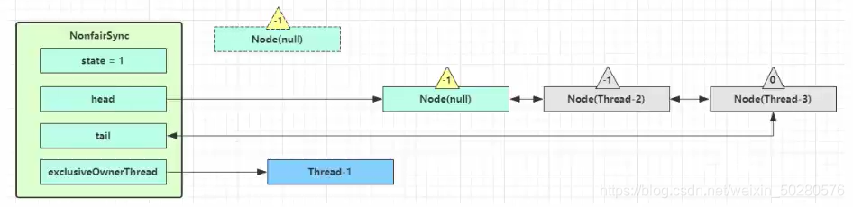
如果加锁成功（没有竞争），会设置 （acquireQueued 方法中）

1. exclusiveOwnerThread 为 Thread-1，state = 1
2. head 指向刚刚 Thread-1 所在的 Node，该 Node 清空 Thread
3. 原本的 head 因为从链表断开，而可被垃圾回收

如果这时候有其它线程来竞争（非公平的体现），例如这时有 Thread-4 来了
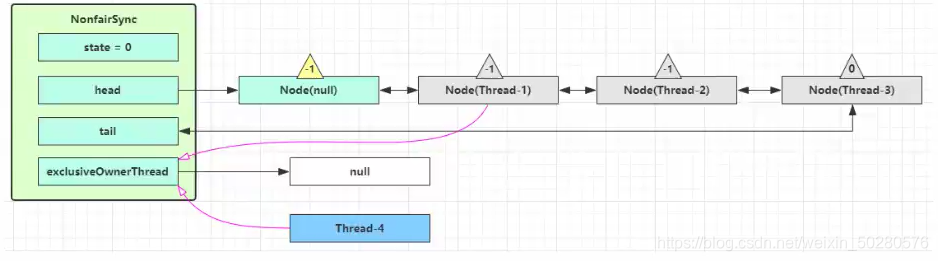
如果不巧又被 Thread-4 占了先

1. Thread-4 被设置为 exclusiveOwnerThread，state = 1
2. Thread-1 再次进入 acquireQueued 流程，获取锁失败，重新进入 park 阻塞

**加锁源码：**

```java
// Sync 继承自 AQS
static final class NonfairSync extends Sync {
    private static final long serialVersionUID = 7316153563782823691L;

     // 加锁实现
    final void lock() {
        // 首先用 cas 尝试（仅尝试一次）将 state 从 0 改为 1, 如果成功表示获得了独占锁
        if (compareAndSetState(0, 1))
            setExclusiveOwnerThread(Thread.currentThread());
        else
            // 如果尝试失败，进入 ㈠
            acquire(1);
    }

    // ㈠ AQS 继承过来的方法, 方便阅读, 放在此处
    public final void acquire(int arg) {
        // ㈡ tryAcquire
        if (
                !tryAcquire(arg) &&
            	// 当 tryAcquire 返回为 false 时, 先调用 addWaiter ㈣, 接着 acquireQueued ㈤
                 acquireQueued(addWaiter(Node.EXCLUSIVE), arg)
        ) {
            selfInterrupt();
        }
    }

    // ㈡ 进入 ㈢
    protected final boolean tryAcquire(int acquires) {
        return nonfairTryAcquire(acquires);
    }

    // ㈢ Sync 继承过来的方法, 方便阅读, 放在此处
    final boolean nonfairTryAcquire(int acquires) {
        final Thread current = Thread.currentThread();
        int c = getState();
        // 如果还没有获得锁
        if (c == 0) {
            // 尝试用 cas 获得, 这里体现了非公平性: 不去检查 AQS 队列
            if (compareAndSetState(0, acquires)) {
                setExclusiveOwnerThread(current);
                return true;
            }
        }
        // 如果已经获得了锁, 线程还是当前线程, 表示发生了锁重入
        else if (current == getExclusiveOwnerThread()) {
            // state++
            int nextc = c + acquires;
            if (nextc < 0) // overflow
                throw new Error("Maximum lock count exceeded");
            setState(nextc);
            return true;
        }
        // 获取失败, 回到调用处
        return false;
    }

    // ㈣ AQS 继承过来的方法, 方便阅读, 放在此处
    private Node addWaiter(Node mode) {
// 将当前线程关联到一个 Node 对象上, 模式为独占模式，新建的Node的waitstatus默认为0，因为waitstatus是成员变量，默认被初始化为0
        Node node = new Node(Thread.currentThread(), mode);
        // 如果 tail 不为 null, cas 尝试将 Node 对象加入 AQS 队列尾部
        Node pred = tail;
        if (pred != null) {
            node.prev = pred;
            if (compareAndSetTail(pred, node)) {
                // 双向链表
                pred.next = node;
                return node;
            }
        }
        //如果tail为null，尝试将 Node 加入 AQS, 进入 ㈥
        enq(node);
        return node;
    }

    // ㈥ AQS 继承过来的方法, 方便阅读, 放在此处
    private Node enq(final Node node) {
        for (;;) {
            Node t = tail;
            if (t == null) {
                // 还没有, 设置 head 为哨兵节点（不对应线程，状态为 0）
                if (compareAndSetHead(new Node())) {
                    tail = head;
                }
            } else {
                // cas 尝试将 Node 对象加入 AQS 队列尾部
                node.prev = t;
                if (compareAndSetTail(t, node)) {
                    t.next = node;
                    return t;
                }
            }
        }
    }

    // ㈤ AQS 继承过来的方法, 方便阅读, 放在此处
    final boolean acquireQueued(final Node node, int arg) {
        boolean failed = true;
        try {
            boolean interrupted = false;
            for (;;) {
                final Node p = node.predecessor();
                // 上一个节点是 head, 表示轮到自己（当前线程对应的 node）了, 尝试获取
                if (p == head && tryAcquire(arg)) {
                    // 获取成功, 设置自己（当前线程对应的 node）为 head
                    setHead(node);
                    // 上一个节点 help GC
                    p.next = null;
                    failed = false;
                    // 返回中断标记 false
                    return interrupted;
                }
                if (
                    // 判断是否应当 park, 进入 ㈦
                    shouldParkAfterFailedAcquire(p, node) &&
                    // park 等待, 此时 Node 的状态被置为 Node.SIGNAL ㈧
                    parkAndCheckInterrupt()
                ) {
                    interrupted = true;
                }
            }
        } finally {
            if (failed)
                cancelAcquire(node);
        }
    }

    // ㈦ AQS 继承过来的方法, 方便阅读, 放在此处
    private static boolean shouldParkAfterFailedAcquire(Node pred, Node node) {
        // 获取上一个节点的状态
        int ws = pred.waitStatus;
        if (ws == Node.SIGNAL) {
            // 上一个节点都在阻塞, 那么自己也阻塞好了
            return true;
        }
        // > 0 表示取消状态
        if (ws > 0) {
            // 上一个节点取消, 那么重构删除前面所有取消的节点, 返回到外层循环重试
            do {
                node.prev = pred = pred.prev;
            } while (pred.waitStatus > 0);
            pred.next = node;
        } else {
            // 这次还没有阻塞
            // 但下次如果重试不成功, 则需要阻塞，这时需要设置上一个节点状态为 Node.SIGNAL
            compareAndSetWaitStatus(pred, ws, Node.SIGNAL);
        }
        return false;
    }

    // ㈧ 阻塞当前线程
    private final boolean parkAndCheckInterrupt() {
        LockSupport.park(this);
        return Thread.interrupted();
    }
}
123456789101112131415161718192021222324252627282930313233343536373839404142434445464748495051525354555657585960616263646566676869707172737475767778798081828384858687888990919293949596979899100101102103104105106107108109110111112113114115116117118119120121122123124125126127128129130131132133134135136137138139140141142143144145146147148149150151152153154155156
```

**解锁源码：**

```java
// Sync 继承自 AQS
static final class NonfairSync extends Sync {
    // 解锁实现
    public void unlock() {
        sync.release(1);
    }

    // AQS 继承过来的方法, 方便阅读, 放在此处
    public final boolean release(int arg) {
        // 尝试释放锁, 进入 ㈠
        if (tryRelease(arg)) {
            // 队列头节点 unpark
            Node h = head;
            if (
                // 队列不为 null
                h != null &&
                // waitStatus == Node.SIGNAL 才需要 unpark
                h.waitStatus != 0
            ) {
                // unpark AQS 中等待的线程, 进入 ㈡
                unparkSuccessor(h);
            }
            return true;
        }
        return false;
    }

    // ㈠ Sync 继承过来的方法, 方便阅读, 放在此处
    protected final boolean tryRelease(int releases) {
        // state--
        int c = getState() - releases;
        if (Thread.currentThread() != getExclusiveOwnerThread())
            throw new IllegalMonitorStateException();
        boolean free = false;
        // 支持锁重入, 只有 state 减为 0, 才释放成功
        if (c == 0) {
            free = true;
            setExclusiveOwnerThread(null);
        }
        setState(c);
        return free;
    }

    // ㈡ AQS 继承过来的方法, 方便阅读, 放在此处
    private void unparkSuccessor(Node node) {
        // 如果状态为 Node.SIGNAL 尝试重置状态为 0, 如果线程获取到了锁那么后来头结点会被抛弃掉
        // 不成功也可以
        int ws = node.waitStatus;
        if (ws < 0) {
            compareAndSetWaitStatus(node, ws, 0);
        }
        // 找到需要 unpark 的节点, 但本节点从 AQS 队列中脱离, 是由唤醒节点完成的
        Node s = node.next;
        // 不考虑已取消的节点, 从 AQS 队列从后至前找到队列最前面需要 unpark 的节点
        if (s == null || s.waitStatus > 0) {
            s = null;
            for (Node t = tail; t != null && t != node; t = t.prev)
                if (t.waitStatus <= 0)
                    s = t;
        }
        if (s != null)
            LockSupport.unpark(s.thread);
    }
}
12345678910111213141516171819202122232425262728293031323334353637383940414243444546474849505152535455565758596061626364
```

#### 2、锁重入原理

```java
static final class NonfairSync extends Sync {
    // ...

    // Sync 继承过来的方法, 方便阅读, 放在此处
    final boolean nonfairTryAcquire(int acquires) {
        final Thread current = Thread.currentThread();
        int c = getState();
        if (c == 0) {
            if (compareAndSetState(0, acquires)) {
                setExclusiveOwnerThread(current);
                return true;
            }
        }
        // 如果已经获得了锁, 线程还是当前线程, 表示发生了锁重入
        else if (current == getExclusiveOwnerThread()) {
            // state++
            int nextc = c + acquires;
            if (nextc < 0) // overflow
                throw new Error("Maximum lock count exceeded");
            setState(nextc);
            return true;
        }
        return false;
    }

    // Sync 继承过来的方法, 方便阅读, 放在此处
    protected final boolean tryRelease(int releases) {
        // state--
        int c = getState() - releases;
        if (Thread.currentThread() != getExclusiveOwnerThread())
            throw new IllegalMonitorStateException();
        boolean free = false;
        // 支持锁重入, 只有 state 减为 0, 才释放成功
        if (c == 0) {
            free = true;
            setExclusiveOwnerThread(null);
        }
        setState(c);
        return free;
    }
}
1234567891011121314151617181920212223242526272829303132333435363738394041
```

#### 3、可打断原理

**不可打断模式：**
在此模式下，即使它被打断，仍会驻留在 AQS 队列中，一直要等到获得锁后方能得知自己被打断了。

```java
// Sync 继承自 AQS
static final class NonfairSync extends Sync {
    // ...

    private final boolean parkAndCheckInterrupt() {
        // 如果打断标记已经是 true, 则 park 会失效
        LockSupport.park(this);
        // interrupted 会清除打断标记
        return Thread.interrupted();
    }

    final boolean acquireQueued(final Node node, int arg) {
        boolean failed = true;
        try {
            boolean interrupted = false;
            for (;;) {
                final Node p = node.predecessor();
                if (p == head && tryAcquire(arg)) {
                    setHead(node);
                    p.next = null;
                    failed = false;
                    // 还是需要获得锁后, 才能返回打断状态
                    return interrupted;
                }
                if (
                        shouldParkAfterFailedAcquire(p, node) &&
                                parkAndCheckInterrupt()
                ) {
                    // 如果是因为 interrupt 被唤醒, 返回打断状态为 true
                    interrupted = true;
                }
            }
        } finally {
            if (failed)
                cancelAcquire(node);
        }
    }

    public final void acquire(int arg) {
        if (
                !tryAcquire(arg) &&
                        acquireQueued(addWaiter(Node.EXCLUSIVE), arg)
        ) {
            // 如果打断状态为 true
            selfInterrupt();
        }
    }

    static void selfInterrupt() {
        // 重新产生一次中断，这时候线程是如果正常运行的状态，那么不是出于sleep等状态，interrupt方法就不会报错
        Thread.currentThread().interrupt();
    }
}
}
123456789101112131415161718192021222324252627282930313233343536373839404142434445464748495051525354
```

**可打断模式：**

```java
static final class NonfairSync extends Sync {
    public final void acquireInterruptibly(int arg) throws InterruptedException {
        if (Thread.interrupted())
            throw new InterruptedException();
        // 如果没有获得到锁, 进入 ㈠
        if (!tryAcquire(arg))
            doAcquireInterruptibly(arg);
    }

    // ㈠ 可打断的获取锁流程
    private void doAcquireInterruptibly(int arg) throws InterruptedException {
        final Node node = addWaiter(Node.EXCLUSIVE);
        boolean failed = true;
        try {
            for (;;) {
                final Node p = node.predecessor();
                if (p == head && tryAcquire(arg)) {
                    setHead(node);
                    p.next = null; // help GC
                    failed = false;
                    return;
                }
                if (shouldParkAfterFailedAcquire(p, node) &&
                        parkAndCheckInterrupt()) {
                    // 在 park 过程中如果被 interrupt 会进入此
                    // 这时候抛出异常, 而不会再次进入 for (;;)
                    throw new InterruptedException();
                }
            }
        } finally {
            if (failed)
                cancelAcquire(node);
        }
    }
}
1234567891011121314151617181920212223242526272829303132333435
```

#### 4、公平锁原理

```java
static final class FairSync extends Sync {
    private static final long serialVersionUID = -3000897897090466540L;
    final void lock() {
        acquire(1);
    }

    // AQS 继承过来的方法, 方便阅读, 放在此处
    public final void acquire(int arg) {
        if (
                !tryAcquire(arg) &&
                        acquireQueued(addWaiter(Node.EXCLUSIVE), arg)
        ) {
            selfInterrupt();
        }
    }
    // 与非公平锁主要区别在于 tryAcquire 方法的实现
    protected final boolean tryAcquire(int acquires) {
        final Thread current = Thread.currentThread();
        int c = getState();
        if (c == 0) {
            // 先检查 AQS 队列中是否有前驱节点, 没有才去竞争
            if (!hasQueuedPredecessors() &&
                    compareAndSetState(0, acquires)) {
                setExclusiveOwnerThread(current);
                return true;
            }
        }
        else if (current == getExclusiveOwnerThread()) {
            int nextc = c + acquires;
            if (nextc < 0)
                throw new Error("Maximum lock count exceeded");
            setState(nextc);
            return true;
        }
        return false;
    }

    // ㈠ AQS 继承过来的方法, 方便阅读, 放在此处
    public final boolean hasQueuedPredecessors() {
        Node t = tail;
        Node h = head;
        Node s;
        // h != t 时表示队列中有 Node
        return h != t &&
                (
                        // (s = h.next) == null 表示队列中还有没有老二
                        (s = h.next) == null || // 或者队列中老二线程不是此线程
                                s.thread != Thread.currentThread()
                );
    }
}
123456789101112131415161718192021222324252627282930313233343536373839404142434445464748495051
```

#### 5、条件变量实现原理

每个条件变量其实就对应着一个等待队列，其实现类是 ConditionObject
**await 流程**
开始 Thread-0 持有锁，调用 await，进入 ConditionObject 的 addConditionWaiter 流程 创建新的 Node 状态为 -2（Node.CONDITION），关联 Thread-0，加入等待队列尾部
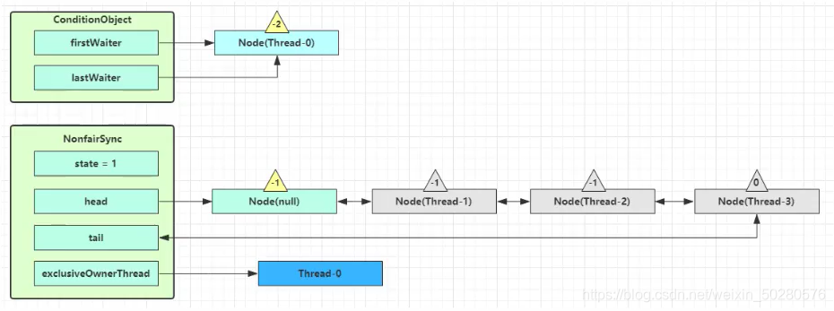
接下来进入 AQS 的 fullyRelease 流程，释放同步器上的锁
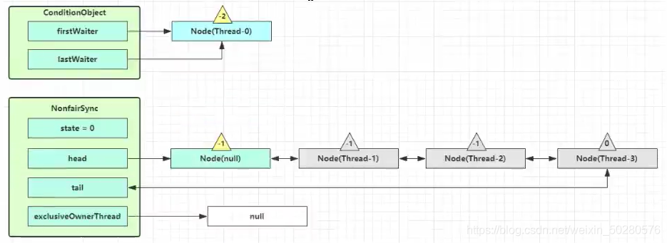
unpark AQS 队列中的下一个节点，竞争锁，假设没有其他竞争线程，那么 Thread-1 竞争成功
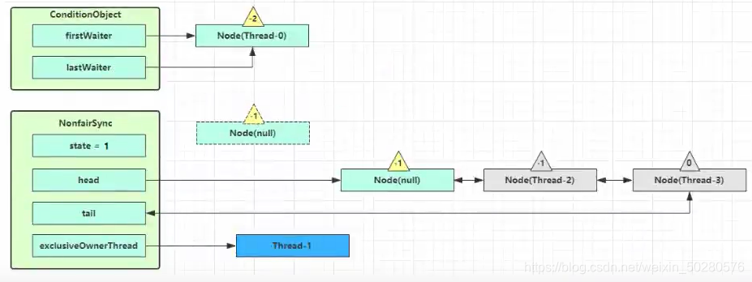
park 阻塞 Thread-0

**signal 流程**
假设 Thread-1 要来唤醒 Thread-0
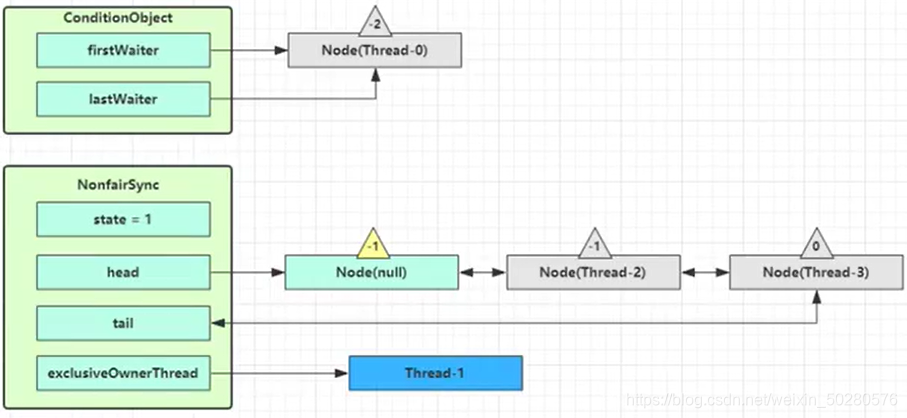
进入 ConditionObject 的 doSignal 流程，取得等待队列中第一个 Node，即 Thread-0 所在 Node

执行 transferForSignal 流程，将该 Node 加入 AQS 队列尾部，将 Thread-0 的 waitStatus 改为 0，Thread-3 的waitStatus 改为 -1
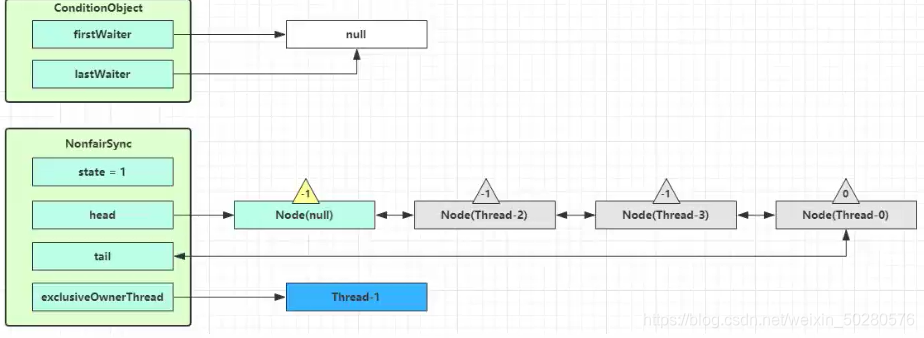
Thread-1 释放锁，进入 unlock 流程。
源码分析：

```java
public class ConditionObject implements Condition, java.io.Serializable {
    private static final long serialVersionUID = 1173984872572414699L;

    // 第一个等待节点
    private transient Node firstWaiter;

    // 最后一个等待节点
    private transient Node lastWaiter;
    public ConditionObject() { }
    // ㈠ 添加一个 Node 至等待队列
    private Node addConditionWaiter() {
        Node t = lastWaiter;
        // 所有已取消的 Node 从队列链表删除, 见 ㈡
        if (t != null && t.waitStatus != Node.CONDITION) {
            unlinkCancelledWaiters();
            t = lastWaiter;
        }
        // 创建一个关联当前线程的新 Node, 添加至队列尾部
        Node node = new Node(Thread.currentThread(), Node.CONDITION);
        if (t == null)
            firstWaiter = node;
        else
            t.nextWaiter = node;
        lastWaiter = node;
        return node;
    }
    // 唤醒 - 将没取消的第一个节点转移至 AQS 队列
    private void doSignal(Node first) {
        do {
            // 已经是尾节点了
            if ( (firstWaiter = first.nextWaiter) == null) {
                lastWaiter = null;
            }
            first.nextWaiter = null;
        } while (
            // 将等待队列中的 Node 转移至 AQS 队列, 不成功且还有节点则继续循环 ㈢
                !transferForSignal(first) &&
                        // 队列还有节点
                        (first = firstWaiter) != null
        );
    }

    // 外部类方法, 方便阅读, 放在此处
    // ㈢ 如果节点状态是取消, 返回 false 表示转移失败, 否则转移成功
    final boolean transferForSignal(Node node) {
        // 设置当前node状态为0（因为处在队列末尾），如果状态已经不是 Node.CONDITION, 说明被取消了
        if (!compareAndSetWaitStatus(node, Node.CONDITION, 0))
            return false;
        // 加入 AQS 队列尾部
        Node p = enq(node);
        int ws = p.waitStatus;
        if (
            // 插入节点的上一个节点被取消
                ws > 0 ||
                        // 插入节点的上一个节点不能设置状态为 Node.SIGNAL
                        !compareAndSetWaitStatus(p, ws, Node.SIGNAL)
        ) {
            // unpark 取消阻塞, 让线程重新同步状态
            LockSupport.unpark(node.thread);
        }
        return true;
    }
// 全部唤醒 - 等待队列的所有节点转移至 AQS 队列
private void doSignalAll(Node first) {
    lastWaiter = firstWaiter = null;
    do {
        Node next = first.nextWaiter;
        first.nextWaiter = null;
        transferForSignal(first);
        first = next;
    } while (first != null);
}

    // ㈡
    private void unlinkCancelledWaiters() {
        // ...
    }
    // 唤醒 - 必须持有锁才能唤醒, 因此 doSignal 内无需考虑加锁
    public final void signal() {
        // 如果没有持有锁，会抛出异常
        if (!isHeldExclusively())
            throw new IllegalMonitorStateException();
        Node first = firstWaiter;
        if (first != null)
            doSignal(first);
    }
    // 全部唤醒 - 必须持有锁才能唤醒, 因此 doSignalAll 内无需考虑加锁
    public final void signalAll() {
        if (!isHeldExclusively())
            throw new IllegalMonitorStateException();
        Node first = firstWaiter;
        if (first != null)
            doSignalAll(first);
    }
    // 不可打断等待 - 直到被唤醒
    public final void awaitUninterruptibly() {
        // 添加一个 Node 至等待队列, 见 ㈠
        Node node = addConditionWaiter();
        // 释放节点持有的锁, 见 ㈣
        int savedState = fullyRelease(node);
        boolean interrupted = false;
        // 如果该节点还没有转移至 AQS 队列, 阻塞
        while (!isOnSyncQueue(node)) {
            // park 阻塞
            LockSupport.park(this);
            // 如果被打断, 仅设置打断状态
            if (Thread.interrupted())
                interrupted = true;
        }
        // 唤醒后, 尝试竞争锁, 如果失败进入 AQS 队列
        if (acquireQueued(node, savedState) || interrupted)
            selfInterrupt();
    }
    // 外部类方法, 方便阅读, 放在此处
    // ㈣ 因为某线程可能重入，需要将 state 全部释放，获取state，然后把它全部减掉，以全部释放
    final int fullyRelease(Node node) {
        boolean failed = true;
        try {
            int savedState = getState();
            // 唤醒等待队列队列中的下一个节点
            if (release(savedState)) {
                failed = false;
                return savedState;
            } else {
                throw new IllegalMonitorStateException();
            }
        } finally {
            if (failed)
                node.waitStatus = Node.CANCELLED;
        }
    }
    // 打断模式 - 在退出等待时重新设置打断状态
    private static final int REINTERRUPT = 1;
    // 打断模式 - 在退出等待时抛出异常
    private static final int THROW_IE = -1;
    // 判断打断模式
    private int checkInterruptWhileWaiting(Node node) {
        return Thread.interrupted() ?
                (transferAfterCancelledWait(node) ? THROW_IE : REINTERRUPT) :
                0;
    }
    // ㈤ 应用打断模式
    private void reportInterruptAfterWait(int interruptMode)
            throws InterruptedException {
        if (interruptMode == THROW_IE)
            throw new InterruptedException();
        else if (interruptMode == REINTERRUPT)
            selfInterrupt();
    }
    // 等待 - 直到被唤醒或打断
    public final void await() throws InterruptedException {
        if (Thread.interrupted()) {
            throw new InterruptedException();
        }
        // 添加一个 Node 至等待队列, 见 ㈠
        Node node = addConditionWaiter();
        // 释放节点持有的锁
        int savedState = fullyRelease(node);
        int interruptMode = 0;
        // 如果该节点还没有转移至 AQS 队列, 阻塞
        while (!isOnSyncQueue(node)) {
            // park 阻塞              
            LockSupport.park(this);
            // 如果被打断, 退出等待队列
            if ((interruptMode = checkInterruptWhileWaiting(node)) != 0)
                break;
        }
        // 退出等待队列后, 还需要获得 AQS 队列的锁
        if (acquireQueued(node, savedState) && interruptMode != THROW_IE)
            interruptMode = REINTERRUPT;
        // 所有已取消的 Node 从队列链表删除, 见 ㈡
        if (node.nextWaiter != null)
            unlinkCancelledWaiters();
        // 应用打断模式, 见 ㈤
        if (interruptMode != 0)
            reportInterruptAfterWait(interruptMode);
    }
    // 等待 - 直到被唤醒或打断或超时
    public final long awaitNanos(long nanosTimeout) throws InterruptedException {
        if (Thread.interrupted()) {
            throw new InterruptedException();
        }
        // 添加一个 Node 至等待队列, 见 ㈠
        Node node = addConditionWaiter();
        // 释放节点持有的锁
        int savedState = fullyRelease(node);
        // 获得最后期限
        final long deadline = System.nanoTime() + nanosTimeout;
        int interruptMode = 0;
        // 如果该节点还没有转移至 AQS 队列, 阻塞
        while (!isOnSyncQueue(node)) {
            // 已超时, 退出等待队列
            if (nanosTimeout <= 0L) {
                transferAfterCancelledWait(node);
                break;
            }
            // park 阻塞一定时间, spinForTimeoutThreshold 为 1000 ns
            if (nanosTimeout >= spinForTimeoutThreshold)
                LockSupport.parkNanos(this, nanosTimeout);
            // 如果被打断, 退出等待队列
            if ((interruptMode = checkInterruptWhileWaiting(node)) != 0)
                break;
            nanosTimeout = deadline - System.nanoTime();
        }
        // 退出等待队列后, 还需要获得 AQS 队列的锁
        if (acquireQueued(node, savedState) && interruptMode != THROW_IE)
            interruptMode = REINTERRUPT;
        // 所有已取消的 Node 从队列链表删除, 见 ㈡
        if (node.nextWaiter != null)
            unlinkCancelledWaiters();
        // 应用打断模式, 见 ㈤
        if (interruptMode != 0)
            reportInterruptAfterWait(interruptMode);
        return deadline - System.nanoTime();
    }
    // 等待 - 直到被唤醒或打断或超时, 逻辑类似于 awaitNanos
    public final boolean awaitUntil(Date deadline) throws InterruptedException {
        // ...
    }
    // 等待 - 直到被唤醒或打断或超时, 逻辑类似于 awaitNanos
    public final boolean await(long time, TimeUnit unit) throws InterruptedException {
        // ...
    }
    // 工具方法 省略 ...
}
```

### [读写锁](https://so.csdn.net/so/search?q=读写锁&spm=1001.2101.3001.7020)原理

#### 1、ReentrantReadWriteLock

当读操作远远高于写操作时，这时候使用读写锁让读-读可以并发，提高性能。读-写，写-写都是相互互斥的！

提供一个数据容器类内部分别使用读锁保护数据的read()方法，写锁保护数据的write()方法 。

实现代码如下：

```java
public class Code_12_ReadWriteLockTest {

    public static void main(String[] args) throws InterruptedException {

        DataContainer dataContainer = new DataContainer();

        Thread t1 = new Thread(() -> {
            dataContainer.read();
//            dataContainer.write();
        }, "t1");

//        Thread.sleep(100);

        Thread t2 = new Thread(() -> {
//            dataContainer.read();
            dataContainer.write();
        }, "t2");

        t1.start();
        t2.start();

    }

}

@Slf4j(topic = "c.DataContainer")
class DataContainer {

    private Object object = new Object();
    private ReentrantReadWriteLock readWriteLock = new ReentrantReadWriteLock();
    private ReentrantReadWriteLock.ReadLock readLock = readWriteLock.readLock();
    private ReentrantReadWriteLock.WriteLock writeLock = readWriteLock.writeLock();

    public Object read() {
        readLock.lock();
        log.info("拿到读锁！");
        try {
            log.info("读取操作 ...");
            try {
                TimeUnit.SECONDS.sleep(1);
            } catch (InterruptedException e) {
                e.printStackTrace();
            }
        }finally {
            readLock.unlock();
            log.info("释放读锁！");
        }
        return object;
    }

    public void write() {
        writeLock.lock();
        log.info("拿到写锁！");
        try {
            log.info("写操作 ... ");
        }finally {
            writeLock.unlock();
            log.info("释放写锁！");
        }
    }

}
1234567891011121314151617181920212223242526272829303132333435363738394041424344454647484950515253545556575859606162
```

注意事项

1. 读锁不支持条件变量
2. 重入时升级不支持：即持有读锁的情况下去获取写锁，会导致获取写锁永久等待

```java
	 r.lock();
	 try {
	     // ...
	     w.lock();
	     try {
	         // ...
	     } finally{
	         w.unlock();
	     }
	 } finally{
	     r.unlock();
	 }
123456789101112
```

1. 重入时降级支持：即持有写锁的情况下去获取读锁

```java
class CachedData {
    Object data;
    // 是否有效，如果失效，需要重新计算 data
    volatile boolean cacheValid;
    final ReentrantReadWriteLock rwl = new ReentrantReadWriteLock();
    void processCachedData() {
        rwl.readLock().lock();
        if (!cacheValid) {
            // 获取写锁前必须释放读锁
            rwl.readLock().unlock();
            rwl.writeLock().lock();
            try {
                // 判断是否有其它线程已经获取了写锁、更新了缓存, 避免重复更新
                if (!cacheValid) {
                    data = ...
                    cacheValid = true;
                }
                // 降级为读锁, 释放写锁, 这样能够让其它线程读取缓存
                rwl.readLock().lock();
            } finally {

                rwl.writeLock().unlock();
            }
        }
        // 自己用完数据, 释放读锁
        try {
            use(data);
        } finally {
            rwl.readLock().unlock();
        }
    }
}
1234567891011121314151617181920212223242526272829303132
```

#### 2、应用之缓存

**缓存更新策略：**
更新时，是先清缓存还是先更新数据库？
先清除缓存操作如下：
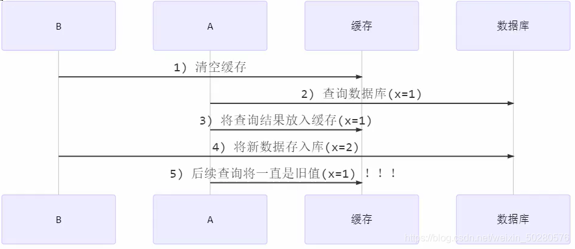

先更新数据库操作如下：
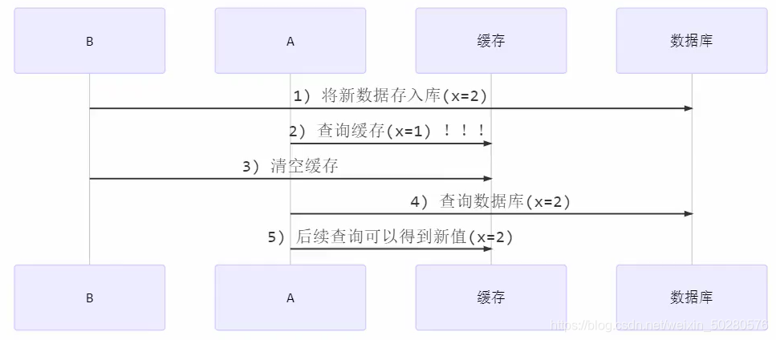
补充一种情况，假设查询线程 A 查询数据时恰好缓存数据由于时间到期失效，或是第一次查询：这种情况的出现几率非常小：
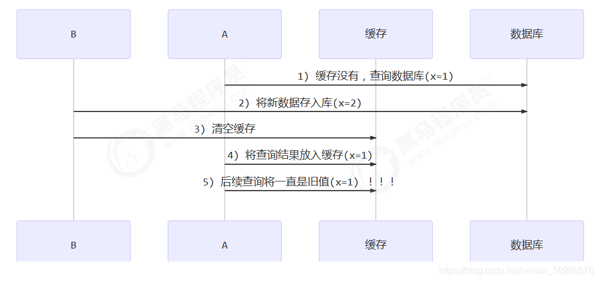
实现代码如下：

```java
/**
 * ReentrantReadWriteLock 读写锁解决 缓存与数据库一致性问题
 */
public class Code_13_ReadWriteCacheTest {
    public static void main(String[] args) {

        GeneriCacheDao<Object> generiCacheDao = new GeneriCacheDao<>();

        Object[] objects = new Object[2];
        generiCacheDao.queryOne(Object.class,"Test",objects);
        generiCacheDao.queryOne(Object.class,"Test",objects);
        generiCacheDao.queryOne(Object.class,"Test",objects);
        generiCacheDao.queryOne(Object.class,"Test",objects);
        System.out.println(generiCacheDao.map);
        generiCacheDao.update("Test",objects);
        System.out.println(generiCacheDao.map);
    }

}

class GeneriCacheDao<T>  extends GenericDao {

    HashMap<SqlPair, T> map = new HashMap<>();
    ReentrantReadWriteLock lock = new ReentrantReadWriteLock();
    GenericDao genericDao = new GenericDao();

    @Override
    public int update(String sql, Object... params){
        lock.writeLock().lock();
        SqlPair sqlPair = new SqlPair(sql, params);
        try {
            // 先查询数据库再更新缓存,但是这里加了锁，谁先谁后都没关系
            int update = genericDao.update(sql, params);
            map.clear();
            return update;
        } finally {
            lock.writeLock().unlock();
        }
    }

    @Override
    public T queryOne(Class beanClass, String sql, Object... params){
        SqlPair key = new SqlPair(sql, params);
        // 加读锁, 防止其它线程对缓存更改
        lock.readLock().lock();

        try {
            T t = map.get(key);
            if (t != null){
                return t;
            }
        } finally {
            lock.readLock().unlock();
        }

        // 加写锁, 防止其它线程对缓存读取和更改
        lock.writeLock().lock();
        // get 方法上面部分是可能多个线程进来的, 可能已经向缓存填充了数据
        // 为防止重复查询数据库, 再次验证
        try {
            T value = map.get(key);
            if (value == null){
                value = (T) genericDao.queryOne(beanClass, sql, params);
                map.put(key, value);
            }
            return value;
        } finally {
            lock.writeLock().unlock();
        }
    }


    class SqlPair{
        private String sql;

        private Object[] params;

        public SqlPair(String sql, Object[] params) {
            this.sql = sql;
            this.params = params;
        }

        @Override
        public boolean equals(Object o) {
            if (this == o) return true;
            if (o == null || getClass() != o.getClass()) return false;
            SqlPair sqlMap = (SqlPair) o;
            return Objects.equals(sql, sqlMap.sql) &&
                    Arrays.equals(params, sqlMap.params);
        }

        @Override
        public int hashCode() {
            int result = Objects.hash(sql);
            result = 31 * result + Arrays.hashCode(params);
            return result;
        }
    }
}

class GenericDao<T>{
    public int update(String sql, Object... params){
        return 1;
    }

    public T queryOne(Class<T> beanClass, String sql, Object... params){
        System.out.println("查询数据库中");
        return (T) new Object();
    }
}
```

#### 3、读写锁原理

**图解流程**

读写锁用的是同一个 Sync 同步器，因此等待队列、state 等也是同一个
**下面执行：t1 w.lock，t2 r.lock 情况**

1）t1 成功上锁，流程与 ReentrantLock 加锁相比没有特殊之处，不同是写锁状态占了 state 的低 16 位，而读锁使用的是 state 的高 16 位
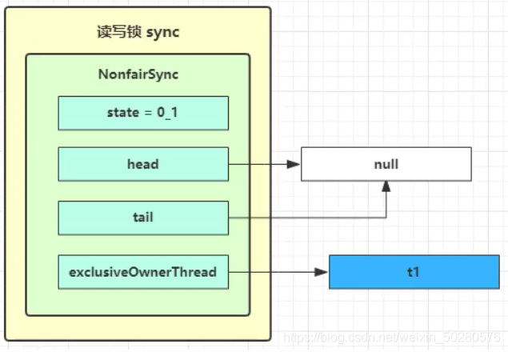
2）t2 执行 r.lock，这时进入读锁的 sync.acquireShared(1) 流程，首先会进入 tryAcquireShared 流程。如果有写锁占据，那么 tryAcquireShared 返回 -1 表示失败。
tryAcquireShared 返回值表示

- -1 表示失败
- 0 表示成功，但后继节点不会继续唤醒
- 正数表示成功，而且数值是还有几个后继节点需要唤醒，我们这里的读写锁返回 1

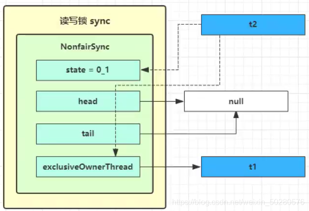
3）这时会进入 sync.doAcquireShared(1) 流程，首先也是调用 addWaiter 添加节点，不同之处在于节点被设置为 Node.SHARED 模式而非 Node.EXCLUSIVE 模式，注意此时 t2 仍处于活跃状态
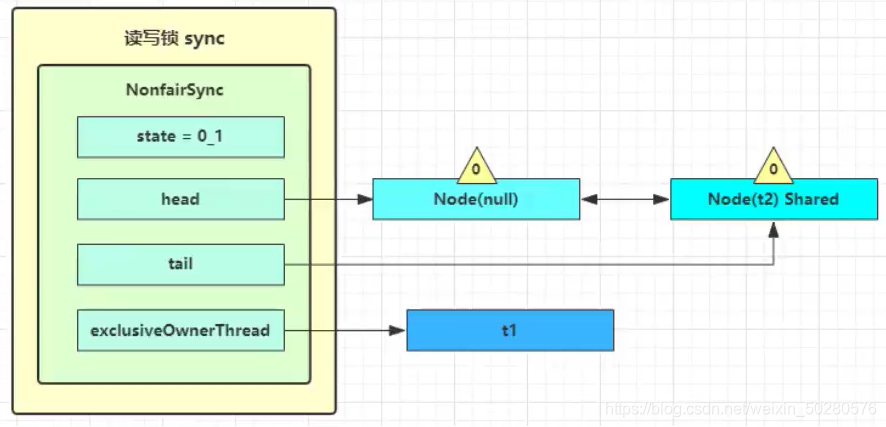
4）t2 会看看自己的节点是不是老二，如果是，还会再次调用 tryAcquireShared(1) 来尝试获取锁
5）如果没有成功，在 doAcquireShared 内 for (;😉 循环一次，把前驱节点的 waitStatus 改为 -1，再 for (;😉 循环一 次尝试 tryAcquireShared(1) 如果还不成功，那么在 parkAndCheckInterrupt() 处 park。

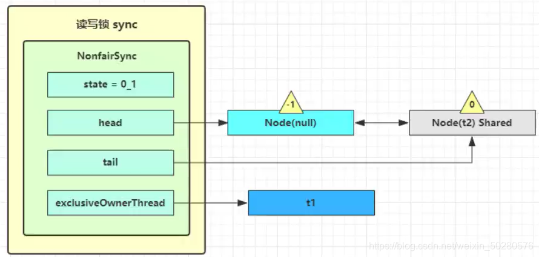

**又继续执行**：t3 r.lock，t4 w.lock
这种状态下，假设又有 t3 加读锁和 t4 加写锁，这期间 t1 仍然持有锁，就变成了下面的样子
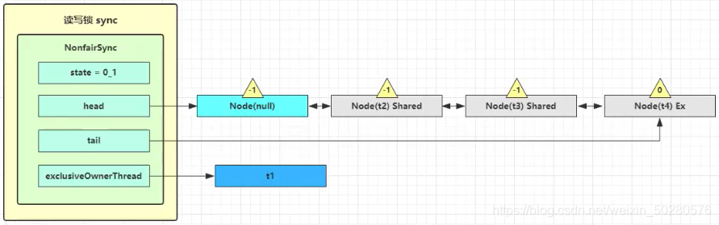
**继续执行 t1 w.unlock**
这时会走到写锁的 sync.release(1) 流程，调用 sync.tryRelease(1) 成功，变成下面的样子
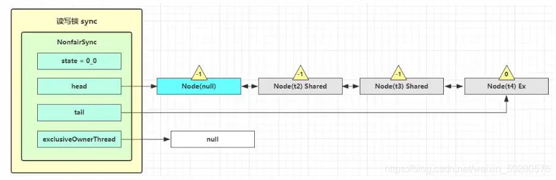
接下来执行唤醒流程 sync.unparkSuccessor，即让老二恢复运行，这时 t2 在 doAcquireShared 内 parkAndCheckInterrupt() 处恢复运行，图中的t2从黑色变成了蓝色（注意这里只是恢复运行而已，并没有获取到锁！） 这回再来一次 for (;; ) 执行 tryAcquireShared 成功则让读锁计数加一
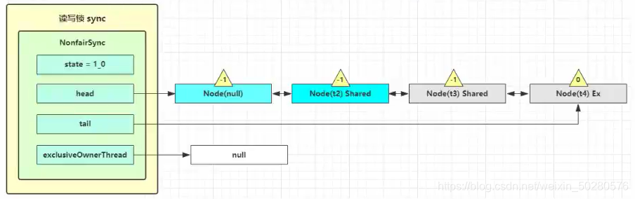
这时 t2 已经恢复运行，接下来 t2 调用 setHeadAndPropagate(node, 1)，它原本所在节点被置为头节点
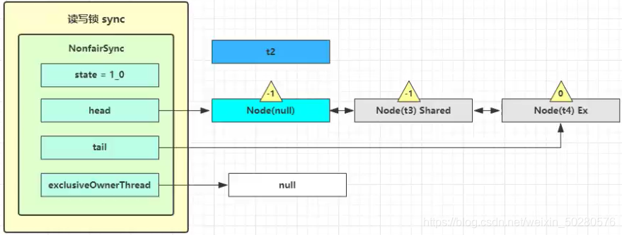
事情还没完，在 setHeadAndPropagate 方法内还会检查下一个节点是否是 shared，如果是则调用 doReleaseShared() 将 head 的状态从 -1 改为 0 并唤醒老二，这时 t3 在 doAcquireShared 内 parkAndCheckInterrupt() 处恢复运行.
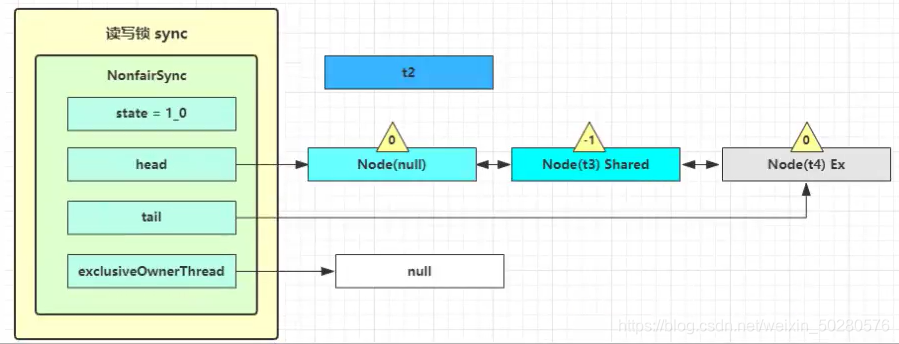
这回再来一次 for (;; ) 执行 tryAcquireShared 成功则让读锁计数加一
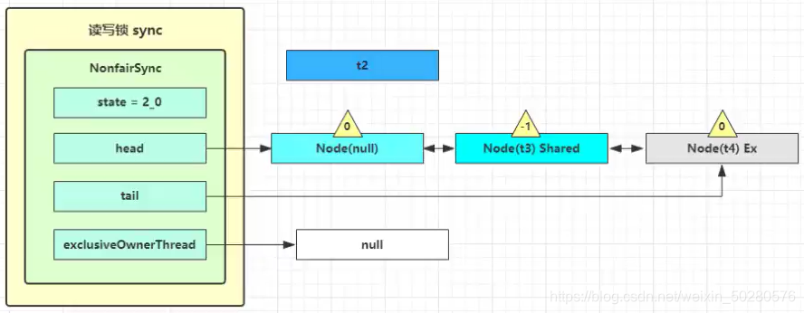
这时 t3 已经恢复运行，接下来 t3 调用 setHeadAndPropagate(node, 1)，它原本所在节点被置为头节点
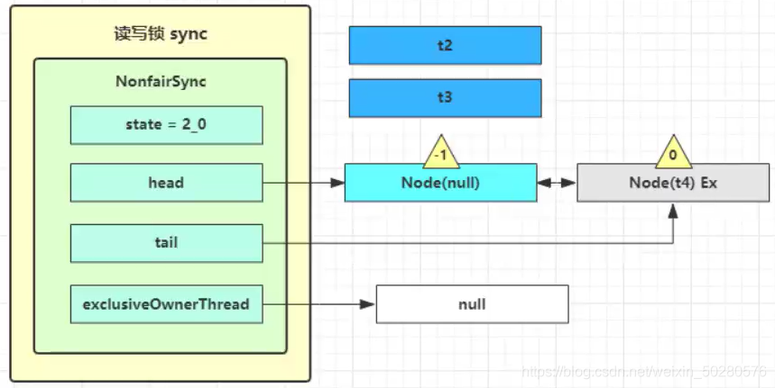
再继续执行t2 r.unlock，t3 r.unlock t2
进入 sync.releaseShared(1) 中，调用 tryReleaseShared(1) 让计数减一，但由于计数还不为零
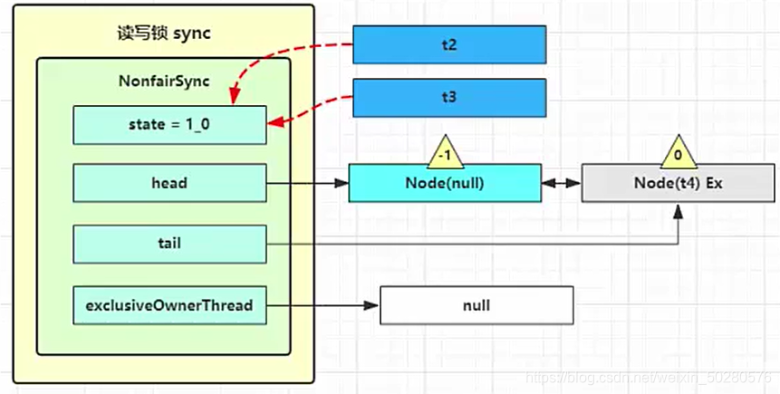
t3 进入 sync.releaseShared(1) 中，调用 tryReleaseShared(1) 让计数减一，这回计数为零了，进入 doReleaseShared() 将头节点从 -1 改为 0 并唤醒老二，即
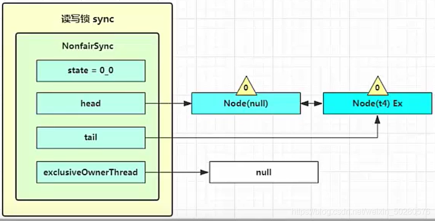
之后 t4 在 acquireQueued 中 parkAndCheckInterrupt 处恢复运行，再次 for (;; ) 这次自己是老二，并且没有其他 竞争，tryAcquire(1) 成功，修改头结点，流程结束
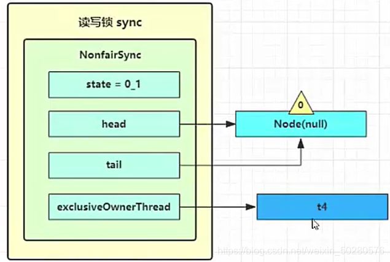
源码分析：
写锁上锁流程

```java
static final class NonfairSync extends Sync {
    // ... 省略无关代码

    // 外部类 WriteLock 方法, 方便阅读, 放在此处
    public void lock() {
        sync.acquire(1);
    }

    // AQS 继承过来的方法, 方便阅读, 放在此处
    public final void acquire(int arg) {
        if (
            // 尝试获得写锁失败
                !tryAcquire(arg) &&
                        // 将当前线程关联到一个 Node 对象上, 模式为独占模式
                        // 进入 AQS 队列阻塞
                        acquireQueued(addWaiter(Node.EXCLUSIVE), arg)
        ) {
            selfInterrupt();
        }
    }

    // Sync 继承过来的方法, 方便阅读, 放在此处
    protected final boolean tryAcquire(int acquires) {
        // 获得低 16 位, 代表写锁的 state 计数
        Thread current = Thread.currentThread();
        int c = getState();
        int w = exclusiveCount(c);

        if (c != 0) {
            if (
                // c != 0 and w == 0 表示有读锁返回错误，读锁不支持锁升级, 或者
                    w == 0 ||
                            // c != 0 and w == 0 表示有写，如果 exclusiveOwnerThread 不是自己
                            current != getExclusiveOwnerThread()
            ) {
                // 获得锁失败
                return false;
            }
            // 写锁计数超过低 16 位, 报异常
            if (w + exclusiveCount(acquires) > MAX_COUNT)
                throw new Error("Maximum lock count exceeded");
            // 写锁重入, 获得锁成功
            setState(c + acquires);
            return true;
        }
        if (
            // 判断写锁是否该阻塞这里返回false, 或者
                writerShouldBlock() ||
                        // 尝试更改计数失败
                        !compareAndSetState(c, c + acquires)
        ) {
            // 获得锁失败
            return false;
        }
        // 获得锁成功
        setExclusiveOwnerThread(current);
        return true;
    }

    // 非公平锁 writerShouldBlock 总是返回 false, 无需阻塞
    final boolean writerShouldBlock() {
        return false;
    }
}
12345678910111213141516171819202122232425262728293031323334353637383940414243444546474849505152535455565758596061626364
```

写锁释放流程：

```java
static final class NonfairSync extends Sync {
    // ... 省略无关代码

    // WriteLock 方法, 方便阅读, 放在此处
    public void unlock() {
        sync.release(1);
    }

    // AQS 继承过来的方法, 方便阅读, 放在此处
    public final boolean release(int arg) {
        // 尝试释放写锁成功
        if (tryRelease(arg)) {
            // unpark AQS 中等待的线程
            Node h = head;
            if (h != null && h.waitStatus != 0)
                unparkSuccessor(h);
            return true;
        }
        return false;
    }

    // Sync 继承过来的方法, 方便阅读, 放在此处
    protected final boolean tryRelease(int releases) {
        if (!isHeldExclusively())
            throw new IllegalMonitorStateException();
        int nextc = getState() - releases;
        // 因为可重入的原因, 写锁计数为 0, 才算释放成功
        boolean free = exclusiveCount(nextc) == 0;
        if (free) {
            setExclusiveOwnerThread(null);
        }
        setState(nextc);
        return free;
    }
}
1234567891011121314151617181920212223242526272829303132333435
```

读锁上锁流程

```java
static final class NonfairSync extends Sync {

    // ReadLock 方法, 方便阅读, 放在此处
    public void lock() {
        sync.acquireShared(1);
    }

    // AQS 继承过来的方法, 方便阅读, 放在此处
    public final void acquireShared(int arg) {
        // tryAcquireShared 返回负数, 表示获取读锁失败
        if (tryAcquireShared(arg) < 0) {
            doAcquireShared(arg);
        }
    }

    // Sync 继承过来的方法, 方便阅读, 放在此处
    protected final int tryAcquireShared(int unused) {
        Thread current = Thread.currentThread();
        int c = getState();
        // 如果是其它线程持有写锁, 获取读锁失败
        if (
                exclusiveCount(c) != 0 &&
                        getExclusiveOwnerThread() != current
        ) {
            return -1;
        }
        int r = sharedCount(c);
        if (
            // 读锁不该阻塞(如果老二是写锁，读锁该阻塞), 并且
                !readerShouldBlock() &&
                        // 小于读锁计数, 并且
                        r < MAX_COUNT &&
                        // 尝试增加计数成功
                        compareAndSetState(c, c + SHARED_UNIT)
        ) {
            // ... 省略不重要的代码
            return 1;
        }
        return fullTryAcquireShared(current);
    }

    // 非公平锁 readerShouldBlock 看 AQS 队列中第一个节点是否是写锁
    // true 则该阻塞, false 则不阻塞
    final boolean readerShouldBlock() {
        return apparentlyFirstQueuedIsExclusive();
    }

    // AQS 继承过来的方法, 方便阅读, 放在此处
    // 与 tryAcquireShared 功能类似, 但会不断尝试 for (;;) 获取读锁, 执行过程中无阻塞
    final int fullTryAcquireShared(Thread current) {
        HoldCounter rh = null;
        for (;;) {
            int c = getState();
            if (exclusiveCount(c) != 0) {
                if (getExclusiveOwnerThread() != current)
                    return -1;
            } else if (readerShouldBlock()) {
                // ... 省略不重要的代码
            }
            if (sharedCount(c) == MAX_COUNT)
                throw new Error("Maximum lock count exceeded");
            if (compareAndSetState(c, c + SHARED_UNIT)) {
                // ... 省略不重要的代码
                return 1;
            }
        }
    }

    // AQS 继承过来的方法, 方便阅读, 放在此处
    private void doAcquireShared(int arg) {
        // 将当前线程关联到一个 Node 对象上, 模式为共享模式
        final Node node = addWaiter(Node.SHARED);
        boolean failed = true;
        try {
            boolean interrupted = false;
            for (;;) {
                final Node p = node.predecessor();
                if (p == head) {
                    // 再一次尝试获取读锁
                    int r = tryAcquireShared(arg);
                    // 成功
                    if (r >= 0) {
                        // ㈠
						// r 表示可用资源数, 在这里总是 1 允许传播
                        //（唤醒 AQS 中下一个 Share 节点）
                        setHeadAndPropagate(node, r);
                        p.next = null; // help GC
                        if (interrupted)
                            selfInterrupt();
                        failed = false;
                        return;
                    }
                }
                if (
                    // 是否在获取读锁失败时阻塞（前一个阶段 waitStatus == Node.SIGNAL）
                        shouldParkAfterFailedAcquire(p, node) &&
                                // park 当前线程
                                parkAndCheckInterrupt()
                ) {
                    interrupted = true;
                }
            }
        } finally {
            if (failed)
                cancelAcquire(node);
        }
    }

    // ㈠ AQS 继承过来的方法, 方便阅读, 放在此处
    private void setHeadAndPropagate(Node node, int propagate) {
        Node h = head; // Record old head for check below
        // 设置自己为 head
        setHead(node);

        // propagate 表示有共享资源（例如共享读锁或信号量）
        // 原 head waitStatus == Node.SIGNAL 或 Node.PROPAGATE
        // 现在 head waitStatus == Node.SIGNAL 或 Node.PROPAGATE
        if (propagate > 0 || h == null || h.waitStatus < 0 ||
                (h = head) == null || h.waitStatus < 0) {
            Node s = node.next;
            // 如果是最后一个节点或者是等待共享读锁的节点
            if (s == null || s.isShared()) {
                // 进入 ㈡
                doReleaseShared();
            }
        }
    }

    // ㈡ AQS 继承过来的方法, 方便阅读, 放在此处
    private void doReleaseShared() {
        // 如果 head.waitStatus == Node.SIGNAL ==> 0 成功, 下一个节点 unpark
        // 如果 head.waitStatus == 0 ==> Node.PROPAGATE, 为了解决 bug, 见后面分析，参考这里：http://www.tianxiaobo.com/2018/05/01/AbstractQueuedSynchronizer-%E5%8E%9F%E7%90%86%E5%88%86%E6%9E%90-%E7%8B%AC%E5%8D%A0-%E5%85%B1%E4%BA%AB%E6%A8%A1%E5%BC%8F/#5propagate-%E7%8A%B6%E6%80%81%E5%AD%98%E5%9C%A8%E7%9A%84%E6%84%8F%E4%B9%89
        for (;;) {
            Node h = head;
            // 队列还有节点
            if (h != null && h != tail) {
                int ws = h.waitStatus;
                if (ws == Node.SIGNAL) {
                    if (!compareAndSetWaitStatus(h, Node.SIGNAL, 0))
                        continue; // loop to recheck cases
                    // 下一个节点 unpark 如果成功获取读锁
                    // 并且下下个节点还是 shared, 继续 doReleaseShared
                    unparkSuccessor(h);
                }
                else if (ws == 0 &&
                        !compareAndSetWaitStatus(h, 0, Node.PROPAGATE))
                    continue; // loop on failed CAS
            }
            if (h == head) // loop if head changed
                break;
        }
    }
}
123456789101112131415161718192021222324252627282930313233343536373839404142434445464748495051525354555657585960616263646566676869707172737475767778798081828384858687888990919293949596979899100101102103104105106107108109110111112113114115116117118119120121122123124125126127128129130131132133134135136137138139140141142143144145146147148149150151152153
```

读锁释放流程

```java
static final class NonfairSync extends Sync {

    // ReadLock 方法, 方便阅读, 放在此处
    public void unlock() {
        sync.releaseShared(1);
    }

    // AQS 继承过来的方法, 方便阅读, 放在此处
    public final boolean releaseShared(int arg) {
        if (tryReleaseShared(arg)) {
            doReleaseShared();
            return true;
        }
        return false;
    }

    // Sync 继承过来的方法, 方便阅读, 放在此处
    protected final boolean tryReleaseShared(int unused) {
        // ... 省略不重要的代码
        for (;;) {
            int c = getState();
            int nextc = c - SHARED_UNIT;
            if (compareAndSetState(c, nextc)) {
                // 读锁的计数不会影响其它获取读锁线程, 但会影响其它获取写锁线程
                // 计数为 0 才是真正释放
                return nextc == 0;
            }
        }
    }

    // AQS 继承过来的方法, 方便阅读, 放在此处
    private void doReleaseShared() {
        // 如果 head.waitStatus == Node.SIGNAL ==> 0 成功, 下一个节点 unpark
        // 如果 head.waitStatus == 0 ==> Node.PROPAGATE
        for (;;) {
            Node h = head;
            if (h != null && h != tail) {
                int ws = h.waitStatus;
                // 如果有其它线程也在释放读锁，那么需要将 waitStatus 先改为 0
                // 防止 unparkSuccessor 被多次执行
                if (ws == Node.SIGNAL) {
                    if (!compareAndSetWaitStatus(h, Node.SIGNAL, 0))
                        continue; // loop to recheck cases
                    unparkSuccessor(h);
                }
                // 如果已经是 0 了，改为 -3，用来解决传播性，见后文信号量 bug 分析
                else if (ws == 0 &&
                        !compareAndSetWaitStatus(h, 0, Node.PROPAGATE))
                    continue; // loop on failed CAS
            }
            if (h == head) // loop if head changed
                break;
        }
    }
}
12345678910111213141516171819202122232425262728293031323334353637383940414243444546474849505152535455
```

#### 4、StampedLock

该类自 JDK 8 加入，是为了进一步优化读性能，它的特点是在使用读锁、写锁时都必须配合【戳】使用

加解读锁

```java
long stamp = lock.readLock();
lock.unlockRead(stamp);
12
```

加解写锁

```java
long stamp = lock.writeLock();
lock.unlockWrite(stamp);
12
```

乐观读，StampedLock 支持 tryOptimisticRead() 方法（乐观读），读取完毕后需要做一次 戳校验 如果校验通 过，表示这期间确实没有写操作，数据可以安全使用，如果校验没通过，需要重新获取读锁，保证数据安全。

```java
long stamp = lock.tryOptimisticRead();
// 验戳
if(!lock.validate(stamp)){
 // 锁升级
}
12345
```

提供一个 数据容器类 内部分别使用读锁保护数据的 read() 方法，写锁保护数据的 write() 方法。
代码实现：

```java
public class Code_14_StampedLockTest {

    public static void main(String[] args) throws InterruptedException {
        StampedLockDataContainer dataContainer = new StampedLockDataContainer(1);

        Thread t1 = new Thread(() -> {
            try {
                System.out.println(dataContainer.read(1));
            } catch (InterruptedException e) {
                e.printStackTrace();
            }
        }, "t1");

        t1.start();

        TimeUnit.MILLISECONDS.sleep(500);

        Thread t2 = new Thread(() -> {
//            try {
//                dataContainer.read(0);
//            } catch (InterruptedException e) {
//                e.printStackTrace();
//            }
            dataContainer.write(10);
        }, "t2");

        t2.start();
    }

}

@Slf4j(topic = "c.StampedLockDataContainer")
class StampedLockDataContainer {

    private int data;
    private StampedLock stampedLock = new StampedLock();

    public StampedLockDataContainer(int data) {
        this.data = data;
    }

    public int read(int readTime) throws InterruptedException {
        long stamp = stampedLock.tryOptimisticRead();
        log.info("optimistic read locking ...{}", stamp);
        Thread.sleep(readTime * 1000);
        if(stampedLock.validate(stamp)) {
            log.info("read finish... {}", stamp);
            return data;
        }
        // 锁升级 - 读锁
        log.info("update to read lock ...");
        try {
            stamp = stampedLock.readLock();
            log.info("read lock {}", stamp);
            Thread.sleep(readTime * 1000);
            log.info("read finish ... {}", stamp);
            return data;
        } finally {
            stampedLock.unlockRead(stamp);
        }
    }

    public void write(int newData) {
        long stamp = stampedLock.writeLock();
        try {
            log.info("write lock {}", stamp);
            this.data = newData;
            try {
                TimeUnit.SECONDS.sleep(1);
            } catch (InterruptedException e) {
                e.printStackTrace();
            }
            log.info("write finish ... {}", stamp);
            log.info("write newData ... {}", this.data);
        } finally {
            stampedLock.unlockWrite(stamp);
        }
    }

}
1234567891011121314151617181920212223242526272829303132333435363738394041424344454647484950515253545556575859606162636465666768697071727374757677787980
```

注意：
StampedLock 不支持条件变量
StampedLock 不支持可重入

### Semaphore

#### 1、基本使用

信号量，用来限制能同时访问共享资源的线程上限。

```java
public static void main(String[] args) {
        // 1. 创建一个对象
        Semaphore semaphore = new Semaphore(3);

        // 2. 开 10 个线程
        for(int i = 0; i < 10; i++) {
            new Thread(() -> {
                // 获取一个许可
                try {
                    semaphore.acquire();
                } catch (InterruptedException e) {
                    e.printStackTrace();
                }
                try {
                    log.info("start ...");
                    Thread.sleep(1000);
                    log.info("end ....");
                } catch (InterruptedException e) {
                    e.printStackTrace();
                } finally {
                    semaphore.release();
                }
            }, "t" + (i + 1)).start();;
        }

    }
1234567891011121314151617181920212223242526
```

#### 2、图解流程

Semaphore 有点像一个停车场，permits 就好像停车位数量，当线程获得了 permits 就像是获得了停车位，然后停车场显示空余车位减一刚开始，permits（state）为 3，这时 5 个线程来获取资源。
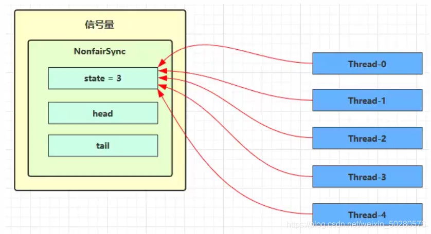
假设其中 Thread-1，Thread-2，Thread-4 cas 竞争成功，而 Thread-0 和 Thread-3 竞争失败，进入 AQS 队列park 阻塞
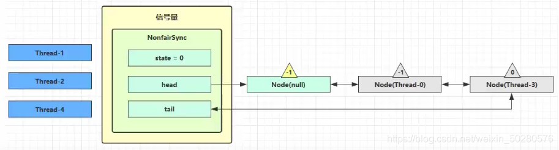
这时 Thread-4 释放了 permits，状态如下
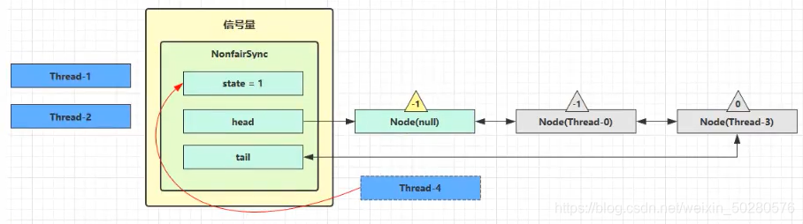
接下来 Thread-0 竞争成功，permits 再次设置为 0，设置自己为 head 节点，断开原来的 head 节点，unpark 接下来的 Thread-3 节点，但由于 permits 是 0，因此 Thread-3 在尝试不成功后再次进入 park 状态
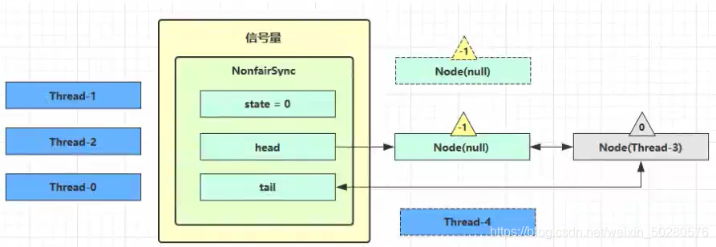

#### 3、源码分析

```java
static final class NonfairSync extends Sync {
    private static final long serialVersionUID = -2694183684443567898L;
    NonfairSync(int permits) {
        // permits 即 state
        super(permits);
    }

    // Semaphore 方法, 方便阅读, 放在此处
    public void acquire() throws InterruptedException {
        sync.acquireSharedInterruptibly(1);
    }
    // AQS 继承过来的方法, 方便阅读, 放在此处
    public final void acquireSharedInterruptibly(int arg)
            throws InterruptedException {
        if (Thread.interrupted())
            throw new InterruptedException();
        if (tryAcquireShared(arg) < 0)
            doAcquireSharedInterruptibly(arg);
    }

    // 尝试获得共享锁
    protected int tryAcquireShared(int acquires) {
        return nonfairTryAcquireShared(acquires);
    }

    // Sync 继承过来的方法, 方便阅读, 放在此处
    final int nonfairTryAcquireShared(int acquires) {
        for (;;) {
            int available = getState();
            int remaining = available - acquires;
            if (
                // 如果许可已经用完, 返回负数, 表示获取失败, 进入 doAcquireSharedInterruptibly
                    remaining < 0 ||
                            // 如果 cas 重试成功, 返回正数, 表示获取成功
                            compareAndSetState(available, remaining)
            ) {
                return remaining;
            }
        }
    }

    // AQS 继承过来的方法, 方便阅读, 放在此处
    private void doAcquireSharedInterruptibly(int arg) throws InterruptedException {
        final Node node = addWaiter(Node.SHARED);
        boolean failed = true;
        try {
            for (;;) {
                final Node p = node.predecessor();
                if (p == head) {
                    // 再次尝试获取许可
                    int r = tryAcquireShared(arg);
                    if (r >= 0) {
                        // 成功后本线程出队（AQS）, 所在 Node设置为 head
                        // 如果 head.waitStatus == Node.SIGNAL ==> 0 成功, 下一个节点 unpark
                        // 如果 head.waitStatus == 0 ==> Node.PROPAGATE
					  // r 表示可用资源数, 为 0 则不会继续传播
                        setHeadAndPropagate(node, r);
                        p.next = null; // help GC
                        failed = false;
                        return;
                    }
                }
                // 不成功, 设置上一个节点 waitStatus = Node.SIGNAL, 下轮进入 park 阻塞
                if (shouldParkAfterFailedAcquire(p, node) &&
                        parkAndCheckInterrupt())
                    throw new InterruptedException();
            }
        } finally {
            if (failed)
                cancelAcquire(node);
        }
    }

    // Semaphore 方法, 方便阅读, 放在此处
    public void release() {
        sync.releaseShared(1);
    }

    // AQS 继承过来的方法, 方便阅读, 放在此处
    public final boolean releaseShared(int arg) {
        if (tryReleaseShared(arg)) {
            doReleaseShared();
            return true;
        }
        return false;
    }

    // Sync 继承过来的方法, 方便阅读, 放在此处
    protected final boolean tryReleaseShared(int releases) {
        for (;;) {
            int current = getState();
            int next = current + releases;
            if (next < current) // overflow
                throw new Error("Maximum permit count exceeded");
            if (compareAndSetState(current, next))
                return true;
        }
    }
}
123456789101112131415161718192021222324252627282930313233343536373839404142434445464748495051525354555657585960616263646566676869707172737475767778798081828384858687888990919293949596979899
```

### CountdownLatch

CountDownLatch 允许多线程阻塞在一个地方，直至所有线程的任务都执行完毕。在 Java 并发中，countdownlatch 的概念是一个常见的面试题，所以一定要确保你很好的理解了它。

CountDownLatch 是共享锁的一种实现,它默认构造 AQS 的 state 值为 count。当线程使用 countDown方法时,其实使用了 tryReleaseShared 方法以CAS 的操作来减少 state ,直至 state 为 0 就代表所有的线程都调用了countDown方法。当调用 await 方法的时候，如果 state 不为0，就代表仍然有线程没有调用 countDown 方法，那么就把已经调用过 countDown 的线程都放入阻塞队列 Park ,并自旋 CAS 判断 state == 0，直至最后一个线程调用了 countDown ，使得 state == 0，于是阻塞的线程便判断成功，全部往下执行。

用来进行线程同步协作，等待所有线程完成倒计时。 其中构造参数用来初始化等待计数值，await() 用来等待计数归零，countDown() 用来让计数减一。

```java
@Slf4j(topic = "c.CountDownLatch")
public class Code_16_CountDownLatchTest {

    public static void main(String[] args) throws InterruptedException {
        method3();
    }

    public static void method1() throws InterruptedException {
        CountDownLatch countDownLatch = new CountDownLatch(3);

        new Thread(() -> {
            log.info("t1 start ...");

            try {
                Thread.sleep(1000);
            } catch (InterruptedException e) {
                e.printStackTrace();
            }
            log.info("t1 end ...");
            countDownLatch.countDown();
        }, "t1").start();


        new Thread(() -> {
            log.info("t2 start ...");

            try {
                Thread.sleep(2000);
            } catch (InterruptedException e) {
                e.printStackTrace();
            }
            log.info("t2 end ...");
            countDownLatch.countDown();
        }, "t2").start();

        new Thread(() -> {
            log.info("t3 start ...");

            try {
                Thread.sleep(1500);
            } catch (InterruptedException e) {
                e.printStackTrace();
            }
            log.info("t3 end ...");
            countDownLatch.countDown();
        }, "t3").start();


        log.info("main wait ...");
        countDownLatch.await();
        log.info("main wait end ...");
    }

    public static void method2() throws InterruptedException {
        CountDownLatch countDownLatch = new CountDownLatch(3);

        ExecutorService executorService = Executors.newFixedThreadPool(4);
        executorService.submit(() -> {
            log.info("t1 start ...");

            try {
                Thread.sleep(1000);
            } catch (InterruptedException e) {
                e.printStackTrace();
            }
            countDownLatch.countDown();
            log.info("t1 end ...{}", countDownLatch.getCount());
        });

        executorService.submit(() -> {
            log.info("t2 start ...");

            try {
                Thread.sleep(2000);
            } catch (InterruptedException e) {
                e.printStackTrace();
            }
            log.info("t2 end ...{}", countDownLatch.getCount());
            countDownLatch.countDown();
        });

        executorService.submit(() -> {
            log.info("t3 start ...");

            try {
                Thread.sleep(1500);
            } catch (InterruptedException e) {
                e.printStackTrace();
            }
            log.info("t3 end ...{}", countDownLatch.getCount());
            countDownLatch.countDown();
        });

        executorService.submit(() -> {
            log.info("main wait ...");
            try {
                countDownLatch.await();
            } catch (InterruptedException e) {
                e.printStackTrace();
            }
            log.info("main wait end ...");
            executorService.shutdown();
        });
    }

    public static void method3() throws InterruptedException {
        CountDownLatch countDownLatch = new CountDownLatch(10);
        ExecutorService executorService = Executors.newFixedThreadPool(10);
        String[] all = new String[10];
        Random random = new Random();
        for(int i = 0; i < 10; i++) {
            int id = i;
            executorService.submit(() -> {
                for (int j = 0; j <= 100; j++) {
                    try {
                        Thread.sleep(random.nextInt(100));
                    } catch (InterruptedException e) {
                        e.printStackTrace();
                    }
                    all[id] = j + "%";
                    System.out.print("\r" + Arrays.toString(all));
                }
                countDownLatch.countDown();
            });
        }
        countDownLatch.await();
        System.out.println();
        System.out.println("游戏开始");
        executorService.shutdown();
    }

}

123456789101112131415161718192021222324252627282930313233343536373839404142434445464748495051525354555657585960616263646566676869707172737475767778798081828384858687888990919293949596979899100101102103104105106107108109110111112113114115116117118119120121122123124125126127128129130131132133
```

### CyclicBarrier

CyclicBarri[ˈsaɪklɪk ˈbæriɚ]
循环栅栏，用来进行线程协作，等待线程满足某个计数。构造时设置『计数个数』，每个线程执行到某个需要“同步”的时刻调用 await() 方法进行等待，当等待的线程数满足『计数个数』时，继续执行。跟 CountdownLatch 一样，但这个可以重用。

```java
public static void main(String[] args) {

        ExecutorService executorService = Executors.newFixedThreadPool(2);
        CyclicBarrier cyclicBarrier = new CyclicBarrier(2, () -> {
            log.info("task2 finish ...");
        });

        for(int i = 0; i < 3; i++) {
            executorService.submit(() -> {
                log.info("task1 begin ...");
                try {
                    Thread.sleep(1000);
                    cyclicBarrier.await();
                } catch (InterruptedException | BrokenBarrierException e) {
                    e.printStackTrace();
                }
            });
            executorService.submit(() -> {
                log.info("task2 begin ...");
                try {
                    Thread.sleep(2000);
                    cyclicBarrier.await();
                } catch (InterruptedException | BrokenBarrierException e) {
                    e.printStackTrace();
                }
            });
        }

        executorService.shutdown();
    }
123456789101112131415161718192021222324252627282930
```

### LinkedBlockingQueue

#### 1）入队操作

```java
public class LinkedBlockingQueue<E> extends AbstractQueue<E>
        implements BlockingQueue<E>, java.io.Serializable {
    static class Node<E> {
        E item;

        /**
         * One of:
         * - the real successor Node(真正的后继节点)
         * - this Node, meaning the successor is head.next(自己, 发生在出队的时候)
         * - null, meaning there is no successor (this is the last node)(null, 表示没有后继节点, 是最后了)
         */
        Node<E> next;

        Node(E x) { item = x; }
    }
123456789101112131415
  private void enqueue(Node<E> node) {
        // assert putLock.isHeldByCurrentThread();
        // assert last.next == null;
        last = last.next = node;
    }

123456
```

初始化链表 last = head = new Node(null); Dummy 节点用来占位，item 为 null。
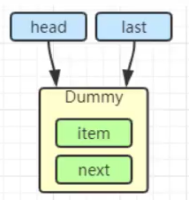
当一个节点入队 last = last.next = node;
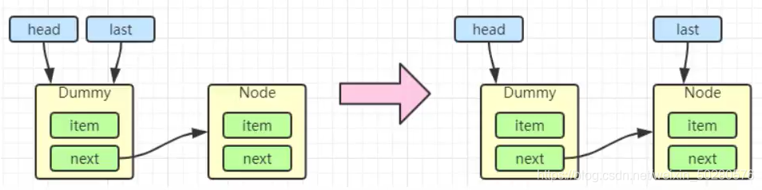
再来一个节点入队 last = last.next = node;
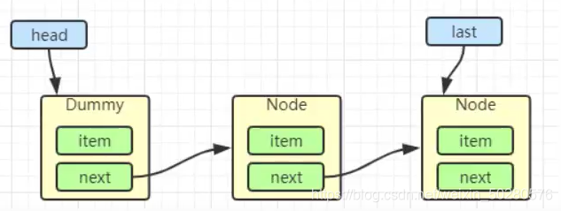

#### 2）出队操作

```java
	 private E dequeue() {
	       // assert takeLock.isHeldByCurrentThread();
	       // assert head.item == null;
	       Node<E> h = head;
	       Node<E> first = h.next;
	       h.next = h; // help GC
	       head = first;
	       E x = first.item;
	       first.item = null;
	       return x;
	   }
1234567891011
```

h = head;
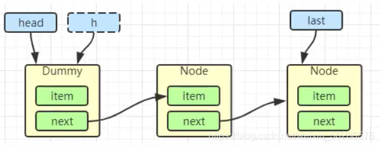
first = h.next;

h.next = h;
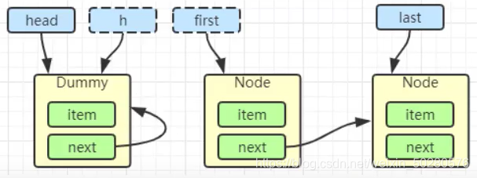
head = first;
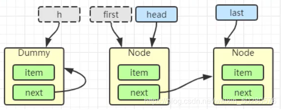

#### 3）加锁分析

高明之处在于用了两把锁和 dummy 节点

- 用一把锁，同一时刻，最多只允许有一个线程（生产者或消费者，二选一）执行
- 用两把锁，同一时刻，可以允许两个线程同时（一个生产者与一个消费者）执行
  - 消费者与消费者线程仍然串行
  - 生产者与生产者线程仍然串行

线程安全分析

- 当节点总数大于 2 时（包括 dummy 节点），putLock 保证的是 last 节点的线程安全，takeLock 保证的是 head 节点的线程安全。两把锁保证了入队和出队没有竞争
- 当节点总数等于 2 时（即一个 dummy 节点，一个正常节点）这时候，仍然是两把锁锁两个对象，不会竞争
- 当节点总数等于 1 时（就一个 dummy 节点）这时 take 线程会被 notEmpty 条件阻塞，有竞争，会阻塞

```java
// 用于 put(阻塞) offer(非阻塞)
private final ReentrantLock putLock = new ReentrantLock();
// 用户 take(阻塞) poll(非阻塞)
private final ReentrantLock takeLock = new ReentrantLock();
1234
```

#### 4）put 操作

```java
public void put(E e) throws InterruptedException {
	if (e == null) throw new NullPointerException();
	int c = -1;
	Node<E> node = new Node<E>(e);
	final ReentrantLock putLock = this.putLock;
	// count 用来维护元素计数
	final AtomicInteger count = this.count;
	putLock.lockInterruptibly();
	try {
		// 满了等待
		while (count.get() == capacity) {
		// 倒过来读就好: 等待 notFull
		notFull.await();
	}
	// 有空位, 入队且计数加一
	enqueue(node);
	c = count.getAndIncrement(); 
	// 除了自己 put 以外, 队列还有空位, 由自己叫醒其他 put 线程
	if (c + 1 < capacity)
		notFull.signal();
	} finally {
		putLock.unlock();
	}
	// 如果队列中有一个元素, 叫醒 take 线程
	if (c == 0)
	// 这里调用的是 notEmpty.signal() 而不是 notEmpty.signalAll() 是为了减少竞争
	signalNotEmpty();
}
12345678910111213141516171819202122232425262728
```

#### 5）take 操作

```java
public E take() throws InterruptedException {
	E x;
	int c = -1;
	final AtomicInteger count = this.count;
	final ReentrantLock takeLock = this.takeLock;
	takeLock.lockInterruptibly();
	try {
		while (count.get() == 0) {
		notEmpty.await();
	}
	x = dequeue();
	c = count.getAndDecrement();
	if (c > 1)
		notEmpty.signal();
	} finally {
		takeLock.unlock();
	}
	// 如果队列中只有一个空位时, 叫醒 put 线程
	// 如果有多个线程进行出队, 第一个线程满足 c == capacity, 但后续线程 c < capacity
	if (c == capacity)
	// 这里调用的是 notFull.signal() 而不是 notFull.signalAll() 是为了减少竞争
	signalNotFull()
	return x; 
 }
123456789101112131415161718192021222324
```

注意：由 put 唤醒 put 是为了避免信号不足

#### 6）性能比较

主要列举 LinkedBlockingQueue 与 ArrayBlockingQueue 的性能比较

- Linked 支持有界，Array 强制有界
- Linked 实现是链表，Array 实现是数组
- Linked 是懒惰的，而 Array 需要提前初始化 Node 数组
- Linked 每次入队会生成新 Node，而 Array 的 Node 是提前创建好的
- Linked 两把锁，Array 一把锁