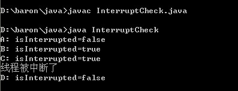

# Java 线程中断机制

Java中断机制是一种协作机制，也就是说通过中断并不能直接终止另一个线程，而需要被中断的线程自己处理中断。这好比是家里的父母叮嘱在外的子女要注意身体，但子女是否注意身体，怎么注意身体则完全取决于自己。

Java线程也有一个不让run方法走完的方式，那就是stop方法，可是这个方法已经被jdk弃用了，为什么呢？如果你的线程正在修改某处数据，可以是数据库，可以是写文件，stop方法不由分说就把线程杀死了，那数据是不是就出现混乱，不一致的状况？所以Java的线程采用的是中断机制，并且你可以捕获这个中断，并作出中断后需要做出的操作。


------


## 以下转自百度知道

```java
public class InterruptCheck {
    public static void main(String[] args) {
        Thread t = Thread.currentThread();
        System.out.println("A: isInterrupted="+t.isInterrupted());
        t.interrupt();
        System.out.println("B: isInterrupted="+t.isInterrupted());
        System.out.println("C: isInterrupted="+t.isInterrupted());
        try {
            t.sleep(2000);
            System.out.println("线程没有被中断");
        }
        catch(InterruptedException x) {
            System.out.println("线程被中断了");
        }
        System.out.println("D: isInterrupted="+t.isInterrupted());
    }
}
```

下图就是结果。
我想问的就是：既然主线程在第5行就被中断了，为什么后面的 B，C，D还会运行呢？
还有就是，为什么到最后的D那段会显示线程又运行了？


我觉得这个例子主要涉及到以下几个问题：

1. 对interrupt（）、isInterrupted()的理解。为什么BCD要运行呢？

   因为CPU在转线程又没有阻塞也没有转到其他语句，他当然要往下执行。我的理解是interrupt（）是抛出一个消息，“要求”调用他的进程中断，他只是负责发出要求，具体执行由其他语句实现。所以这个语句出现进程不会中断。

   

2. t.sleep(2000)之前，没有语句实现中断，所以这个状态（或者说这个“中断要求”）一直存在， t.sleep(2000)中响应了这个要求（所以你看执行中间【没有】暂停2秒），所以这个状态（或者说这个“中断要求”）就没有了，在D里面就是false了。

   

3. 对异常的理解。那么是怎么实现中断的效果呢？

   我的理解是通过异常。比如这个例子，发出中断信号过后，你调用t.sleep(2000)，这个t.sleep(2000)里面封装了一个东西，他收到了这个信号就向外抛出了一个InterruptedException ，交给try.catch，通过try.catch对异常的转接，【System.out.println("线程被中断了");】就被执行了。其实我觉得你这里不应该输出，而应该写sleep的，因为人家异常是要求你中断。

   

4. 为什么到最后的D那段会显示线程又运行了？

   这个是对对语句执行的理解问题。方法执行的返回（或者你理解方法里执行的终止）仅限于以下情况：A.执行return语句；B.所有语句执行完毕；C.抛到方法外的异常（run()除外，因为异常不能抛到run()外面去），这里是有异常，但是他没有抛到外面去，所以要继续执行后面的。

   

总结一下吧，就是语句都是会被执行的，除非你把他的执行顺序改到其他方向去了，或者按照顺序语句执行终了。改顺序的措施包括return（方法里面的语句执行完毕）和通过异常处理选择。多看看API吧。我的建议是遇到问题就去看API。 


## 1. 引言

当我们点击某个杀毒软件的取消按钮来停止查杀病毒时，当我们在控制台敲入 quit 命令以结束某个后台服务时……都需要通过一个线程去取消另一个线程正在执行的任务。Java 没有提供一种安全直接的方法来停止某个线程，但是 Java 提供了中断机制。

如果对 Java 中断没有一个全面的了解，可能会误以为被中断的线程将立马退出运行，但事实并非如此。中断机制是如何工作的？捕获或检测到中断后，是抛出 InterruptedException 还是重设中断状态以及在方法中吞掉中断状态会有什么后果？Thread.stop 与中断相比又有哪些异同？什么情况下需要使用中断？本文将从以上几个方面进行描述。


## 2. 中断的原理

Java 中断模型也是这么简单，每个线程对象里都有一个 boolean 类型的标识（不一定就要是 Thread 类的字段，实际上也的确不是，这几个方法最终都是通过 native 方法来完成的），代表着是否有中断请求（该请求可以来自所有线程，包括被中断的线程本身）。例如，当线程 t1 想中断线程 t2，只需要在线程 t1 中将线程 t2 对象的中断标识置为 true，然后线程 2 可以选择在合适的时候处理该中断请求，甚至可以不理会该请求，就像这个线程没有被中断一样。

java.lang.Thread 类提供了几个方法来操作这个中断状态，这些方法包括：

```java
public static boolean interrupted()
//	测试当前线程是否已经中断。线程的中断状态由该方法清除。换句话说，如果连续两次调用该方法，则第二次调用将返回 false（在第一次调用已清除了其中断状态之后，且第二次调用检验完中断状态前，当前线程再次中断的情况除外）。

public boolean isInterrupted()
//	测试线程是否已经中断。线程的中断状态不受该方法的影响。

public void interrupt()
//	中断线程。
```

其中，interrupt 方法是唯一能将中断状态设置为 true 的方法。静态方法 interrupted 会将当前线程的中断状态清除，但这个方法的命名极不直观，很容易造成误解，需要特别注意。

上面的例子中，线程 t1 通过调用 interrupt 方法将线程 t2 的中断状态置为 true，t2 可以在合适的时候调用 interrupted 或 isInterrupted 来检测状态并做相应的处理。

此外，类库中的有些类的方法也可能会调用中断，如 FutureTask 中的 cancel 方法，如果传入的参数为 true，它将会在正在运行异步任务的线程上调用 interrupt 方法，如果正在执行的异步任务中的代码没有对中断做出响应，那么 cancel 方法中的参数将不会起到什么效果；又如 ThreadPoolExecutor 中的 shutdownNow 方法会遍历线程池中的工作线程并调用线程的 interrupt 方法来中断线程，所以如果工作线程中正在执行的任务没有对中断做出响应，任务将一直执行直到正常结束。


## 3. 如何中断线程

如果一个线程处于了阻塞状态（如线程调用了thread.sleep、thread.join、thread.wait以及可中断的通道上的IO操作方法后可进入阻塞状态），则线程在检查中断标示时如果发现中断标示为true,则会在这些阻塞方法调用处抛出InterruptedException异常，并且在抛出异常后立即将线程的中断标示位清除，即重新设置为false。抛出异常是为了线程从阻塞状态醒过来，并在结束线程前让程序员有足够的时间来处理中断请求。
 ​


## 4. 中断的处理

既然 Java 中断机制只是设置被中断线程的中断状态，那么被中断线程该做些什么？

**处理时机**

显然，作为一种协作机制，不会强求被中断线程一定要在某个点进行处理。实际上，被中断线程只需在合适的时候处理即可，如果没有合适的时间点，甚至可以不处理，这时候在任务处理层面，就跟没有调用中断方法一样。“合适的时候”与线程正在处理的业务逻辑紧密相关，例如，每次迭代的时候，进入一个可能阻塞且无法中断的方法之前等，但多半不会出现在某个临界区更新另一个对象状态的时候，因为这可能会导致对象处于不一致状态。

处理时机决定着程序的效率与中断响应的灵敏性。频繁的检查中断状态可能会使程序执行效率下降，相反，检查的较少可能使中断请求得不到及时响应。如果发出中断请求之后，被中断的线程继续执行一段时间不会给系统带来灾难，那么就可以将中断处理放到方便检查中断，同时又能从一定程度上保证响应灵敏度的地方。当程序的性能指标比较关键时，可能需要建立一个测试模型来分析最佳的中断检测点，以平衡性能和响应灵敏性。

**处理方式**

1、 中断状态的管理

一般说来，当可能阻塞的方法声明中有抛出 InterruptedException 则暗示该方法是可中断的，如 BlockingQueue#put、BlockingQueue#take、Object#wait、Thread#sleep 等，如果程序捕获到这些可中断的阻塞方法抛出的 InterruptedException 或检测到中断后，这些中断信息该如何处理？一般有以下两个通用原则：

- 如果遇到的是可中断的阻塞方法抛出 InterruptedException，可以继续向方法调用栈的上层抛出该异常，如果是检测到中断，则可清除中断状态并抛出 InterruptedException，使当前方法也成为一个可中断的方法。
- 若有时候不太方便在方法上抛出 InterruptedException，比如要实现的某个接口中的方法签名上没有 throws InterruptedException，这时就可以捕获可中断方法的 InterruptedException 并通过 Thread.currentThread.interrupt() 来重新设置中断状态。如果是检测并清除了中断状态，亦是如此。

一般的代码中，尤其是作为一个基础类库时，绝不应当吞掉中断，即捕获到 InterruptedException 后在 catch 里什么也不做，清除中断状态后又不重设中断状态也不抛出 InterruptedException 等。因为吞掉中断状态会导致方法调用栈的上层得不到这些信息。

当然，凡事总有例外的时候，当你完全清楚自己的方法会被谁调用，而调用者也不会因为中断被吞掉了而遇到麻烦，就可以这么做。

总得来说，就是要让方法调用栈的上层获知中断的发生。假设你写了一个类库，类库里有个方法 amethod，在 amethod 中检测并清除了中断状态，而没有抛出 InterruptedException，作为 amethod 的用户来说，他并不知道里面的细节，如果用户在调用 amethod 后也要使用中断来做些事情，那么在调用 amethod 之后他将永远也检测不到中断了，因为中断信息已经被 amethod 清除掉了。如果作为用户，遇到这样有问题的类库，又不能修改代码，那该怎么处理？只好在自己的类里设置一个自己的中断状态，在调用 interrupt 方法的时候，同时设置该状态，这实在是无路可走时才使用的方法。

2、 中断的响应

程序里发现中断后该怎么响应？这就得视实际情况而定了。某些线程非常重要，以至于它们应该不理会中断，而是在处理完抛出的异常之后继续执行，如做一些事务回滚操作，一些清理工作，一些补偿操作等。若不确定调用某个线程的 interrupt 后该线程会做出什么样的响应，那就不应当中断该线程。但是普遍的情况是，一个线程将把中断看作一个终止请求。


## 5. Thread.interrupt	VS	Thread.stop

Thread.stop 方法已经不推荐使用了。而在某些方面 Thread.stop 与中断机制有着相似之处。如当线程在等待内置锁或 IO 时，stop 跟 interrupt 一样，不会中止这些操作；当 catch 住 stop 导致的异常时，程序也可以继续执行，虽然 stop 本意是要停止线程，这么做会让程序行为变得更加混乱。

那么它们的区别在哪里？最重要的就是中断需要程序自己去检测然后做相应的处理，而 Thread.stop 会直接在代码执行过程中抛出 ThreadDeath 错误，这是一个 java.lang.Error 的子类。

在继续之前，先来看个小例子：

```java
import java.util.Arrays;
import java.util.Random;
import java.util.concurrent.TimeUnit;
public class TestStop {
   private static final int[] array = new int[80000];
   private static final Thread t = new Thread() {
   	public void run() {
   		try {
   			System.out.println(sort(array));
   		} catch (Error err) {
   			err.printStackTrace();
   		}
   		System.out.println("in thread t");
   	}
   };
   
   static {
   	Random random = new Random();
   	for(int i = 0; i < array.length; i++) {
   		array[i] = random.nextInt(i + 1);
   	}
   }
   
   private static int sort(int[] array) {
   	for (int i = 0; i < array.length-1; i++){
   		for(int j = 0 ;j < array.length - i - 1; j++){
   			if(array[j] < array[j + 1]){
   				int temp = array[j];
   				array[j] = array[j + 1];
   				array[j + 1] = temp;
   			}
   		}
   	}
   	return array[0];
   }
   
   public static void main(String[] args) throws Exception {
   	t.start();
   	TimeUnit.SECONDS.sleep(1);
   	System.out.println("go to stop thread t");
   	t.stop();
   	System.out.println("finish main");
   }
}
```

这个例子很简单，线程 t 里面做了一个非常耗时的排序操作，排序方法中，只有简单的加、减、赋值、比较等操作，一个可能的执行结果如下：

```bash
 go to stop thread t
java.lang.ThreadDeath
   at java.lang.Thread.stop(Thread.java:758)
   at com.ticmy.interrupt.TestStop.main(TestStop.java:44)
finish main
in thread t
```

这里 sort 方法是个非常耗时的操作，也就是说主线程休眠一秒钟后调用 stop 的时候，线程 t 还在执行 sort 方法。就是这样一个简单的方法，也会抛出错误！换一句话说，调用 stop 后，大部分 Java 字节码都有可能抛出错误，哪怕是简单的加法！如果线程当前正持有锁，stop 之后则会释放该锁。由于此错误可能出现在很多地方，那么这就让编程人员防不胜防，极易造成对象状态的不一致。

例如，对象 obj 中存放着一个范围值：最小值 low，最大值 high，且 low 不得大于 high，这种关系由锁 lock 保护，以避免并发时产生竞态条件而导致该关系失效。假设当前 low 值是 5，high 值是 10，当线程 t 获取 lock 后，将 low 值更新为了 15，此时被 stop 了，真是糟糕，如果没有捕获住 stop 导致的 Error，low 的值就为 15，high 还是 10，这导致它们之间的小于关系得不到保证，也就是对象状态被破坏了！如果在给 low 赋值的时候 catch 住 stop 导致的 Error 则可能使后面 high 变量的赋值继续，但是谁也不知道 Error 会在哪条语句抛出，如果对象状态之间的关系更复杂呢？这种方式几乎是无法维护的，太复杂了！如果是中断操作，它决计不会在执行 low 赋值的时候抛出错误，这样程序对于对象状态一致性就是可控的。

正是因为可能导致对象状态不一致，stop 才被禁用。


## 6. 中断的使用

通常，中断的使用场景有以下几个：

- 点击某个桌面应用中的取消按钮时；
- 某个操作超过了一定的执行时间限制需要中止时；
- 多个线程做相同的事情，只要一个线程成功其它线程都可以取消时；
- 一组线程中的一个或多个出现错误导致整组都无法继续时；
- 当一个应用或服务需要停止时。

下面来看一个具体的例子。这个例子里，本打算采用 GUI 形式，但考虑到 GUI 代码会使程序复杂化，就使用控制台来模拟下核心的逻辑。这里新建了一个磁盘文件扫描的任务，扫描某个目录下的所有文件并将文件路径打印到控制台，扫描的过程可能会很长。若需要中止该任务，只需在控制台键入 quit 并回车即可。

```java
 
package com.ticmy.interrupt;
import java.io.BufferedReader;
import java.io.File;
import java.io.InputStreamReader;
 
public class FileScanner {
   private static void listFile(File f) throws InterruptedException {
   	if(f == null) {
   		throw new IllegalArgumentException();
   	}
   	if(f.isFile()) {
   		System.out.println(f);
   		return;
   	}
   	File[] allFiles = f.listFiles();
   	if(Thread.interrupted()) {
   		throw new InterruptedException(" 文件扫描任务被中断 ");
   	}
   	for(File file : allFiles) {
   		// 还可以将中断检测放到这里
   		listFile(file);
   	}
   }
   
   public static String readFromConsole() {
   	BufferedReader reader = new BufferedReader(new InputStreamReader(System.in));
   	try {
   		return reader.readLine();
   	} catch (Exception e) {
   		e.printStackTrace();
   		return "";
   	}
   }
   
   public static void main(String[] args) throws Exception {
   	final Thread fileIteratorThread = new Thread() {
   		public void run() {
   			try {
   				listFile(new File("c:\\"));
   			} catch (InterruptedException e) {
   				e.printStackTrace();
   			}
   		}
   	};
   	new Thread() {
   		public void run() {
   			while(true) {
   				if("quit".equalsIgnoreCase(readFromConsole())) {
   					if(fileIteratorThread.isAlive()) {
   						fileIteratorThread.interrupt();
   						return;
   					}
   				} else {
   					System.out.println(" 输入 quit 退出文件扫描 ");
   				}
   			}
   		}
   	}.start();
   	fileIteratorThread.start();
   }
}
 
```

在扫描文件的过程中，对于中断的检测这里采用的策略是，如果碰到的是文件就不检测中断，是目录才检测中断，因为文件可能是非常多的，每次遇到文件都检测一次会降低程序执行效率。此外，在 fileIteratorThread 线程中，仅是捕获了 InterruptedException，没有重设中断状态也没有继续抛出异常，因为我非常清楚它的使用环境，run 方法的调用栈上层已经没有可能需要检测中断状态的方法了。

在这个程序中，输入 quit 完全可以执行 System.exit(0) 操作来退出程序，但正如前面提到的，这是个 GUI 程序核心逻辑的模拟，在 GUI 中，执行 System.exit(0) 会使得整个程序退出。


 ​中断应用

1）使用中断信号量中断非阻塞状态的线程
 使用共享变量（shared variable）发出信号，告诉线程必须停止正在运行的任务。线程必须周期性的核查这一变量，然后有秩序地中止任务。

```java
public class ThreadExample {

    public static void main(String[] args) throws  Exception{

        InterruptThreadBySemaphore interruptThreadBySemaphore = new InterruptThreadBySemaphore();
        interruptThreadBySemaphore.start();
        Thread.sleep(3000);
        System.out.println("asking thread to stop");
        //设置中断信号量
        interruptThreadBySemaphore.stop = true;
        Thread.sleep(3000);
        System.out.println("stopping application...");
    }
     static class InterruptThreadBySemaphore extends Thread {

         /**
          * 线程中断信号量
          */
         volatile boolean stop = false;

         @Override
         public void run() {
             super.run();
             //每隔一秒检测一下中断信号量
             while (!stop) {
                 System.out.println("thread is running....");
                 long time = System.currentTimeMillis();
                 /**
                  * 使用while循环模拟sleep方法，使用sleep，否则在阻塞时会抛
                  * InterruptedException异常而退出循环
                  */
                 while ((System.currentTimeMillis() - time) < 1000) {

                 }
             }
             System.out.println("thread exiting...");
         }
     }
}
```

2）使用thread.interrupt()中断非阻塞状态线程

```java
public class ThreadExample {

    public static void main(String[] args) throws  Exception{

        InterruptThreadByInterrupt interruptThreadByInterrupt = new InterruptThreadByInterrupt();
        interruptThreadByInterrupt.start();
        Thread.sleep(3000);
        System.out.println("asking thread to stop");
        //发起中断请求
        interruptThreadByInterrupt.interrupt();
        Thread.sleep(3000);
        System.out.println("stopping application...");
    }

    static class InterruptThreadByInterrupt extends Thread {

        @Override
        public void run() {
            super.run();
            //每隔一秒检测一下中断信号量
            while (!Thread.currentThread().isInterrupted()) {
                System.out.println("thread is running....");
                long time = System.currentTimeMillis();
                /**
                 * 使用while循环模拟sleep方法，使用sleep，否则在阻塞时会抛
                 * InterruptedException异常而退出循环
                 */
                while ((System.currentTimeMillis() - time) < 1000) {

                }
            }
            System.out.println("thread exiting...");
        }
    }
}
```

3）使用thread.interrup()中断阻塞状态线程
 Thread.interrupt()方法不会中断一个正在运行的线程。是设置线程的中断标示位，在线程受阻塞的地方（如sleep,wait,join等）抛出一个异常InterruptedException,并且中断状态也将被清除，这样线程就得以退出阻塞的状态。

```java
public class ThreadExample {

    public static void main(String[] args) throws  Exception{

        InterruptBlockingThread interruptBlockingThread = new InterruptBlockingThread();
        interruptBlockingThread.start();
        Thread.sleep(3000);
        System.out.println("asking thread to stop");
        interruptBlockingThread.interrupt();
        Thread.sleep(3000);
        System.out.println("stopping application...");
    }


    static class InterruptBlockingThread extends Thread {

        @Override
        public void run() {
            super.run();
            while (!Thread.currentThread().isInterrupted()) {
                System.out.println("thread is running....");
                try {
                    /**
                     * 如果线程阻塞，将不会去检查中断信号量stop,所以thread.interrupt()
                     * 会使用阻塞线程从阻塞的地方抛出异常，让阻塞线程从阻塞状态逃离出来，
                     * 并进行异常块进行，相应的处理
                     */
                    Thread.sleep(1000);//线程阻塞，如果线程收到中断操作信号将抛出异常
                }catch (InterruptedException e){
                    System.out.println("thread interrupted....");
                    /**
                     * 如果线程在调用Object.wait()方法，或者该类的join(),sleep()方法
                     * 过程中受阻，则其中断状态将被清除
                     */
                    System.out.println(this.isInterrupted());//false
                    /**
                     * 中不中断由自己决定，如果需要中断线程，则重新设置中断位，
                     * 如果不需要，则不用调用
                     */
                    Thread.currentThread().interrupt();
                }

            }
            System.out.println("thread exiting...");
        }
    }
}
```

运行结果：\


## 7、总结

Java的中断是一种协作机制。也就是说调用线程对象的interrupt()方法并不一定就中断了正在运行的线程，它只是要求线程在合适的时机中断自己。每个线程都有一个boolean的中断状态，interrupt()方法仅仅只是将该状态置为true，比如对正常运行的线程调用interrupt()并不能终止它，只是改变了interrupt标示符。

 一般来说，如果一个方法声明抛出InterruptedException，表示该方法是可中断的，比如wait,sleep,join,也就是说可中断方法会对interrupt调用做出响应（例如sleep响应interrupt的操作包括清除中断状态，抛出InterruptedException），异常都是由可中断方法自己抛出来的，并不是直接由interrupt()方法直接引起的。

 Object.wait()、Thread.sleep()方法会不断的轮询监听interrupted标志位，发现其设置为true后，会停止阻塞并抛出InterruptedException异常。

