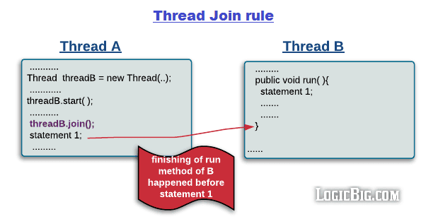
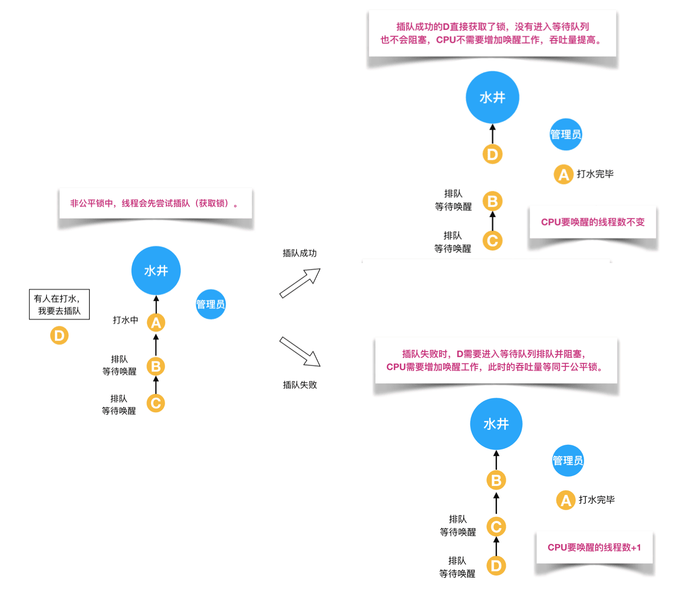
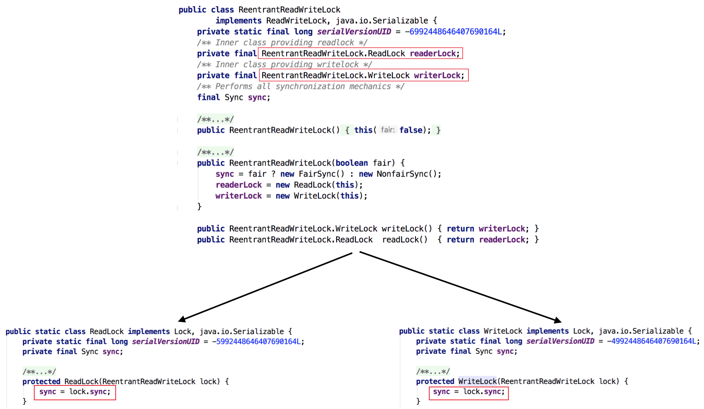

# Java并发学习笔记

------


# 理论基础

------

## 1、并发出现线程不安全的本质什么? 

上述代码输出为什么不是1000? 并发出现问题的根源是什么?

并发出现问题的根源：并发三要素（可见性，原子性和有序性）

### 可见性: CPU缓存引起

可见性：一个线程对共享变量的修改，另外一个线程能够立刻看到。

举个简单的例子，看下面这段代码：

```java
//线程1执行的代码
int i = 0;
i = 10;
 
//线程2执行的代码
j = i;
```

假若执行线程1的是CPU1，执行线程2的是CPU2。由上面的分析可知，当线程1执行 i =10这句时，会先把i的初始值加载到CPU1的高速缓存中，然后赋值为10，那么在CPU1的高速缓存当中i的值变为10了，却没有立即写入到主存当中。

此时线程2执行 j = i，它会先去主存读取i的值并加载到CPU2的缓存当中，注意此时内存当中i的值还是0，那么就会使得j的值为0，而不是10.

这就是可见性问题，线程1对变量i修改了之后，线程2没有立即看到线程1修改的值。

### 原子性: 分时复用引起

原子性：即一个操作或者多个操作 要么全部执行并且执行的过程不会被任何因素打断，要么就都不执行。

举个简单的例子，看下面这段代码：

```java
int i = 1;

// 线程1执行
i += 1;

// 线程2执行
i += 1;
```

这里需要注意的是：`i += 1`需要三条 CPU 指令

1. 将变量 i 从内存读取到 CPU寄存器；
2. 在CPU寄存器中执行 i + 1 操作；
3. 将最后的结果i写入内存（缓存机制导致可能写入的是 CPU 缓存而不是内存）。

由于CPU分时复用（线程切换）的存在，线程1执行了第一条指令后，就切换到线程2执行，假如线程2执行了这三条指令后，再切换会线程1执行后续两条指令，将造成最后写到内存中的i值是2而不是3。

### 有序性: 重排序引起

有序性：即程序执行的顺序按照代码的先后顺序执行。举个简单的例子，看下面这段代码：

```java
int i = 0;              
boolean flag = false;
i = 1;                //语句1  
flag = true;          //语句2
```

上面代码定义了一个int型变量，定义了一个boolean类型变量，然后分别对两个变量进行赋值操作。从代码顺序上看，语句1是在语句2前面的，那么JVM在真正执行这段代码的时候会保证语句1一定会在语句2前面执行吗? 不一定，为什么呢? 这里可能会发生指令重排序（Instruction Reorder）。

在执行程序时为了提高性能，编译器和处理器常常会对指令做重排序。重排序分三种类型：

- 编译器优化的重排序。编译器在不改变单线程程序语义的前提下，可以重新安排语句的执行顺序。
- 指令级并行的重排序。现代处理器采用了指令级并行技术（Instruction-Level Parallelism， ILP）来将多条指令重叠执行。如果不存在数据依赖性，处理器可以改变语句对应机器指令的执行顺序。
- 内存系统的重排序。由于处理器使用缓存和读 / 写缓冲区，这使得加载和存储操作看上去可能是在乱序执行。

从 java 源代码到最终实际执行的指令序列，会分别经历下面三种重排序：


上述的 1 属于编译器重排序，2 和 3 属于处理器重排序。这些重排序都可能会导致多线程程序出现内存可见性问题。对于编译器，JMM 的编译器重排序规则会禁止特定类型的编译器重排序（不是所有的编译器重排序都要禁止）。对于处理器重排序，JMM 的处理器重排序规则会要求 java 编译器在生成指令序列时，插入特定类型的内存屏障（memory barriers，intel 称之为 memory fence）指令，通过内存屏障指令来禁止特定类型的处理器重排序（不是所有的处理器重排序都要禁止）。


## 2、Java是怎么解决并发问题的?

Java通过JMM(Java内存模型)解决并发问题 

**理解的第一个维度：核心知识点**

JMM本质上可以理解为，Java 内存模型规范了 JVM 如何提供按需禁用缓存和编译优化的方法。具体来说，这些方法包括：

- volatile、synchronized 和 final 三个关键字
- Happens-Before 规则

**理解的第二个维度：可见性，有序性，原子性**

- 原子性

在Java中，对基本数据类型的变量的读取和赋值操作是原子性操作，即这些操作是不可被中断的，要么执行，要么不执行。 请分析以下哪些操作是原子性操作：

```java
x = 10;        //语句1: 直接将数值10赋值给x，也就是说线程执行这个语句的会直接将数值10写入到工作内存中
y = x;         //语句2: 包含2个操作，它先要去读取x的值，再将x的值写入工作内存，虽然读取x的值以及 将x的值写入工作内存 这2个操作都是原子性操作，但是合起来						就不是原子性操作了。
x++;           //语句3： x++包括3个操作：读取x的值，进行加1操作，写入新的值。
x = x + 1;     //语句4： 同语句3
```

上面4个语句只有语句1的操作具备原子性。

也就是说，只有简单的读取、赋值（而且必须是将数字赋值给某个变量，变量之间的相互赋值不是原子操作）才是原子操作。

> 从上面可以看出，Java内存模型只保证了基本读取和赋值是原子性操作，如果要实现更大范围操作的原子性，可以通过synchronized和Lock来实现。由于synchronized和Lock能够保证任一时刻只有一个线程执行该代码块，那么自然就不存在原子性问题了，从而保证了原子性。

- 可见性

Java提供了volatile关键字来保证可见性。

当一个共享变量被volatile修饰时，它会保证修改的值会立即被更新到主存，当有其他线程需要读取时，它会去内存中读取新值。

而普通的共享变量不能保证可见性，因为普通共享变量被修改之后，什么时候被写入主存是不确定的，当其他线程去读取时，此时内存中可能还是原来的旧值，因此无法保证可见性。

> 另外，通过synchronized和Lock也能够保证可见性，synchronized和Lock能保证同一时刻只有一个线程获取锁然后执行同步代码，并且在释放锁之前会将对变量的修改刷新到主存当中。因此可以保证可见性。

- 有序性

在Java里面，可以通过volatile关键字来保证一定的“有序性”（具体原理在下一节讲述）。另外可以通过synchronized和Lock来保证有序性，很显然，synchronized和Lock保证每个时刻是有一个线程执行同步代码，相当于是让线程顺序执行同步代码，自然就保证了有序性。当然JMM是通过Happens-Before 规则来保证有序性的。

### 关键字: volatile、synchronized 和 final

见这几个关键字的专题笔记

- [关键字: synchronized详解]()
- [关键字: volatile详解]()
- [关键字: final详解]()

### Happens-Before 规则

上面提到了可以用 volatile 和 synchronized 来保证有序性。除此之外，JVM 还规定了先行发生原则，让一个操作无需控制就能先于另一个操作完成。

#### 单一线程原则

> Single Thread rule

在一个线程内，在程序前面的操作先行发生于后面的操作。


####  管程锁定规则

> Monitor Lock Rule

或称监视器锁规则，一个 unlock 操作先行发生于后面对同一个锁的 lock 操作。


#### volatile 变量规则

> Volatile Variable Rule

对一个 volatile 变量的写操作先行发生于后面对这个变量的读操作。


#### 线程启动规则

> Thread Start Rule

Thread 对象的 start() 方法调用先行发生于此线程的每一个动作。


#### 线程加入规则

> Thread Join Rule

Thread 对象的结束先行发生于 join() 方法返回。



#### 线程中断规则

> Thread Interruption Rule

对线程 interrupt() 方法的调用先行发生于被中断线程的代码检测到中断事件的发生，可以通过 interrupted() 方法检测到是否有中断发生。

#### 对象终结规则

> Finalizer Rule

一个对象的初始化完成(构造函数执行结束)先行发生于它的 finalize() 方法的开始。

#### 传递性

> Transitivity

如果操作 A 先行发生于操作 B，操作 B 先行发生于操作 C，那么操作 A 先行发生于操作 C。


## 3、线程安全有哪些实现思路?

### 互斥同步

synchronized 和 ReentrantLock。

初步了解你可以看：

- [Java 并发 - 线程基础：线程互斥同步]()

详细分析请看：

- [关键字: Synchronized详解]()
- [JUC锁: ReentrantLock详解]()

### 非阻塞同步

互斥同步最主要的问题就是线程阻塞和唤醒所带来的性能问题，因此这种同步也称为阻塞同步。

互斥同步属于一种悲观的并发策略，总是认为只要不去做正确的同步措施，那就肯定会出现问题。无论共享数据是否真的会出现竞争，它都要进行加锁(这里讨论的是概念模型，实际上虚拟机会优化掉很大一部分不必要的加锁)、用户态核心态转换、维护锁计数器和检查是否有被阻塞的线程需要唤醒等操作。

**CAS**

随着硬件指令集的发展，我们可以使用基于冲突检测的乐观并发策略: 先进行操作，如果没有其它线程争用共享数据，那操作就成功了，否则采取补偿措施(不断地重试，直到成功为止)。这种乐观的并发策略的许多实现都不需要将线程阻塞，因此这种同步操作称为非阻塞同步。

乐观锁需要操作和冲突检测这两个步骤具备原子性，这里就不能再使用互斥同步来保证了，只能靠硬件来完成。硬件支持的原子性操作最典型的是: **比较并交换(Compare-and-Swap，CAS)**。CAS 指令需要有 3 个操作数，分别是内存地址 V、旧的预期值 A 和新值 B。当执行操作时，只有当 V 的值等于 A，才将 V 的值更新为 B。

**AtomicInteger**

J.U.C 包里面的整数原子类 AtomicInteger，其中的 compareAndSet() 和 getAndIncrement() 等方法都使用了 Unsafe 类的 CAS 操作。

以下代码使用了 AtomicInteger 执行了自增的操作。

```java
private AtomicInteger cnt = new AtomicInteger();

public void add() {
    cnt.incrementAndGet();
}
```

以下代码是 incrementAndGet() 的源码，它调用了 unsafe 的 getAndAddInt() 。

```java
public final int incrementAndGet() {
    return unsafe.getAndAddInt(this, valueOffset, 1) + 1;
}
```

以下代码是 getAndAddInt() 源码，var1 指示对象内存地址，var2 指示该字段相对对象内存地址的偏移，var4 指示操作需要加的数值，这里为 1。通过 getIntVolatile(var1, var2) 得到旧的预期值，通过调用 compareAndSwapInt() 来进行 CAS 比较，如果该字段内存地址中的值等于 var5，那么就更新内存地址为 var1+var2 的变量为 var5+var4。

可以看到 getAndAddInt() 在一个循环中进行，发生冲突的做法是不断的进行重试。

```java
public final int getAndAddInt(Object var1, long var2, int var4) {
    int var5;
    do {
        var5 = this.getIntVolatile(var1, var2);
    } while(!this.compareAndSwapInt(var1, var2, var5, var5 + var4));

    return var5;
}
```

**ABA**

如果一个变量初次读取的时候是 A 值，它的值被改成了 B，后来又被改回为 A，那 CAS 操作就会误认为它从来没有被改变过。

J.U.C 包提供了一个带有标记的原子引用类 AtomicStampedReference 来解决这个问题，它可以通过控制变量值的版本来保证 CAS 的正确性。大部分情况下 ABA 问题不会影响程序并发的正确性，如果需要解决 ABA 问题，改用传统的互斥同步可能会比原子类更高效。

CAS, Unsafe和原子类详细分析请看：

- [JUC原子类: CAS, Unsafe和原子类详解]()

### 无同步方案

要保证线程安全，并不是一定就要进行同步。如果一个方法本来就不涉及共享数据，那它自然就无须任何同步措施去保证正确性。

**栈封闭**

多个线程访问同一个方法的局部变量时，不会出现线程安全问题，因为局部变量存储在虚拟机栈中，属于线程私有的。

```java
import java.util.concurrent.ExecutorService;
import java.util.concurrent.Executors;

public class StackClosedExample {
    public void add100() {
        int cnt = 0;
        for (int i = 0; i < 100; i++) {
            cnt++;
        }
        System.out.println(cnt);
    }
}
public static void main(String[] args) {
    StackClosedExample example = new StackClosedExample();
    ExecutorService executorService = Executors.newCachedThreadPool();
    executorService.execute(() -> example.add100());
    executorService.execute(() -> example.add100());
    executorService.shutdown();
}
100
100
```

更详细的分析请看J.U.C中线程池相关内容详解：

- [JUC线程池: FutureTask详解]()
- [JUC线程池: ThreadPoolExecutor详解]()
- [JUC线程池: ScheduledThreadPool详解]()
- [JUC线程池: Fork/Join框架详解]()

**线程本地存储(Thread Local Storage)**

如果一段代码中所需要的数据必须与其他代码共享，那就看看这些共享数据的代码是否能保证在同一个线程中执行。如果能保证，我们就可以把共享数据的可见范围限制在同一个线程之内，这样，无须同步也能保证线程之间不出现数据争用的问题。

符合这种特点的应用并不少见，大部分使用消费队列的架构模式(如“生产者-消费者”模式)都会将产品的消费过程尽量在一个线程中消费完。其中最重要的一个应用实例就是经典 Web 交互模型中的“一个请求对应一个服务器线程”(Thread-per-Request)的处理方式，这种处理方式的广泛应用使得很多 Web 服务端应用都可以使用线程本地存储来解决线程安全问题。

可以使用 java.lang.ThreadLocal 类来实现线程本地存储功能。

对于以下代码，thread1 中设置 threadLocal 为 1，而 thread2 设置 threadLocal 为 2。过了一段时间之后，thread1 读取 threadLocal 依然是 1，不受 thread2 的影响。

```java
public class ThreadLocalExample {
    public static void main(String[] args) {
        ThreadLocal threadLocal = new ThreadLocal();
        Thread thread1 = new Thread(() -> {
            threadLocal.set(1);
            try {
                Thread.sleep(1000);
            } catch (InterruptedException e) {
                e.printStackTrace();
            }
            System.out.println(threadLocal.get());
            threadLocal.remove();
        });
        Thread thread2 = new Thread(() -> {
            threadLocal.set(2);
            threadLocal.remove();
        });
        thread1.start();
        thread2.start();
    }
}
```

输出结果

```java
1
```

为了理解 ThreadLocal，先看以下代码:

```java
public class ThreadLocalExample1 {
    public static void main(String[] args) {
        ThreadLocal threadLocal1 = new ThreadLocal();
        ThreadLocal threadLocal2 = new ThreadLocal();
        Thread thread1 = new Thread(() -> {
            threadLocal1.set(1);
            threadLocal2.set(1);
        });
        Thread thread2 = new Thread(() -> {
            threadLocal1.set(2);
            threadLocal2.set(2);
        });
        thread1.start();
        thread2.start();
    }
}
```

它所对应的底层结构图为:


每个 Thread 都有一个 ThreadLocal.ThreadLocalMap 对象，Thread 类中就定义了 ThreadLocal.ThreadLocalMap 成员。

```java
/* ThreadLocal values pertaining to this thread. This map is maintained
 * by the ThreadLocal class. */
ThreadLocal.ThreadLocalMap threadLocals = null;
```

当调用一个 ThreadLocal 的 set(T value) 方法时，先得到当前线程的 ThreadLocalMap 对象，然后将 ThreadLocal->value 键值对插入到该 Map 中。

```java
public void set(T value) {
    Thread t = Thread.currentThread();
    ThreadLocalMap map = getMap(t);
    if (map != null)
        map.set(this, value);
    else
        createMap(t, value);
}
```

get() 方法类似。

```java
public T get() {
    Thread t = Thread.currentThread();
    ThreadLocalMap map = getMap(t);
    if (map != null) {
        ThreadLocalMap.Entry e = map.getEntry(this);
        if (e != null) {
            @SuppressWarnings("unchecked")
            T result = (T)e.value;
            return result;
        }
    }
    return setInitialValue();
}
```

ThreadLocal 从理论上讲并不是用来解决多线程并发问题的，因为根本不存在多线程竞争。

在一些场景 (尤其是使用线程池) 下，由于 ThreadLocal.ThreadLocalMap 的底层数据结构导致 ThreadLocal 有内存泄漏的情况，应该尽可能在每次使用 ThreadLocal 后手动调用 remove()，以避免出现 ThreadLocal 经典的内存泄漏甚至是造成自身业务混乱的风险。

更详细的分析看：[Java 并发 - ThreadLocal详解]()

**(三)可重入代码(Reentrant Code)**

这种代码也叫做纯代码(Pure Code)，可以在代码执行的任何时刻中断它，转而去执行另外一段代码(包括递归调用它本身)，而在控制权返回后，原来的程序不会出现任何错误。

可重入代码有一些共同的特征，例如不依赖存储在堆上的数据和公用的系统资源、用到的状态量都由参数中传入、不调用非可重入的方法等。


## 4、线程有哪几种状态? 分别说明状态间转变有哪些方式?

线程状态及其转换关系如下图


### 新建(New)

创建后尚未启动。

### 可运行(Runnable)

可能正在运行，也可能正在等待 CPU 时间片。

包含了操作系统线程状态中的 Running 和 Ready。

### 阻塞(Blocking)

等待获取一个排它锁，如果其线程释放了锁就会结束此状态。

### 无限期等待(Waiting)

等待其它线程显式地唤醒，否则不会被分配 CPU 时间片。

| 进入方法                                   | 退出方法                             |
| ------------------------------------------ | ------------------------------------ |
| 没有设置 Timeout 参数的 Object.wait() 方法 | Object.notify() / Object.notifyAll() |
| 没有设置 Timeout 参数的 Thread.join() 方法 | 被调用的线程执行完毕                 |
| LockSupport.park() 方法                    | -                                    |

### 限期等待(Timed Waiting)

无需等待其它线程显式地唤醒，在一定时间之后会被系统自动唤醒。

调用 Thread.sleep() 方法使线程进入限期等待状态时，常常用“使一个线程睡眠”进行描述。

调用 Object.wait() 方法使线程进入限期等待或者无限期等待时，常常用“挂起一个线程”进行描述。

睡眠和挂起是用来描述行为，而阻塞和等待用来描述状态。

阻塞和等待的区别在于，阻塞是被动的，它是在等待获取一个排它锁。而等待是主动的，通过调用 Thread.sleep() 和 Object.wait() 等方法进入。

| 进入方法                                 | 退出方法                                        |
| ---------------------------------------- | ----------------------------------------------- |
| Thread.sleep() 方法                      | 时间结束                                        |
| 设置了 Timeout 参数的 Object.wait() 方法 | 时间结束 / Object.notify() / Object.notifyAll() |
| 设置了 Timeout 参数的 Thread.join() 方法 | 时间结束 / 被调用的线程执行完毕                 |
| LockSupport.parkNanos() 方法             | -                                               |
| LockSupport.parkUntil() 方法             | -                                               |

### 死亡(Terminated)

可以是线程结束任务之后自己结束，或者产生了异常而结束。


## 5、通常线程有哪几种使用方式?

有三种使用线程的方法:

- 实现 Runnable 接口；
- 实现 Callable 接口；
- 继承 Thread 类。

实现 Runnable 和 Callable 接口的类只能当做一个可以在线程中运行的任务，不是真正意义上的线程，因此最后还需要通过 Thread 来调用。可以说任务是通过线程驱动从而执行的。

### 实现 Runnable 接口

需要实现 run() 方法。

通过 Thread 调用 start() 方法来启动线程。

```java
public class MyRunnable implements Runnable {
    public void run() {
        // ...
    }
}
```

```java
public static void main(String[] args) {
    MyRunnable instance = new MyRunnable();
    Thread thread = new Thread(instance);
    thread.start();
}
```


### 实现 Callable 接口

与 Runnable 相比，Callable 可以有返回值，返回值通过 FutureTask 进行封装。

```java
public class MyCallable implements Callable<Integer> {
    public Integer call() {
        return 123;
    }
}
```

```java
public static void main(String[] args) throws ExecutionException, InterruptedException {
    MyCallable mc = new MyCallable();
    FutureTask<Integer> ft = new FutureTask<>(mc);
    Thread thread = new Thread(ft);
    thread.start();
    System.out.println(ft.get());
}
```


### 继承 Thread 类

同样也是需要实现 run() 方法，因为 Thread 类也实现了 Runable 接口。

当调用 start() 方法启动一个线程时，虚拟机会将该线程放入就绪队列中等待被调度，当一个线程被调度时会执行该线程的 run() 方法。

```java
public class MyThread extends Thread {
    public void run() {
        // ...
    }
}
```

```java
public static void main(String[] args) {
    MyThread mt = new MyThread();
    mt.start();
}
```


**实现接口 VS 继承 Thread**

实现接口会更好一些，因为:

- Java 不支持多重继承，因此继承了 Thread 类就无法继承其它类，但是可以实现多个接口；
- 类可能只要求可执行就行，继承整个 Thread 类开销过大。


## 6、基础线程机制有哪些?

### Executor

Executor 管理多个异步任务的执行，而无需程序员显式地管理线程的生命周期。这里的异步是指多个任务的执行互不干扰，不需要进行同步操作。

主要有三种 Executor:

- CachedThreadPool: 一个任务创建一个线程；
- FixedThreadPool: 所有任务只能使用固定大小的线程；
- SingleThreadExecutor: 相当于大小为 1 的 FixedThreadPool。

```java
public static void main(String[] args) {
    ExecutorService executorService = Executors.newCachedThreadPool();
    for (int i = 0; i < 5; i++) {
        executorService.execute(new MyRunnable());
    }
    executorService.shutdown();
}
```

### Daemon

守护线程是程序运行时在后台提供服务的线程，不属于程序中不可或缺的部分。

当所有非守护线程结束时，程序也就终止，同时会杀死所有守护线程。

main() 属于非守护线程。

使用 setDaemon() 方法将一个线程设置为守护线程。

```java
public static void main(String[] args) {
    Thread thread = new Thread(new MyRunnable());
    thread.setDaemon(true);
}
```

### sleep

Thread.sleep(millisec) 方法会休眠当前正在执行的线程，millisec 单位为毫秒。

sleep() 可能会抛出 InterruptedException，因为异常不能跨线程传播回 main() 中，因此必须在本地进行处理。线程中抛出的其它异常也同样需要在本地进行处理。

```java
public void run() {
    try {
        Thread.sleep(3000);
    } catch (InterruptedException e) {
        e.printStackTrace();
    }
}
```

### yield

对静态方法 Thread.yield() 的调用声明了当前线程已经完成了生命周期中最重要的部分，可以切换给其它线程来执行。该方法只是对线程调度器的一个建议，而且也只是建议具有相同优先级的其它线程可以运行。

```java
public void run() {
    Thread.yield();
}
```


------


## 7、线程的中断方式有哪些?

线程中断：一个线程执行完毕之后会自动结束，如果在运行过程中发生异常也会提前结束。


### InterruptedException

通过调用一个线程的 interrupt() 来中断该线程，如果该线程处于阻塞、限期等待或者无限期等待状态，那么就会抛出 InterruptedException，从而提前结束该线程。但是不能中断 I/O 阻塞和 synchronized 锁阻塞。

对于以下代码，在 main() 中启动一个线程之后再中断它，由于线程中调用了 Thread.sleep() 方法，因此会抛出一个 InterruptedException，从而提前结束线程，不执行之后的语句。

```java
public class InterruptExample {
    private static class MyThread1 extends Thread {
        @Override
        public void run() {
            try {
                Thread.sleep(2000);
                System.out.println("Thread run");
            } catch (InterruptedException e) {
                e.printStackTrace();
            }
        }
    }
}
```

```java
public static void main(String[] args) throws InterruptedException {
    Thread thread1 = new MyThread1();
    thread1.start();
    thread1.interrupt();
    System.out.println("Main run");
}
```

```java
Main run
java.lang.InterruptedException: sleep interrupted
    at java.lang.Thread.sleep(Native Method)
    at InterruptExample.lambda$main$0(InterruptExample.java:5)
    at InterruptExample$$Lambda$1/713338599.run(Unknown Source)
    at java.lang.Thread.run(Thread.java:745)
```


### interrupted()

如果一个线程的 run() 方法执行一个无限循环，并且没有执行 sleep() 等会抛出 InterruptedException 的操作，那么调用线程的 interrupt() 方法就无法使线程提前结束。

但是调用 interrupt() 方法会设置线程的中断标记，此时调用 interrupted() 方法会返回 true。因此可以在循环体中使用 interrupted() 方法来判断线程是否处于中断状态，从而提前结束线程。

```java
public class InterruptExample {
    private static class MyThread2 extends Thread {
        @Override
        public void run() {
            while (!interrupted()) {
                // ..
            }
            System.out.println("Thread end");
        }
    }
}
```

```java
public static void main(String[] args) throws InterruptedException {
    Thread thread2 = new MyThread2();
    thread2.start();
    thread2.interrupt();
}
```

```java
Thread end
```


### Executor 的中断操作

调用 Executor 的 shutdown() 方法会等待线程都执行完毕之后再关闭，但是如果调用的是 shutdownNow() 方法，则相当于调用每个线程的 interrupt() 方法。

以下使用 Lambda 创建线程，相当于创建了一个匿名内部线程。

```java
public static void main(String[] args) {
    ExecutorService executorService = Executors.newCachedThreadPool();
    executorService.execute(() -> {
        try {
            Thread.sleep(2000);
            System.out.println("Thread run");
        } catch (InterruptedException e) {
            e.printStackTrace();
        }
    });
    executorService.shutdownNow();
    System.out.println("Main run");
}
```

```java
Main run
java.lang.InterruptedException: sleep interrupted
    at java.lang.Thread.sleep(Native Method)
    at ExecutorInterruptExample.lambda$main$0(ExecutorInterruptExample.java:9)
    at ExecutorInterruptExample$$Lambda$1/1160460865.run(Unknown Source)
    at java.util.concurrent.ThreadPoolExecutor.runWorker(ThreadPoolExecutor.java:1142)
    at java.util.concurrent.ThreadPoolExecutor$Worker.run(ThreadPoolExecutor.java:617)
    at java.lang.Thread.run(Thread.java:745)
```

如果只想中断 Executor 中的一个线程，可以通过使用 submit() 方法来提交一个线程，它会返回一个 Future<?> 对象，通过调用该对象的 cancel(true) 方法就可以中断线程。

```java
Future<?> future = executorService.submit(() -> {
    // ..
});
future.cancel(true);
```


------


## 8、线程的互斥同步方式有哪些? 如何比较和选择?

Java 提供了两种锁机制来控制多个线程对共享资源的互斥访问，第一个是 JVM 实现的 synchronized，而另一个是 JDK 实现的 ReentrantLock。

### synchronized

**同步一个代码块**

```java
public void func() {
    synchronized (this) {
        // ...
    }
}
```

它只作用于同一个对象，如果调用两个对象上的同步代码块，就不会进行同步。

对于以下代码，使用 ExecutorService 执行了两个线程，由于调用的是同一个对象的同步代码块，因此这两个线程会进行同步，当一个线程进入同步语句块时，另一个线程就必须等待。

```java
public class SynchronizedExample {
    public void func1() {
        synchronized (this) {
            for (int i = 0; i < 10; i++) {
                System.out.print(i + " ");
            }
        }
    }
}
```

```java
public static void main(String[] args) {
    SynchronizedExample e1 = new SynchronizedExample();
    ExecutorService executorService = Executors.newCachedThreadPool();
    executorService.execute(() -> e1.func1());
    executorService.execute(() -> e1.func1());
}
```

```
0 1 2 3 4 5 6 7 8 9 0 1 2 3 4 5 6 7 8 9
```

对于以下代码，两个线程调用了不同对象的同步代码块，因此这两个线程就不需要同步。从输出结果可以看出，两个线程交叉执行。

```java
public static void main(String[] args) {
    SynchronizedExample e1 = new SynchronizedExample();
    SynchronizedExample e2 = new SynchronizedExample();
    ExecutorService executorService = Executors.newCachedThreadPool();
    executorService.execute(() -> e1.func1());
    executorService.execute(() -> e2.func1());
}
```

```java
0 0 1 1 2 2 3 3 4 4 5 5 6 6 7 7 8 8 9 9
```

**同步一个方法**

```java
public synchronized void func () {
    // ...
}
```

它和同步代码块一样，作用于同一个对象。

**同步一个类**

```java
public void func() {
    synchronized (SynchronizedExample.class) {
        // ...
    }
}
```

作用于整个类，也就是说两个线程调用同一个类的不同对象上的这种同步语句，也会进行同步。

```java
public class SynchronizedExample {
    public void func2() {
        synchronized (SynchronizedExample.class) {
            for (int i = 0; i < 10; i++) {
                System.out.print(i + " ");
            }
        }
    }
}
```

```java
public static void main(String[] args) {
    SynchronizedExample e1 = new SynchronizedExample();
    SynchronizedExample e2 = new SynchronizedExample();
    ExecutorService executorService = Executors.newCachedThreadPool();
    executorService.execute(() -> e1.func2());
    executorService.execute(() -> e2.func2());
}
```

```java
0 1 2 3 4 5 6 7 8 9 0 1 2 3 4 5 6 7 8 9
```

**同步一个静态方法**

```java
public synchronized static void fun() {
    // ...
}
```

作用于整个类。

### ReentrantLock

ReentrantLock 是 java.util.concurrent(J.U.C)包中的锁。

```java
public class LockExample {
    private Lock lock = new ReentrantLock();

    public void func() {
        lock.lock();
        try {
            for (int i = 0; i < 10; i++) {
                System.out.print(i + " ");
            }
        } finally {
            lock.unlock(); // 确保释放锁，从而避免发生死锁。
        }
    }
}
```

```java
public static void main(String[] args) {
    LockExample lockExample = new LockExample();
    ExecutorService executorService = Executors.newCachedThreadPool();
    executorService.execute(() -> lockExample.func());
    executorService.execute(() -> lockExample.func());
}
```

```java
0 1 2 3 4 5 6 7 8 9 0 1 2 3 4 5 6 7 8 9
```


### 比较

**1. 锁的实现**

synchronized 是 JVM 实现的，而 ReentrantLock 是 JDK 实现的。

**2. 性能**

新版本 Java 对 synchronized 进行了很多优化，例如自旋锁等，synchronized 与 ReentrantLock 大致相同。

**3. 等待可中断**

当持有锁的线程长期不释放锁的时候，正在等待的线程可以选择放弃等待，改为处理其他事情。

ReentrantLock 可中断，而 synchronized 不行。

**4. 公平锁**

公平锁是指多个线程在等待同一个锁时，必须按照申请锁的时间顺序来依次获得锁。

synchronized 中的锁是非公平的，ReentrantLock 默认情况下也是非公平的，但是也可以是公平的。

**5. 锁绑定多个条件**

一个 ReentrantLock 可以同时绑定多个 Condition 对象。

### 使用选择

除非需要使用 ReentrantLock 的高级功能，否则优先使用 synchronized。这是因为 synchronized 是 JVM 实现的一种锁机制，JVM 原生地支持它，而 ReentrantLock 不是所有的 JDK 版本都支持。并且使用 synchronized 不用担心没有释放锁而导致死锁问题，因为 JVM 会确保锁的释放。


------


## 9、线程之间有哪些协作方式?

当多个线程可以一起工作去解决某个问题时，如果某些部分必须在其它部分之前完成，那么就需要对线程进行协调。

### join()

在线程中调用另一个线程的 join() 方法，会将当前线程挂起，而不是忙等待，直到目标线程结束。

对于以下代码，虽然 b 线程先启动，但是因为在 b 线程中调用了 a 线程的 join() 方法，b 线程会等待 a 线程结束才继续执行，因此最后能够保证 a 线程的输出先于 b 线程的输出。

```java
public class JoinExample {
    private class A extends Thread {
        @Override
        public void run() {
            System.out.println("A");
        }
    }

    private class B extends Thread {
        private A a;
        B(A a) {
            this.a = a;
        }
        @Override
        public void run() {
            try {
                a.join();
            } catch (InterruptedException e) {
                e.printStackTrace();
            }
            System.out.println("B");
        }
    }

    public void test() {
        A a = new A();
        B b = new B(a);
        b.start();
        a.start();
    }
```

```java
public static void main(String[] args) {
	JoinExample example = new JoinExample();
	example.test();
}
```

```java
A
B
```


### wait() notify() notifyAll()

调用 wait() 使得线程等待某个条件满足，线程在等待时会被挂起，当其他线程的运行使得这个条件满足时，其它线程会调用 notify() 或者 notifyAll() 来唤醒挂起的线程。

它们都属于 Object 的一部分，而不属于 Thread。

只能用在同步方法或者同步控制块中使用，否则会在运行时抛出 IllegalMonitorStateExeception。

使用 wait() 挂起期间，线程会释放锁。这是因为，如果没有释放锁，那么其它线程就无法进入对象的同步方法或者同步控制块中，那么就无法执行 notify() 或者 notifyAll() 来唤醒挂起的线程，造成死锁。

```java
public class WaitNotifyExample {
    public synchronized void before() {
        System.out.println("before");
        notifyAll();
    }

    public synchronized void after() {
        try {
            wait();
        } catch (InterruptedException e) {
            e.printStackTrace();
        }
        System.out.println("after");
    }
}
```

```java
public static void main(String[] args) {
    ExecutorService executorService = Executors.newCachedThreadPool();
    WaitNotifyExample example = new WaitNotifyExample();
    executorService.execute(() -> example.after());
    executorService.execute(() -> example.before());
}
```

```java
before
after
```

**wait() 和 sleep() 的区别**

- wait() 是 Object 的方法，而 sleep() 是 Thread 的静态方法；
- wait() 会释放锁，sleep() 不会。

### await() signal() signalAll()

java.util.concurrent 类库中提供了 Condition 类来实现线程之间的协调，可以在 Condition 上调用 await() 方法使线程等待，其它线程调用 signal() 或 signalAll() 方法唤醒等待的线程。相比于 wait() 这种等待方式，await() 可以指定等待的条件，因此更加灵活。

使用 Lock 来获取一个 Condition 对象。

```java
public class AwaitSignalExample {
    private Lock lock = new ReentrantLock();
    private Condition condition = lock.newCondition();

    public void before() {
        lock.lock();
        try {
            System.out.println("before");
            condition.signalAll();
        } finally {
            lock.unlock();
        }
    }

    public void after() {
        lock.lock();
        try {
            condition.await();
            System.out.println("after");
        } catch (InterruptedException e) {
            e.printStackTrace();
        } finally {
            lock.unlock();
        }
    }
}
```

```java
public static void main(String[] args) {
    ExecutorService executorService = Executors.newCachedThreadPool();
    AwaitSignalExample example = new AwaitSignalExample();
    executorService.execute(() -> example.after());
    executorService.execute(() -> example.before());
}
```

```java
before
after
```


# 三个关键字


## 1、Synchronized原理是通过什么保证线程安全的?

### 加锁和释放锁的原理

> 现象、时机(内置锁this)、深入JVM看字节码(反编译看monitor指令)

深入JVM看字节码，创建如下的代码：

```java
public class SynchronizedDemo2 {

    Object object = new Object();
    public void method1() {
        synchronized (object) {

        }
        method2();
    }

    private static void method2() {

    }
}
```

使用javac命令进行编译生成.class文件

```bash
>javac SynchronizedDemo2.java
```

使用javap命令反编译查看.class文件的信息

```bash
>javap -verbose SynchronizedDemo2.class
```

得到如下的信息：


关注红色方框里的`monitorenter`和`monitorexit`即可。

`Monitorenter`和`Monitorexit`指令，会让对象在执行，使其锁计数器加1或者减1。每一个对象在同一时间只与一个monitor(锁)相关联，而一个monitor在同一时间只能被一个线程获得，一个对象在尝试获得与这个对象相关联的Monitor锁的所有权的时候，monitorenter指令会发生如下3中情况之一：

- monitor计数器为0，意味着目前还没有被获得，那这个线程就会立刻获得然后把锁计数器+1，一旦+1，别的线程再想获取，就需要等待
- 如果这个monitor已经拿到了这个锁的所有权，又重入了这把锁，那锁计数器就会累加，变成2，并且随着重入的次数，会一直累加
- 这把锁已经被别的线程获取了，等待锁释放

`monitorexit指令`：释放对于monitor的所有权，释放过程很简单，就是讲monitor的计数器减1，如果减完以后，计数器不是0，则代表刚才是重入进来的，当前线程还继续持有这把锁的所有权，如果计数器变成0，则代表当前线程不再拥有该monitor的所有权，即释放锁。

下图表现了对象，对象监视器，同步队列以及执行线程状态之间的关系：


该图可以看出，任意线程对Object的访问，首先要获得Object的监视器，如果获取失败，该线程就进入同步状态，线程状态变为BLOCKED，当Object的监视器占有者释放后，在同步队列中得线程就会有机会重新获取该监视器。


### 可重入原理：加锁次数计数器

- **什么是可重入？可重入锁**？

**可重入**：（来源于维基百科）若一个程序或子程序可以“在任意时刻被中断然后操作系统调度执行另外一段代码，这段代码又调用了该子程序不会出错”，则称其为可重入（reentrant或re-entrant）的。即当该子程序正在运行时，执行线程可以再次进入并执行它，仍然获得符合设计时预期的结果。与多线程并发执行的线程安全不同，可重入强调对单个线程执行时重新进入同一个子程序仍然是安全的。

**可重入锁**：又名递归锁，是指在同一个线程在外层方法获取锁的时候，再进入该线程的内层方法会自动获取锁（前提锁对象得是同一个对象或者class），不会因为之前已经获取过还没释放而阻塞。

- **看如下的例子**

```java
public class SynchronizedDemo {

    public static void main(String[] args) {
        SynchronizedDemo demo =  new SynchronizedDemo();
        demo.method1();
    }

    private synchronized void method1() {
        System.out.println(Thread.currentThread().getId() + ": method1()");
        method2();
    }

    private synchronized void method2() {
        System.out.println(Thread.currentThread().getId()+ ": method2()");
        method3();
    }

    private synchronized void method3() {
        System.out.println(Thread.currentThread().getId()+ ": method3()");
    }
}
```

结合前文中加锁和释放锁的原理，不难理解：

- 执行monitorenter获取锁 
  - （monitor计数器=0，可获取锁）
  - 执行method1()方法，monitor计数器+1 -> 1 （获取到锁）
  - 执行method2()方法，monitor计数器+1 -> 2
  - 执行method3()方法，monitor计数器+1 -> 3
- 执行monitorexit命令 
  - method3()方法执行完，monitor计数器-1 -> 2
  - method2()方法执行完，monitor计数器-1 -> 1
  - method2()方法执行完，monitor计数器-1 -> 0 （释放了锁）
  - （monitor计数器=0，锁被释放了）

这就是Synchronized的重入性，即在**同一锁程**中，每个对象拥有一个monitor计数器，当线程获取该对象锁后，monitor计数器就会加一，释放锁后就会将monitor计数器减一，线程不需要再次获取同一把锁。


### 保证可见性的原理：内存模型和happens-before规则

Synchronized的happens-before规则，即监视器锁规则：对同一个监视器的解锁，happens-before于对该监视器的加锁。继续来看代码：

```java
public class MonitorDemo {
    private int a = 0;

    public synchronized void writer() {     // 1
        a++;                                // 2
    }                                       // 3

    public synchronized void reader() {    // 4
        int i = a;                         // 5
    }                                      // 6
}
```

该代码的happens-before关系如图所示：


在图中每一个箭头连接的两个节点就代表之间的happens-before关系，黑色的是通过程序顺序规则推导出来，红色的为监视器锁规则推导而出：线程A释放锁happens-before线程B加锁，蓝色的则是通过程序顺序规则和监视器锁规则推测出来happens-before关系，通过传递性规则进一步推导的happens-before关系。现在我们来重点关注2 happens-before 5，通过这个关系我们可以得出什么?

根据happens-before的定义中的一条:如果A happens-before B，则A的执行结果对B可见，并且A的执行顺序先于B。线程A先对共享变量A进行加一，由2 happens-before 5关系可知线程A的执行结果对线程B可见即线程B所读取到的a的值为1。


------


## 2、JVM中锁的优化

简单来说在JVM中monitorenter和monitorexit字节码依赖于底层的操作系统的Mutex Lock来实现的，但是由于使用Mutex Lock需要将当前线程挂起并从用户态切换到内核态来执行，这种切换的代价是非常昂贵的；然而在现实中的大部分情况下，同步方法是运行在单线程环境(无锁竞争环境)如果每次都调用Mutex Lock那么将严重的影响程序的性能。**不过在jdk1.6中对锁的实现引入了大量的优化，如锁粗化(Lock Coarsening)、锁消除(Lock Elimination)、轻量级锁(Lightweight Locking)、偏向锁(Biased Locking)、适应性自旋(Adaptive Spinning)等技术来减少锁操作的开销**。

- `锁粗化(Lock Coarsening)`：也就是减少不必要的紧连在一起的unlock，lock操作，将多个连续的锁扩展成一个范围更大的锁。
- `锁消除(Lock Elimination)`：通过运行时JIT编译器的逃逸分析来消除一些没有在当前同步块以外被其他线程共享的数据的锁保护，通过逃逸分析也可以在线程本的Stack上进行对象空间的分配(同时还可以减少Heap上的垃圾收集开销)。
- `轻量级锁(Lightweight Locking)`：这种锁实现的背后基于这样一种假设，即在真实的情况下我们程序中的大部分同步代码一般都处于无锁竞争状态(即单线程执行环境)，在无锁竞争的情况下完全可以避免调用操作系统层面的重量级互斥锁，取而代之的是在monitorenter和monitorexit中只需要依靠一条CAS原子指令就可以完成锁的获取及释放。当存在锁竞争的情况下，执行CAS指令失败的线程将调用操作系统互斥锁进入到阻塞状态，当锁被释放的时候被唤醒(具体处理步骤下面详细讨论)。
- `偏向锁(Biased Locking)`：是为了在无锁竞争的情况下避免在锁获取过程中执行不必要的CAS原子指令，因为CAS原子指令虽然相对于重量级锁来说开销比较小但还是存在非常可观的本地延迟。
- `适应性自旋(Adaptive Spinning)`：当线程在获取轻量级锁的过程中执行CAS操作失败时，在进入与monitor相关联的操作系统重量级锁(mutex semaphore)前会进入忙等待(Spinning)然后再次尝试，当尝试一定的次数后如果仍然没有成功则调用与该monitor关联的semaphore(即互斥锁)进入到阻塞状态。

> 下面来详细讲解下，先从Synchronied同步锁开始讲起：


### 锁的类型

在Java SE 1.6里Synchronized同步锁，一共有四种状态：`无锁`、`偏向锁`、`轻量级锁`、`重量级锁`，它会随着竞争情况逐渐升级。锁可以升级但是不可以降级，目的是为了提高获取锁和释放锁的效率。

> 锁膨胀方向： 无锁 → 偏向锁 → 轻量级锁 → 重量级锁 (此过程是不可逆的)


### 自旋锁与自适应自旋锁

**自旋锁**

> 引入背景：大家都知道，在没有加入锁优化时，Synchronized是一个非常“胖大”的家伙。在多线程竞争锁时，当一个线程获取锁时，它会阻塞所有正在竞争的线程，这样对性能带来了极大的影响。在挂起线程和恢复线程的操作都需要转入内核态中完成，这些操作对系统的并发性能带来了很大的压力。同时HotSpot团队注意到在很多情况下，共享数据的锁定状态只会持续很短的一段时间，为了这段时间去挂起和回复阻塞线程并不值得。在如今多处理器环境下，完全可以让另一个没有获取到锁的线程在门外等待一会(自旋)，但不放弃CPU的执行时间。等待持有锁的线程是否很快就会释放锁。为了让线程等待，我们只需要让线程执行一个忙循环(自旋)，这便是自旋锁由来的原因。

自旋锁早在JDK1.4 中就引入了，只是当时默认时关闭的。在JDK 1.6后默认为开启状态。自旋锁本质上与阻塞并不相同，先不考虑其对多处理器的要求，如果锁占用的时间非常的短，那么自旋锁的性能会非常的好，相反，其会带来更多的性能开销(因为在线程自旋时，始终会占用CPU的时间片，如果锁占用的时间太长，那么自旋的线程会白白消耗掉CPU资源)。因此自旋等待的时间必须要有一定的限度，如果自旋超过了限定的次数仍然没有成功获取到锁，就应该使用传统的方式去挂起线程了，在JDK定义中，自旋锁默认的自旋次数为10次，用户可以使用参数`-XX:PreBlockSpin`来更改。

可是现在又出现了一个问题：如果线程锁在线程自旋刚结束就释放掉了锁，那么是不是有点得不偿失。所以这时候我们需要更加聪明的锁来实现更加灵活的自旋。来提高并发的性能。(这里则需要自适应自旋锁！)

**自适应自旋锁**

 在JDK 1.6中引入了自适应自旋锁。这就意味着自旋的时间不再固定了，而是由前一次在同一个锁上的自旋时间及锁的拥有者的状态来决定的。如果在同一个锁对象上，自旋等待刚刚成功获取过锁，并且持有锁的线程正在运行中，那么JVM会认为该锁自旋获取到锁的可能性很大，会自动增加等待时间。比如增加到100此循环。相反，如果对于某个锁，自旋很少成功获取锁。那再以后要获取这个锁时将可能省略掉自旋过程，以避免浪费处理器资源。有了自适应自旋，JVM对程序的锁的状态预测会越来越准确，JVM也会越来越聪明。


### 锁消除

锁消除是指虚拟机即时编译器再运行时，对一些代码上要求同步，但是被检测到不可能存在共享数据竞争的锁进行消除。锁消除的主要判定依据来源于逃逸分析的数据支持。意思就是：JVM会判断在一段程序中的同步明显不会逃逸出去从而被其他线程访问到，那JVM就把它们当作栈上数据对待，认为这些数据是线程独有的，不需要加同步。此时就会进行锁消除。

当然在实际开发中，我们很清楚的知道哪些是线程独有的，不需要加同步锁，但是在Java API中有很多方法都是加了同步的，那么此时JVM会判断这段代码是否需要加锁。如果数据并不会逃逸，则会进行锁消除。比如如下操作：在操作String类型数据时，由于String是一个不可变类，对字符串的连接操作总是通过生成的新的String对象来进行的。因此Javac编译器会对String连接做自动优化。在JDK 1.5之前会使用StringBuffer对象的连续append()操作，在JDK 1.5及以后的版本中，会转化为StringBuidler对象的连续append()操作。

```java
public static String test03(String s1, String s2, String s3) {
    String s = s1 + s2 + s3;
    return s;
}
```

上述代码使用javap 编译结果


众所周知，StringBuilder不是安全同步的，但是在上述代码中，JVM判断该段代码并不会逃逸，则将该代码带默认为线程独有的资源，并不需要同步，所以执行了锁消除操作。(还有Vector中的各种操作也可实现锁消除。在没有逃逸出数据安全防卫内)


### 锁粗化

原则上，我们都知道在加同步锁时，尽可能的将同步块的作用范围限制到尽量小的范围(只在共享数据的实际作用域中才进行同步，这样是为了使得需要同步的操作数量尽可能变小。在存在锁同步竞争中，也可以使得等待锁的线程尽早的拿到锁)。

大部分上述情况是完美正确的，但是如果存在连串的一系列操作都对同一个对象反复加锁和解锁，甚至加锁操作时出现在循环体中的，那即使没有线程竞争，频繁的进行互斥同步操作也会导致不必要的性能操作。

这里贴上根据上述Javap 编译的情况编写的实例java类

```java
public static String test04(String s1, String s2, String s3) {
    StringBuffer sb = new StringBuffer();
    sb.append(s1);
    sb.append(s2);
    sb.append(s3);
    return sb.toString();
}
```

在上述的连续append()操作中就属于这类情况。JVM会检测到这样一连串的操作都是对同一个对象加锁，那么JVM会将加锁同步的范围扩展(粗化)到整个一系列操作的 外部，使整个一连串的append()操作只需要加锁一次就可以了。


### 轻量级锁

在JDK 1.6之后引入的轻量级锁，需要注意的是轻量级锁并不是替代重量级锁的，而是对在大多数情况下同步块并不会有竞争出现提出的一种优化。它可以减少重量级锁对线程的阻塞带来的线程开销。从而提高并发性能。

如果要理解轻量级锁，那么必须先要了解HotSpot虚拟机中对象头的内存布局。上面介绍Java对象头也详细介绍过。在对象头中(`Object Header`)存在两部分。第一部分用于存储对象自身的运行时数据，`HashCode`、`GC Age`、`锁标记位`、`是否为偏向锁`等。一般为32位或者64位(视操作系统位数定)。官方称之为`Mark Word`，它是实现轻量级锁和偏向锁的关键。 另外一部分存储的是指向方法区对象类型数据的指针(`Klass Point`)，如果对象是数组的话，还会有一个额外的部分用于存储数据的长度。

**轻量级锁加锁**

在线程执行同步块之前，JVM会先在当前线程的栈帧中创建一个名为锁记录(`Lock Record`)的空间，用于存储锁对象目前的`Mark Word`的拷贝(JVM会将对象头中的`Mark Word`拷贝到锁记录中，官方称为`Displaced Mark Ward`)这个时候线程堆栈与对象头的状态如图：


如上图所示：如果当前对象没有被锁定，那么锁标志位为01状态，JVM在执行当前线程时，首先会在当前线程栈帧中创建锁记录`Lock Record`的空间用于存储锁对象目前的`Mark Word`的拷贝。

 然后，虚拟机使用CAS操作将标记字段Mark Word拷贝到锁记录中，并且将`Mark Word`更新为指向`Lock Record`的指针。如果更新成功了，那么这个线程就拥用了该对象的锁，并且对象Mark Word的锁标志位更新为(`Mark Word`中最后的2bit)00，即表示此对象处于轻量级锁定状态，如图：


 如果这个更新操作失败，JVM会检查当前的`Mark Word`中是否存在指向当前线程的栈帧的指针，如果有，说明该锁已经被获取，可以直接调用。如果没有，则说明该锁被其他线程抢占了，如果有两条以上的线程竞争同一个锁，那轻量级锁就不再有效，直接膨胀为重量级锁，没有获得锁的线程会被阻塞。此时，锁的标志位为`10.Mark Word`中存储的指向重量级锁的指针。

 轻量级解锁时，会使用原子的CAS操作将`Displaced Mark Word`替换回到对象头中，如果成功，则表示没有发生竞争关系。如果失败，表示当前锁存在竞争关系。锁就会膨胀成重量级锁。两个线程同时争夺锁，导致锁膨胀的流程图如下：


### 偏向锁

> 引入背景：在大多实际环境下，锁不仅不存在多线程竞争，而且总是由同一个线程多次获取，那么在同一个线程反复获取所释放锁中，其中并还没有锁的竞争，那么这样看上去，多次的获取锁和释放锁带来了很多不必要的性能开销和上下文切换。

 为了解决这一问题，HotSpot的作者在Java SE 1.6 中对Synchronized进行了优化，引入了偏向锁。当一个线程访问同步块并获取锁时，会在对象头和栈帧中的锁记录里存储锁偏向的线程ID，以后该线程在进入和退出同步块时不需要进行CAS操作来加锁和解锁。只需要简单的测试一下对象头的`Mark Word`里是否存储着指向当前线程的偏向锁。如果成功，表示线程已经获取到了锁。


**偏向锁的撤销**

 偏向锁使用了一种等待竞争出现才会释放锁的机制。所以当其他线程尝试获取偏向锁时，持有偏向锁的线程才会释放锁。但是偏向锁的撤销需要等到全局安全点(就是当前线程没有正在执行的字节码)。它会首先暂停拥有偏向锁的线程，让你后检查持有偏向锁的线程是否活着。如果线程不处于活动状态，直接将对象头设置为无锁状态。如果线程活着，JVM会遍历栈帧中的锁记录，栈帧中的锁记录和对象头要么偏向于其他线程，要么恢复到无锁状态或者标记对象不适合作为偏向锁。


### 锁的优缺点对比

| 锁       | 优点                                                         | 缺点                                                         | 使用场景                           |
| -------- | ------------------------------------------------------------ | ------------------------------------------------------------ | ---------------------------------- |
| 偏向锁   | 加锁和解锁不需要CAS操作，没有额外的性能消耗，和执行非同步方法相比仅存在纳秒级的差距 | 如果线程间存在锁竞争，会带来额外的锁撤销的消耗               | 适用于只有一个线程访问同步块的场景 |
| 轻量级锁 | 竞争的线程不会阻塞，提高了响应速度                           | 如线程始终得不到锁竞争的线程，使用自旋会消耗CPU性能          | 追求响应时间，同步块执行速度非常快 |
| 重量级锁 | 线程竞争不适用自旋，不会消耗CPU                              | 线程阻塞，响应时间缓慢，在多线程下，频繁的获取释放锁，会带来巨大的性能消耗 | 追求吞吐量，同步块执行速度较长     |


------


## 3、Synchronized与Lock的对比和选择

### synchronized的缺陷

- `效率低`：锁的释放情况少，只有代码执行完毕或者异常结束才会释放锁；试图获取锁的时候不能设定超时，不能中断一个正在使用锁的线程，相对而言，Lock可以中断和设置超时
- `不够灵活`：加锁和释放的时机单一，每个锁仅有一个单一的条件(某个对象)，相对而言，读写锁更加灵活
- `无法知道是否成功获得锁`，相对而言，Lock可以拿到状态，如果成功获取锁，....，如果获取失败，.....


### Lock解决相应问题

Lock类这里不做过多解释，主要看里面的4个方法:

- `lock()`: 加锁
- `unlock()`: 解锁
- `tryLock()`: 尝试获取锁，返回一个boolean值
- `tryLock(long,TimeUtil)`: 尝试获取锁，可以设置超时

Synchronized加锁只与一个条件(是否获取锁)相关联，不灵活，后来`Condition与Lock的结合`解决了这个问题。

多线程竞争一个锁时，其余未得到锁的线程只能不停的尝试获得锁，而不能中断。高并发的情况下会导致性能下降。ReentrantLock的lockInterruptibly()方法可以优先考虑响应中断。 一个线程等待时间过长，它可以中断自己，然后ReentrantLock响应这个中断，不再让这个线程继续等待。有了这个机制，使用ReentrantLock时就不会像synchronized那样产生死锁了。

> `ReentrantLock`为常用类，它是一个可重入的互斥锁 Lock，它具有与使用 synchronized 方法和语句所访问的隐式监视器锁相同的一些基本行为和语义，但功能更强大。详细分析请看: [JUC锁: ReentrantLock详解]()


------


## 4、synchronized再深入理解

synchronized是通过软件(JVM)实现的，简单易用，即使在JDK5之后有了Lock，仍然被广泛的使用。

- **使用Synchronized有哪些要注意的？**
  - 锁对象不能为空，因为锁的信息都保存在对象头里
  - 作用域不宜过大，影响程序执行的速度，控制范围过大，编写代码也容易出错
  - 避免死锁
  - 在能选择的情况下，既不要用Lock也不要用synchronized关键字，用java.util.concurrent包中的各种各样的类，如果不用该包下的类，在满足业务的情况下，可以使用synchronized关键，因为代码量少，避免出错
- **synchronized是公平锁吗？**

synchronized实际上是非公平的，新来的线程有可能立即获得监视器，而在等待区中等候已久的线程可能再次等待，这样有利于提高性能，但是也可能会导致饥饿现象。


## 5、volatile的作用详解

### 防重排序

我们从一个最经典的例子来分析重排序问题。大家应该都很熟悉单例模式的实现，而在并发环境下的单例实现方式，我们通常可以采用双重检查加锁(DCL)的方式来实现。其源码如下：

```java
public class Singleton {
    public static volatile Singleton singleton;
    /**
     * 构造函数私有，禁止外部实例化
     */
    private Singleton() {};
    public static Singleton getInstance() {
        if (singleton == null) {
            synchronized (singleton.class) {
                if (singleton == null) {
                    singleton = new Singleton();
                }
            }
        }
        return singleton;
    }
}
```

现在我们分析一下为什么要在变量singleton之间加上volatile关键字。要理解这个问题，先要了解对象的构造过程，实例化一个对象其实可以分为三个步骤：

- 分配内存空间。
- 初始化对象。
- 将内存空间的地址赋值给对应的引用。

但是由于操作系统可以`对指令进行重排序`，所以上面的过程也可能会变成如下过程：

- 分配内存空间。
- 将内存空间的地址赋值给对应的引用。
- 初始化对象

如果是这个流程，多线程环境下就可能将一个未初始化的对象引用暴露出来，从而导致不可预料的结果。因此，为了防止这个过程的重排序，我们需要将变量设置为volatile类型的变量。


### 实现可见性

可见性问题主要指一个线程修改了共享变量值，而另一个线程却看不到。引起可见性问题的主要原因是每个线程拥有自己的一个高速缓存区——线程工作内存。volatile关键字能有效的解决这个问题，我们看下下面的例子，就可以知道其作用：

```java
public class TestVolatile {
    private static boolean stop = false;

    public static void main(String[] args) {
        // Thread-A
        new Thread("Thread A") {
            @Override
            public void run() {
                while (!stop) {
                }
                System.out.println(Thread.currentThread() + " stopped");
            }
        }.start();

        // Thread-main
        try {
            TimeUnit.SECONDS.sleep(1);
            System.out.println(Thread.currentThread() + " after 1 seconds");
        } catch (InterruptedException e) {
            e.printStackTrace();
        }
        stop = true;
    }
}
```

执行输出如下

```bash
Thread[main,5,main] after 1 seconds

// Thread A一直在loop, 因为Thread A 由于可见性原因看不到Thread Main 已经修改stop的值
```

可以看到 Thread-main 休眠1秒之后，设置 stop = ture，但是Thread A根本没停下来，这就是可见性问题。如果通过在stop变量前面加上volatile关键字则会真正stop:

```bash
Thread[main,5,main] after 1 seconds
Thread[Thread A,5,main] stopped

Process finished with exit code 0
```


### 保证原子性:单次读/写

volatile不能保证完全的原子性，只能保证单次的读/写操作具有原子性。先从如下两个问题来理解（后文再从内存屏障的角度理解）：

**问题1： i++为什么不能保证原子性?**

对于原子性，需要强调一点，也是大家容易误解的一点：对volatile变量的单次读/写操作可以保证原子性的，如long和double类型变量，但是并不能保证i++这种操作的原子性，因为本质上i++是读、写两次操作。

现在我们就通过下列程序来演示一下这个问题：

```java
public class VolatileTest01 {
    volatile int i;

    public void addI(){
        i++;
    }

    public static void main(String[] args) throws InterruptedException {
        final  VolatileTest01 test01 = new VolatileTest01();
        for (int n = 0; n < 1000; n++) {
            new Thread(new Runnable() {
                @Override
                public void run() {
                    try {
                        Thread.sleep(10);
                    } catch (InterruptedException e) {
                        e.printStackTrace();
                    }
                    test01.addI();
                }
            }).start();
        }
        Thread.sleep(10000);//等待10秒，保证上面程序执行完成
        System.out.println(test01.i);
    }
}
```

大家可能会误认为对变量i加上关键字volatile后，这段程序就是线程安全的。大家可以尝试运行上面的程序。下面是我本地运行的结果：981 可能每个人运行的结果不相同。不过应该能看出，volatile是无法保证原子性的(否则结果应该是1000)。原因也很简单，i++其实是一个复合操作，包括三步骤：

- 读取i的值。
- 对i加1。
- 将i的值写回内存。 volatile是无法保证这三个操作是具有原子性的，我们可以通过AtomicInteger或者Synchronized来保证+1操作的原子性。 注：上面几段代码中多处执行了Thread.sleep()方法，目的是为了增加并发问题的产生几率，无其他作用。

**问题2： 共享的long和double变量的为什么要用volatile?**

因为long和double两种数据类型的操作可分为高32位和低32位两部分，因此普通的long或double类型读/写可能不是原子的。因此，鼓励大家将共享的long和double变量设置为volatile类型，这样能保证任何情况下对long和double的单次读/写操作都具有原子性。

如下是JLS中的解释：

> 17.7 Non-Atomic Treatment of double and long

- For the purposes of the Java programming language memory model, a single write to a non-volatile long or double value is treated as two separate writes: one to each 32-bit half. This can result in a situation where a thread sees the first 32 bits of a 64-bit value from one write, and the second 32 bits from another write.
- Writes and reads of volatile long and double values are always atomic.
- Writes to and reads of references are always atomic, regardless of whether they are implemented as 32-bit or 64-bit values.
- Some implementations may find it convenient to divide a single write action on a 64-bit long or double value into two write actions on adjacent 32-bit values. For efficiency’s sake, this behavior is implementation-specific; an implementation of the Java Virtual Machine is free to perform writes to long and double values atomically or in two parts.
- Implementations of the Java Virtual Machine are encouraged to avoid splitting 64-bit values where possible. Programmers are encouraged to declare shared 64-bit values as volatile or synchronize their programs correctly to avoid possible complications.

目前各种平台下的商用虚拟机都选择把 64 位数据的读写操作作为原子操作来对待，因此我们在编写代码时一般不把long 和 double 变量专门声明为 volatile多数情况下也是不会错的。


------


## 6、volatile 的实现原理

### volatile 可见性实现

> volatile 变量的内存可见性是基于内存屏障(Memory Barrier)实现:

- 内存屏障，又称内存栅栏，是一个 CPU 指令。
- 在程序运行时，为了提高执行性能，编译器和处理器会对指令进行重排序，JMM 为了保证在不同的编译器和 CPU 上有相同的结果，通过插入特定类型的内存屏障来禁止+ 特定类型的编译器重排序和处理器重排序，插入一条内存屏障会告诉编译器和 CPU：不管什么指令都不能和这条 Memory Barrier 指令重排序。

写一段简单的 Java 代码，声明一个 volatile 变量，并赋值。

```java
public class Test {
    private volatile int a;
    public void update() {
        a = 1;
    }
    public static void main(String[] args) {
        Test test = new Test();
        test.update();
    }
}
```

通过 hsdis 和 jitwatch 工具可以得到编译后的汇编代码:

```bash
......
  0x0000000002951563: and    $0xffffffffffffff87,%rdi
  0x0000000002951567: je     0x00000000029515f8
  0x000000000295156d: test   $0x7,%rdi
  0x0000000002951574: jne    0x00000000029515bd
  0x0000000002951576: test   $0x300,%rdi
  0x000000000295157d: jne    0x000000000295159c
  0x000000000295157f: and    $0x37f,%rax
  0x0000000002951586: mov    %rax,%rdi
  0x0000000002951589: or     %r15,%rdi
  0x000000000295158c: lock cmpxchg %rdi,(%rdx)  //在 volatile 修饰的共享变量进行写操作的时候会多出 lock 前缀的指令
  0x0000000002951591: jne    0x0000000002951a15
  0x0000000002951597: jmpq   0x00000000029515f8
  0x000000000295159c: mov    0x8(%rdx),%edi
  0x000000000295159f: shl    $0x3,%rdi
  0x00000000029515a3: mov    0xa8(%rdi),%rdi
  0x00000000029515aa: or     %r15,%rdi
......
```

lock 前缀的指令在多核处理器下会引发两件事情:

- 将当前处理器缓存行的数据写回到系统内存。
- 写回内存的操作会使在其他 CPU 里缓存了该内存地址的数据无效。

为了提高处理速度，处理器不直接和内存进行通信，而是先将系统内存的数据读到内部缓存(L1，L2 或其他)后再进行操作，但操作完不知道何时会写到内存。

如果对声明了 volatile 的变量进行写操作，JVM 就会向处理器发送一条 lock 前缀的指令，将这个变量所在缓存行的数据写回到系统内存。

为了保证各个处理器的缓存是一致的，实现了缓存一致性协议(MESI)，每个处理器通过嗅探在总线上传播的数据来检查自己缓存的值是不是过期了，当处理器发现自己缓存行对应的内存地址被修改，就会将当前处理器的缓存行设置成无效状态，当处理器对这个数据进行修改操作的时候，会重新从系统内存中把数据读到处理器缓存里。

所有多核处理器下还会完成：当处理器发现本地缓存失效后，就会从内存中重读该变量数据，即可以获取当前最新值。

volatile 变量通过这样的机制就使得每个线程都能获得该变量的最新值。

**lock 指令**

在 Pentium 和早期的 IA-32 处理器中，lock 前缀会使处理器执行当前指令时产生一个 LOCK# 信号，会对总线进行锁定，其它 CPU 对内存的读写请求都会被阻塞，直到锁释放。 后来的处理器，加锁操作是由高速缓存锁代替总线锁来处理。 因为锁总线的开销比较大，锁总线期间其他 CPU 没法访问内存。 这种场景多缓存的数据一致通过缓存一致性协议(MESI)来保证。

**缓存一致性**

缓存是分段(line)的，一个段对应一块存储空间，称之为缓存行，它是 CPU 缓存中可分配的最小存储单元，大小 32 字节、64 字节、128 字节不等，这与 CPU 架构有关，通常来说是 64 字节。 LOCK# 因为锁总线效率太低，因此使用了多组缓存。 为了使其行为看起来如同一组缓存那样。因而设计了 缓存一致性协议。 缓存一致性协议有多种，但是日常处理的大多数计算机设备都属于 " 嗅探(snooping)" 协议。 所有内存的传输都发生在一条共享的总线上，而所有的处理器都能看到这条总线。 缓存本身是独立的，但是内存是共享资源，所有的内存访问都要经过仲裁(同一个指令周期中，只有一个 CPU 缓存可以读写内存)。 CPU 缓存不仅仅在做内存传输的时候才与总线打交道，而是不停在嗅探总线上发生的数据交换，跟踪其他缓存在做什么。 当一个缓存代表它所属的处理器去读写内存时，其它处理器都会得到通知，它们以此来使自己的缓存保持同步。 只要某个处理器写内存，其它处理器马上知道这块内存在它们的缓存段中已经失效。


### volatile 有序性实现

**volatile 的 happens-before 关系**

happens-before 规则中有一条是 volatile 变量规则：对一个 volatile 域的写，happens-before 于任意后续对这个 volatile 域的读。

```java
//假设线程A执行writer方法，线程B执行reader方法
class VolatileExample {
    int a = 0;
    volatile boolean flag = false;
    
    public void writer() {
        a = 1;              // 1 线程A修改共享变量
        flag = true;        // 2 线程A写volatile变量
    } 
    
    public void reader() {
        if (flag) {         // 3 线程B读同一个volatile变量
        int i = a;          // 4 线程B读共享变量
        ……
        }
    }
}
```

根据 happens-before 规则，上面过程会建立 3 类 happens-before 关系。

- 根据程序次序规则：1 happens-before 2 且 3 happens-before 4。
- 根据 volatile 规则：2 happens-before 3。
- 根据 happens-before 的传递性规则：1 happens-before 4。


因为以上规则，当线程 A 将 volatile 变量 flag 更改为 true 后，线程 B 能够迅速感知。

**volatile 禁止重排序**

为了性能优化，JMM 在不改变正确语义的前提下，会允许编译器和处理器对指令序列进行重排序。JMM 提供了内存屏障阻止这种重排序。

Java 编译器会在生成指令系列时在适当的位置会插入内存屏障指令来禁止特定类型的处理器重排序。

JMM 会针对编译器制定 volatile 重排序规则表。


" NO " 表示禁止重排序。

为了实现 volatile 内存语义时，编译器在生成字节码时，会在指令序列中插入内存屏障来禁止特定类型的处理器重排序。

对于编译器来说，发现一个最优布置来最小化插入屏障的总数几乎是不可能的，为此，JMM 采取了保守的策略。

- 在每个 volatile 写操作的前面插入一个 StoreStore 屏障。
- 在每个 volatile 写操作的后面插入一个 StoreLoad 屏障。
- 在每个 volatile 读操作的后面插入一个 LoadLoad 屏障。
- 在每个 volatile 读操作的后面插入一个 LoadStore 屏障。

volatile 写是在前面和后面分别插入内存屏障，而 volatile 读操作是在后面插入两个内存屏障。

| 内存屏障        | 说明                                                        |
| --------------- | ----------------------------------------------------------- |
| StoreStore 屏障 | 禁止上面的普通写和下面的 volatile 写重排序。                |
| StoreLoad 屏障  | 防止上面的 volatile 写与下面可能有的 volatile 读/写重排序。 |
| LoadLoad 屏障   | 禁止下面所有的普通读操作和上面的 volatile 读重排序。        |
| LoadStore 屏障  | 禁止下面所有的普通写操作和上面的 volatile 读重排序。        |


------


## 7、volatile 的应用场景

使用 volatile 必须具备的条件

- 对变量的写操作不依赖于当前值。
- 该变量没有包含在具有其他变量的不变式中。
- 只有在状态真正独立于程序内其他内容时才能使用 volatile。

### 模式1：状态标志

也许实现 volatile 变量的规范使用仅仅是使用一个布尔状态标志，用于指示发生了一个重要的一次性事件，例如完成初始化或请求停机。

```java
volatile boolean shutdownRequested;
......
public void shutdown() { shutdownRequested = true; }
public void doWork() { 
    while (!shutdownRequested) { 
        // do stuff
    }
}
```


### 模式2：一次性安全发布(one-time safe publication)

缺乏同步会导致无法实现可见性，这使得确定何时写入对象引用而不是原始值变得更加困难。在缺乏同步的情况下，可能会遇到某个对象引用的更新值(由另一个线程写入)和该对象状态的旧值同时存在。(这就是造成著名的双重检查锁定(double-checked-locking)问题的根源，其中对象引用在没有同步的情况下进行读操作，产生的问题是您可能会看到一个更新的引用，但是仍然会通过该引用看到不完全构造的对象)。

```java
public class BackgroundFloobleLoader {
    public volatile Flooble theFlooble;
 
    public void initInBackground() {
        // do lots of stuff
        theFlooble = new Flooble();  // this is the only write to theFlooble
    }
}
 
public class SomeOtherClass {
    public void doWork() {
        while (true) { 
            // do some stuff...
            // use the Flooble, but only if it is ready
            if (floobleLoader.theFlooble != null) 
                doSomething(floobleLoader.theFlooble);
        }
    }
}
```


### 模式3：独立观察(independent observation)

安全使用 volatile 的另一种简单模式是定期 发布 观察结果供程序内部使用。例如，假设有一种环境传感器能够感觉环境温度。一个后台线程可能会每隔几秒读取一次该传感器，并更新包含当前文档的 volatile 变量。然后，其他线程可以读取这个变量，从而随时能够看到最新的温度值。

```java
public class UserManager {
    public volatile String lastUser;
 
    public boolean authenticate(String user, String password) {
        boolean valid = passwordIsValid(user, password);
        if (valid) {
            User u = new User();
            activeUsers.add(u);
            lastUser = user;
        }
        return valid;
    }
}
```


### 模式4：volatile bean 模式

在 volatile bean 模式中，JavaBean 的所有数据成员都是 volatile 类型的，并且 getter 和 setter 方法必须非常普通 —— 除了获取或设置相应的属性外，不能包含任何逻辑。此外，对于对象引用的数据成员，引用的对象必须是有效不可变的。(这将禁止具有数组值的属性，因为当数组引用被声明为 volatile 时，只有引用而不是数组本身具有 volatile 语义)。对于任何 volatile 变量，不变式或约束都不能包含 JavaBean 属性。

```java
@ThreadSafe
public class Person {
    private volatile String firstName;
    private volatile String lastName;
    private volatile int age;
 
    public String getFirstName() { return firstName; }
    public String getLastName() { return lastName; }
    public int getAge() { return age; }
 
    public void setFirstName(String firstName) { 
        this.firstName = firstName;
    }
 
    public void setLastName(String lastName) { 
        this.lastName = lastName;
    }
 
    public void setAge(int age) { 
        this.age = age;
    }
}
```


### 模式5：开销较低的读－写锁策略

volatile 的功能还不足以实现计数器。因为 ++x 实际上是三种操作(读、添加、存储)的简单组合，如果多个线程凑巧试图同时对 volatile 计数器执行增量操作，那么它的更新值有可能会丢失。 如果读操作远远超过写操作，可以结合使用内部锁和 volatile 变量来减少公共代码路径的开销。 安全的计数器使用 synchronized 确保增量操作是原子的，并使用 volatile 保证当前结果的可见性。如果更新不频繁的话，该方法可实现更好的性能，因为读路径的开销仅仅涉及 volatile 读操作，这通常要优于一个无竞争的锁获取的开销。

```java
@ThreadSafe
public class CheesyCounter {
    // Employs the cheap read-write lock trick
    // All mutative operations MUST be done with the 'this' lock held
    @GuardedBy("this") private volatile int value;
 
    public int getValue() { return value; }
 
    public synchronized int increment() {
        return value++;
    }
}
```


### 模式6：双重检查(double-checked)

就是我们上文举的例子。

单例模式的一种实现方式，但很多人会忽略 volatile 关键字，因为没有该关键字，程序也可以很好的运行，只不过代码的稳定性总不是 100%，说不定在未来的某个时刻，隐藏的 bug 就出来了。

```java
class Singleton {
    private volatile static Singleton instance;
    private Singleton() {
    }
    public static Singleton getInstance() {
        if (instance == null) {
            syschronized(Singleton.class) {
                if (instance == null) {
                    instance = new Singleton();
                }
            }
        }
        return instance;
    } 
}
```


## 8、final域重排序规则

上面我们聊的final使用，应该属于Java基础层面的，当理解这些后我们就真的算是掌握了final吗? 有考虑过final在多线程并发的情况吗? 在java内存模型中我们知道java内存模型为了能让处理器和编译器底层发挥他们的最大优势，对底层的约束就很少，也就是说针对底层来说java内存模型就是一弱内存数据模型。同时，处理器和编译为了性能优化会对指令序列有编译器和处理器重排序。那么，在多线程情况下,final会进行怎样的重排序? 会导致线程安全的问题吗? 下面，就来看看final的重排序。

### final域为基本类型

先看一段示例性的代码：

```java
public class FinalDemo {
    private int a;  //普通域
    private final int b; //final域
    private static FinalDemo finalDemo;

    public FinalDemo() {
        a = 1; // 1. 写普通域
        b = 2; // 2. 写final域
    }

    public static void writer() {
        finalDemo = new FinalDemo();
    }

    public static void reader() {
        FinalDemo demo = finalDemo; // 3.读对象引用
        int a = demo.a;    //4.读普通域
        int b = demo.b;    //5.读final域
    }
}
```

假设线程A在执行writer()方法，线程B执行reader()方法。

​	**写final域重排序规则**

写final域的重排序规则禁止对final域的写重排序到构造函数之外，这个规则的实现主要包含了两个方面：

- JMM禁止编译器把final域的写重排序到构造函数之外；
- 编译器会在final域写之后，构造函数return之前，插入一个storestore屏障。这个屏障可以禁止处理器把final域的写重排序到构造函数之外。

我们再来分析writer方法，虽然只有一行代码，但实际上做了两件事情：

- 构造了一个FinalDemo对象；
- 把这个对象赋值给成员变量finalDemo。

我们来画下存在的一种可能执行时序图，如下：


由于a,b之间没有数据依赖性，普通域(普通变量)a可能会被重排序到构造函数之外，线程B就有可能读到的是普通变量a初始化之前的值(零值)，这样就可能出现错误。而final域变量b，根据重排序规则，会禁止final修饰的变量b重排序到构造函数之外，从而b能够正确赋值，线程B就能够读到final变量初始化后的值。

因此，写final域的重排序规则可以确保：在对象引用为任意线程可见之前，对象的final域已经被正确初始化过了，而普通域就不具有这个保障。比如在上例，线程B有可能就是一个未正确初始化的对象finalDemo。

**读final域重排序规则**

读final域重排序规则为：在一个线程中，初次读对象引用和初次读该对象包含的final域，JMM会禁止这两个操作的重排序。(注意，这个规则仅仅是针对处理器)，处理器会在读final域操作的前面插入一个LoadLoad屏障。实际上，读对象的引用和读该对象的final域存在间接依赖性，一般处理器不会重排序这两个操作。但是有一些处理器会重排序，因此，这条禁止重排序规则就是针对这些处理器而设定的。

read()方法主要包含了三个操作：

- 初次读引用变量finalDemo;
- 初次读引用变量finalDemo的普通域a;
- 初次读引用变量finalDemo的final域b;

假设线程A写过程没有重排序，那么线程A和线程B有一种的可能执行时序为下图：


读对象的普通域被重排序到了读对象引用的前面就会出现线程B还未读到对象引用就在读取该对象的普通域变量，这显然是错误的操作。而final域的读操作就“限定”了在读final域变量前已经读到了该对象的引用，从而就可以避免这种情况。

读final域的重排序规则可以确保：在读一个对象的final域之前，一定会先读这个包含这个final域的对象的引用。


### final域为引用类型

我们已经知道了final域是基本数据类型的时候重排序规则是怎么的了? 如果是引用数据类型了? 我们接着继续来探讨。

​	**对final修饰的对象的成员域写操作**

针对引用数据类型，final域写针对编译器和处理器重排序增加了这样的约束：在构造函数内对一个final修饰的对象的成员域的写入，与随后在构造函数之外把这个被构造的对象的引用赋给一个引用变量，这两个操作是不能被重排序的。注意这里的是“增加”也就说前面对final基本数据类型的重排序规则在这里还是使用。这句话是比较拗口的，下面结合实例来看。

```java
public class FinalReferenceDemo {
    final int[] arrays;
    private FinalReferenceDemo finalReferenceDemo;

    public FinalReferenceDemo() {
        arrays = new int[1];  //1
        arrays[0] = 1;        //2
    }

    public void writerOne() {
        finalReferenceDemo = new FinalReferenceDemo(); //3
    }

    public void writerTwo() {
        arrays[0] = 2;  //4
    }

    public void reader() {
        if (finalReferenceDemo != null) {  //5
            int temp = finalReferenceDemo.arrays[0];  //6
        }
    }
}
```

针对上面的实例程序，线程线程A执行wirterOne方法，执行完后线程B执行writerTwo方法，然后线程C执行reader方法。下图就以这种执行时序出现的一种情况来讨论(耐心看完才有收获)。


由于对final域的写禁止重排序到构造方法外，因此1和3不能被重排序。由于一个final域的引用对象的成员域写入不能与随后将这个被构造出来的对象赋给引用变量重排序，因此2和3不能重排序。

​	**对final修饰的对象的成员域读操作**

JMM可以确保线程C至少能看到写线程A对final引用的对象的成员域的写入，即能看下arrays[0] = 1，而写线程B对数组元素的写入可能看到可能看不到。JMM不保证线程B的写入对线程C可见，线程B和线程C之间存在数据竞争，此时的结果是不可预知的。如果可见的，可使用锁或者volatile。


### 关于final重排序的总结

按照final修饰的数据类型分类：

- 基本数据类型:
  - `final域写`：禁止final域写与构造方法重排序，即禁止final域写重排序到构造方法之外，从而保证该对象对所有线程可见时，该对象的final域全部已经初始化过。
  - `final域读`：禁止初次读对象的引用与读该对象包含的final域的重排序。
- 引用数据类型：
  - `额外增加约束`：禁止在构造函数对一个final修饰的对象的成员域的写入与随后将这个被构造的对象的引用赋值给引用变量 重排序


------


## 9、final再深入理解

### final的实现原理

上面我们提到过，写final域会要求编译器在final域写之后，构造函数返回前插入一个StoreStore屏障。读final域的重排序规则会要求编译器在读final域的操作前插入一个LoadLoad屏障。

很有意思的是，如果以X86处理为例，X86不会对写-写重排序，所以StoreStore屏障可以省略。由于不会对有间接依赖性的操作重排序，所以在X86处理器中，读final域需要的LoadLoad屏障也会被省略掉。也就是说，以X86为例的话，对final域的读/写的内存屏障都会被省略！具体是否插入还是得看是什么处理器


### 为什么final引用不能从构造函数中“溢出”

这里还有一个比较有意思的问题：上面对final域写重排序规则可以确保我们在使用一个对象引用的时候该对象的final域已经在构造函数被初始化过了。但是这里其实是有一个前提条件的，也就是：在构造函数，不能让这个被构造的对象被其他线程可见，也就是说该对象引用不能在构造函数中“溢出”。以下面的例子来说：

```java
public class FinalReferenceEscapeDemo {
    private final int a;
    private FinalReferenceEscapeDemo referenceDemo;

    public FinalReferenceEscapeDemo() {
        a = 1;  //1
        referenceDemo = this; //2
    }

    public void writer() {
        new FinalReferenceEscapeDemo();
    }

    public void reader() {
        if (referenceDemo != null) {  //3
            int temp = referenceDemo.a; //4
        }
    }
}
```

可能的执行时序如图所示：


假设一个线程A执行writer方法另一个线程执行reader方法。因为构造函数中操作1和2之间没有数据依赖性，1和2可以重排序，先执行了2，这个时候引用对象referenceDemo是个没有完全初始化的对象，而当线程B去读取该对象时就会出错。尽管依然满足了final域写重排序规则：在引用对象对所有线程可见时，其final域已经完全初始化成功。但是，引用对象“this”逸出，该代码依然存在线程安全的问题。


### 使用 final 的限制条件和局限性

当声明一个 final 成员时，必须在构造函数退出前设置它的值。

```java
public class MyClass {
  private final int myField = 1;
  public MyClass() {
    ...
  }
}
```

或者

```java
public class MyClass {
  private final int myField;
  public MyClass() {
    ...
    myField = 1;
    ...
  }
}
```

将指向对象的成员声明为 final 只能将该引用设为不可变的，而非所指的对象。

下面的方法仍然可以修改该 list。

```java
private final List myList = new ArrayList();
myList.add("Hello");
```

声明为 final 可以保证如下操作不合法

```java
myList = new ArrayList();
myList = someOtherList;
```

如果一个对象将会在多个线程中访问并且你并没有将其成员声明为 final，则必须提供其他方式保证线程安全。

" 其他方式 " 可以包括声明成员为 volatile，使用 synchronized 或者显式 Lock 控制所有该成员的访问。


### 再思考一个有趣的现象

```java
byte b1=1;
byte b2=3;
byte b3=b1+b2;//当程序执行到这一行的时候会出错，因为b1、b2可以自动转换成int类型的变量，运算时java虚拟机对它进行了转换，结果导致把一个int赋值给byte-----出错
```

如果对b1 b2加上final就不会出错

```java
final byte b1=1;
final byte b2=3;
byte b3=b1+b2;//不会出错，相信你看了上面的解释就知道原因了。
```


# 原子类

JUC中多数类是通过volatile和CAS来实现的，CAS本质上提供的是一种无锁方案，而Synchronized和Lock是互斥锁方案; java原子类本质上使用的是CAS，而CAS底层是通过Unsafe类实现的。


## 1、CAS

前面我们说到，线程安全的实现方法包含:

- 互斥同步: synchronized 和 ReentrantLock
- 非阻塞同步: CAS, AtomicXXXX
- 无同步方案: 栈封闭，Thread Local，可重入代码

具体可以参看：[1 - Java 并发 - 理论基础 - 线程安全有哪些实现思路?]()，这里我们将对CAS重点阐释。

### 什么是CAS

CAS的全称为Compare-And-Swap，直译就是对比交换。是一条CPU的原子指令，其作用是让CPU先进行比较两个值是否相等，然后原子地更新某个位置的值，经过调查发现，其实现方式是基于硬件平台的汇编指令，就是说CAS是靠硬件实现的，JVM只是封装了汇编调用，那些AtomicInteger类便是使用了这些封装后的接口。   简单解释：CAS操作需要输入两个数值，一个旧值(期望操作前的值)和一个新值，在操作期间先比较下在旧值有没有发生变化，如果没有发生变化，才交换成新值，发生了变化则不交换。

CAS操作是原子性的，所以多线程并发使用CAS更新数据时，可以不使用锁。JDK中大量使用了CAS来更新数据而防止加锁(synchronized 重量级锁)来保持原子更新。

相信sql大家都熟悉，类似sql中的条件更新一样：update set id=3 from table where id=2。因为单条sql执行具有原子性，如果有多个线程同时执行此sql语句，只有一条能更新成功。


### CAS使用示例

如果不使用CAS，在高并发下，多线程同时修改一个变量的值我们需要synchronized加锁(可能有人说可以用Lock加锁，Lock底层的AQS也是基于CAS进行获取锁的)。

```java
public class Test {
    private int i=0;
    public synchronized int add(){
        return i++;
    }
}
```

java中为我们提供了AtomicInteger 原子类(底层基于CAS进行更新数据的)，不需要加锁就在多线程并发场景下实现数据的一致性。

```java
public class Test {
    private  AtomicInteger i = new AtomicInteger(0);
    public int add(){
        return i.addAndGet(1);
    }
}
```


### CAS 问题

CAS 方式为乐观锁，synchronized 为悲观锁。因此使用 CAS 解决并发问题通常情况下性能更优。

但使用 CAS 方式也会有几个问题：

**ABA问题**

因为CAS需要在操作值的时候，检查值有没有发生变化，比如没有发生变化则更新，但是如果一个值原来是A，变成了B，又变成了A，那么使用CAS进行检查时则会发现它的值没有发生变化，但是实际上却变化了。

ABA问题的解决思路就是使用版本号。在变量前面追加上版本号，每次变量更新的时候把版本号加1，那么A->B->A就会变成1A->2B->3A。

从Java 1.5开始，JDK的Atomic包里提供了一个类AtomicStampedReference来解决ABA问题。这个类的compareAndSet方法的作用是首先检查当前引用是否等于预期引用，并且检查当前标志是否等于预期标志，如果全部相等，则以原子方式将该引用和该标志的值设置为给定的更新值。

**循环时间长开销大**

自旋CAS如果长时间不成功，会给CPU带来非常大的执行开销。如果JVM能支持处理器提供的pause指令，那么效率会有一定的提升。pause指令有两个作用：第一，它可以延迟流水线执行命令(de-pipeline)，使CPU不会消耗过多的执行资源，延迟的时间取决于具体实现的版本，在一些处理器上延迟时间是零；第二，它可以避免在退出循环的时候因内存顺序冲突(Memory Order Violation)而引起CPU流水线被清空(CPU Pipeline Flush)，从而提高CPU的执行效率。

**只能保证一个共享变量的原子操作**

当对一个共享变量执行操作时，我们可以使用循环CAS的方式来保证原子操作，但是对多个共享变量操作时，循环CAS就无法保证操作的原子性，这个时候就可以用锁。

还有一个取巧的办法，就是把多个共享变量合并成一个共享变量来操作。比如，有两个共享变量i = 2，j = a，合并一下ij = 2a，然后用CAS来操作ij。

从Java 1.5开始，JDK提供了AtomicReference类来保证引用对象之间的原子性，就可以把多个变量放在一个对象里来进行CAS操作。


------


## 2、UnSafe类详解

> 上文我们了解到Java原子类是通过UnSafe类实现的，这节主要分析下UnSafe类。UnSafe类在J.U.C中CAS操作有很广泛的应用。

Unsafe是位于sun.misc包下的一个类，主要提供一些用于执行低级别、不安全操作的方法，如直接访问系统内存资源、自主管理内存资源等，这些方法在提升Java运行效率、增强Java语言底层资源操作能力方面起到了很大的作用。但由于Unsafe类使Java语言拥有了类似C语言指针一样操作内存空间的能力，这无疑也增加了程序发生相关指针问题的风险。在程序中过度、不正确使用Unsafe类会使得程序出错的概率变大，使得Java这种安全的语言变得不再“安全”，因此对Unsafe的使用一定要慎重。

这个类尽管里面的方法都是 public 的，但是并没有办法使用它们，JDK API 文档也没有提供任何关于这个类的方法的解释。总而言之，对于 Unsafe 类的使用都是受限制的，只有授信的代码才能获得该类的实例，当然 JDK 库里面的类是可以随意使用的。

先来看下这张图，对UnSafe类总体功能：


如上图所示，Unsafe提供的API大致可分为内存操作、CAS、Class相关、对象操作、线程调度、系统信息获取、内存屏障、数组操作等几类，下面将对其相关方法和应用场景进行详细介绍。


### Unsafe与CAS

反编译出来的代码：

```java
public final int getAndAddInt(Object paramObject, long paramLong, int paramInt)
  {
    int i;
    do
      i = getIntVolatile(paramObject, paramLong);
    while (!compareAndSwapInt(paramObject, paramLong, i, i + paramInt));
    return i;
  }

  public final long getAndAddLong(Object paramObject, long paramLong1, long paramLong2)
  {
    long l;
    do
      l = getLongVolatile(paramObject, paramLong1);
    while (!compareAndSwapLong(paramObject, paramLong1, l, l + paramLong2));
    return l;
  }

  public final int getAndSetInt(Object paramObject, long paramLong, int paramInt)
  {
    int i;
    do
      i = getIntVolatile(paramObject, paramLong);
    while (!compareAndSwapInt(paramObject, paramLong, i, paramInt));
    return i;
  }

  public final long getAndSetLong(Object paramObject, long paramLong1, long paramLong2)
  {
    long l;
    do
      l = getLongVolatile(paramObject, paramLong1);
    while (!compareAndSwapLong(paramObject, paramLong1, l, paramLong2));
    return l;
  }

  public final Object getAndSetObject(Object paramObject1, long paramLong, Object paramObject2)
  {
    Object localObject;
    do
      localObject = getObjectVolatile(paramObject1, paramLong);
    while (!compareAndSwapObject(paramObject1, paramLong, localObject, paramObject2));
    return localObject;
  }
```

从源码中发现，内部使用自旋的方式进行CAS更新(while循环进行CAS更新，如果更新失败，则循环再次重试)。

又从Unsafe类中发现，原子操作其实只支持下面三个方法。

```java
public final native boolean compareAndSwapObject(Object paramObject1, long paramLong, Object paramObject2, Object paramObject3);

public final native boolean compareAndSwapInt(Object paramObject, long paramLong, int paramInt1, int paramInt2);

public final native boolean compareAndSwapLong(Object paramObject, long paramLong1, long paramLong2, long paramLong3);
```

我们发现Unsafe只提供了3种CAS方法：compareAndSwapObject、compareAndSwapInt和compareAndSwapLong。都是native方法。


### Unsafe底层

不妨再看看Unsafe的compareAndSwap*方法来实现CAS操作，它是一个本地方法，实现位于unsafe.cpp中。

```c
UNSAFE_ENTRY(jboolean, Unsafe_CompareAndSwapInt(JNIEnv *env, jobject unsafe, jobject obj, jlong offset, jint e, jint x))
  UnsafeWrapper("Unsafe_CompareAndSwapInt");
  oop p = JNIHandles::resolve(obj);
  jint* addr = (jint *) index_oop_from_field_offset_long(p, offset);
  return (jint)(Atomic::cmpxchg(x, addr, e)) == e;
UNSAFE_END
```

可以看到它通过 `Atomic::cmpxchg` 来实现比较和替换操作。其中参数x是即将更新的值，参数e是原内存的值。

如果是Linux的x86，`Atomic::cmpxchg`方法的实现如下：

```c
inline jint Atomic::cmpxchg (jint exchange_value, volatile jint* dest, jint compare_value) {
  int mp = os::is_MP();
  __asm__ volatile (LOCK_IF_MP(%4) "cmpxchgl %1,(%3)"
                    : "=a" (exchange_value)
                    : "r" (exchange_value), "a" (compare_value), "r" (dest), "r" (mp)
                    : "cc", "memory");
  return exchange_value;
}
```

而windows的x86的实现如下：

```c
inline jint Atomic::cmpxchg (jint exchange_value, volatile jint* dest, jint compare_value) {
    int mp = os::isMP(); //判断是否是多处理器
    _asm {
        mov edx, dest
        mov ecx, exchange_value
        mov eax, compare_value
        LOCK_IF_MP(mp)
        cmpxchg dword ptr [edx], ecx
    }
}

// Adding a lock prefix to an instruction on MP machine
// VC++ doesn't like the lock prefix to be on a single line
// so we can't insert a label after the lock prefix.
// By emitting a lock prefix, we can define a label after it.
#define LOCK_IF_MP(mp) __asm cmp mp, 0  \
                       __asm je L0      \
                       __asm _emit 0xF0 \
                       __asm L0:
```

如果是多处理器，为cmpxchg指令添加lock前缀。反之，就省略lock前缀(单处理器会不需要lock前缀提供的内存屏障效果)。这里的lock前缀就是使用了处理器的总线锁(最新的处理器都使用缓存锁代替总线锁来提高性能)。

> cmpxchg(void* ptr, int old, int new)，如果ptr和old的值一样，则把new写到ptr内存，否则返回ptr的值，整个操作是原子的。在Intel平台下，会用lock cmpxchg来实现，使用lock触发缓存锁，这样另一个线程想访问ptr的内存，就会被block住。


### Unsafe其它功能

Unsafe 提供了硬件级别的操作，比如说获取某个属性在内存中的位置，比如说修改对象的字段值，即使它是私有的。不过 Java 本身就是为了屏蔽底层的差异，对于一般的开发而言也很少会有这样的需求。

举两个例子，比方说：

```java
public native long staticFieldOffset(Field paramField);
```

这个方法可以用来获取给定的 paramField 的内存地址偏移量，这个值对于给定的 field 是唯一的且是固定不变的。

再比如说：

```java
public native int arrayBaseOffset(Class paramClass);
public native int arrayIndexScale(Class paramClass);
```

前一个方法是用来获取数组第一个元素的偏移地址，后一个方法是用来获取数组的转换因子即数组中元素的增量地址的。

最后看三个方法：

```java
public native long allocateMemory(long paramLong);
public native long reallocateMemory(long paramLong1, long paramLong2);
public native void freeMemory(long paramLong);
```

分别用来分配内存，扩充内存和释放内存的。

> 更多相关功能，推荐你看下这篇文章：来自美团技术团队：[Java魔法类：Unsafe应用解析在新窗口打开](https://tech.meituan.com/2019/02/14/talk-about-java-magic-class-unsafe.html)


------


## 3、AtomicInteger

### 使用举例

以 AtomicInteger 为例，常用 API：

```java
public final int get()：获取当前的值
public final int getAndSet(int newValue)：获取当前的值，并设置新的值
public final int getAndIncrement()：获取当前的值，并自增
public final int getAndDecrement()：获取当前的值，并自减
public final int getAndAdd(int delta)：获取当前的值，并加上预期的值
void lazySet(int newValue): 最终会设置成newValue,使用lazySet设置值后，可能导致其他线程在之后的一小段时间内还是可以读到旧的值。
```

相比 Integer 的优势，多线程中让变量自增：

```java
private volatile int count = 0;
// 若要线程安全执行执行 count++，需要加锁
public synchronized void increment() {
    count++;
}
public int getCount() {
    return count;
}
```

使用 AtomicInteger 后：

```java
private AtomicInteger count = new AtomicInteger();
public void increment() {
    count.incrementAndGet();
}
// 使用 AtomicInteger 后，不需要加锁，也可以实现线程安全
public int getCount() {
    return count.get();
}
```


### 源码解析

```java
public class AtomicInteger extends Number implements java.io.Serializable {
    private static final Unsafe unsafe = Unsafe.getUnsafe();
    private static final long valueOffset;
    static {
        try {
            //用于获取value字段相对当前对象的“起始地址”的偏移量
            valueOffset = unsafe.objectFieldOffset(AtomicInteger.class.getDeclaredField("value"));
        } catch (Exception ex) { throw new Error(ex); }
    }

    private volatile int value;

    //返回当前值
    public final int get() {
        return value;
    }

    //递增加detla
    public final int getAndAdd(int delta) {
        //三个参数，1、当前的实例 2、value实例变量的偏移量 3、当前value要加上的数(value+delta)。
        return unsafe.getAndAddInt(this, valueOffset, delta);
    }

    //递增加1
    public final int incrementAndGet() {
        return unsafe.getAndAddInt(this, valueOffset, 1) + 1;
    }
...
}
```

我们可以看到 AtomicInteger 底层用的是volatile的变量和CAS来进行更改数据的。

- volatile保证线程的可见性，多线程并发时，一个线程修改数据，可以保证其它线程立马看到修改后的值
- CAS 保证数据更新的原子性。


------


## 4、延伸到所有原子类：共12个

> JDK中提供了12个原子操作类。

### 原子更新基本类型

使用原子的方式更新基本类型，Atomic包提供了以下3个类。

- AtomicBoolean: 原子更新布尔类型。
- AtomicInteger: 原子更新整型。
- AtomicLong: 原子更新长整型。

以上3个类提供的方法几乎一模一样，可以参考上面AtomicInteger中的相关方法。


### 原子更新数组

通过原子的方式更新数组里的某个元素，Atomic包提供了以下的3个类：

- AtomicIntegerArray: 原子更新整型数组里的元素。
- AtomicLongArray: 原子更新长整型数组里的元素。
- AtomicReferenceArray: 原子更新引用类型数组里的元素。

这三个类的最常用的方法是如下两个方法：

- get(int index)：获取索引为index的元素值。
- compareAndSet(int i,E expect,E update): 如果当前值等于预期值，则以原子方式将数组位置i的元素设置为update值。

举个AtomicIntegerArray例子：

```java
import java.util.concurrent.atomic.AtomicIntegerArray;

public class Demo5 {
    public static void main(String[] args) throws InterruptedException {
        AtomicIntegerArray array = new AtomicIntegerArray(new int[] { 0, 0 });
        System.out.println(array);
        System.out.println(array.getAndAdd(1, 2));
        System.out.println(array);
    }
}
```

输出结果：

```java
[0, 0]
0
[0, 2]
```


### 原子更新引用类型

Atomic包提供了以下三个类：

- AtomicReference: 原子更新引用类型。
- AtomicStampedReference: 原子更新引用类型, 内部使用Pair来存储元素值及其版本号。
- AtomicMarkableReferce: 原子更新带有标记位的引用类型。

这三个类提供的方法都差不多，首先构造一个引用对象，然后把引用对象set进Atomic类，然后调用compareAndSet等一些方法去进行原子操作，原理都是基于Unsafe实现，但AtomicReferenceFieldUpdater略有不同，更新的字段必须用volatile修饰。

举个AtomicReference例子：

```java
import java.util.concurrent.atomic.AtomicReference;

public class AtomicReferenceTest {
    
    public static void main(String[] args){

        // 创建两个Person对象，它们的id分别是101和102。
        Person p1 = new Person(101);
        Person p2 = new Person(102);
        // 新建AtomicReference对象，初始化它的值为p1对象
        AtomicReference ar = new AtomicReference(p1);
        // 通过CAS设置ar。如果ar的值为p1的话，则将其设置为p2。
        ar.compareAndSet(p1, p2);

        Person p3 = (Person)ar.get();
        System.out.println("p3 is "+p3);
        System.out.println("p3.equals(p1)="+p3.equals(p1));
    }
}

class Person {
    volatile long id;
    public Person(long id) {
        this.id = id;
    }
    public String toString() {
        return "id:"+id;
    }
}
```

结果输出：

```java
p3 is id:102
p3.equals(p1)=false
```

结果说明：

- 新建AtomicReference对象ar时，将它初始化为p1。
- 紧接着，通过CAS函数对它进行设置。如果ar的值为p1的话，则将其设置为p2。
- 最后，获取ar对应的对象，并打印结果。p3.equals(p1)的结果为false，这是因为Person并没有覆盖equals()方法，而是采用继承自Object.java的equals()方法；而Object.java中的equals()实际上是调用"=="去比较两个对象，即比较两个对象的地址是否相等。


### 原子更新字段类

Atomic包提供了四个类进行原子字段更新：

- AtomicIntegerFieldUpdater: 原子更新整型的字段的更新器。
- AtomicLongFieldUpdater: 原子更新长整型字段的更新器。
- AtomicReferenceFieldUpdater: 上面已经说过此处不在赘述。

这四个类的使用方式都差不多，是基于反射的原子更新字段的值。要想原子地更新字段类需要两步:

- 第一步，因为原子更新字段类都是抽象类，每次使用的时候必须使用静态方法newUpdater()创建一个更新器，并且需要设置想要更新的类和属性。
- 第二步，更新类的字段必须使用public volatile修饰。

举个例子：

```java
public class TestAtomicIntegerFieldUpdater {

    public static void main(String[] args){
        TestAtomicIntegerFieldUpdater tIA = new TestAtomicIntegerFieldUpdater();
        tIA.doIt();
    }

    public AtomicIntegerFieldUpdater<DataDemo> updater(String name){
        return AtomicIntegerFieldUpdater.newUpdater(DataDemo.class,name);

    }

    public void doIt(){
        DataDemo data = new DataDemo();
        System.out.println("publicVar = "+updater("publicVar").getAndAdd(data, 2));
        /*
            * 由于在DataDemo类中属性value2/value3,在TestAtomicIntegerFieldUpdater中不能访问
            * */
        //System.out.println("protectedVar = "+updater("protectedVar").getAndAdd(data,2));
        //System.out.println("privateVar = "+updater("privateVar").getAndAdd(data,2));

        //System.out.println("staticVar = "+updater("staticVar").getAndIncrement(data));//报java.lang.IllegalArgumentException
        /*
            * 下面报异常：must be integer
            * */
        //System.out.println("integerVar = "+updater("integerVar").getAndIncrement(data));
        //System.out.println("longVar = "+updater("longVar").getAndIncrement(data));
    }

}

class DataDemo{
    public volatile int publicVar=3;
    protected volatile int protectedVar=4;
    private volatile  int privateVar=5;

    public volatile static int staticVar = 10;
    //public  final int finalVar = 11;

    public volatile Integer integerVar = 19;
    public volatile Long longVar = 18L;

}
```

再说下对于AtomicIntegerFieldUpdater 的使用稍微有一些限制和约束，约束如下：

- 字段必须是volatile类型的，在线程之间共享变量时保证立即可见.eg:volatile int value = 3
- 字段的描述类型(修饰符public/protected/default/private)是与调用者与操作对象字段的关系一致。也就是说调用者能够直接操作对象字段，那么就可以反射进行原子操作。但是对于父类的字段，子类是不能直接操作的，尽管子类可以访问父类的字段。
- 只能是实例变量，不能是类变量，也就是说不能加static关键字。
- 只能是可修改变量，不能使final变量，因为final的语义就是不可修改。实际上final的语义和volatile是有冲突的，这两个关键字不能同时存在。
- 对于AtomicIntegerFieldUpdater和AtomicLongFieldUpdater只能修改int/long类型的字段，不能修改其包装类型(Integer/Long)。如果要修改包装类型就需要使用AtomicReferenceFieldUpdater。


------


## 5、再讲讲AtomicStampedReference解决CAS的ABA问题

### AtomicStampedReference解决ABA问题

AtomicStampedReference主要维护包含一个对象引用以及一个可以自动更新的整数"stamp"的pair对象来解决ABA问题。

```java
public class AtomicStampedReference<V> {
    private static class Pair<T> {
        final T reference;  //维护对象引用
        final int stamp;  //用于标志版本
        private Pair(T reference, int stamp) {
            this.reference = reference;
            this.stamp = stamp;
        }
        static <T> Pair<T> of(T reference, int stamp) {
            return new Pair<T>(reference, stamp);
        }
    }
    private volatile Pair<V> pair;
    ....
    
    /**
      * expectedReference ：更新之前的原始值
      * newReference : 将要更新的新值
      * expectedStamp : 期待更新的标志版本
      * newStamp : 将要更新的标志版本
      */
    public boolean compareAndSet(V   expectedReference,
                             V   newReference,
                             int expectedStamp,
                             int newStamp) {
        // 获取当前的(元素值，版本号)对
        Pair<V> current = pair;
        return
            // 引用没变
            expectedReference == current.reference &&
            // 版本号没变
            expectedStamp == current.stamp &&
            // 新引用等于旧引用
            ((newReference == current.reference &&
            // 新版本号等于旧版本号
            newStamp == current.stamp) ||
            // 构造新的Pair对象并CAS更新
            casPair(current, Pair.of(newReference, newStamp)));
    }

    private boolean casPair(Pair<V> cmp, Pair<V> val) {
        // 调用Unsafe的compareAndSwapObject()方法CAS更新pair的引用为新引用
        return UNSAFE.compareAndSwapObject(this, pairOffset, cmp, val);
    }
```

- 如果元素值和版本号都没有变化，并且和新的也相同，返回true；
- 如果元素值和版本号都没有变化，并且和新的不完全相同，就构造一个新的Pair对象并执行CAS更新pair。

可以看到，java中的实现跟我们上面讲的ABA的解决方法是一致的。

- 首先，使用版本号控制；
- 其次，不重复使用节点(Pair)的引用，每次都新建一个新的Pair来作为CAS比较的对象，而不是复用旧的；
- 最后，外部传入元素值及版本号，而不是节点(Pair)的引用。


### 使用举例

```java
public class AtomicTester {

    private static AtomicStampedReference<Integer> atomicStampedRef =
            new AtomicStampedReference<>(1, 0);

    public static void main(String[] args){
        first().start();
        second().start();
    }

    private static Thread first() {
        return new Thread(() -> {
            System.out.println("操作线程" + Thread.currentThread() +",初始值 a = " + atomicStampedRef.getReference());
            int stamp = atomicStampedRef.getStamp(); //获取当前标识别
            try {
                Thread.sleep(1000); //等待1秒 ，以便让干扰线程执行
            } catch (InterruptedException e) {
                e.printStackTrace();
            }
            boolean isCASSuccess = atomicStampedRef.compareAndSet(1,2,stamp,stamp +1);  //此时expectedReference未发生改变，但是stamp已经被修改了,所以CAS失败
            System.out.println("操作线程" + Thread.currentThread() +",CAS操作结果: " + isCASSuccess);
        },"主操作线程");
    }

    private static Thread second() {
        return new Thread(() -> {
            Thread.yield(); // 确保thread-first 优先执行
            atomicStampedRef.compareAndSet(1,2,atomicStampedRef.getStamp(),atomicStampedRef.getStamp() +1);
            System.out.println("操作线程" + Thread.currentThread() +",【increment】 ,值 = "+ atomicStampedRef.getReference());
            atomicStampedRef.compareAndSet(2,1,atomicStampedRef.getStamp(),atomicStampedRef.getStamp() +1);
            System.out.println("操作线程" + Thread.currentThread() +",【decrement】 ,值 = "+ atomicStampedRef.getReference());
        },"干扰线程");
    }
}
```

输出结果：

```bash
操作线程Thread[主操作线程,5,main],初始值 a = 1
操作线程Thread[干扰线程,5,main],【increment】 ,值 = 2
操作线程Thread[干扰线程,5,main],【decrement】 ,值 = 1
操作线程Thread[主操作线程,5,main],CAS操作结果: false
```


# 锁


------

## 1、锁的分类

### 乐观锁 VS 悲观锁

> 乐观锁与悲观锁是一种广义上的概念，体现了看待线程同步的不同角度。在Java和数据库中都有此概念对应的实际应用。

先说概念。对于同一个数据的并发操作，悲观锁认为自己在使用数据的时候一定有别的线程来修改数据，因此在获取数据的时候会先加锁，确保数据不会被别的线程修改。Java中，synchronized关键字和Lock的实现类都是悲观锁。

而乐观锁认为自己在使用数据时不会有别的线程修改数据，所以不会添加锁，只是在更新数据的时候去判断之前有没有别的线程更新了这个数据。如果这个数据没有被更新，当前线程将自己修改的数据成功写入。如果数据已经被其他线程更新，则根据不同的实现方式执行不同的操作（例如报错或者自动重试）。

乐观锁在Java中是通过使用无锁编程来实现，最常采用的是CAS算法，Java原子类中的递增操作就通过CAS自旋实现的。


根据从上面的概念描述我们可以发现：

- **悲观锁适合写操作多的场景**，先加锁可以保证写操作时数据正确。
- **乐观锁适合读操作多的场景**，不加锁的特点能够使其读操作的性能大幅提升。

光说概念有些抽象，我们来看下乐观锁和悲观锁的调用方式示例：

```java
// ------------------------- 悲观锁的调用方式 -------------------------
// synchronized
public synchronized void testMethod() {
	// 操作同步资源
}
// ReentrantLock
private ReentrantLock lock = new ReentrantLock(); // 需要保证多个线程使用的是同一个锁
public void modifyPublicResources() {
	lock.lock();
	// 操作同步资源
	lock.unlock();
}

// ------------------------- 乐观锁的调用方式 -------------------------
private AtomicInteger atomicInteger = new AtomicInteger();  // 需要保证多个线程使用的是同一个AtomicInteger
atomicInteger.incrementAndGet(); //执行自增1
```

通过调用方式示例，我们可以发现悲观锁基本都是在显式的锁定之后再操作同步资源，而乐观锁则直接去操作同步资源。那么，为何乐观锁能够做到不锁定同步资源也可以正确的实现线程同步呢？具体可以参看[JUC原子类: CAS, Unsafe和原子类详解]()。


------


### 自旋锁 VS 适应性自旋锁

> 在介绍自旋锁前，我们需要介绍一些前提知识来帮助大家明白自旋锁的概念。

阻塞或唤醒一个Java线程需要操作系统切换CPU状态来完成，这种状态转换需要耗费处理器时间。如果同步代码块中的内容过于简单，状态转换消耗的时间有可能比用户代码执行的时间还要长。

在许多场景中，同步资源的锁定时间很短，为了这一小段时间去切换线程，线程挂起和恢复现场的花费可能会让系统得不偿失。如果物理机器有多个处理器，能够让两个或以上的线程同时并行执行，我们就可以让后面那个请求锁的线程不放弃CPU的执行时间，看看持有锁的线程是否很快就会释放锁。

而为了让当前线程“稍等一下”，我们需让当前线程进行自旋，如果在自旋完成后前面锁定同步资源的线程已经释放了锁，那么当前线程就可以不必阻塞而是直接获取同步资源，从而避免切换线程的开销。这就是自旋锁。


自旋锁本身是有缺点的，它不能代替阻塞。自旋等待虽然避免了线程切换的开销，但它要占用处理器时间。如果锁被占用的时间很短，自旋等待的效果就会非常好。反之，如果锁被占用的时间很长，那么自旋的线程只会白浪费处理器资源。所以，自旋等待的时间必须要有一定的限度，如果自旋超过了限定次数（默认是10次，可以使用-XX:PreBlockSpin来更改）没有成功获得锁，就应当挂起线程。

自旋锁的实现原理同样也是CAS，AtomicInteger中调用unsafe进行自增操作的源码中的do-while循环就是一个自旋操作，如果修改数值失败则通过循环来执行自旋，直至修改成功。

自旋锁相关可以看[关键字 - synchronized详解 - 自旋锁与自适应自旋锁]()


------


### 无锁 VS 偏向锁 VS 轻量级锁 VS 重量级锁

> 这四种锁是指锁的状态，专门针对synchronized的。在介绍这四种锁状态之前还需要介绍一些额外的知识。

总结而言： 偏向锁通过对比Mark Word解决加锁问题，避免执行CAS操作。而轻量级锁是通过用CAS操作和自旋来解决加锁问题，避免线程阻塞和唤醒而影响性能。重量级锁是将除了拥有锁的线程以外的线程都阻塞。


相关可以看[关键字 - synchronized详解 - 锁的类型]()


------


### 公平锁 VS 非公平锁

公平锁是指多个线程按照申请锁的顺序来获取锁，线程直接进入队列中排队，队列中的第一个线程才能获得锁。公平锁的优点是等待锁的线程不会饿死。缺点是整体吞吐效率相对非公平锁要低，等待队列中除第一个线程以外的所有线程都会阻塞，CPU唤醒阻塞线程的开销比非公平锁大。

非公平锁是多个线程加锁时直接尝试获取锁，获取不到才会到等待队列的队尾等待。但如果此时锁刚好可用，那么这个线程可以无需阻塞直接获取到锁，所以非公平锁有可能出现后申请锁的线程先获取锁的场景。非公平锁的优点是可以减少唤起线程的开销，整体的吞吐效率高，因为线程有几率不阻塞直接获得锁，CPU不必唤醒所有线程。缺点是处于等待队列中的线程可能会饿死，或者等很久才会获得锁。

直接用语言描述可能有点抽象，这里作者用从别处看到的一个例子来讲述一下公平锁和非公平锁。


如上图所示，假设有一口水井，有管理员看守，管理员有一把锁，只有拿到锁的人才能够打水，打完水要把锁还给管理员。每个过来打水的人都要管理员的允许并拿到锁之后才能去打水，如果前面有人正在打水，那么这个想要打水的人就必须排队。管理员会查看下一个要去打水的人是不是队伍里排最前面的人，如果是的话，才会给你锁让你去打水；如果你不是排第一的人，就必须去队尾排队，这就是公平锁。

但是对于非公平锁，管理员对打水的人没有要求。即使等待队伍里有排队等待的人，但如果在上一个人刚打完水把锁还给管理员而且管理员还没有允许等待队伍里下一个人去打水时，刚好来了一个插队的人，这个插队的人是可以直接从管理员那里拿到锁去打水，不需要排队，原本排队等待的人只能继续等待。如下图所示：



更多请参看[JUC - ReentrantLock详解]()。


------


### 可重入锁 VS 非可重入锁

可重入锁又名递归锁，是指在同一个线程在外层方法获取锁的时候，再进入该线程的内层方法会自动获取锁（前提锁对象得是同一个对象或者class），不会因为之前已经获取过还没释放而阻塞。Java中ReentrantLock和synchronized都是可重入锁，可重入锁的一个优点是可一定程度避免死锁。下面用示例代码来进行分析：

```java
public class Widget {
    public synchronized void doSomething() {
        System.out.println("方法1执行...");
        doOthers();
    }

    public synchronized void doOthers() {
        System.out.println("方法2执行...");
    }
}
```

在上面的代码中，类中的两个方法都是被内置锁synchronized修饰的，doSomething()方法中调用doOthers()方法。因为内置锁是可重入的，所以同一个线程在调用doOthers()时可以直接获得当前对象的锁，进入doOthers()进行操作。

如果是一个不可重入锁，那么当前线程在调用doOthers()之前需要将执行doSomething()时获取当前对象的锁释放掉，实际上该对象锁已被当前线程所持有，且无法释放。所以此时会出现死锁。

而为什么可重入锁就可以在嵌套调用时可以自动获得锁呢？我们通过图示和源码来分别解析一下。

还是打水的例子，有多个人在排队打水，此时管理员允许锁和同一个人的多个水桶绑定。这个人用多个水桶打水时，第一个水桶和锁绑定并打完水之后，第二个水桶也可以直接和锁绑定并开始打水，所有的水桶都打完水之后打水人才会将锁还给管理员。这个人的所有打水流程都能够成功执行，后续等待的人也能够打到水。这就是可重入锁。


但如果是非可重入锁的话，此时管理员只允许锁和同一个人的一个水桶绑定。第一个水桶和锁绑定打完水之后并不会释放锁，导致第二个水桶不能和锁绑定也无法打水。当前线程出现死锁，整个等待队列中的所有线程都无法被唤醒。


之前我们说过ReentrantLock和synchronized都是重入锁，那么我们通过重入锁ReentrantLock以及非可重入锁NonReentrantLock的源码来对比分析一下为什么非可重入锁在重复调用同步资源时会出现死锁。

首先ReentrantLock和NonReentrantLock都继承父类AQS，其父类AQS中维护了一个同步状态status来计数重入次数，status初始值为0。

当线程尝试获取锁时，可重入锁先尝试获取并更新status值，如果status == 0表示没有其他线程在执行同步代码，则把status置为1，当前线程开始执行。如果status != 0，则判断当前线程是否是获取到这个锁的线程，如果是的话执行status+1，且当前线程可以再次获取锁。而非可重入锁是直接去获取并尝试更新当前status的值，如果status != 0的话会导致其获取锁失败，当前线程阻塞。

释放锁时，可重入锁同样先获取当前status的值，在当前线程是持有锁的线程的前提下。如果status-1 == 0，则表示当前线程所有重复获取锁的操作都已经执行完毕，然后该线程才会真正释放锁。而非可重入锁则是在确定当前线程是持有锁的线程之后，直接将status置为0，将锁释放。


更多请参看：

- [JUC锁: LockSupport详解]()
- [JUC锁: AbstractQueuedSynchronizer详解]()
- [JUC锁 - ReentrantLock详解]()。
- [关键字 - synchronized详解]()


------


### 独享锁(排他锁) VS 共享锁

> 独享锁和共享锁同样是一种概念。我们先介绍一下具体的概念，然后通过ReentrantLock和ReentrantReadWriteLock的源码来介绍独享锁和共享锁。

**独享锁也叫排他锁**，是指该锁一次只能被一个线程所持有。如果线程T对数据A加上排它锁后，则其他线程不能再对A加任何类型的锁。获得排它锁的线程即能读数据又能修改数据。JDK中的synchronized和JUC中Lock的实现类就是互斥锁。

**共享锁**是指该锁可被多个线程所持有。如果线程T对数据A加上共享锁后，则其他线程只能对A再加共享锁，不能加排它锁。获得共享锁的线程只能读数据，不能修改数据。

独享锁与共享锁也是通过AQS来实现的，通过实现不同的方法，来实现独享或者共享。

下图为ReentrantReadWriteLock的部分源码：



我们看到ReentrantReadWriteLock有两把锁：ReadLock和WriteLock，由词知意，一个读锁一个写锁，合称“读写锁”。再进一步观察可以发现ReadLock和WriteLock是靠内部类Sync实现的锁。Sync是AQS的一个子类，这种结构在CountDownLatch、ReentrantLock、Semaphore里面也都存在。

在ReentrantReadWriteLock里面，读锁和写锁的锁主体都是Sync，但读锁和写锁的加锁方式不一样。读锁是共享锁，写锁是独享锁。读锁的共享锁可保证并发读非常高效，而读写、写读、写写的过程互斥，因为读锁和写锁是分离的。所以ReentrantReadWriteLock的并发性相比一般的互斥锁有了很大提升。

更多请参看

- [JUC锁: ReentrantReadWriteLock详解]()


# 集合


# 线程池


# 工具类


# 线程本地存储


## 1、ThreadLocal简介

我们在[Java 并发 - 并发理论基础]()总结过线程安全(是指广义上的共享资源访问安全性，因为线程隔离是通过副本保证本线程访问资源安全性，它不保证线程之间还存在共享关系的狭义上的安全性)的解决思路：

- 互斥同步: synchronized 和 ReentrantLock
- 非阻塞同步: CAS, AtomicXXXX
- 无同步方案: 栈封闭，本地存储(Thread Local)，可重入代码

这个章节将详细的讲讲 (Thread Local)。官网的解释是这样的：

> This class provides thread-local variables. These variables differ from their normal counterparts in that each thread that accesses one (via its {@code get} or {@code set} method) has its own, independently initialized copy of the variable. {@code ThreadLocal} instances are typically private static fields in classes that wish to associate state with a thread (e.g., a user ID or Transaction ID) 该类提供了线程局部 (thread-local) 变量。这些变量不同于它们的普通对应物，因为访问某个变量(通过其 get 或 set 方法)的每个线程都有自己的局部变量，它独立于变量的初始化副本。ThreadLocal 实例通常是类中的 private static 字段，它们希望将状态与某一个线程(例如，用户 ID 或事务 ID)相关联。

总结而言：ThreadLocal是一个将在多线程中为每一个线程创建单独的变量副本的类; 当使用ThreadLocal来维护变量时, ThreadLocal会为每个线程创建单独的变量副本, 避免因多线程操作共享变量而导致的数据不一致的情况。


------


## 2、ThreadLocal理解

> 提到ThreadLocal被提到应用最多的是session管理和数据库链接管理，这里以数据访问为例帮助你理解ThreadLocal：

- 如下数据库管理类在单线程使用是没有任何问题的

```java
class ConnectionManager {
    private static Connection connect = null;

    public static Connection openConnection() {
        if (connect == null) {
            connect = DriverManager.getConnection();
        }
        return connect;
    }

    public static void closeConnection() {
        if (connect != null)
            connect.close();
    }
}
```

很显然，在多线程中使用会存在线程安全问题：第一，这里面的2个方法都没有进行同步，很可能在openConnection方法中会多次创建connect；第二，由于connect是共享变量，那么必然在调用connect的地方需要使用到同步来保障线程安全，因为很可能一个线程在使用connect进行数据库操作，而另外一个线程调用closeConnection关闭链接。

- 为了解决上述线程安全的问题，第一考虑：互斥同步

你可能会说，将这段代码的两个方法进行同步处理，并且在调用connect的地方需要进行同步处理，比如用Synchronized或者ReentrantLock互斥锁。

- 这里再抛出一个问题：这地方到底需不需要将connect变量进行共享?

事实上，是不需要的。假如每个线程中都有一个connect变量，各个线程之间对connect变量的访问实际上是没有依赖关系的，即一个线程不需要关心其他线程是否对这个connect进行了修改的。即改后的代码可以这样：

```java
class ConnectionManager {
    private Connection connect = null;

    public Connection openConnection() {
        if (connect == null) {
            connect = DriverManager.getConnection();
        }
        return connect;
    }

    public void closeConnection() {
        if (connect != null)
            connect.close();
    }
}

class Dao {
    public void insert() {
        ConnectionManager connectionManager = new ConnectionManager();
        Connection connection = connectionManager.openConnection();

        // 使用connection进行操作

        connectionManager.closeConnection();
    }
}
```

这样处理确实也没有任何问题，由于每次都是在方法内部创建的连接，那么线程之间自然不存在线程安全问题。但是这样会有一个致命的影响：导致服务器压力非常大，并且严重影响程序执行性能。由于在方法中需要频繁地开启和关闭数据库连接，这样不仅严重影响程序执行效率，还可能导致服务器压力巨大。

- 这时候ThreadLocal登场了

那么这种情况下使用ThreadLocal是再适合不过的了，因为ThreadLocal在每个线程中对该变量会创建一个副本，即每个线程内部都会有一个该变量，且在线程内部任何地方都可以使用，线程之间互不影响，这样一来就不存在线程安全问题，也不会严重影响程序执行性能。下面就是网上出现最多的例子：

```java
import java.sql.Connection;
import java.sql.DriverManager;
import java.sql.SQLException;

public class ConnectionManager {

    private static final ThreadLocal<Connection> dbConnectionLocal = new ThreadLocal<Connection>() {
        @Override
        protected Connection initialValue() {
            try {
                return DriverManager.getConnection("", "", "");
            } catch (SQLException e) {
                e.printStackTrace();
            }
            return null;
        }
    };

    public Connection getConnection() {
        return dbConnectionLocal.get();
    }
}
```

- 再注意下ThreadLocal的修饰符

ThreaLocal的JDK文档中说明：ThreadLocal instances are typically private static fields in classes that wish to associate state with a thread。如果我们希望通过某个类将状态(例如用户ID、事务ID)与线程关联起来，那么通常在这个类中定义private static类型的ThreadLocal 实例。

> 但是要注意，虽然ThreadLocal能够解决上面说的问题，但是由于在每个线程中都创建了副本，所以要考虑它对资源的消耗，比如内存的占用会比不使用ThreadLocal要大。


------


## 3、ThreadLocal原理

### 如何实现线程隔离

主要是用到了Thread对象中的一个ThreadLocalMap类型的变量threadLocals, 负责存储当前线程的关于Connection的对象, dbConnectionLocal(以上述例子中为例) 这个变量为Key, 以新建的Connection对象为Value; 这样的话, 线程第一次读取的时候如果不存在就会调用ThreadLocal的initialValue方法创建一个Connection对象并且返回;

具体关于为线程分配变量副本的代码如下:

```java
public T get() {
    Thread t = Thread.currentThread();
    ThreadLocalMap threadLocals = getMap(t);
    if (threadLocals != null) {
        ThreadLocalMap.Entry e = threadLocals.getEntry(this);
        if (e != null) {
            @SuppressWarnings("unchecked")
            T result = (T)e.value;
            return result;
        }
    }
    return setInitialValue();
}
```

- 首先获取当前线程对象t, 然后从线程t中获取到ThreadLocalMap的成员属性threadLocals
- 如果当前线程的threadLocals已经初始化(即不为null) 并且存在以当前ThreadLocal对象为Key的值, 则直接返回当前线程要获取的对象(本例中为Connection);
- 如果当前线程的threadLocals已经初始化(即不为null)但是不存在以当前ThreadLocal对象为Key的的对象, 那么重新创建一个Connection对象, 并且添加到当前线程的threadLocals Map中,并返回
- 如果当前线程的threadLocals属性还没有被初始化, 则重新创建一个ThreadLocalMap对象, 并且创建一个Connection对象并添加到ThreadLocalMap对象中并返回。

如果存在则直接返回很好理解, 那么对于如何初始化的代码又是怎样的呢?

```java
private T setInitialValue() {
    T value = initialValue();
    Thread t = Thread.currentThread();
    ThreadLocalMap map = getMap(t);
    if (map != null)
        map.set(this, value);
    else
        createMap(t, value);
    return value;
}
```

- 首先调用我们上面写的重载过后的initialValue方法, 产生一个Connection对象
- 继续查看当前线程的threadLocals是不是空的, 如果ThreadLocalMap已被初始化, 那么直接将产生的对象添加到ThreadLocalMap中, 如果没有初始化, 则创建并添加对象到其中;

同时, ThreadLocal还提供了直接操作Thread对象中的threadLocals的方法

```java
public void set(T value) {
    Thread t = Thread.currentThread();
    ThreadLocalMap map = getMap(t);
    if (map != null)
        map.set(this, value);
    else
        createMap(t, value);
}
```

这样我们也可以不实现initialValue, 将初始化工作放到DBConnectionFactory的getConnection方法中:

```java
public Connection getConnection() {
    Connection connection = dbConnectionLocal.get();
    if (connection == null) {
        try {
            connection = DriverManager.getConnection("", "", "");
            dbConnectionLocal.set(connection);
        } catch (SQLException e) {
            e.printStackTrace();
        }
    }
    return connection;
}
```

那么我们看过代码之后就很清晰的知道了为什么ThreadLocal能够实现变量的多线程隔离了; 其实就是用了Map的数据结构给当前线程缓存了, 要使用的时候就从本线程的threadLocals对象中获取就可以了, key就是当前线程;

当然了在当前线程下获取当前线程里面的Map里面的对象并操作肯定没有线程并发问题了, 当然能做到变量的线程间隔离了;

现在我们知道了ThreadLocal到底是什么了, 又知道了如何使用ThreadLocal以及其基本实现原理了是不是就可以结束了呢? 其实还有一个问题就是ThreadLocalMap是个什么对象, 为什么要用这个对象呢?


### ThreadLocalMap对象是什么

本质上来讲, 它就是一个Map, 但是这个ThreadLocalMap与我们平时见到的Map有点不一样

- 它没有实现Map接口;
- 它没有public的方法, 最多有一个default的构造方法, 因为这个ThreadLocalMap的方法仅仅在ThreadLocal类中调用, 属于静态内部类
- ThreadLocalMap的Entry实现继承了WeakReference<ThreadLocal<?>>
- 该方法仅仅用了一个Entry数组来存储Key, Value; Entry并不是链表形式, 而是每个bucket里面仅仅放一个Entry;

要了解ThreadLocalMap的实现, 我们先从入口开始, 就是往该Map中添加一个值:

```java
private void set(ThreadLocal<?> key, Object value) {

    // We don't use a fast path as with get() because it is at
    // least as common to use set() to create new entries as
    // it is to replace existing ones, in which case, a fast
    // path would fail more often than not.

    Entry[] tab = table;
    int len = tab.length;
    int i = key.threadLocalHashCode & (len-1);

    for (Entry e = tab[i];
         e != null;
         e = tab[i = nextIndex(i, len)]) {
        ThreadLocal<?> k = e.get();

        if (k == key) {
            e.value = value;
            return;
        }

        if (k == null) {
            replaceStaleEntry(key, value, i);
            return;
        }
    }

    tab[i] = new Entry(key, value);
    int sz = ++size;
    if (!cleanSomeSlots(i, sz) && sz >= threshold)
        rehash();
}
```

先进行简单的分析, 对该代码表层意思进行解读:

- 看下当前threadLocal的在数组中的索引位置 比如: `i = 2`, 看 `i = 2` 位置上面的元素(Entry)的`Key`是否等于threadLocal 这个 Key, 如果等于就很好说了, 直接将该位置上面的Entry的Value替换成最新的就可以了;
- 如果当前位置上面的 Entry 的 Key为空, 说明ThreadLocal对象已经被回收了, 那么就调用replaceStaleEntry
- 如果清理完无用条目(ThreadLocal被回收的条目)、并且数组中的数据大小 > 阈值的时候对当前的Table进行重新哈希 所以, 该HashMap是处理冲突检测的机制是向后移位, 清除过期条目 最终找到合适的位置;

了解完Set方法, 后面就是Get方法了:

```java
private Entry getEntry(ThreadLocal<?> key) {
    int i = key.threadLocalHashCode & (table.length - 1);
    Entry e = table[i];
    if (e != null && e.get() == key)
        return e;
    else
        return getEntryAfterMiss(key, i, e);
}
```

先找到ThreadLocal的索引位置, 如果索引位置处的entry不为空并且键与threadLocal是同一个对象, 则直接返回; 否则去后面的索引位置继续查找。


------


## 4、ThreadLocal造成内存泄露的问题

网上有这样一个例子：

```java
import java.util.concurrent.LinkedBlockingQueue;
import java.util.concurrent.ThreadPoolExecutor;
import java.util.concurrent.TimeUnit;

public class ThreadLocalDemo {
    static class LocalVariable {
        private Long[] a = new Long[1024 * 1024];
    }

    // (1)
    final static ThreadPoolExecutor poolExecutor = new ThreadPoolExecutor(5, 5, 1, TimeUnit.MINUTES,
            new LinkedBlockingQueue<>());
    // (2)
    final static ThreadLocal<LocalVariable> localVariable = new ThreadLocal<LocalVariable>();

    public static void main(String[] args) throws InterruptedException {
        // (3)
        Thread.sleep(5000 * 4);
        for (int i = 0; i < 50; ++i) {
            poolExecutor.execute(new Runnable() {
                public void run() {
                    // (4)
                    localVariable.set(new LocalVariable());
                    // (5)
                    System.out.println("use local varaible" + localVariable.get());
                    localVariable.remove();
                }
            });
        }
        // (6)
        System.out.println("pool execute over");
    }
}
```

如果用线程池来操作ThreadLocal 对象确实会造成内存泄露, 因为对于线程池里面不会销毁的线程, 里面总会存在着`<ThreadLocal, LocalVariable>`的强引用, 因为final static 修饰的 ThreadLocal 并不会释放, 而ThreadLocalMap 对于 Key 虽然是弱引用, 但是强引用不会释放, 弱引用当然也会一直有值, 同时创建的LocalVariable对象也不会释放, 就造成了内存泄露; 如果LocalVariable对象不是一个大对象的话, 其实泄露的并不严重, `泄露的内存 = 核心线程数 * LocalVariable`对象的大小;

所以, 为了避免出现内存泄露的情况, ThreadLocal提供了一个清除线程中对象的方法, 即 remove, 其实内部实现就是调用 ThreadLocalMap 的remove方法:

```java
private void remove(ThreadLocal<?> key) {
    Entry[] tab = table;
    int len = tab.length;
    int i = key.threadLocalHashCode & (len-1);
    for (Entry e = tab[i];
         e != null;
         e = tab[i = nextIndex(i, len)]) {
        if (e.get() == key) {
            e.clear();
            expungeStaleEntry(i);
            return;
        }
    }
}
```

找到Key对应的Entry, 并且清除Entry的Key(ThreadLocal)置空, 随后清除过期的Entry即可避免内存泄露。


------


## 5、再看ThreadLocal应用场景

除了上述的数据库管理类的例子，我们再看看其它一些应用：


### 每个线程维护了一个“序列号”

> 再回想上文说的，如果我们希望通过某个类将状态(例如用户ID、事务ID)与线程关联起来，那么通常在这个类中定义private static类型的ThreadLocal 实例。

每个线程维护了一个“序列号”

```java
public class SerialNum {
    // The next serial number to be assigned
    private static int nextSerialNum = 0;

    private static ThreadLocal serialNum = new ThreadLocal() {
        protected synchronized Object initialValue() {
            return new Integer(nextSerialNum++);
        }
    };

    public static int get() {
        return ((Integer) (serialNum.get())).intValue();
    }
}
```


### Session的管理

经典的另外一个例子：

```java
private static final ThreadLocal threadSession = new ThreadLocal();  
  
public static Session getSession() throws InfrastructureException {  
    Session s = (Session) threadSession.get();  
    try {  
        if (s == null) {  
            s = getSessionFactory().openSession();  
            threadSession.set(s);  
        }  
    } catch (HibernateException ex) {  
        throw new InfrastructureException(ex);  
    }  
    return s;  
}  
```


### 在线程内部创建ThreadLocal

还有一种用法是在线程类内部创建ThreadLocal，基本步骤如下：

- 在多线程的类(如ThreadDemo类)中，创建一个ThreadLocal对象threadXxx，用来保存线程间需要隔离处理的对象xxx。
- 在ThreadDemo类中，创建一个获取要隔离访问的数据的方法getXxx()，在方法中判断，若ThreadLocal对象为null时候，应该new()一个隔离访问类型的对象，并强制转换为要应用的类型。
- 在ThreadDemo类的run()方法中，通过调用getXxx()方法获取要操作的数据，这样可以保证每个线程对应一个数据对象，在任何时刻都操作的是这个对象。

```java
public class ThreadLocalTest implements Runnable{
    
    ThreadLocal<Student> StudentThreadLocal = new ThreadLocal<Student>();

    @Override
    public void run() {
        String currentThreadName = Thread.currentThread().getName();
        System.out.println(currentThreadName + " is running...");
        Random random = new Random();
        int age = random.nextInt(100);
        System.out.println(currentThreadName + " is set age: "  + age);
        Student Student = getStudentt(); //通过这个方法，为每个线程都独立的new一个Studentt对象，每个线程的的Studentt对象都可以设置不同的值
        Student.setAge(age);
        System.out.println(currentThreadName + " is first get age: " + Student.getAge());
        try {
            Thread.sleep(500);
        } catch (InterruptedException e) {
            e.printStackTrace();
        }
        System.out.println( currentThreadName + " is second get age: " + Student.getAge());
        
    }
    
    private Student getStudentt() {
        Student Student = StudentThreadLocal.get();
        if (null == Student) {
            Student = new Student();
            StudentThreadLocal.set(Student);
        }
        return Student;
    }

    public static void main(String[] args) {
        ThreadLocalTest t = new ThreadLocalTest();
        Thread t1 = new Thread(t,"Thread A");
        Thread t2 = new Thread(t,"Thread B");
        t1.start();
        t2.start();
    }
    
}

class Student{
    int age;
    public int getAge() {
        return age;
    }
    public void setAge(int age) {
        this.age = age;
    }
    
}
```


### java 开发手册中推荐的 ThreadLocal

看看阿里巴巴 java 开发手册中推荐的 ThreadLocal 的用法:

```java
import java.text.DateFormat;
import java.text.SimpleDateFormat;
 
public class DateUtils {
    public static final ThreadLocal<DateFormat> df = new ThreadLocal<DateFormat>(){
        @Override
        protected DateFormat initialValue() {
            return new SimpleDateFormat("yyyy-MM-dd");
        }
    };
}
```

然后我们再要用到 DateFormat 对象的地方，这样调用：

```java
DateUtils.df.get().format(new Date());
```


