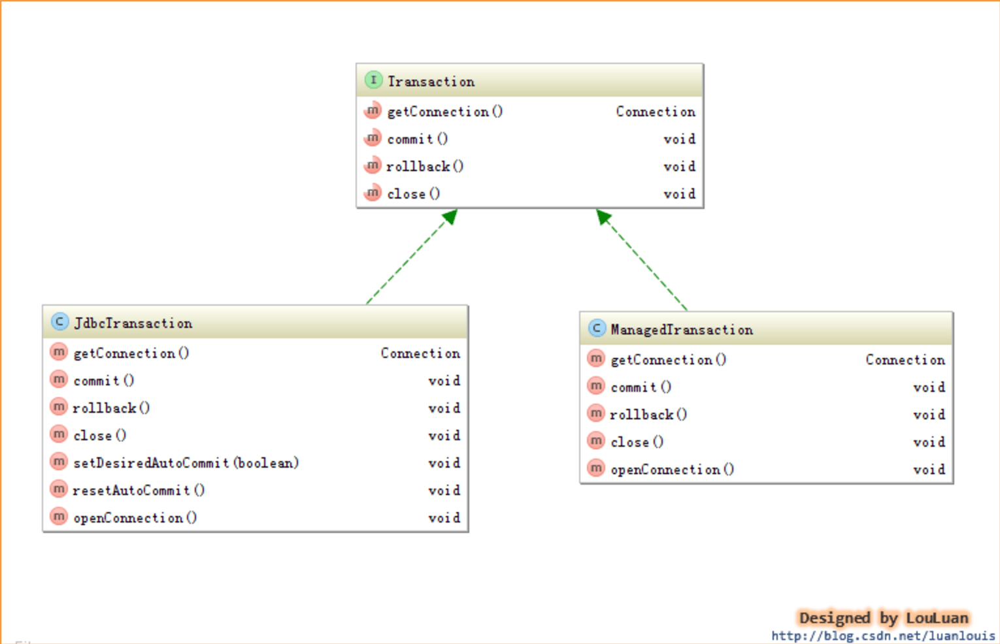
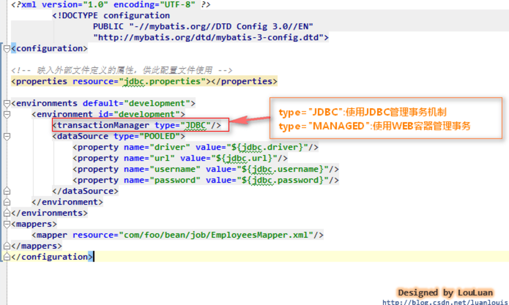
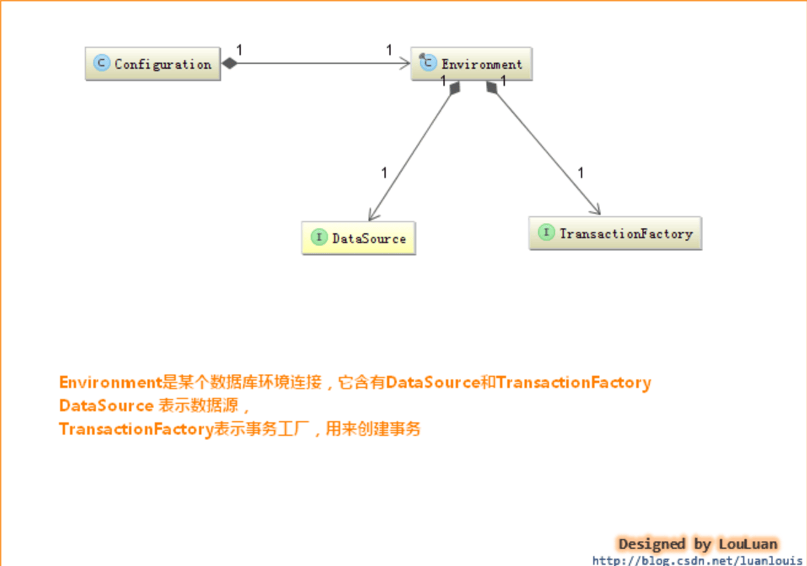
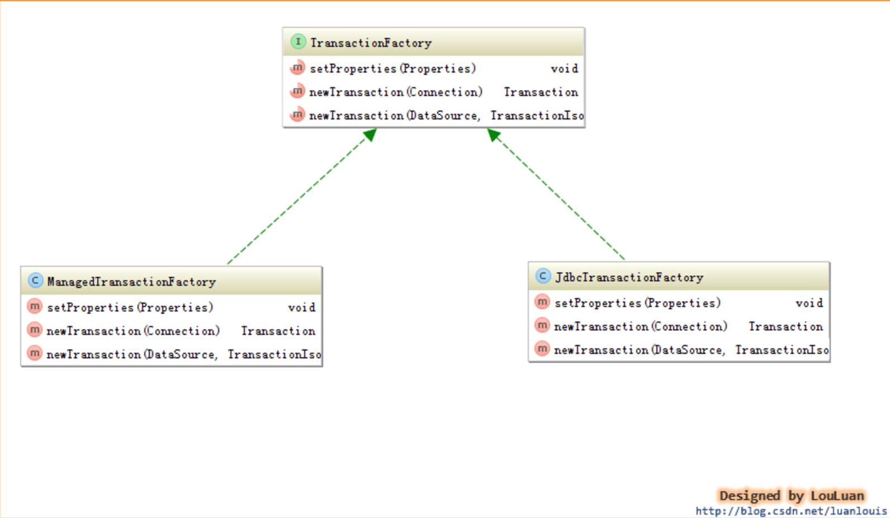

# 11 - MyBatis详解 - 事务管理机制

> 本文主要介绍MyBatis事务管理相关的使用和机制。@pdai

- MyBatis详解 - 事务管理机制
  - [概述](#概述)
  - [官网关于事务配置的内容](#官网关于事务配置的内容)
  - 事务的配置、创建和使用
    - [事务的配置](#事务的配置)
    - [事务工厂的创建](#事务工厂的创建)
    - [事务工厂TransactionFactory](#事务工厂transactionfactory)
    - [事务Transaction的创建](#事务transaction的创建)
    - [JdbcTransaction](#jdbctransaction)
    - [ManagedTransaction](#managedtransaction)

## [#](#概述) 概述

对数据库的事务而言，应该具有以下几点：创建（create）、提交（commit）、回滚（rollback）、关闭（close）。对应地，MyBatis将事务抽象成了Transaction接口：


MyBatis的事务管理分为两种形式：

- **使用JDBC的事务管理机制**：即利用java.sql.Connection对象完成对事务的提交（commit()）、回滚（rollback()）、关闭（close()）等。
- **使用MANAGED的事务管理机制**：这种机制MyBatis自身不会去实现事务管理，而是让程序的容器如（JBOSS，Weblogic）来实现对事务的管理。

这两者的类图如下所示：



## [#](#官网关于事务配置的内容) 官网关于事务配置的内容

在 MyBatis 中有两种类型的事务管理器（也就是 `type="[JDBC|MANAGED]"`）：

- **JDBC** – 这个配置直接使用了 JDBC 的提交和回滚设施，它依赖从数据源获得的连接来管理事务作用域。
- **MANAGED** – 这个配置几乎没做什么。它从不提交或回滚一个连接，而是让容器来管理事务的整个生命周期（比如 JEE 应用服务器的上下文）。 默认情况下它会关闭连接。然而一些容器并不希望连接被关闭，因此需要将 closeConnection 属性设置为 false 来阻止默认的关闭行为。例如:

```xml
<transactionManager type="MANAGED">
  <property name="closeConnection" value="false"/>
</transactionManager>
```

> 如果你正在使用 Spring + MyBatis，则没有必要配置事务管理器，因为 Spring 模块会使用自带的管理器来覆盖前面的配置。

这两种事务管理器类型都不需要设置任何属性。它们其实是类型别名，换句话说，你可以用 TransactionFactory 接口实现类的全限定名或类型别名代替它们。

```java
public interface TransactionFactory {
  default void setProperties(Properties props) { // 从 3.5.2 开始，该方法为默认方法
    // 空实现
  }
  Transaction newTransaction(Connection conn);
  Transaction newTransaction(DataSource dataSource, TransactionIsolationLevel level, boolean autoCommit);
}
```

在事务管理器实例化后，所有在 XML 中配置的属性将会被传递给 setProperties() 方法。你的实现还需要创建一个 Transaction 接口的实现类，这个接口也很简单：

```java
public interface Transaction {
  Connection getConnection() throws SQLException;
  void commit() throws SQLException;
  void rollback() throws SQLException;
  void close() throws SQLException;
  Integer getTimeout() throws SQLException;
}
```

使用这两个接口，你可以完全自定义 MyBatis 对事务的处理。

## [#](#事务的配置、创建和使用) 事务的配置、创建和使用

### [#](#事务的配置) 事务的配置

我们在使用MyBatis时，一般会在MyBatisXML配置文件中定义类似如下的信息：



`<environment>`节点定义了连接某个数据库的信息，其子节点`<transactionManager>` 的type 会决定我们用什么类型的事务管理机制。

### [#](#事务工厂的创建) 事务工厂的创建

MyBatis事务的创建是交给TransactionFactory 事务工厂来创建的，如果我们将`<transactionManager>`的type 配置为"JDBC",那么，在MyBatis初始化解析 `<environment>`节点时，会根据type="JDBC"创建一个JdbcTransactionFactory工厂，其源码如下：

```java
/** 
 * 解析<transactionManager>节点，创建对应的TransactionFactory 
 * @param context 
 * @return 
 * @throws Exception 
 */  
private TransactionFactory transactionManagerElement(XNode context) throws Exception {  
    if (context != null) {  
        String type = context.getStringAttribute("type");  
        Properties props = context.getChildrenAsProperties();  
        /* 
         * 在Configuration初始化的时候，会通过以下语句，给JDBC和MANAGED对应的工厂类 
         * typeAliasRegistry.registerAlias("JDBC", JdbcTransactionFactory.class); 
         * typeAliasRegistry.registerAlias("MANAGED", ManagedTransactionFactory.class); 
         * 下述的resolveClass(type).newInstance()会创建对应的工厂实例 
         */  
        TransactionFactory factory = (TransactionFactory) resolveClass(type).newInstance();  
        factory.setProperties(props);  
        return factory;  
    }  
    throw new BuilderException("Environment declaration requires a TransactionFactory.");  
}  
```

如上述代码所示，如果type = "JDBC",则MyBatis会创建一个JdbcTransactionFactory.class 实例；如果type="MANAGED"，则MyBatis会创建一个MangedTransactionFactory.class实例。

MyBatis对`<transactionManager>`节点的解析会生成TransactionFactory实例；而对`<dataSource>`解析会生成datasouce实例，作为`<environment>`节点，会根据TransactionFactory和DataSource实例创建一个Environment对象，代码如下所示：

```java
private void environmentsElement(XNode context) throws Exception {  
    if (context != null) {  
        if (environment == null) {  
            environment = context.getStringAttribute("default");  
        }  
        for (XNode child : context.getChildren()) {  
            String id = child.getStringAttribute("id");  
            //是和默认的环境相同时，解析之  
            if (isSpecifiedEnvironment(id)) {  
                //1.解析<transactionManager>节点，决定创建什么类型的TransactionFactory  
                TransactionFactory txFactory = transactionManagerElement(child.evalNode("transactionManager"));  
                //2. 创建dataSource  
                DataSourceFactory dsFactory = dataSourceElement(child.evalNode("dataSource"));  
                DataSource dataSource = dsFactory.getDataSource();  
                //3. 使用了Environment内置的构造器Builder，传递id 事务工厂TransactionFactory和数据源DataSource  
                Environment.Builder environmentBuilder = new Environment.Builder(id)  
                .transactionFactory(txFactory)  
                .dataSource(dataSource);  
                configuration.setEnvironment(environmentBuilder.build());  
            }  
        }  
    }  
}  
```

Environment表示着一个数据库的连接，生成后的Environment对象会被设置到Configuration实例中，以供后续的使用。



上述一直在讲事务工厂TransactionFactory来创建的Transaction，现在让我们看一下MyBatis中的TransactionFactory的定义吧。

### [#](#事务工厂transactionfactory) 事务工厂TransactionFactory

事务工厂Transaction定义了创建Transaction的两个方法：一个是通过指定的Connection对象创建Transaction，另外是通过数据源DataSource来创建Transaction。与JDBC 和MANAGED两种Transaction相对应，TransactionFactory有两个对应的实现的子类：



### [#](#事务transaction的创建) 事务Transaction的创建

通过事务工厂TransactionFactory很容易获取到Transaction对象实例。我们以JdbcTransaction为例，看一下JdbcTransactionFactory是怎样生成JdbcTransaction的，代码如下：

```java
public class JdbcTransactionFactory implements TransactionFactory {  
 
    public void setProperties(Properties props) {  
    }  
 
    /** 
     * 根据给定的数据库连接Connection创建Transaction 
     * @param conn Existing database connection 
     * @return 
     */  
    public Transaction newTransaction(Connection conn) {  
        return new JdbcTransaction(conn);  
    }  
 
    /** 
     * 根据DataSource、隔离级别和是否自动提交创建Transacion 
     * 
     * @param ds 
     * @param level Desired isolation level 
     * @param autoCommit Desired autocommit 
     * @return 
     */  
    public Transaction newTransaction(DataSource ds, TransactionIsolationLevel level, boolean autoCommit) {  
        return new JdbcTransaction(ds, level, autoCommit);  
    }  
}  
```

如上说是，JdbcTransactionFactory会创建JDBC类型的Transaction，即JdbcTransaction。类似地，ManagedTransactionFactory也会创建ManagedTransaction。下面我们会分别深入JdbcTranaction 和ManagedTransaction，看它们到底是怎样实现事务管理的。

### [#](#jdbctransaction) JdbcTransaction

JdbcTransaction直接使用JDBC的提交和回滚事务管理机制。它依赖与从dataSource中取得的连接connection 来管理transaction 的作用域，connection对象的获取被延迟到调用getConnection()方法。如果autocommit设置为on，开启状态的话，它会忽略commit和rollback。

直观地讲，就是JdbcTransaction是使用的java.sql.Connection 上的commit和rollback功能，JdbcTransaction只是相当于对java.sql.Connection事务处理进行了一次包装（wrapper），Transaction的事务管理都是通过java.sql.Connection实现的。JdbcTransaction的代码实现如下：

```java
public class JdbcTransaction implements Transaction {  
 
    private static final Log log = LogFactory.getLog(JdbcTransaction.class);  
 
    //数据库连接  
    protected Connection connection;  
    //数据源  
    protected DataSource dataSource;  
    //隔离级别  
    protected TransactionIsolationLevel level;  
    //是否为自动提交  
    protected boolean autoCommmit;  
 
    public JdbcTransaction(DataSource ds, TransactionIsolationLevel desiredLevel, boolean desiredAutoCommit) {  
        dataSource = ds;  
        level = desiredLevel;  
        autoCommmit = desiredAutoCommit;  
    }  
 
    public JdbcTransaction(Connection connection) {  
        this.connection = connection;  
    }  
 
    public Connection getConnection() throws SQLException {  
        if (connection == null) {  
            openConnection();  
        }  
        return connection;  
    }  
 
    /** 
     * commit()功能 使用connection的commit() 
     * @throws SQLException 
     */  
    public void commit() throws SQLException {  
        if (connection != null && !connection.getAutoCommit()) {  
            if (log.isDebugEnabled()) {  
                log.debug("Committing JDBC Connection [" + connection + "]");  
            }  
            connection.commit();  
        }  
    }  
 
    /** 
     * rollback()功能 使用connection的rollback() 
     * @throws SQLException 
     */  
    public void rollback() throws SQLException {  
        if (connection != null && !connection.getAutoCommit()) {  
            if (log.isDebugEnabled()) {  
                log.debug("Rolling back JDBC Connection [" + connection + "]");  
            }  
            connection.rollback();  
        }  
    }  
 
    /** 
     * close()功能 使用connection的close() 
     * @throws SQLException 
     */  
    public void close() throws SQLException {  
        if (connection != null) {  
            resetAutoCommit();  
            if (log.isDebugEnabled()) {  
                log.debug("Closing JDBC Connection [" + connection + "]");  
            }  
            connection.close();  
        }  
    }  
 
    protected void setDesiredAutoCommit(boolean desiredAutoCommit) {  
        try {  
            if (connection.getAutoCommit() != desiredAutoCommit) {  
                if (log.isDebugEnabled()) {  
                    log.debug("Setting autocommit to " + desiredAutoCommit + " on JDBC Connection [" + connection + "]");  
                }  
                connection.setAutoCommit(desiredAutoCommit);  
            }  
        } catch (SQLException e) {  
            // Only a very poorly implemented driver would fail here,  
            // and there's not much we can do about that.  
            throw new TransactionException("Error configuring AutoCommit.  "  
             + "Your driver may not support getAutoCommit() or setAutoCommit(). "  
             + "Requested setting: " + desiredAutoCommit + ".  Cause: " + e, e);  
        }  
    }  
 
    protected void resetAutoCommit() {  
        try {  
            if (!connection.getAutoCommit()) {  
                // MyBatis does not call commit/rollback on a connection if just selects were performed.  
                // Some databases start transactions with select statements  
                // and they mandate a commit/rollback before closing the connection.  
                // A workaround is setting the autocommit to true before closing the connection.  
                // Sybase throws an exception here.  
                if (log.isDebugEnabled()) {  
                    log.debug("Resetting autocommit to true on JDBC Connection [" + connection + "]");  
                }  
                connection.setAutoCommit(true);  
            }  
        } catch (SQLException e) {  
            log.debug("Error resetting autocommit to true "  
             + "before closing the connection.  Cause: " + e);  
        }  
    }  
 
    protected void openConnection() throws SQLException {  
        if (log.isDebugEnabled()) {  
            log.debug("Opening JDBC Connection");  
        }  
        connection = dataSource.getConnection();  
        if (level != null) {  
            connection.setTransactionIsolation(level.getLevel());  
        }  
        setDesiredAutoCommit(autoCommmit);  
    }  
 
}  
```

### [#](#managedtransaction) ManagedTransaction

ManagedTransaction让容器来管理事务Transaction的整个生命周期，意思就是说，使用ManagedTransaction的commit和rollback功能不会对事务有任何的影响，它什么都不会做，它将事务管理的权利移交给了容器来实现。看如下Managed的实现代码大家就会一目了然：

```java
/** 
 *  
 * 让容器管理事务transaction的整个生命周期 
 * connection的获取延迟到getConnection()方法的调用 
 * 忽略所有的commit和rollback操作 
 * 默认情况下，可以关闭一个连接connection，也可以配置它不可以关闭一个连接 
 * 让容器来管理transaction的整个生命周期 
 * @see ManagedTransactionFactory 
 */   
public class ManagedTransaction implements Transaction {  
 
    private static final Log log = LogFactory.getLog(ManagedTransaction.class);  
 
    private DataSource dataSource;  
    private TransactionIsolationLevel level;  
    private Connection connection;  
    private boolean closeConnection;  
 
    public ManagedTransaction(Connection connection, boolean closeConnection) {  
        this.connection = connection;  
        this.closeConnection = closeConnection;  
    }  
 
    public ManagedTransaction(DataSource ds, TransactionIsolationLevel level, boolean closeConnection) {  
        this.dataSource = ds;  
        this.level = level;  
        this.closeConnection = closeConnection;  
    }  
 
    public Connection getConnection() throws SQLException {  
        if (this.connection == null) {  
            openConnection();  
        }  
        return this.connection;  
    }  
 
    public void commit() throws SQLException {  
        // Does nothing  
    }  
 
    public void rollback() throws SQLException {  
        // Does nothing  
    }  
 
    public void close() throws SQLException {  
        if (this.closeConnection && this.connection != null) {  
            if (log.isDebugEnabled()) {  
                log.debug("Closing JDBC Connection [" + this.connection + "]");  
            }  
            this.connection.close();  
        }  
    }  
 
    protected void openConnection() throws SQLException {  
        if (log.isDebugEnabled()) {  
            log.debug("Opening JDBC Connection");  
        }  
        this.connection = this.dataSource.getConnection();  
        if (this.level != null) {  
            this.connection.setTransactionIsolation(this.level.getLevel());  
        }  
    }
} 
```

注意：如果我们使用MyBatis构建本地程序，即不是WEB程序，若将type设置成"MANAGED"，那么，我们执行的任何update操作，即使我们最后执行了commit操作，数据也不会保留，不会对数据库造成任何影响。因为我们将MyBatis配置成了“MANAGED”，即MyBatis自己不管理事务，而我们又是运行的本地程序，没有事务管理功能，所以对数据库的update操作都是无效的。

------

著作权归@pdai所有 原文链接：https://pdai.tech/md/framework/orm-mybatis/mybatis-y-trans.html