# 19 - Redis大厂经验 - 微博：万亿级日访问量下，Redis在微博的9年优化历程

> 再分享一篇微博使用redis的经验的文章，因为Redis在微博内部分布在各个应用场景，比如像现在春晚必争的“红包飞”活动，还有像粉丝数、用户数、阅读数、转评赞、评论盖楼、广告推荐、负反馈、音乐榜单等等都有用到Redis；我们可以通过大厂使用redis的经验来强化对redis使用上的认知。@pdai

- Redis大厂经验 - 微博：万亿级日访问量下，Redis在微博的9年优化历程
  - Redis在微博的应用场景
    - [业务&规模&挑战](#业务规模挑战)
    - [技术选型](#技术选型)
    - [优化](#优化)
  - Redis在微博的优化
    - [Cache Service服务化](#cache-service服务化)
    - [mcq服务化](#mcq服务化)
    - [如何解决Redis容量过大？](#如何解决redis容量过大)
    - [仍满足不了新需求？](#仍满足不了新需求)
  - 未来展望
    - [Q & A](#q--a)
  - [文章来源](#文章来源)

## [#](#redis在微博的应用场景) Redis在微博的应用场景

> Redis在微博内部分布在各个应用场景，比如像现在春晚必争的“红包飞”活动，还有像粉丝数、用户数、阅读数、转评赞、评论盖楼、广告推荐、负反馈、音乐榜单等等都有用到Redis。

### [#](#业务-规模-挑战) 业务&规模&挑战

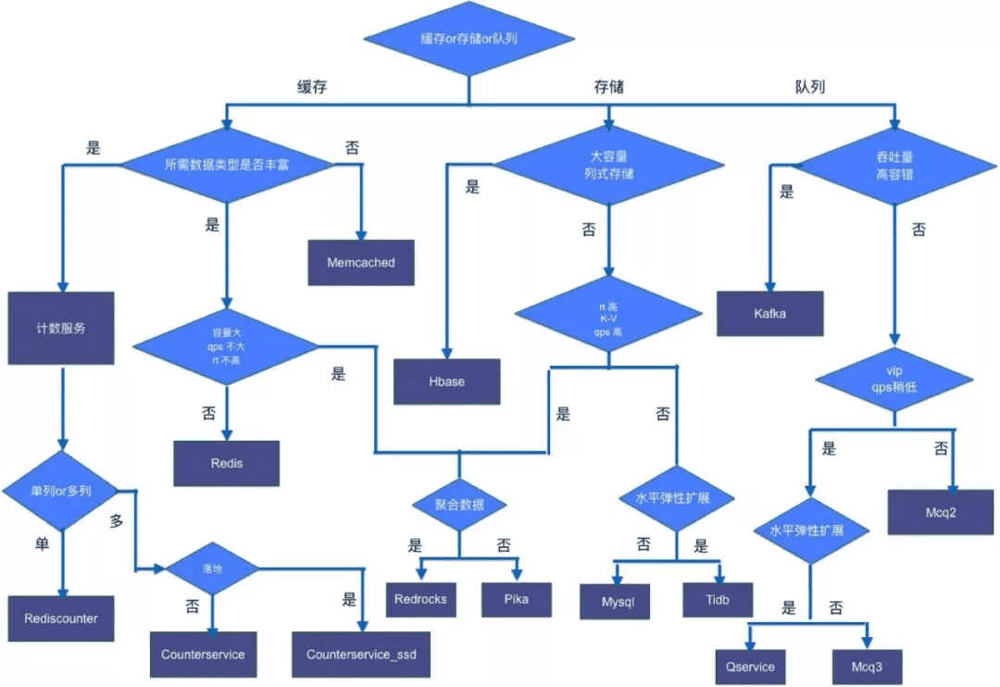

线上的业务有前面提到的信息流、广告、用户关系等等，还有现在大家可能比较感兴趣的热搜，用户一般会去看发生了什么事情，还有引爆阅读量的话题，以及现在兵家必争之地的视频，微博大大小小的业务都有用到Redis。

- 线上**规模**方面，微博有100T+存储，1000+台物理机，10000+Redis实例。
- 关于面临的**挑战**，我们每天有万亿级的读写，线上的响应时间要求也比较高。

举一个简单的例子，我们部署资源是跨机房部署，但是有一些业务部门连跨机房部署存在的多余两毫秒的延迟都要投诉反馈（真的是臣妾做不到啊，如果单机房故障了呢？有些业务方真是异想天开）。响应时间基本上四个9是20毫秒。

- **成本**的话因为我们线上有大量需求是上T的，所以成本压力其实也特别大。

### [#](#技术选型) 技术选型

上图是微博数据库的技术选型，其实可以看到这里面不仅仅包含Redis等NoSQL，还有队列、存储，如果以后有机会的话可以给大家分享一下从0到1搭建微博的数据库，在内部分享的时候大概花了2-3个小时，时间有限，这次就只讲Redis这一部分。

### [#](#优化) 优化

从2010年开始，我们就基于官方的2.0版本引进Redis，到现在已经有九个年头了，我们主要做了以下这些方面的改进：

- Redis编码格式，在特殊场景下可以节省30%的空间；
- 主从库方面有独立的复制线程；
- 我们定制化一些数据结构，比如：LongSet 数据结构，它是一个“固定长度开放寻址的 Hash 数组”，减少Redis dict 很多额外的指针开销；
- 在主从复制方面，独立复制线程 + 完全增量复制,这样的话，如果网络主从临时断了，只要从当前的pos点同步数据就行；
- 在持久化方面，我们是全量的RDB加增量的AOF复制；
- AOF写入/ 刷盘，主线程—>BIO，避免了因为写入导致的阻塞；
- 落地时间，不可控—>cronsave可控；
- 增加aofnumber,设置AOF数量，避免因为写入过快，磁盘写满；
- 高可用, Redis的HA我们并没有用官方的或者社区开源的，用的是我们自己开发的一套Redis HA，保障在故障的情况下，能快速进行切换。

微博有大量的技术场景，比如转评赞、阅读数等，对于一些用户来说，他们是很关心这些指标的。

如果我们用原生的Redis，会浪费大量的存储空间，因为它的产品特别特殊，它的key是一个用户的id，value是数字，我们自己内部最早改了一版叫RedisCounter，它相当于只维持了一个哈希表，节省了大量的Redis内存空间。

当然它有一个缺点就是当初是短平快地上线了，所以它只支持单个列和单个表，如果你要存转发，评论，赞3个计数的话需要部署三套资源，这样一来大家访问微博取这3个数的速度会变慢。

而且需要维护3套资源，为了应对这种场景，我们支持了多列和多表的方式，如果一个表写满了，可以继续写下一个表，写到最后一个表时，我们可以把前面的表滚到盘里面，但是这个时候是不可读的。

为了解决不可读的问题，我们想了一个办法，把表都放在磁盘里面，维护ddb的数据结构，在这样的落地方式下，就可以把最近的热数据放在内存里面，把冷数据或者历史数据放在磁盘里面。

之前统计了一下，在线上90%多的情况下，用户只访问几个月的数据，所以一些长尾数据可以靠从磁盘中读取数据来解决，也不影响用户体验。

微博还有一些存在性判断的行为，比如是否赞过、是否阅读过，这些全量的数据特别大，如果用Redis的话对内存成本花费特别大。

所以我们改造了一版服务，它是一个兼容Redis协议，基于BloomFilter，开发了一版phantom，高性能，单线程网络处理机制，与Redis性能相当，低存储空间，每条记录占用1.2*N字节（1%的误判率，每增加0.6*N字节误判率下降为原来的1/10，N为单个槽位占用的bit数）。

当然还有其他像我们最近用的队列、MySQL等等其他类型的数据库，这边就不展开了。简单做一下Redis第一阶段优化的小结：

- 无阻塞落地
- 增量复制 -> RDB+AOF
- 在线热升级
- 关系graph定制 
  - 内存降为1/10
  - 性能相当
- 计数定制化 
  - 内存降为1/4
  - 性能提升3-5倍
- BloomFilter

但是我们做了这么多优化还是跟不上业务的需求。

## [#](#redis在微博的优化) Redis在微博的优化

首先需要明白为什么要优化，我们一般从三个方面进行考虑：

**首先是业务方**。目前线上的业务方需要关心资源的分布、容量规划等多方面，比如内存是否满了、磁盘是否满了、如果用MySQL的话是否要提前分库分表、QPS是否能扛住。

我们希望把这些问题对业务方屏蔽，他们只管用，而不用关心太多涉及到资源细节的方面。

**第二是DBA**。虽然现在微博已经不是处于高速增长的状态了，但实际上它也还是以一定的速度在增长，所以对DBA来说，需求还是特别多的。

加上我们部门是承接微博所有的数据库的服务，有微博最多的服务器，因此对于我们来说，需求多，变更多，挑战大。

从设计的角度，我们要考虑如何设计Redis更合理。

总结了一下有三个方面：

**一是高性能，读写快、访问快、响应时间快**。

**二是能够支持大容量的需求**。

**三是可扩展**，因为接触的业务方比较多，就会发现一个问题，基本上没有几个业务方能把自己的需求描述得特别清楚，经常上线之后才发现内存不够了，或者写入扛不住了，所以这个时候我们需要在可扩展性方面提供一个强有力的支持。

我们可以把这三个方面解释为三座大山。

### [#](#cache-service服务化) Cache Service服务化

为了解决三座大山，首先要把Cache服务化，它是一个多级缓存的服务，能够解决高访问、高并发的问题以及实现高可用。

基于这套系统，也设计了一套后台程序，根据微博的流量进行自动监测、能够支持自动扩缩容，这样能快速扛过峰值，峰值过去之后又回收机器，实现了对资源的充分利用。

当然这套系统还在持续完善中，希望未来能做到更智能。

ConfigService就是我们把配置放在配置中心里面，Client再从配置中心里面拉取配置。

一共有两种访问方式，第一种是SDK，第二种是支持多语言的，通过Proxy把请求路由到后端的Cache里面。DBA只要通过管理平台就可以对资源进行快速扩缩容。

现在讲一下多级的Cache，实际上这里面有四个角色：master、maste-l1、slave、slave-l1。

master跟slave没有同步关系，只是按角色作用的方式命名的，master-l1有多组数据来扛热点，master是基准数据保存全量数据，slave一般是做多机房的容灾，slave-l1做多机房的数据同步，这个同步只保证最终数据的一致性。

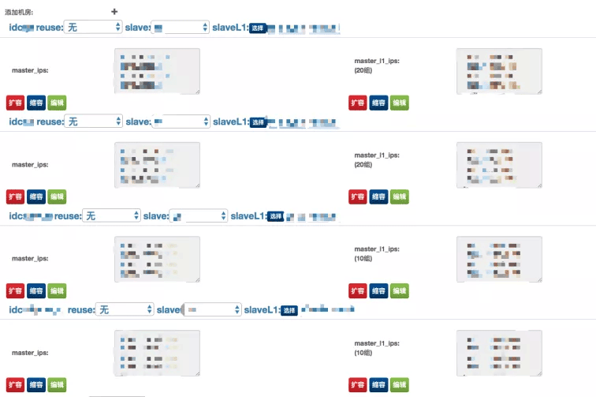

以读取作为例子来说一下流程，读取是先访问master-l1，如果没有命中会访问master，如果又没有命中会访问到slave，通过这3层，大部分情况下能把99%的热点给扛住，然后还有1%的流量才会落到MySQL里面。

假如是100万的读，穿透到MySQL只有一万QPS，如果100万的读全部都打到MySQL的话，对于MySQL而言成本特别高，而且大家知道，MySQL在高并发读写情况下，很容易被打死，且在短时间内是恢复不了。

Cacheservice 目前支持mc和Redis协议2种协议。

上图是我们DBA操作的扩缩容的界面，这个业务总共有20组，每组有5个IP，5×20=100个实例，实际上就是一百个实例在里面提供服务，线上有好多个单个集群服务，可以支撑百万甚至千万QPS的高并发访问，而且可以支持快速的扩缩容。

分享一下我们之前的成功案例，我们已经实现好几年的春晚1000+台阿里云ECS弹性扩缩容，多次实现无降级平滑过渡，高峰期支持微博50%的春晚核心流量。

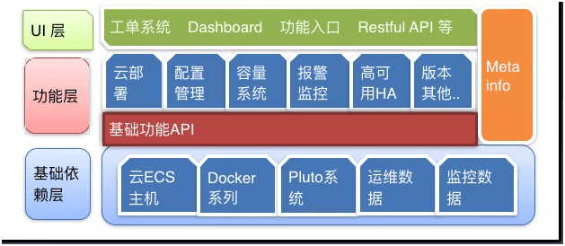

上图是我们内部为了支持系统而进行的系统整合，在这边就不展开了。

### [#](#mcq服务化) mcq服务化

基于前面的Cache服务化，我们在2018上半年跟业务方一起合作，把队列也给服务化了。

为什么要把队列单独提出来呢？是因为经常有内部或外部的人问，你们发微博是什么样的流程？你们发评论是什么样的流程？数据怎么解决？

这些问题很关键的一环就是在队列里面，发微博的时候实际上是先写到队列，然后队列再写到后端的MySQL里面，如果这个时候MySQL宕机了，我们会有一个修复队列，专门有一个Key来存这部分的数据，等MySQL恢复以后再把这部分数据写入到MySQL里面。

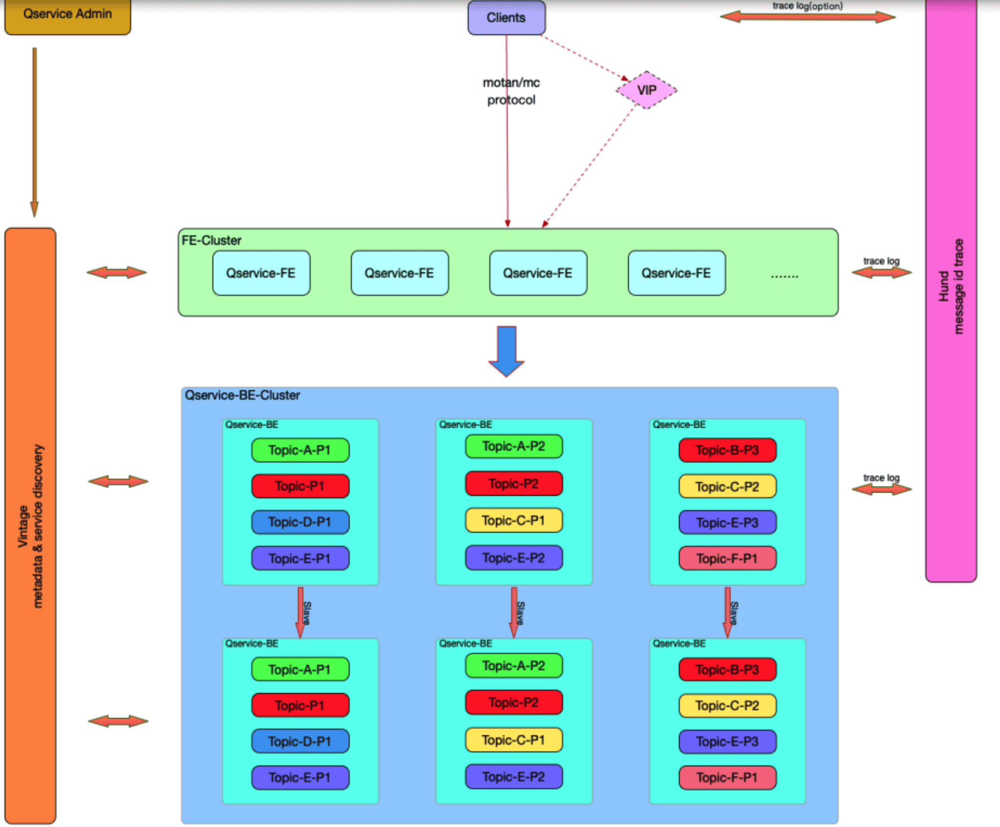

上面还有一个BCP，是因为当初我们在做这一套的时候，实际上是想在整个微博推广。

去年比特币特别火，我们也想通过购买比特币的方式，在内部通过机器的资源或者内部开源的一些东西来做等价物质的转换，然后来应用这个服务，但是最终这个计划没有具体落地。

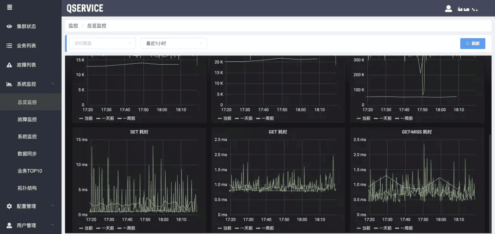

上图是一键告警以及操作的监控图。

前面提到我们把Cache服务化了，但是实际上并没有很好地解决容量过大的问题，虽然现在内存的价格一直在下降，但相对硬盘来说价格还是太高。

如果我们经常有像5T或者10T的业务，并且全放内存里面的话，对于我们成本的压力实际上是特别大的。

而且我们需要向专门的成本委员会申领资源，只有成本委员会同意了我们才能拿到这些机器，整个周期时间长。

### [#](#如何解决redis容量过大) 如何解决Redis容量过大？

为了解决容量过大的问题，我们想把容量从内存放到磁盘里面。

我们当时考虑了一些特性，比如支持冷热数据的分离，比如把历史的数据或者全量的数据全部存在磁盘，然后支持持久化、支持数据主从复制、支持在线热升级，需要兼容Redis数据类型，还要兼容与Redis的复制。

基于前面的场景，像微博这种属性特别适合用这种方法，就算冷热数据不明显，比如上T，每秒几K访问的情况，用这个方法也特别合适。

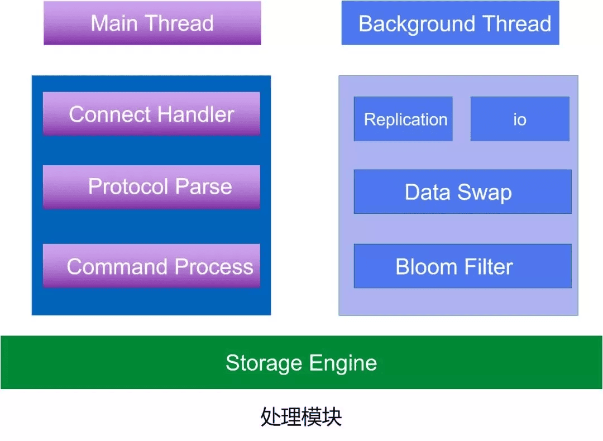

下面讲一下处理模块，里面有主线程和后台线程。

主线程主要处理连接的请求、协议的解析以及命令的请求，后台线程主要是复制线程，还有像BIO线程，我们把像刷盘操作是写AOF都是放在这个线程，这样可以尽可能减少写入所造成的对Redis的阻塞。

还有一个Bloom Filter，是基于布谷鸟算法来优化，初始化的时候指定Filter的容量，新增双向链表管理Hash冲突。

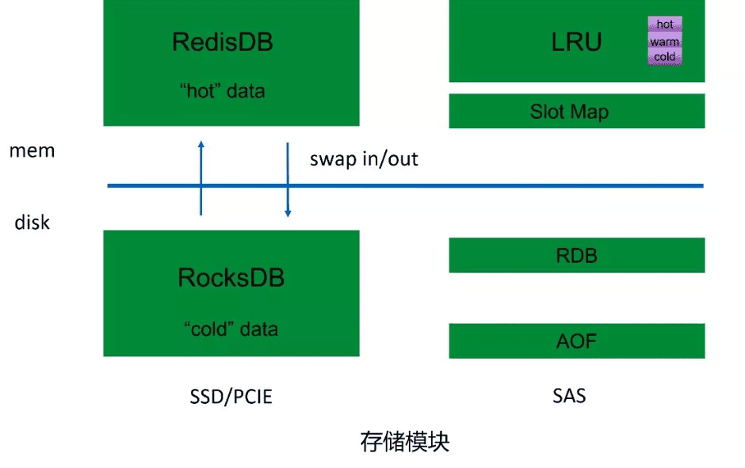

从这个名字大家可以猜到，是Redis+RocksDB的结合，为什么这个时候我们不像前面提到的类似设计CounterserviceSSD那样自己设计，其实主要原因是当初我们在设计时RocksDB还没有非常多大规模的应用。

现在RocksDB已经特别成熟，而且有非常多成功的案例。我们还有一个不自己开发的原因，就是如果自己开发的话，可能适用性或者性能，以及代码健壮性反而没有那么好，所以为了节省时间我们采用了RocksDB来做存储，避免重复造轮子。

LRU是为了加快访问速度的，如果第一次访问的时候没有在内存里面读取到，就从磁盘里面读取，它实际上会放在内存，下次你再读取的时候会从LRU里面读取出来。

这边还涉及到数据从内存到磁盘换入换出，如果key或者value特别大的话，性能会有影响。这就是前面提到的为什么我们不推荐那种特别大的key或者value用RedRocks。

把前面的处理模块和后端整合一下就形成了以下这样的架构图。

对其做一下小结：

- 简单易用：完全兼容Redis，业务方不用做任何改动就可以迁移上；
- 成本优势：把热点数据或者频繁访问数据放在内存，全量的数据全部放磁盘，这是一个特别大的优势，可以突破内存容量限制；
- 高性能：热点数据在内存，热点数据访问性能和Redis相当。

下图是性能压测报告，我们对比了set的随机对写。

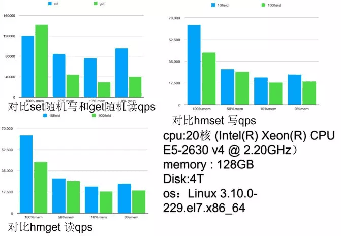

### [#](#仍满足不了新需求) 仍满足不了新需求？

我们前面已经解决了大容量的问题，但还是有很多困难并没有得到很好的解决。

因此，我们借鉴了开源经验，也调研了Twemproxy、Codis、Corvus、Redis-Cluser这些功能：

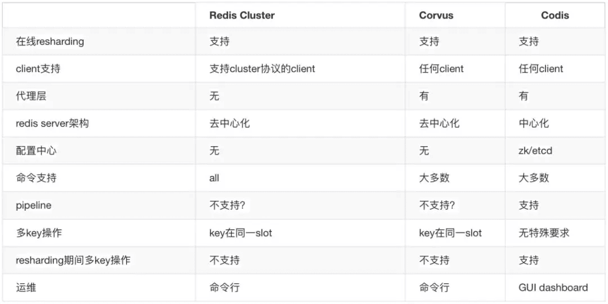

实际上我们在2015年就已经存在基于Twemproxy的业务，在线上的话像微博音乐、微博健康、通行证这3个业务已经上线。

但是我们没有在内部大范围推广开来，其中涉及到2个主要的原因，第一就是迁移还是比较费时间，第二是无法比较完美的动态增加节点，还有内部一些其他原因等等的约束。

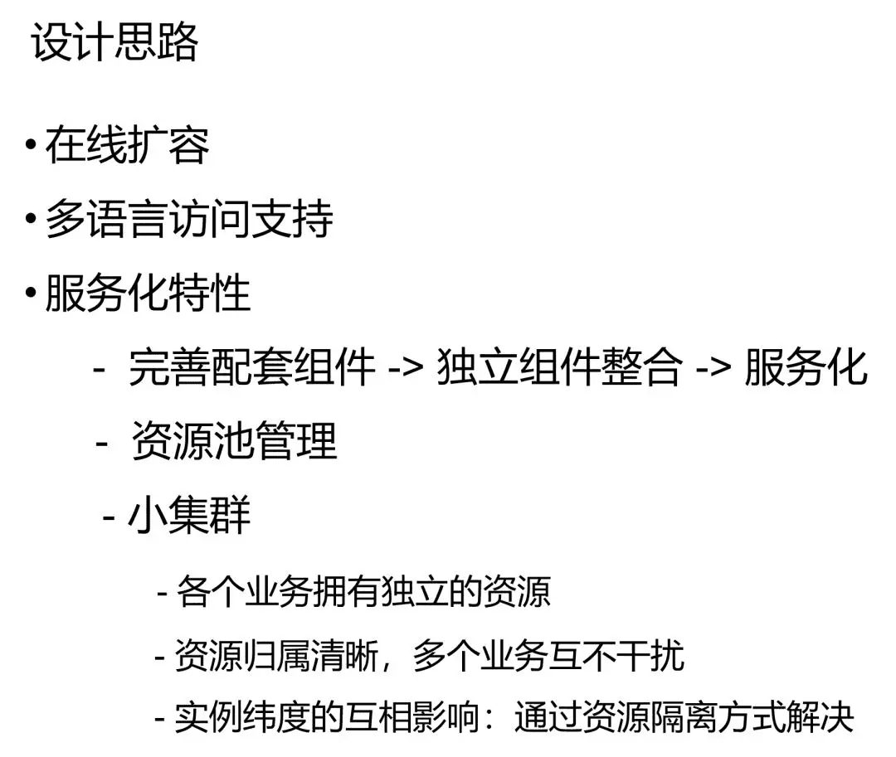

以上是我们的设计思路，一是能支持在线扩缩容，二是支持多语言的访问，因为我们是要对整个公司进行推广的，而不是说只对一个部门，所以为了推广方便我们必须有这种功能，三是对服务化特性的需求。

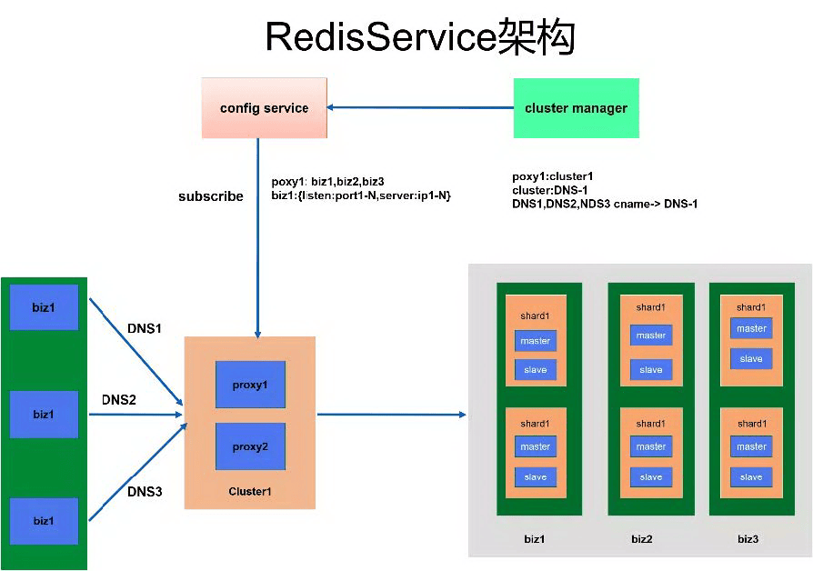

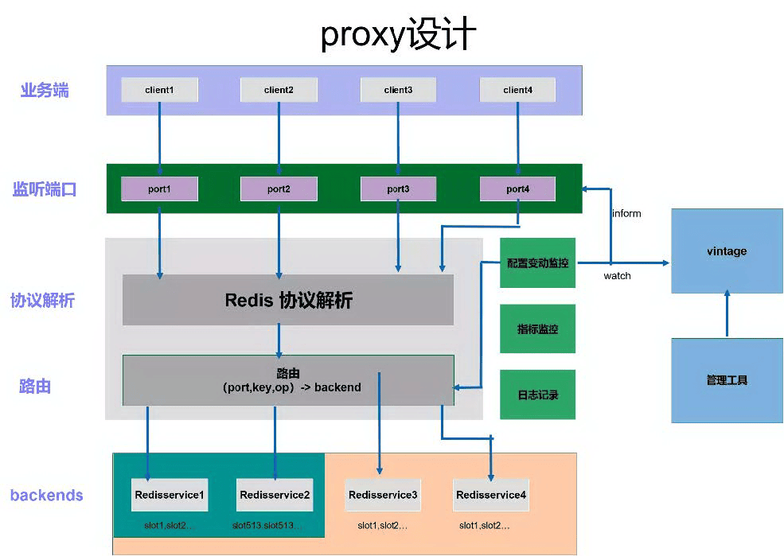

下面简单讲一下proxy里面各模块的功能：

- **port自动增删和监听**：根据Vintage对本proxy节点的配置，自动增加监听的端口或者删除移除的端口，监听客户端的连接。
- **Redis协议解析**：解析Redis协议，确定需要路由的请求，非法和不支持的请求直接返回错误。
- **路由**：需要获取和监听端口对应的backend以及它们的slot， 根据端口、key和Redis命令选择一个backend, 将请求路由到对应的backend,并将结果返回给客户端。
- **配置监控**：监控Vintage中本proxy的配置，包括端口的变动、端口和backend的变动以及slot的变化等，通知端口监听模块和路由模块。
- **指标监控**：需要将Metrics发送到Graphite中进行监控。
- **日志记录**：生成日志文件以便跟踪。

- **Redis存储方面**：还是沿用我们内部改造的Redis版本，相对之前线上的版本，这次我们新增了官方比如Mememory，内存编码的优化，以及内部新增的一些新的功能。

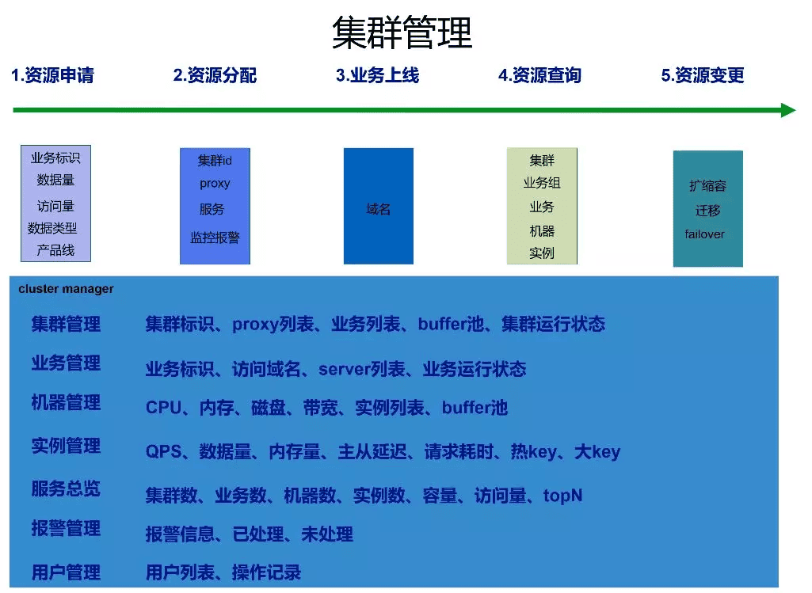

关于集群管理方面，无论是Redis也好，MySQL也好，对资源的任何管理都可以用这个来总结，包括五个部分：资源申请，资源分配，业务上线，资源查询，资源变更。

对于业务申请这一方面需要有一个业务唯一的标识，QPS、数据类型是怎样的，基于这些考察我们再对它进行分配、配置、部署。

基于前面我们做了那么多的优化以及平台服务化，用下图作为总结比较合适，就相当于服务的高可用、高性能以及可扩展这些方面，我们基本上都用前面这一套方案解决了。

## [#](#未来展望) 未来展望

无论是最开始的MySQL也好还是到后面的Oracle也好，这些都离不开SQL。如果我们能把数据一致性解决好的话，Redis的应用场景会更广。

现在有很多公司对Raft做了二次开发，后续我们也会投入到在这方面中。

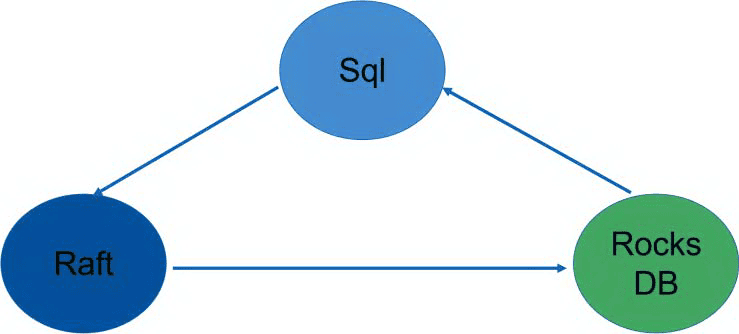

借用两句话结束今天的演讲：“数据库实际上是需要你用最快的速度把数据存储下来，然后以最方便的方式把数据给回忆起来。”

### [#](#q-a) Q & A

Q1：**刚才您说您这边有一个新的类型叫LongSet，能不能说一下它的应用场景**？

A：应用场景是在关系判断这个场景下，在微博关注Cache化改造中，需要把Redis当做Cache用存储用户的关注列表，原定方案是使用Hash结构。

但是由于Redis是做Cahce使用，key可能会被剔除，所以在判断用户是否关注某人的时候，可能不存在，这时就需要从数据库拉用户的关注列表直接HMSET到Hash结构中。

但是Redis在一次HSET多个field的时候，性能是比较低的，并且会堵塞其它的请求。

同时在仿真压力测试过程中发现，在Cache为空的情况下，必须要逐步放量填充Cache后，业务才能达到稳定。

这种情况下，对运维的压力比较大，容错很低，违背了我们Cache化的初衷，所以才有了这一次的改造。

为了解决Redis Hash结构HMSET性能较低及内存利用率较低的问题，对Redis进行了定制化改造，增加了一种新的数据结构LongSet，用来存储元素为long类型的集合。

Q2：**您刚刚解释的是热数据放在Redis，初始放在RocksDB，什么时候调用这个数据？什么时候调用那个数据？肯定是有一张表吧**？

A：读取流程是，先读取内存中的数据，这个内存大小是可以动态调整的，和官方的maxMemory参数是一致的，内存中只保留一部分的数据，如果内存中的数据没有读取到，才会从磁盘里面读取数据。

## [#](#文章来源) 文章来源

- 兰将州，新浪微博核心feed流、广告数据库业务线负责人，主要负责MySQL、NoSQL、TiDB相关的自动化开发和运维，参与Redis、counteservice_ssd、memcacheq相关代码的开发，目前关注分布式系统。
- 本文根据兰将州老师在〖2019 Gdevops全球敏捷运维峰会北京站〗现场演讲内容整理而成。
- [原文地址在新窗口打开](https://mp.weixin.qq.com/s?__biz=Mzg4NzU1MzIzMA==&mid=2247528094&idx=1&sn=e4416e3e13194a64319dd88d4b541d52&source=41#wechat_redirect)
- [演讲PPT](https://pan.baidu.com/s/10SDlBF7bWXwk2clZ5TvthA)

------

著作权归@pdai所有 原文链接：https://pdai.tech/md/db/nosql-redis/db-redis-y-weibo.html