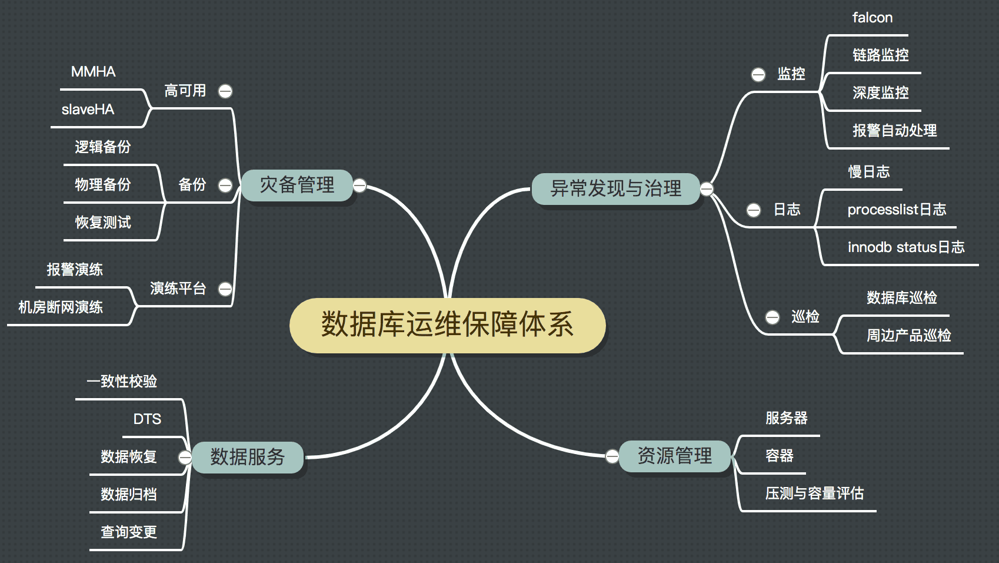
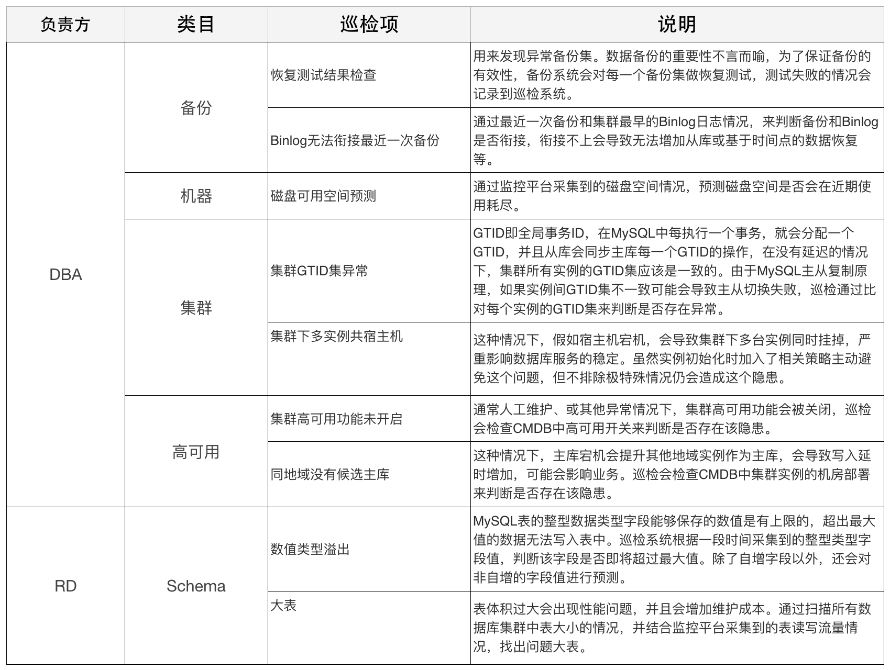
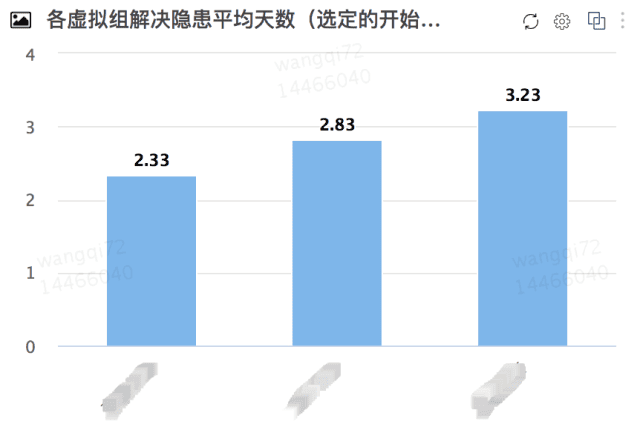
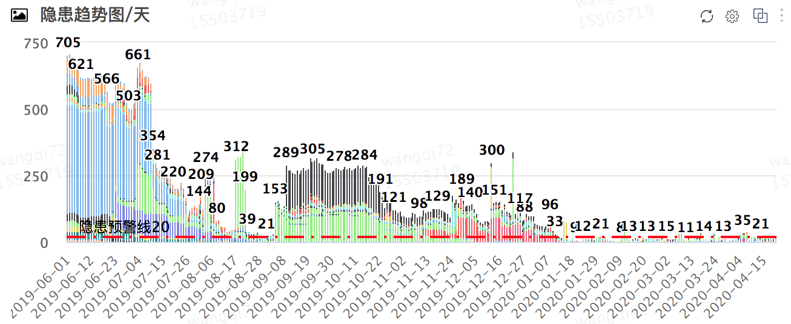
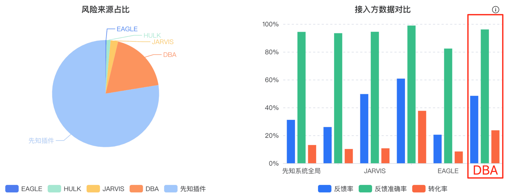

# 大厂实践 - 美团: MySQL数据库巡检系统的设计与应用

巡检工作是保障系统平稳有效运行必不可少的一个环节，目的是能及时发现系统中存在的隐患。我们生活中也随处可见各种巡检，比如电力巡检、消防检查等，正是这些巡检工作，我们才能在稳定的环境下进行工作、生活。巡检对于数据库或者其他IT系统来说也同样至关重要，特别是在降低风险、提高服务稳定性方面起到了非常关键作用。本文介绍了美团MySQL数据库巡检系统的框架和巡检内容，希望能够帮助大家了解什么是数据库巡检，美团的巡检系统架构是如何设计的，以及巡检系统是如何保障MySQL服务稳定运行的。

## 一、背景

为了保障数据库的稳定运行，以下核心功能组件必不可少：

其中，数据库巡检作为运维保障体系最重要的环节之一，能够帮助我们发现数据库存在的隐患，提前治理，做到防患于未然。对于大规模集群而言，灵活健壮的自动化巡检能力，至关重要。

任何系统都会经历一个原始的阶段，最早的巡检是由中控机+定时巡检脚本+前端展示构成的。但是，随着时间的推移，老巡检方案逐渐暴露出了一些问题：

- 巡检定时任务执行依赖中控机，存在单点问题；
- 巡检结果分散在不同的库表，无法进行统计；
- 巡检脚本没有统一开发标准，不能保证执行的成功率；
- 每个巡检项都需要单独写接口取数据，并修改前端用于巡检结果展示，比较繁琐；
- 巡检发现的隐患需要DBA主动打开前端查看，再进行处理，影响整体隐患的治理速度； ……

所以我们需要一个灵活、稳定的巡检系统来帮助我们解决这些痛点，保障数据库的稳定。

## 二、设计原则

巡检系统的设计原则，我们从以下三个方面进行考虑：

- **稳定**：巡检作为保证数据库稳定的工具，它自身的稳定性也必须有所保证；
- **高效**：以用户为中心，尽量化繁为简，降低用户的使用成本，让新同学也能迅速上手治理和管理隐患；提高新巡检部署效率，随着架构、版本、基础模块等运维环境不断变化，新的巡检需求层出不穷，更快的部署等于更早的保障；
- **可运营**：用数据做基础，对巡检隐患进行运营，包括推进隐患治理，查看治理效率、趋势、薄弱点等。

## 三、系统架构

美团MySQL数据库巡检系统架构图设计如下。接下来，我们按照架构图从下到上的顺序来对巡检系统主要模块进行简单的介绍：

### 1. 执行层

**巡检执行环境**：由多台巡检执行机组成，巡检任务脚本会同时部署在所有执行机上。执行机会定时从巡检Git仓库拉取最新的脚本，脚本使用Python Virtualenv + Git进行管理，方便扩充新的执行机。

**任务调度**：巡检任务使用了美团基础架构部研发的分布式定时任务系统Crane进行调度，解决传统定时任务单点问题。Crane会随机指派某一台执行机执行任务，假如这台执行机出现故障，会指派其他执行机重新执行任务。一般一个巡检任务对应着一个巡检项，巡检任务会针对特定的巡检目标根据一定的规则来判断是否存在隐患。

**巡检目标**：除了对生产数据库进行巡检以外，还会对高可用组件、中间件等数据库周边产品进行巡检，尽可能覆盖所有会引发数据库故障的风险点。

### 2. 存储层

**巡检数据库**：主要用来保存巡检相关数据。为了规范和简化流程，我们将巡检发现的隐患保存到数据库中，提供了通用的入库函数，能够实现以下功能：

1. 自动补齐隐患负责人、隐患发现时间等信息；
2. 入库操作幂等；
3. 支持半结构化的巡检结果入库，不同巡检的隐患结果包括不同的属性，比如巡检A的隐患有“中间件类型”，巡检B有“主库CPU核数”，以上不同结构的数据均可解析入库；
4. 针对表粒度的隐患项，如果分库分表的表出现隐患，会自动合并成一个逻辑表隐患入库。

**巡检脚本Git仓库**：用来管理巡检脚本。为了方便DBA添加巡检，在系统建设过程中，我们增加了多个公共函数，用来降低开发新巡检的成本，也方便将老的巡检脚本迁移到新的体系中。

### 3. 应用层

**集成到数据库运维平台**：作为隐患明细展示、配置巡检展示、管理白名单等功能的入口。为了提高隐患治理效率。我们做了以下设计。

1. 隐患明细展示页面会标注每个隐患出现的天数，便于追踪隐患出现原因。
2. 配置新的巡检展示时必须要同时制定隐患解决方案，确保隐患治理有章可循，避免错误的治理方式导致“错上加错”。

**隐患运营后台**：这个模块主要目的是推进隐患的治理。

1. 运营报表，帮助管理者从全局角度掌握隐患治理进展，报表包括隐患趋势、存量分布、增量分布、平均治理周期等核心内容，进而由上到下推动隐患治理；报表数据同样是通过crane定时任务计算获得。
2. 隐患治理催办功能，用来督促DBA处理隐患。催办内容中会带有隐患具体内容、出现时长、处理方案等。催办形式包括大象消息、告警，具体选用哪种形式可根据巡检关键程度做相应配置。

**外部数据服务**：主要是将巡检隐患数据提供给美团内部其他平台或项目使用，让巡检数据发挥更大的价值。

1. 对接先知平台（美团SRE团队开发的主要面向RD用户的风险发现和运营平台），平台接收各服务方上报的隐患数据，以RD视角从组织架构维度展示各服务的风险点，并跟进RD处理进度。巡检系统会把需要RD参与治理的隐患，比如大表、无唯一键表等，借助先知平台统一推送给RD进行治理。
2. 运维周报，主要面向业务线RD负责人和业务线DBA，以静态报告形式展示业务线数据库运行情况以及存在的问题，巡检隐患是报告内容之一。

## 四、巡检项目

巡检项目根据负责方分为DBA和RD，DBA主要负责处理数据库基础功能组件以及影响服务稳定性的隐患。RD主要负责库表设计缺陷、数据库使用不规范等引起的业务故障或性能问题的隐患。也存在需要他们同时参与治理的巡检项，比如“磁盘可用空间预测”等。目前巡检项目共64个，类目分布情况如下图所示：

- **集群**：主要检查集群拓扑、核心参数等集群层面的隐患；
- **机器**：主要检查服务器硬件层面的隐患；
- **Schema/SQL**：检查表结构设计、数据库使用、SQL质量等方面的隐患；
- **高可用/备份/中间件/报警**：主要检查相关核心功能组件是否存在隐患。

下面，我们通过列举几个巡检任务来对巡检项做简单的说明：

## 五、成果

美团MySQL巡检系统已稳定运行近一年时间，基于新巡检体系上线的巡检项49个。通过巡检体系持续运行，在团队的共同努力下，我们共治理了8000+核心隐患，近3个月隐患治理周期平均不超过4天，将隐患总数持续保持在极小的量级，有效地保障了数据库的稳定。

下面的隐患趋势图，展示了近一年中隐患的个数，数量突然增长是由于新的巡检项上线。从整体趋势上看，隐患存量有非常明显的下降。

除了推动内部隐患治理之外，我们还通过对接先知平台，积极推动RD治理隐患数量超过5000个。

为了提升用户体验，我们在提升准确率方面也做了重点的投入，让每一个巡检在上线前都会经过严格的测试和校验。

对比其他先知接入方，DBA上报隐患在总量、转化率、反馈率几个指标上都处于较高水平，可见我们上报的隐患风险也得到了RD的认可。

**指标说明**：

- 反馈率 = 截止到当前时刻反馈过的风险事件数量/截止到当前时刻产生的风险事件总量 * 100%；
- 反馈准确率 = 截止到当前时刻反馈准确的风险事件数量/截止到当前时刻反馈过的风险事件总量 * 100%；
- 转化率 = 截止到当前时刻用户反馈准确且需要处理的风险事件数量 / 截止到当前时刻产生的风险事件总量 * 100%。

## 六、未来规划

除了继续完善补充巡检项以外，未来巡检系统还会在以下几个方向继续探索迭代：

- 提高自动化能力，完善CI和审计；
- 加强运营能力，进一步细化每个隐患的重要程度，辅助决策治理优先级；
- 隐患自动修复。

## 文章来源

转载说明

- 作者：王琦
- 版权声明：本文为美团技术团队的原创文章，遵循 CC 4.0 BY-SA 版权协议，转载请附上原文出处链接及本声明。
- 原文链接：https://tech.meituan.com/2020/06/04/mysql-detection-system.html

