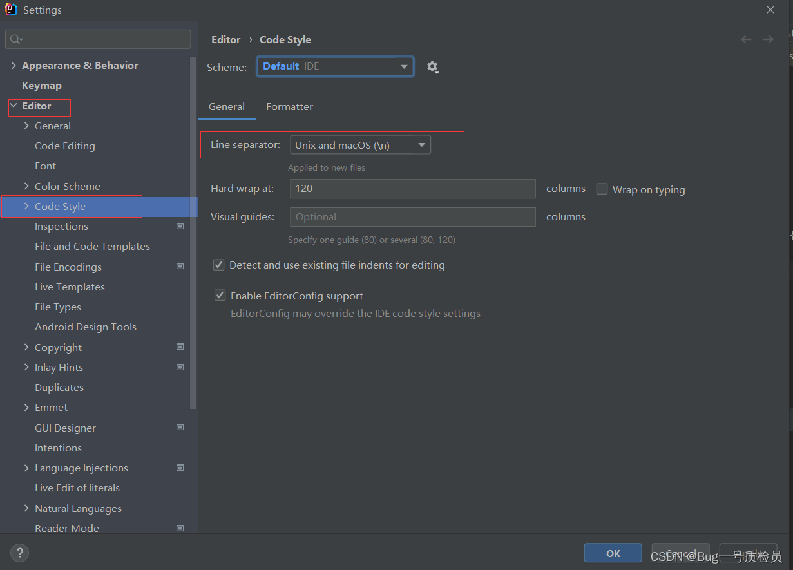

# 【发现问题】IDEA设置全局新创建文件默认换行符

今晚读《阿里Java开发手册》的代码格式部分中，第十条强制规约引起了我的注意。说的是，

> IDE中文件的换行符使用UNIX格式，不要使用Windows格式。

于是上网搜索为何如此，得到以下答案：

> 在开发中，有可能会遇到某些命令脚本使用windows下的文本编辑器进行编写
>
> 当放到测试环境的Linux中时，运行会报错。

这是因为：

**Windows：二进制下换行符号：`0d0a`**

**Linux/Unix：二进制下换行符号：`0a`**

------

**IDEA设置全局新创建文件默认换行符**
Settings——>Editor——>Code Style下面

**注意：**

- 改变的默认的换行符仅针对新文件有效，已存在的文件还是需要手动修改
- 默认换行符设置最好在刚开始安装IntelliJ IDEA软件，这样后续所有的文件都是统一换行符