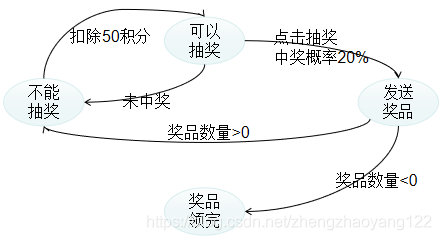
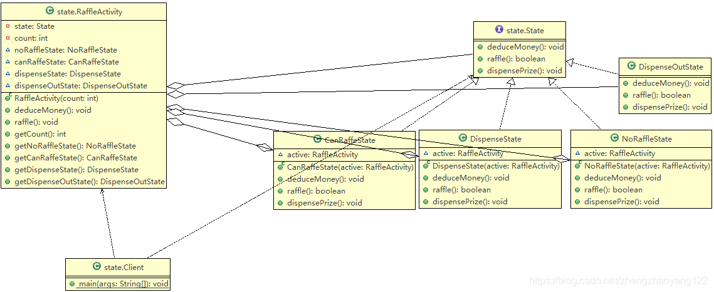

# 设计模式

------


## 设计原则


### 单一职责原则

单一职责原则（SRP：Single responsibility principle）又称为单一功能原则：它规定一个类应该只负责一项职责。

单一职责原则注意事项和细节：
1、降低类的复杂度，一个类只负责一项职责。
2、提高类的可读性，可维护性。
3、降低变更引起的风险。
4、通常情况下，我们应当遵守单一职责原则，只有当逻辑足够简单时，才可以在代码级别违反单一职责原则；只有类中方法足够少，可以在方法级别保持单一职责原则。


### 接口隔离原则

接口隔离原则（Interface Segregation Principle，ISP）的定义：客户端不应该依赖它不需要的接口类，类之间的依赖关系应该建立在最小的接口上。一句话，就是实现接口的类中，有多余的方法时，需要将接口进行拆分。

接口隔离原则的规范：
1、使用接口隔离原则前首先需要满足单一职责原则。
2、接口需要高内聚，也就是提高接口、类、模块的处理能力，少对外发布public的方法。
3、定制服务，就是单独为一个个体提供优良的服务，简单来说就是拆分接口，对特定接口进行定制。
4、接口设计是有限度的，接口的设计粒度越小，系统越灵活，但是值得注意不能过小，否则变成"字节码编程"。

接口隔离解决的问题如下（实现类实现了接口中不需要的抽象方法）：

```java
//接口
interface Interface1 {
    void operation1();
    void operation2();
    void operation3();
}
 
class B implements Interface1 {
    public void operation1() {
        System.out.println("B 实现了 operation1");
    }
    public void operation2() {
        System.out.println("B 实现了 operation2");
    }
    public void operation3() {
        System.out.println("B 实现了 operation3");
    }
}
//问题所在：A类只用到了B类的 1,2 方法，但B类却要实现方法3，造成代码的冗余。
class A { //A 类通过接口Interface1 依赖(使用) B类，但是只会用到1,2方法
    public void depend1(Interface1 i) {
        i.operation1();
    }
    public void depend2(Interface1 i) {
        i.operation2();
    }
}
```

遵循接口隔离原则后（将抽象方法进行隔离，当需要时实现多个接口即可） ：

```java
// 接口1
interface Interface1 {
    void operation1();
        void operation2();
}
 
// 接口2
interface Interface2 {
    void operation3();
}
 
class B implements Interface1 {
    public void operation1() {
        System.out.println("B 实现了 operation1");
    }
 
    public void operation2() {
        System.out.println("B 实现了 operation2");
    }
 
}
 
class A { // A 类通过接口Interface1,Interface2 依赖(使用) B类，但是只会用到1,2,3方法
    public void depend1(Interface1 i) {
        i.operation1();
    }
 
    public void depend2(Interface2 i) {
        i.operation2();
    }
}
```


### 依赖倒置原则

依赖倒转原则（Dependency Inversion Principle，DIP）的定义：程序要依赖于抽象接口，不要依赖于具体实现。简单的说就是要求对抽象进行编程，不要对实现进行编程，这样就降低了客户与实现模块间的耦合。

依赖倒置的原则：
1、高层模块不应该依赖底层模块，二者都应该依赖其抽象。
2、抽象不应该依赖细节（实现类），细节应该依赖抽象。
3、依赖倒置的中心思想是面向接口编程。
4、依赖倒置的的设计理念是：相对于细节的多样性，抽象的东西要稳定的多。以抽象为基础搭建的架构比以细节为基础的架构要稳的多。在 Java 中，抽象指的是接口和抽象类，细节就是具体的实现类。
5、使用接口或抽象类的目的是定制好规范，而不涉及任何具体的操作，把展现细节的任务交给他们的实现类去完成。

依赖倒置解决的问题如下（方法中传入的参数为类，而不是接口）：

```java
//完成 Person 接收消息的功能:这里receive方法中直接传入的对象是 类 也是依赖倒置重要强调的问题所在。
/**1. 如果我们获取的对象是 微信，短信等等，则新增类，同时Perons也要增加相应的接收方法getInfo()
 * 2. 解决思路：引入一个抽象的接口IReceiver, 表示接收者, 这样Person类与接口IReceiver发生依赖
 * 因为Email, WeiXin 等等属于接收的范围，他们各自实现IReceiver 接口就ok, 这样我们就符号依赖倒转原则
 */
class Person {
    public void receive(Email email ) {
        System.out.println(email.getInfo());
    }
}
 
class Email {
    public String getInfo() {
        return "电子邮件信息: hello,world";
    }
}
```

遵循依赖倒置原则后（方法中传入的参数修改为接口） ：

```java
public class DependecyInversion {
 
    public static void main(String[] args) {
        Person person = new Person();
                //当为电子邮件时，传入邮件对象
        person.receive(new Email());
        //当为微信时，传入微信对象
        person.receive(new WeiXin());
    }
 
}
 
//定义接口
interface IReceiver {
    public String getInfo();
}
//原电子邮件类，实现接口
class Email implements IReceiver {
    public String getInfo() {
        return "电子邮件信息: hello,world";
    }
}
 
//增加微信
class WeiXin implements IReceiver {
    public String getInfo() {
        return "微信信息: hello,ok";
    }
}
 
//方法中传入接口
class Person {
    //这里我们是对接口的依赖
    public void receive(IReceiver receiver ) {
        System.out.println(receiver.getInfo());
    }
}
```

依赖传递的三种方式和案例：
【1】接口传递：就是上面举例的方式
【2】构造方法传递：

```java
//方式2: 通过构造方法依赖传递
 //接口1
 interface IOpenAndClose {
     public void open(); //抽象方法
 }
 //接口2
 interface ITV {
     public void play();
 }
 //接口1的方法实现调用接口2，接口2的实现通过构造器传入
 class OpenAndClose implements IOpenAndClose{
     //成员
     public ITV tv;
     //构造器
     public OpenAndClose(ITV tv){
         //将传入的对象值复制给自己的成员变量
         this.tv = tv;
     }
     //调用的方法
     public void open(){
         this.tv.play();
     }
 }
 
//--------------测试类-------------------
 public class DependencyPass {
    public static void main(String[] args) {
    openAndClose.open(changHong);
        //通过构造器进行依赖传递
        OpenAndClose openAndClose = new OpenAndClose(changHong);
    openAndClose.open();
    }
 }
```

【3】setter 方法传递：（将实现类通过 set 方法传入到目标对象中）：

```java
// 方式3 , 通过setter方法传递
interface IOpenAndClose {
    public void open(); // 抽象方法
        //相当于多添加了一个方法，只用来获取实现 ITV 接口的实现类，并赋值给自己的属性对象。
    public void setTv(ITV tv);
}
// ITV接口
interface ITV {
    public void play();
}
//目标类（逻辑处理类）当tv属性多次使用到时，可以用此方法实现
class OpenAndClose implements IOpenAndClose {
    private ITV tv;
 
    public void setTv(ITV tv) {
        this.tv = tv;
    }
 
    public void open() {
        this.tv.play();
    }
}
//接口 ITV 的实现类
class ChangHong implements ITV {
    @Override
    public void play() {
        System.out.println("长虹电视机，打开");
    }
 
}
//--------------------测试-----------------
public class DependencyPass {
    public static void main(String[] args) {
    OpenAndClose openAndClose = new OpenAndClose();
        //通过setter方法进行依赖传递
    openAndClose.setTv(changHong);
    openAndClose.open();
    }
}
```

依赖倒置原则的注意事项和细节：
1）、低层模块尽量都要有抽象类或接口，或者两者都有，程序稳定性更好。
2）、变量的声明类型尽量是抽象类或接口，这样我们的变量引用和实际对象间，就存在一个缓冲区层，对于程序扩展和优化。
3）、继承时遵循理氏替换原则


### 里氏替换原则

里氏代换原则（Liskov Substitution Principle, LSP）的定义：所有引用基类的地方必须能透明地使用其子类的对象，子类可以扩展父类的功能，但不能改变父类原有的功能。

面向对象(Object Oriented, OO)继承性的思考和说明：
1、继承包含这样一层含义：父类中凡是已经实现好的方法，实际上是在设定规范和契约，虽然它不强制要求所有子类都必须遵循这种契约，但是如果子类对这些已经实现的方法任意修改，就会对这个继承体系造成破坏。
2、继承在给程序设计带来方便的同时，也带来了弊端。比如使用继承给程序带来侵入性，程序可移植性降低，增加对对象间的耦合性。如果一个类被其他的类所继承，则当此类需要修改时，必须考虑到所有的子类，并且父类修改后，所有涉及到子类的功能都有可能产生故障。
3、问题提出：在编程中如何正确的使用继承，答案是：遵循里氏替换原则

里氏替换原则基本介绍：
1、里氏替换原则是在1988年，有麻省理工学院的一名姓里的女士提出的。
2、如果对类型为T1的对象o1，对有类型为T2的对象o2，使得以T1定义的所有程序P中对象o1可以代替成o2，程序 P 的行为没有发生变化，那么类型T2是类型T1的子类型。换句话说，所有引用基类的地方能透明地使用其子类的对象。
3、在使用继承时，遵循里氏替换原则，在子类中尽量不要重写父类的方法。
4、里氏替换原则告诉我们，继承实际上让两个类耦合性增强了，在适当的情况下，可以通过聚合、组合、依赖来解决问题。

里氏替换解决的问题如下：（子类重写了父类的方法）

```java
// A类
class A {
    // 返回两个数的差
    public int func1(int num1, int num2) {
        return num1 - num2;
    }
}
 
// B类继承了A
// 增加了一个新功能：完成两个数相加,然后和9求和
class B extends A {
    //这里，重写了A类的方法, 可能是无意识
    public int func1(int a, int b) {
        return a + b;
    }
 
    public int func2(int a, int b) {
        return func1(a, b) + 9;
    }
}
```

遵循里氏替换原则后（提取一个公共的类，将A类与B类进行组合） ：

```java
//创建一个更加基础的基类
class Base {
    //把更加基础的方法和成员写到Base类
}
 
// A类
class A extends Base {
    // 返回两个数的差
    public int func1(int num1, int num2) {
        return num1 - num2;
    }
}
 
// B类继承了A
// 增加了一个新功能：完成两个数相加,然后和9求和
class B extends Base {
    //如果B需要使用A类的方法,使用组合关系
    private A a = new A();
 
    //这里，重写了A类的方法, 可能是无意识
    public int func1(int a, int b) {
        return a + b;
    }
 
    public int func2(int a, int b) {
        return func1(a, b) + 9;
    }
 
    //我们仍然想使用A的方法
    public int func3(int a, int b) {
        return this.a.func1(a, b);
    }
}
```


### 开闭原则

开闭原则（Open Closed Principle，OCP）的定义是： 一个软件实体如类、模块和函数应该对扩展开放，对修改关闭。模块应尽量在不修改原代码的情况下进行扩展。

开闭原则的基本介绍：
1）、开闭原则是编程中最基础、最重要的设计原则。
2）、一个软件实体，如类，模块和函数应该对扩展开发（提供方），对修改关闭（使用方）。用抽象构建框架，用实现扩展细节。
3）、当软件需要变化时，尽量通过扩展软件实体的行为来实现变化，而不是修改已有的代码来实现变化。
4）、编程中遵循其他原则，以及使用设计模式的目的就是遵循开闭原则

开闭原则解决的问题如下：（在使用方进行了代码修改）

```java
//这是一个用于绘图的类 [使用方]
class GraphicEditor {
    //接收Shape对象，然后根据type，来绘制不同的图形
    public void drawShape(Shape s) {
                //**问题所在：此类属于使用方，但当我们需要扩展新的图形时，却要修改使用方，就不符合OCP原则
            if (s.m_type == 1) {
              drawRectangle(s);
                }else if (s.m_type == 2) {
              drawCircle(s);
                }
    }
 
    //绘制矩形
    public void drawRectangle(Shape r) {
        System.out.println(" 绘制矩形 ");
    }
    //绘制圆形
    public void drawCircle(Shape r) {
        System.out.println(" 绘制圆形 ");
    }
}
 
//Shape类，基类
class Shape {
    int m_type;
}
 
class Rectangle extends Shape {
    Rectangle() {
        super.m_type = 1;
    }
}
class Circle extends Shape {
    Circle() {
        super.m_type = 2;
    }
}
```

遵循开闭替换原则（将公共方法提取到抽象类，在实现类中实现需要调用的方法，使用类中直接调用公共方法即可） ：

```java
//这是一个用于绘图的类 [使用方]
class GraphicEditor {
    //接收Shape对象，调用draw方法
    public void drawShape(Shape s) {
                //直接调用公共方法即可，就算增加新的图形也无需修改此处，
                //当多个地方调用时，更能体现OCP的重要性，这里只是简单举例
        s.draw();
    }
}
 
//Shape类，基类
abstract class Shape {
    //抽象方法
    public abstract void draw();
}
//[提供方]
class Rectangle extends Shape {
    @Override
    public void draw() {
        // TODO Auto-generated method stub
        System.out.println(" 绘制矩形 ");
    }
}
 
class Circle extends Shape {
    @Override
    public void draw() {
        // TODO Auto-generated method stub
        System.out.println(" 绘制圆形 ");
    }
}
```


### 迪米特法则

迪米特法则（Law of Demeter，LOD），有时候也叫做最少知识原则（Least Knowledge Principle，LKP）定义是：一个软件实体应尽可能少地与其他实体发生相互作用。迪米特法则的初衷在于降低类之间的耦合。由于每个类尽量减少对其他类的依赖，因此，很容易使得系统的功能模块独立，相互之间不存在（或很少有）依赖关系。迪米特法则则不希望类之间建立直接的关系。如果真的有需要建立联系，也希望能通过它的友元类（中间类或者跳转类）来转达。

迪米特法则的规则：
1）、Only talk to your immediate friends(只与直接的朋友通讯)：每个对象都会与其他对象有耦合关系，只要两个对象之间有耦合关系， 我们就说这两个对象之间是朋友关系。耦合的方式很多，依赖，关联，组合，聚合等。其中，我们称出现成员变量，方法参数，方法返回值中的类为直接的朋友，而出现在局部变量中的类不是直接的朋友（例如，在一个方法中new了一个类，那么此类就不属于直接朋友）。也就是说，陌生的类最好不要以局部变量的形式出现在类的内部。
2）、一个对象应该对其他对象保持最少的了解。
3）、类与类关系越密切，耦合度越大。
4）、迪米特法则指一个类对自己依赖的类知道的 越少越好。也就是说，对于被依赖的类不管多么复杂，都尽量将逻辑封装在类的内部。对外除了提供的public 方法，不对外泄露任何信息。
5）、 迪米特法则还有个更简单的定义：只与直接的朋友通信。

迪米特法则解决的问题如下： （方法中出现了局部变量）

```java
//通过查看如下代码会发现，CollegeEmployee 以局部变量的形式出现在方法 printAllEmployee 中，违反了迪米特法则
public class Demeter1 {
        //该方法完成输出学校总部和学院员工信息(id)
    void printAllEmployee(CollegeManager sub) {
 
        //分析问题
        //1. 这里的 CollegeEmployee 不是  SchoolManager的直接朋友
        //2. CollegeEmployee 是以局部变量方式出现在 SchoolManager
        //3. 违反了 迪米特法则
 
        //获取到学院员工
        List<CollegeEmployee> list1 = sub.getAllEmployee();
        System.out.println("------------学院员工------------");
        for (CollegeEmployee e : list1) {
            System.out.println(e.getId());
        }
    }
```

遵循迪米特法则后（将局部变量部分，提取到自己的类中）：

```java
public class DemeterUpdate {
        void printAllEmployee(CollegeManager sub) {
        //分析问题
        //1. 将输出学院的员工方法，封装到CollegeManager
        sub.printEmployee();
    }
}
 
//管理学院员工的管理类
class CollegeManager {
    //输出学院员工的信息
    public void printEmployee() {
        //获取到学院员工
        List<CollegeEmployee> list1 = getAllEmployee();
        System.out.println("------------学院员工------------");
        for (CollegeEmployee e : list1) {
            System.out.println(e.getId());
        }
    }
 
    //返回学院的所有员工
    public List<CollegeEmployee> getAllEmployee() {
        List<CollegeEmployee> list = new ArrayList<CollegeEmployee>();
        for (int i = 0; i < 10; i++) { //这里我们增加了10个员工到 list
            CollegeEmployee emp = new CollegeEmployee();
            emp.setId("学院员工id= " + i);
            list.add(emp);
        }
        return list;
    }
}
```

迪米特法则注意事项和细节：
1）、迪米特法则的核心是降低类之间的耦合。
2）、但是注意：由于每个类之间都减少了不必要的依赖，因此迪米特法则只是要求降低类之间（对象间）耦合关系，并不是要求完全没有依赖关系。


### 合成复用原则

原则是尽量使用合成/聚合的方法，而不是使用继承。
聚合用来表示“拥有”关系或者整体与部分的关系： 代表部分的对象有可能会被多个代表整体的对象所共享，而且不一定会随着某个代表整体的对象被销毁或破坏而被销毁或破坏，部分的生命周期可以超越整体。例如，班级和学生，当班级删除后，学生还能存在，学生可以被培训机构引用。

```java
class OpenAndClose implements IOpenAndClose {
    private ITV tv;
        //通过set方法将ITV对象聚合到OpenAndClose对象中
    public void setTv(ITV tv) {
        this.tv = tv;
    }
 
    public void open() {
        this.tv.play();
    }
}
```

合成用来表示一种强得多的“拥有”关系： 在一个合成关系里，部分和整体的生命周期是一样的。一个合成的新对象完全拥有对其组成部分的支配权，包括它们的创建和湮灭等。使用程序语言的术语来说，合成的新对象对组成部分的内存分配、内存释放有绝对的责任。例如，一个人由头、四肢和各种器官组成，人与这些具有相同的生命周期，人死了，这些器官也就挂了。房子和房间的关系，当房子没了，房间也不可能独立存在。

```java
class OpenAndClose implements IOpenAndClose {
    //将 ITV 对象组合到 OpenAndClose 对象中
    ITV tv = new ITV();
}
```

【总结】设计原则的核心思想：
【1】找出应用中可能需要变化之处，把它们独立出来，不要和那些不需要变化的代码混在一起。
【2】 针对接口编程，而不是针对实现编程。
【3】为了交互对象之间的松耦合设计而努力。

简单理解就是： 开闭原则是总纲，它指导我们要对扩展开放，对修改关闭；单一职责原则指导我们实现类要职责单一；里氏替换原则指导我们不要破坏继承体系；依赖倒置原则指导我们要面向接口编程；接口隔离原则指导我们在设计接口的时候要精简单一；迪米特法则指导我们要降低耦合。


书本里的描述：

- **找出应用中可能需要变化之处，把它们独立出来，不要和那些不需要变化的代码混在一起。**

- **针对接口（针对超类型）编程，而不是针对实现编程。**

​	子类使用接口所表示的行为，这样的话实际的“实现”不会被绑死在子类中，声明类时不用理会以后执行时的真正对象类型。

​	例如：

```java
// 针对实现编程：
Dog d = new Dog();
d.bark();
// 针对超类型编程：（我们知道该对象是dog，但是利用animal进行多态调用）
Animal animal = new Dog();
animal.makesound();
```

​	子类实例化动作不再需要在代码中硬编码，例如new Dog()，而是在运行时才指定具体实现的对象。

- **多用组合，少用继承。**

​	HAS-A（有一个） 有时候比 IS-A（是一个）更好。比如一个鸭子对象，应该理解成有一个a行为，也有一个b行为等。将两个类结合起来使用，就是组合，比如a行为（算法），和b行为等行为组合成对象，而不是各种行为继承而来的对象。这样使用组合建立的系统具有很大的弹性。不仅可以将算法组封装成类，更可以独立地改变行为而不影响其他部分。

- **为了交互对象之间的松耦合设计而努力。**

当两个对象之间松耦合，它们之间的依赖性就降到了最低而且依然可以交互，但是不太清楚彼此的细节。

比如观察者模式中，有新类型的观察者出现时，主题的代码不需要修改。假如我们有个新的具体类需要当观察者，我们不需要为了兼容新类型而修改主题的代码，所有要做的就是在新的类里实现此观察者接口，然后注册为观察者即可。主题不在乎别的，它只会发送通知给所有实现了观察者接口的对象。

- **类应该对扩展开放，对修改关闭**

要允许类容易扩展，在不修改现有代码的情况下，就可搭配新的行为。如能实现这样的目标，这样的设计具有弹性可以应对改变和新需求。说简单点就是，当有新需求新变化时，尽量做到是增加代码就完成扩展，而不是对已有的代码进行修改。

- **要依赖抽象，不要依赖具体类**

意为不能让高层组件依赖低层组件，而且不管高层或者低层组件，两者都应该依赖于抽象（也称“依赖倒置原则”），如果违反该原则，高层组件将会大量依赖低层组件，要频繁修改代码。

遵循以下三条原则能够避免在OO设计中违反依赖倒置原则：

1、变量不可以持有具体类引用。（如果使用new，就会持有具体类的引用。可以改用工厂来避开这样的做法）

2、不要让类派生自具体类。（如果派生自具体类，就会依赖具体类。应该派生自一个抽象类或接口）

3、不要覆盖基类中已实现的方法。（如果覆盖基类已实现的方法，那么基类就不是一个真正适合被继承的抽象，基类中已实现的方法应该可以给所有子类共享）

- **最少知识原则：只和你的密友谈话**

不要让太多的类耦合在一起，免得修改系统中一部分，会影响到其他部分。如果许多类之间相互依赖。那么这个系统就会变成一个易碎的系统，它需要花许多成本维护，也会因为太复杂儿童不容易被其他人了解。


## 1.策略模式

在现实生活中常常遇到实现某种目标存在多种策略可供选择的情况，例如，出行旅游可以乘坐飞机、乘坐火车、骑自行车或自己开私家车等。在软件开发中也常常遇到类似的情况，当实现某一个功能存在多种算法或者策略，我们可以根据环境或者条件的不同选择不同的算法或者策略来完成该功能，如数据排序策略有冒泡排序、选择排序、插入排序、二叉树排序等。

策略模式中，定义算法族，分别封装起来，让他们之间可以互相替换，此模式让算法的变化独立于使用算法的用户。策略模式属于对象行为模式，它通过对算法进行封装，把使用算法的责任和算法的实现分割开来，并委派给不同对象进行管理。

这算法体现了几个设计原则，第一：把变化的代码从不变的代码中分离出来；第二：针对接口编程而不是具体的类（定义了策略接口）；第三：多个组合/聚合，少用继承（客户通过组合方式使用策略）

多重条件语句不易维护，而使用策略模式可以避免使用多重条件查询。算法可以自由切换。策略模式提供了对 “开闭原则” 的完美支持，可以在不修改原代码的情况下，灵活增加新算法。策略模式把算法的使用放到环境类中，而算法的实现移到具体策略类中，实现了二者的分离。

缺点：客户端必须理解所有策略算法的区别，以便适时选择恰当的算法类。同时策略模式造成很多的策略类。

策略模式是准备一组算法，并将这组算法封装到一系列的策略类里面，作为一个抽象策略类的子类。策略模式的重心不是如何实现算法，而是如何组织这些算法，从而让程序结构更加灵活，具有更好的维护性和扩展性。

策略模式的主要角色如下：抽象策略（Strategy）类：定义一个公共接口，各种不同的算法以不同的方式实现这个接口，一般使用接口或者抽象类。
具体策略（Concrete Strategy）类：实现了抽象策略定义的接口，提供具体的算法实现。
上下文（Context）类：持有一个具体的策略类引用，最终给客户端调用。

我们通过写一个旅游出行方式的案例来体会策略模式的特点：

交通方式的抽象策略角色

```java
//交通方式的 抽象策略
public interface TripMode {
    public void goOut();
}
```

具体策略角色（火车、汽车、飞机）

```java
//具体实现类一 ： 飞机
public class ByCar implements TripMode{
 
    @Override
    public void goOut() {
        System.out.println("飞机出行，最快的选择");
    }
}
//具体实现类二 ： 火车
public class ByTrain implements TripMode{
 
    @Override
    public void goOut() {
        System.out.println("火车出行，最安全的选择");
    }
}
//具体实现类三 ： 自驾车
public class SelfDrive implements TripMode{
 
    @Override
    public void goOut() {
        System.out.println("旅游就的是自驾车");
    }
}
```

我们就举一个最安全的出行实例：组合抽象策略类，实现了具体使用类与策略类的分离。

```java
package stratege;
//注重安全的人,都会选择火车
public class Safe {
    //组合接口
    private TripMode train;
 
    public Safe() {
        //组合一个火车实例
        train = new ByTrain();
    }
 
    //客户端也可以根据情况进行重新赋值
    public void setTrain(TripMode train) {
        this.train = train;
    }
 
    public void toBeijing() {
        //去北京选择的工具
        train.goOut();
    }
}
```

客户端直接调用即可，或者使用 set 对其策略进行重置。

```java
public class Client {
    public static void main(String[] args) {
        Safe safe = new Safe();
        //火车出行，最安全的选择
        safe.toBeijing();
    }
}
```

策略接口的源码应用分析

抽象策略类：Comparator 接口

```java
public interface Comparator<T> {
    ...
    int compare(T o1, T o2);
    ...
}
```

具体策略类：可以根据自己的需求，实现不同的升序和降序等策略。

```java
public static void main(String[] args) {
    Integer[] data = {3,1,5,8,6};
    //实现升序排序，返回-1放左边，1放右边，0不变
    //Comparator 就是一个抽象策略类（接口），我们对其进行实现，就是一个具体的策略
    Comparator<Integer> comparator = new Comparator<Integer>() {
        @Override
        public int compare(Integer o1, Integer o2) {
            if(o1>o2) {
                return 1;
            }else {
                return -1;
            }
        }
    };
    Arrays.sort(data,comparator);
    //[1, 3, 5, 6, 8]
    System.out.println(Arrays.toString(data));
    }
}
```

## 2.单例模式

确保一个类只能被实例化一次，并提供一个全局访问点。

**传统经典单例模式**

局限性：当有多个线程都要执行这段代码的时候会导致重复实例化。

```java
public class Singleton {
    private static Singleton uniqueInstance; // 利用一个静态变量记录singleton类的唯一实例
    
    private Singleton() { } // 把构造器声明为私有的，这样只有自己类内才可以调用构造器

    public static Singleton getInstance() {
        if (uniqueInstance == null)
            uniqueInstance = new Singleton();
        return uniqueInstance;
    }
}

```

改进方法一：通过增加同步关键词在getInstance方法中，我们迫使每个线程在进入这个方法之前，要先等候其他的线程离开该方法。也就是说，不会有两个线程可以同时进入这个方法。但是依然存在局限性，同步会降低性能，当getInstance方法处在频繁运行的地方，效率将被严重影响.

```java
public class Singleton {
    private static Singleton uniqueInstance;

    private Singleton() { }

    public static synchronized Singleton getInstance() {
        if (uniqueInstance == null)
            uniqueInstance = new Singleton();
        return uniqueInstance;
    }
}
```

改进方法二：依赖JVM在加载类时马上创建此唯一的单件实例。JVM保证在任何线程访问uniqueInstance静态变量之前，一定要先创建此实例。

```java
public class Singleton {
    private static Singleton uniqueInstance = new Singleton();
	// 在静态初始化器中创建单件，这段代码保证了线程安全。
    private Singleton() { }

    public static Singleton getInstance() {
        return uniqueInstance;
    }
}
```

**双重检查加锁**

利用双重检查加锁，首先检查是否实例已经创建了，如果尚未创建，才进行同步。这样一来只有第一次会同步。

```java
public class Singleton {
    private volatile static Singleton uniqueInstance;	// volatile确保当uniqueInstance变量被初始化成singleton实例时，多个线程正确地处理uniqueInstance变量。
    
    private Singleton() { }
    
    public static Singleton getInstance() {
        if (uniqueInstance == null) {	// 检查实例，如果没有，才进入同步区块（只有第一次才彻底执行这里的代码）
            synchronized (Singleton.class) {
                if (uniqueInstance == null)	// 进入区块后，再检查一次。如果仍是null，才创建实例。
                    uniqueInstance = new Singleton();
            }
        }
        return uniqueInstance;
    }
}
```


## 3.观察者模式

定义了对象之间的一对多依赖，这样一来，当一个对象改变状态时，它的所有依赖者都会收到通知并自动更新。

观察者模式中有两个主体，分别是被观察的主题和观察者。有时也有布告板，但也属于观察者。

首先看主题，一般将主题抽象成接口。

```java
public interface Subject {
    void registerObserver(Observer o);
    void removeObserver(Observer o);
    void notifyObservers();
}
```

观察者（所有的组件都实现此接口，这样的话主题在需要通知观察者时，有了一个共同的接口）

```java
public interface Observer {
    void update(float temp, float humidity, float pressure);
}
```

布告板（同时布告板也有共同的接口，只需实现display方法）

```java
public interface DisplayElement {
    void display();
}
```

具体的主题类，实现主题接口

```java
public class WeatherData implements  Subject{
    private ArrayList observers;
    private float temperature;
    private float humidity;
    private float pressure;
    
    public WeatherData() {
        observers = new ArrayList<>();
    }
    @Override
    public void registerObserver(Observer o) {
        observers.add(o);
    }

    @Override
    public void removeObserver(Observer o) {
    int i = observers.indexOf(o);
    if (i >= 0) {
        observers.remove(i);
        }
    }

    @Override
    public void notifyObservers() {
        for (int i = 0; i < observers.size(); i++) {
            Observer observer = (Observer) observers.get(i);
            observer.update(temperature,humidity,pressure);
        }
    }
    
    public void setMeasurements(float temperature, float humidity, float pressure) {
        this.temperature = temperature;
        this.humidity = humidity;
        this.pressure = pressure;
        notifyObservers();
    }
}
```

布告板类，该布告板实现了布告板接口（自己规定的规范，跟设计模式无关），也实现了观察者接口，从而可以从主题中获取改变的信息。

```java
public class CurrentConditionsDisplay implements Observer, DisplayElement{
    private float temperature;
    private float humidity;
    private Subject weatherData;

    public CurrentConditionsDisplay(Subject weatherData) {
        this.weatherData = weatherData;
        weatherData.registerObserver(this);
    }
    
    @Override
    public void update(float temperature, float humidity, float pressure) {
        this.temperature = temperature;
        this.humidity = humidity;
        display();
    }

    @Override
    public void display() {
        System.out.println("......");
    }
}
```

应用和测试

```java
public static void main(String[] args) {
    WeatherData weatherData = new WeatherData();
    CurrentConditionsDisplay currentDisplay = new CurrentConditionsDisplay(weatherData);
    
    // 模拟新的气象测量
    weatherData.setMeasurements(80, 65, 30.4f);
    weatherData.setMeasurements(82, 70, 29.2f);
    weatherData.setMeasurements(78, 90, 29.2f);
}
```

**Java已有内置的观察者模式，主题为java.util.Observable类，观察者为java.util.Observer接口。**

具体的主题只要继承Observable类即可，观察者则实现Observer接口即可。

- java.util.Observable类包含的方法：addObserver()、deleteObserver()、notifyObserver()、setChanged()
- java.util.Observer接口有：update()

实现观察者接口，然后调用任何Observable对象的addObserver()方法，即可成为观察者，不想当观察者时调用deleteObserver()方法即可。然后有两种方法让观察者受到信息。

1. 主题送出通知给观察者：先调用setChanged()方法标记状态已经改变的事实，然后调用notifyObservers()或notifyObservers(Object arg)，后者可以传送任何的数据对象给每一个观察者。setChanged方法用来标记状态已经改变的事实，true是表明此时应该更新给观察者，每次通知后会重新变回false，该方法作用是防止极其敏感地、持续不断地通知。
2. 观察者主动从主题处获取数据：调用update(Observable o, Object arg)，参数1让观察者知道是哪个主题通知它的，参数2是传入notifyObservers的数据对象，没有则为空。

利用Java内置的支持修改上述代码，首先是主题

```java
import java.util.Observable;

public class WeatherData extends Observable {
    private float temperature;
    private float humidity;
    private float pressure;

    public WeatherData() {
    } // 构造器不再需要为了记住观察者们而建立数据结构了

    public void measurementsChanged() {
        setChanged();   // 在调用notifyObservers()之前，要先调用setChanged()来指示状态已经改变。
        notifyObservers();
    }

    public void setMeasurements(float temperature, float humidity, float pressure) {
        this.temperature = temperature;
        this.humidity = humidity;
        this.pressure = pressure;
        measurementsChanged();
    }
    
    public float getTemperature() {
        return temperature;
    }

    public float getHumidity() {
        return humidity;
    }

    public float getPressure() {
        return pressure;
    }
}
```

下面开始重做布告板（观察者）

```java
import java.util.Observer;
import java.util.Observable;

public class CurrentConditionsDisplay implements Observer, DisplayElement{
    private float temperature;
    private float humidity;
    Observable observable;

    public CurrentConditionsDisplay(Observable observable) {
        this.observable = observable;
        observable.addObserver(this);
    }

    public void update(Observable obs, Object arg) {
        if (obs instanceof WeatherData) {	// 先让观察者确定主题是自己想要的属于WeatherData类型的主题
            WeatherData weatherData = (WeatherData) obs;
            this.temperature = weatherData.getTemperature();
            this.humidity = weatherData.getHumidity();
            display();
        }
    }

    @Override
    public void display() {
        System.out.println("......");
    }
}
```


## 4.装饰者模式

动态地将责任附加到对象上。若要扩展功能，装饰者提供了比继承更有弹性的替代方案。

适用场景：继承无法完全解决问题，需要扩展的子类数量过多，设计死板，基类臃肿，加入的新功能并不适用于所有的子类。可以通过装饰者模式让子类“装饰”基类的方式来扩展，或说将基类看作最内层的一类，需要一个新扩展就包装一层子类，层层包装。

举例，不同类型多种咖啡基底能搭配不同类型多种配料合成新饮料，不同搭配而成的新饮料要有对应的描述和价格。基底咖啡包括HouseBlend、DarkRoast、Espresso、Decaf，配料有Milk、Mocha、Soy、Whip。首先可以将基底咖啡抽象为“饮料”抽象类（被装饰类，或称基底类）

```java
public abstract class Beverage {
    String description = "unknown beverage";
    
    public String getDescription(){
        return description;
    }
    
    public abstract double cost();
}
```

然后抽象化各种配料类（装饰者类）

```java
public abstract class CondimentDecorator extends Beverage{
    public abstract String getDescription();
}
```

具体基类（用作基底的咖啡）

```java
public class Espresso extends Beverage{
    public Espresso(){
        description = "Espresso";
    }

    @Override
    public double cost() {
        return 1.99;
    }
}
```

具体装饰类（配料）

```java
public class Mocha extends CondimentDecorator{
    Beverage beverage;
    
    public Mocha(Beverage beverage){
        this.beverage = beverage;    
    }
    @Override
    public String getDescription() {
        return beverage.getDescription() + ", Mocha";
    }   
    @Override
    public double cost() {
        return 0.20 + beverage.cost();
    }
}
```

装饰类这里展现了装饰者模式是如何包装基类的，描述和价钱可以通过相加的方式包装，类本身也可以通过构造方法来实现对象的包装。


## 5.工厂模式

如果代码是针对接口而写，那么通过多态，它可以与任何新类实现该接口。但是当代码使用大量的具体类时，一旦加入新的具体类就必须重新打开原来的代码去改变。

**工厂方法模式**：定义了一个创建对象的接口，但由子类决定要实例化的类是哪一个。（所谓的“决定”并不是指模式允许子类本身在运行时候做决定，而是指在编写创建类时，不需要知道实际创建的产品是哪一个。选择了哪个子类自然就决定了实际创建的产品是什么。）

一开始可能是这样创建pizza

```java
Pizza orderPizza() {
    Pizza pizza = new Pizza();
    
    pizza.prepare();
    pizza.bake();
    pizza.cut();
    pizza.box();
    return pizza;
}
```

后来需要更多种类的pizza，先确定种类再制造

```java
Pizza orderPizza(String type) {
    Pizza pizza;
    
    if (type.equals("cheese")){	// 为了方便举例，这里直接写死，实际应该使用静态常量或者枚举类
        pizza = new CheesePizza();
    } else if (type.equals("greek")){
        pizza = new GreekPizza();
    } else if (type.equals("pepperoni")){
        pizza = new PepperoniPizza();
    }

    pizza.prepare();
    pizza.bake();
    pizza.cut();
    pizza.box();
    return pizza;
}
```

但是随着种类的增多，则需要在此方法进行频繁修改，而且下半部分对pizza的操作一直不变，所以抽取出频繁改变的那一部分，也就是选择new哪一种pizza的那部分作为一个类。因此得到一个简单工厂：

```java
public class SimplePizzaFactory {
    Pizza createPizza(String type) {
        Pizza pizza = null;

        if (type.equals("cheese")){
            pizza = new CheesePizza();
        } else if (type.equals("greek")){
            pizza = new GreekPizza();
        } else if (type.equals("pepperoni")){
            pizza = new PepperoniPizza();
        }

        return pizza;
    }
}
```

与此同时，客户代码，也就是PizzaStore类

```java
public class PizzaStore {
    SimplePizzaFactory factory;
    public PizzaStore(SimplePizzaFactory factory) {
        this.factory = factory;
    }

    public Pizza orderPizza(String type) {
        Pizza pizza;
        pizza = factory.createPizza(type);

        pizza.prepare();
        pizza.bake();
        pizza.cut();
        pizza.box();
        return pizza;
    }
}
```

此时不再使用具体实例化。（简单工厂其实不是一个设计模式，更像一种编程习惯）

但是当有不同的风味的pizza，每种不同的风味之下也有不同种类的pizza的情况怎么办（或者说有不同的工厂的情况），此时需要把工厂方法定为抽象方法，与此同时，所在的类也要变成抽象类。

```java
public abstract class PizzaStore {

    public Pizza orderPizza(String type) {
        Pizza pizza;
        pizza = createPizza(type);
        
        pizza.prepare();
        pizza.bake();
        pizza.cut();
        pizza.box();
        return pizza;
    }
    
    abstract Pizza createPizza(String type);
}
```

假设有NYStylePizzaStore和ChicagoStylePizzaStore，因此工厂方法就在这俩继承了PizzaStore抽象类的实现类中

```java
public class NYStylePizzaStore extends PizzaStore{
    @Override
    Pizza createPizza(String type) {
        if (type.equals("cheese")){
            return new NYStyleCheesePizza();
        } else if (type.equals("greek")){
            return new NYStyleGreekPizza();
        } else if (type.equals("pepperoni")){
            return new NYStylePepperoniPizza();
        } else return null;
    }
}
```

随后再定义Pizza模型类本身就行（Pizza类为抽象类，具体风味和类型的Pizza则是具体子类，如NYStyleCheesePizza、ChicagoStyleCheesePizza等），下面展示该模式如何使用

如果客户需要NYStyleCheesePizza，则有

```java
PizzaStore nyStore = new NYStylePizzaStore();
Pizza pizza = nyStore.orderPizza("cheese");
```

如果客户需要ChicagoStylePepperoniPizza，则有

```java
PizzaStore chicagoStore = new ChicagoStylePizzaStore();
Pizza pizza = chicagoStore.orderPizza("pepperoni");
```


**抽象工厂模式**：提供一个接口，用于创建相关或依赖对象的家族，但不需要明确指定具体类。

抽象工厂就是一个把工厂抽象，工厂模式生产的是产品，抽象工厂模式生产的是工厂。这种类型的设计模式属于创建型模式。就相当于是一个工厂生产一件产品，现在有多个产品了就有多个工厂。

```java
public interface PizzaIngredientFactory {
    Dough createDough();
    Sauce createSauce();
    Cheese createCheese();
    Veggies[] createVeggies();
    Pepperoni createPepperoni();
    Clams createClams();
}
```

```java
public class NYPizzaIngredientFactory implements PizzaIngredientFactory{
    @Override
    public Dough createDough() {
        return new ThinCrustDough();
    }
    @Override
    public Sauce createSauce() {
        return new MarinaraSauce();
    }
    @Override
    public Cheese createCheese() {
        return new ReggianoCheese();
    }
    @Override
    public Veggies[] createVeggies() {
        Veggies veggies[] = {new Garlic(), new Onion(), new Mushroom(), new RedPepper()};
        return veggies;
    }
    @Override
    public Pepperoni createPepperoni() {
        return new SlicedPepperoni();
    }
    @Override
    public Clams createClams() {
        return new FreshClams();
    }
}
```

以上是具体的工厂，继承自PizzaIngredientFactory这一个抽象的工厂

```java
public class NYPizzaStore extends PizzaStore{
    protected Pizza createPizza(String item) {
        Pizza pizza = null;
        PizzaIngredientFactory ingredientFactory = new NYPizzaIngredientFactory();
        if (item.equals("cheese")) {
            pizza = new CheesePizza(ingredientFactory);
            pizza.setName("NY style Cheese Pizza");
        }  else if (item.equals("veggie")) {
            pizza = new VeggiePizza(ingredientFactory);
            pizza.setName("NY style Veggie Pizza");
        }  else if (item.equals("clam")) {
            pizza = new ClamPizza(ingredientFactory);
            pizza.setName("NY style Clam Pizza");
        }  else if (item.equals("pepperoni")) {
            pizza = new PepperoniPizza(ingredientFactory);
            pizza.setName("NY style Pepperoni Pizza");
        }
        return pizza;
    }
}
```

NYPizzaStore就是抽象工厂的客户。对比工厂方法的NYStylePizzaStore类，现在的NYPizzaStore通过ingredientFactory传值，传递原料给pizza来new对应的pizza种类，下面看看pizza里面做了什么，以CheesePizza为例（通过ingredientFactory传进了NYPizzaIngredientFactory的各种原料），CheesePizza类收到了各种原料，它需要什么就拿什么，比如需要dough、sauce、cheese，所以prepare里就要向NYPizzaIngredientFactory获取

```java
public class CheesePizza extends Pizza{
    PizzaIngredientFactory ingredientFactory;
    public CheesePizza(PizzaIngredientFactory ingredientFactory) {
        this.ingredientFactory = ingredientFactory;
    }
    
    @Override
    void prepare() {
        dough = ingredientFactory.createDough();
        sauce = ingredientFactory.createSauce();
        cheese = ingredientFactory.createCheese()
    }
}
```


```java
public abstract class Pizza {
    String name;
    Dough dough;
    Sauce sauce;
    Cheese cheese;
    Veggies veggies[];
    Pepperoni pepperoni;
    Clams clams;
    abstract void prepare();
    
    void bake(){}
    void cut(){}
    void box(){}
    void setName(String name){
        this.name = name;
    }
    String getName(){
        return name;
    }
}
```

现在Pizza和区域原料之间被解耦，无论原料工厂是在哪个地区，Pizza类都可以轻易复用，Pizza类不关心原料，它只知道如何制作pizza


## 6.命令模式 

将“请求”封装成对象，以便使用不同的请求、队列或者日志来参数化其他对象。命令模式也支持可撤销的操作。

命令模式是将行为请求者和行为实现者解耦合的方式。对命令进行封装，将命令和执行命令分隔开。请求的一方发出命令，要求执行某些操作，接受一方收到命令，执行这些操作的真正实现。

1.优点：降低对象之间的耦合度，新的命令可以很容易地加入到系统中，可以比较容易地设计一个组合命令，调用同一方法实现不同的功能。

2.缺点：使用命令模式可能会导致某些系统有过多的具体命令类。因为针对每一个命令都需要设计一个具体命令类，因此某些系统可能需要大量具体命令类，这将影响命令模式的使用。

3.使用场景：需要对行为进行记录，撤销，重做，事务处理时；需要抽象出待执行的动作，然后以参数的形式提供出来。

拿“开发人员”-“项目经理”举例，比如有个外包的项目需要开发，开发完成后甲方要求改一改某个功能。下面用代码详细说明一下：

1.首先定义一个抽象的Receiver，因为开发人员不止一个人

```java
public abstract class AbstractReceiver {
   //写项目
   public abstract  void write();

   //增删改项目
   public abstract  void change();

   //提交程序
   public abstract  void submit();
}
```

2.定义具体的开发人员，Receiver

```java
public class Receiver extends  AbstractReceiver{

   @Override
   public void write() {
       System.out.println("写代码");
   }

   @Override
   public void change() {
       System.out.println("改需求");
   }

   @Override
   public void submit() {
       System.out.println("提交");
   }
}
```

3.定义Command，命令类，也就是刚才说的甲方要求改一改某个功能的命令，假如此功能是开发人员A改：

```java
public abstract class AbstractCommand  {
   public abstract void excute();
}
```

```java
public class ChangeFunctionCommand extends AbstractCommand {
   Receiver receiver = new Receiver();   //开发人员
   @Override
   public void excute() { 
       receiver.change();
       receiver.submit();
   }
}
```

4.定义Invoker类，也就是项目经理，负责安排调用

```java
public class Invoker  {

   private  AbstractCommand command;

   //设置命令
   public void setCommand(AbstractCommand command) {
       this.command = command;
   }

   // 执行命令
  public void Action(){
      command.excute();
  }
```

5.调用

```java
//定义一个项目经理-张三
Invoker zhangsan = new Invoker();
//定义修改功能的命令并执行
AbstractCommand command = new ChangeFunctionCommand();
zhangsan.setCommand(command);
zhangsan.Action();
```


## 7.适配器模式

适配器模式主要通过将一个类的接口转换成客户端所期望的另一个接口，来解决接口不兼容的问题。适配器模式一般包括三个角色：目标、适配器（Adapter）和被适配者。其中，目标角色是客户端所期望的接口，适配器角色是将被适配者的接口转换成目标接口的类，被适配者角色是需要被适配的类。

鸭子接口和鸭子类

```java
public interface Duck {
    void quack();
    void fly();
}
```

```java
public class MallardDuck implements Duck{
    @Override
    public void quack() {
        System.out.println("qqq");
    }

    @Override
    public void fly() {
        System.out.println("flying...");
    }
}
```

火鸡接口和火鸡类

```java
public interface Turkey {
    void gobble();
    void fly();
}
```

```java
public class WildTurkey implements Turkey{
    @Override
    public void gobble() {
        System.out.println("kkk");
    }

    @Override
    public void fly() {
        System.out.println("flying a short distance");
    }
}
```

现在假设缺少鸭子对象，想用一些火鸡对象来冒充。因为火鸡接口和鸭子接口不一样，所以需要一个适配器。

```java
public class TurkeyAdapter implements Duck{
    Turkey turkey;
    public TurkeyAdapter(Turkey turkey){
        this.turkey = turkey;
    }

    @Override
    public void quack() {
        turkey.gobble();
    }

    @Override
    public void fly() {
        turkey.fly();
        turkey.fly();
        turkey.fly();
    }
}
```


## 8.外观模式

提供了一个统一的接口，用来访问子系统中的一群接口。外观定义了一个高层接口，让子系统更容易使用。

在以下情况下可以考虑使用外观模式：

1、设计初期阶段，应该有意识的将不同层分离，层与层之间建立外观模式。

2、开发阶段，子系统越来越复杂，增加外观模式提供一个简单的调用接口。

3、维护一个大型遗留系统的时候，可能这个系统已经非常难以维护和扩展，但又包含非常重要的功能，为其开发一个外观类，以便新系统与其交互。

例如我们发布文章，经常分为两步：

编写文章内容并提交文章

审核(审核通过才能发布成功)

1.子系统

```java
public class Content {
   //编写的文章内容
   public void articleContent(String str){
       System.out.println(str);
   }
   //发布文章
   public void release(){
       System.out.println("点击提交-发布");
   }
}

public class Examine {
     //文章审核
   public void articleExamine(Content content){
       System.out.println("此文章审核通过了");
   }
}
```

2.外观类

```java
public class Facade {
   private Examine examine = new Examine();
   private Content content = new Content();


  // 对外提供的处理方法
   public void Call(String str){
       content.articleContent(str);
       content.release();
       examine.articleExamine(content);
   }
}
```

3.调用：

```java
String str = "编写的文章的内容";
Facade facade = new Facade();
facade.Call(str);
```

子系统每个类不是独立的，两个类分为不同的模块并形成一个集合；另外子系统每个类中的方法数可以是一个或者多个。

优点：减少系统的相互依赖，客户端只能调用外观类的方法；提高安全性；子系统是隐藏的；

缺点：不符合开闭原则！


## 9.模板方法模式

模板方法模式又叫模板模式，在一个抽象类公开定义了执行此方法的模板。它的子类可以按照需要重写方法实现，但调用将以抽象类中定义的方式进行。

简单说，模板方法模式定义了一个操作中的算法骨架，而将步骤延迟到子类中，使得子类可以不改变一个算法的结构，就可以重定义该算法的某些特定步骤。

使用场景：
1、当多个子类具有公用的方法，却执行流程逻辑相同时；
2、重要的、复杂的方法，可以考虑作为模板方法。

注意： 为了防止恶意操作，一般模板方法上都加有 final 关键字。

例如，咖啡因饮料中有咖啡和茶，

其中，咖啡的冲泡步骤是，把水煮沸 - 用沸水冲泡咖啡 - 把咖啡倒进杯子 - 加糖和牛奶

```java
public class Coffee {
    void prepareRecipe() {
        boilWater();
        brewCoffeeGrinds();
        pourInCup();
        addSugarAndMilk();
    }

    public void addSugarAndMilk() {
        // ...
    }

    public void pourInCup() {
        // ...
    }

    public void brewCoffeeGrinds() {
        // ...
    }

    public void boilWater() {
        // ...
    }
}
```

茶的冲泡步骤是，把水煮沸 - 用沸水浸泡茶叶 - 把茶倒进杯子 - 加柠檬

```java
public class Tea {
    void prepareRecipe() {
        boilWater();
        steepTeaBag();
        pourInCup();
        addLemon();
    }

    public void addLemon() {
        // ...
    }

    public void pourInCup() {
        // ...
    }

    public void steepTeaBag() {
        // ...
    }

    public void boilWater() {
        // ...
    }
}
```

我们发现步骤相同（算法相同）且代码有重复的部分，都需要把水煮沸和将饮料倒进杯子里，所以应该抽取出来放进一个基类中。

仔细看brewCoffeeGrinds()和steepTeaBag()差异不大（冲泡咖啡和浸泡茶），所以可以抽象出来给个新方法名称为brew，同理，加糖加牛奶和加柠檬也都是属于加调料，也可以抽象出一个方法addCondiments。因此相同的方法可以直接抽取出来，相似的方法则抽象出来作为抽象方法，而这些抽出来的方法应该放进一个抽象类，这个抽象类则应该是咖啡和茶两类的抽象化，它们都是咖啡因饮料，因此可以抽象出一个称作咖啡因饮料的抽象类。

```java
public abstract class CaffeineBeverage {
    final void prepareRecipe(){
        boilWater();
        brew();
        pourInCup();
        addCondiments();
    }
    
    abstract void brew();
    
    abstract void addCondiments();

    public void pourInCup() {
        // ...
    }

    public void boilWater() {
        // ...
    }
}
```

接下来则单独在子类实现抽象方法即可

```java
public class Tea extends CaffeineBeverage{
    @Override
    void brew() {
      // steeping the tea...
    }

    @Override
    void addCondiments() {
        // add lemon...
    }
}
```

此外，一般抽象类中还有一个具体方法hook()，但是这个钩子方法啥也不做。

```java
void hook() {}
```

钩子方法的作用是给用户自己做选择，比如泡茶或者泡咖啡要不要加调料。子类可以自行决定要不要覆盖该方法，不覆盖则按照抽象类默认的缺省实现。以下举个例子，子类的钩子方法提供一个功能，询问用户是否想要加奶和糖。

```java
import java.io.BufferedReader;
import java.io.IOException;
import java.io.InputStreamReader;

public class Coffee extends CaffeineBeverage{

    @Override
    public void brew() {
        // ...
    }

    @Override
    public void addCondiments() {
        // add sugar and milk
    }
    
    private String getUserInput() {
        String answer = null;
        System.out.println("would you like milk and sugar with your coffee?(Y/N)");
        BufferedReader in = new BufferedReader(new InputStreamReader(System.in));
        try {
            answer = in.readLine();
        } catch (IOException e) {
            System.err.println("IO error trying to read your answer");
        }
        if (answer == null) {
            return "no";
        }
        return answer;
    }
    
    // 钩子方法
    @Override
    public boolean wantsCondimentsOrNot() {
        String answer = getUserInput();
        
        if (answer.toLowerCase().startsWith("y")) {
            return true;
        } else {
            return false;
        }
    }
}
```

如果算法某个部分是可选的，就应该使用钩子方法，子类也可以选择是否实现这个钩子，但并不是强制的。


## 10.迭代器模式

提供一种方法顺序访问一个聚合对象中的各个元素，而又不暴露其内部的表示。在程序设计中，经常需要访问一个聚合对象中的各个元素，例如：我们使用 list 存储元素，通常的做法是将 list 的创建和遍历放在同一个类中。但这种方法不利于扩展，如果将存储方式更改为数组时，就需要更换迭代方式。违背了 “开闭原则”。“迭代器模式” 能较好的克服以上缺点，它在客户访问类与聚合类之间插入一个迭代器，这分离了聚合对象与遍历行为，对客户也隐藏了其内部细节，满足 “单一职责原则” 和 “开闭原则”，如 Java 中的 Collection、List、Set、Map 等都包含迭代器。

缺点：每个聚合对象都要一个迭代器，增加了类的个数，在一定程度上增加了系统的复杂度且不好管理。

提供了一种设计思想，就是一个类应该只有一个引起变化的原因（叫做 “单一责任原则”）。在聚合类中，我们把迭代器分开，就是要把管理对象集合和遍历对象集合的责任分开，这样一来集合改变的话，只影响到聚合对象。而如果遍历方式改变的话，只影响到迭代器。

迭代器模式主要包含以下角色：
抽象聚合角色：定义了存储、添加、删除聚合对象以及创建迭代对象的接口。
具体聚合角色：实现抽象聚合类，返回一个具体迭代器的实例。
抽象迭代器：定义访问和遍历和聚合元素接口，通常包含 hasNext()、next()等方法。
具体迭代器：实现抽象迭代器接口中所定义的方法，完成对聚合对象的遍历，记录遍历的当前位置。

抽象迭代器： 使用 JDK 自带的 Iterator 接口，我们将源码粘贴过来，无需自行实现。子类需要实现 hasNext 和 next 方法

```java
public interface Iterator<E> {
 
    boolean hasNext();
    //使用泛型 E
    E next();
 
    default void remove() {
        throw new UnsupportedOperationException("remove");
    }
 
    default void forEachRemaining(Consumer<? super E> action) {
        Objects.requireNonNull(action);
        while (hasNext())
            action.accept(next());
    }
}
```

具体迭代器：定义将 List 集合包装为 Iterator 遍历的对象 ListIterator。

```java
public class ListIterator implements Iterator<Object>{
    //定义一个 List 集合
    List<Phone> list;
 
    //构造器
    public ListIterator(List<Phone> list) {
        this.list = list;
    }
 
    //获取位数
    int index = 0;
    @Override
    public boolean hasNext() {
        if(list != null && list.size()>index) {
            return true;
        }else {
            return false;
        }
    }
 
    @Override
    public Object next() {
        Phone object = list.get(index);
        index += 1;
        return object;
    }
 
}
```

具体迭代器：定义将 数组集合包装为 Iterator 遍历的对象 ArrayIterator。

```java
public class ArrayIterator implements Iterator<Object>{
    //定义 电话数组
    Phone[] phones;
    //下标
    private int index = 0;
    //构造器
    public ArrayIterator(Phone[] phones) {
        this.phones = phones;
    }
 
    @Override
    public boolean hasNext() {
        if(phones[index] != null && phones.length > index) {
            return true;
        }else {
            return false;
        }
    }
 
    @Override
    public Object next() {
        Phone phone = phones[index];
        index += 1;
        return phone;
    }
}
```

定义 List 与 数组中存储的对象 Phone。

```java
public class Phone {
    public String name;
    public String money;

    public Phone(String name, String money) {
        super();
        this.name = name;
        this.money = money;
    }
    public String getName() {
        return name;
    }
    public void setName(String name) {
        this.name = name;
    }
    public String getMoney() {
        return money;
    }
    public void setMoney(String money) {
        this.money = money;
    }
}
```

抽象聚合角色：手机的抽象接口 IPhone。

```java
public interface IPhone {
    //获取手机名称
    public String getName();
    //创建一个获取 Iterator 实例的方法
    public Iterator<Object> createIterator();
    //增加手机的方法
    public void add(String name,String type);
}
```

具体聚合角色1： 小米手机集合类，通过 List 进行封装，并创建一个返回 Iterator 的方法，使用迭代的方式遍历。

```java
public class XiaoMiPhoneImpl implements IPhone{
    //小米使用 list 存储产品
    private List<Phone> xiaoMis = new ArrayList<Phone>();
    //构造器
    public XiaoMiPhoneImpl() {
        add("红米", "1200");
        add("小米6", "2300");
        add("小米7", "3200");
    }
 
    @Override
    public String getName() {
        return "====小米手机====";
    }
    //创建遍历器
    @Override
    public Iterator<Object> createIterator() {
        return new ListIterator(xiaoMis);
    }
        //集合中添加小米产品
    @Override
    public void add(String name, String money) {
        xiaoMis.add(new Phone(name, money));
    }
}
```

具体聚合角色2：华为手机集合类，通过数组进行封装，并创建一个返回 Iterator 的方法，使用迭代的方式遍历。

```java
public class HuaWeiPhoneImpl implements IPhone{
    //存储华为手机的数据
    Phone phone[];
    private int index = 0;
 
    //构造器
    public HuaWeiPhoneImpl() {
        phone = new Phone[5];
        add("荣耀", "1300");
        add("华为P8", "2000");
        add("华为P20", "8000");
    }
 
    @Override
    public String getName() {
        return "====华为手机====";
    }
 
    @Override
    public Iterator<Object> createIterator() {
        return new ArrayIterator(phone);
    }
 
    @Override
    public void add(String name, String money) {
        phone[index] = new Phone(name,money);
        index += 1;
    }
}
```

构造一个数据的工厂类： 将所有的品牌集合在一块，通过 Iterator 接口的方式进行遍历输出。

```java
public class OutputImpl {
    //定义一个集合
    private List<IPhone> phones;
 
    //构造器
    public OutputImpl(List<IPhone> phones) {
        this.phones = phones;
    }
 
    //输入方法
    public void outPrit() {
        //先调用 list 自身带的迭代器 Iterator
        Iterator<IPhone> iterator = phones.iterator();
        // 调用hasNext 方法
        while(iterator.hasNext()) {
            IPhone iPhones = iterator.next();
            //手机品牌名称
            System.out.println(iPhones.getName());
            //遍历品牌的所有手机，使用我们自己实现的Iterator
            pritlnPhone(iPhones.createIterator());
        }
    }
 
 
    private void pritlnPhone(Iterator<Object> createIterator) {
        while(createIterator.hasNext()) {
            Phone phone = (Phone) createIterator.next();
            System.out.println("品牌="+phone.getName()+"-----金额="+phone.getMoney());
        }
    }
}
```

客户端调用：创建手机品牌实体类，并将其组合在 List 中，调用输出工厂集合类即可。

```java
public class Client {
 
    public static void main(String[] args) {
        //手机店集合
        List<IPhone> phones = new ArrayList<IPhone>();
        //创建华为手机 == 数组
        HuaWeiPhoneImpl huaWeis = new HuaWeiPhoneImpl();
        //创建小米手机 == list
        XiaoMiPhoneImpl xiaoMis = new XiaoMiPhoneImpl();
 
        //将其都加入到手机店集合
        phones.add(huaWeis);
        phones.add(xiaoMis);
 
        //调用公共的输入类
        OutputImpl outputImpl = new OutputImpl(phones);
        outputImpl.outPrit();
        /**
         * 结构如下：
         * ====华为手机====
        品牌=荣耀-----金额=1300
        品牌=华为P8-----金额=2000
        品牌=华为P20-----金额=8000
        ====小米手机====
        品牌=红米-----金额=1200
        品牌=小米6-----金额=2300
        品牌=小米7-----金额=3200
         */
    }
}
```

**迭代器模式应用源码分析：**

先了解下 ArrayList 的 Iterator 的使用：

```java
public class IteratorDemo {
 
    public static void main(String[] args) {
        List<String> a = new ArrayList<>();
        a.add("t");// ..
        // 获取到迭代器
        Iterator<String> Itr = a.iterator();
        while (Itr.hasNext()) {
            System.out.println(Itr.next());
        }
    }
}
```

进入 ArrayList 的源码： 实现了 List 接口，实现了 Iterator 方法，返回遍历对象：Iterator。相当于具体聚合对象。

```java
public class ArrayList<E> extends AbstractList<E> implements List<E> {
    ...
        public Iterator<E> iterator() {
        return new Itr();
    }
    ...
}
```

进入 List 接口查看： 发现包含一个 Iterator 的抽象方法 。相当于抽象聚合对象

```java
public interface List<E> extends Collection<E> {
    ...
    Iterator<E> iterator();
    ...
}
```

我们进入返回的 Iterator 对象的类 Itr ，是 ArrayList 类的内部类。查看 hasNext(）方法，会发现遍历的对象是 Object[] 数组，具体的迭代器类（实现 hasNext 和 Next 方法）

```java
private class Itr implements Iterator<E> {
    int cursor;       // index of next element to return
    int lastRet = -1; // index of last element returned; -1 if no such
    int expectedModCount = modCount;

    public boolean hasNext() {
        return cursor != size;
    }

    @SuppressWarnings("unchecked")
    public E next() {
        checkForComodification();
        int i = cursor;
        if (i >= size)
            throw new NoSuchElementException();
        Object[] elementData = ArrayList.this.elementData;
        if (i >= elementData.length)
            throw new ConcurrentModificationException();
        cursor = i + 1;
        return (E) elementData[lastRet = i];
    }

    public void remove() {
        if (lastRet < 0)
            throw new IllegalStateException();
        checkForComodification();

        try {
            ArrayList.this.remove(lastRet);
            cursor = lastRet;
            lastRet = -1;
            expectedModCount = modCount;
        } catch (IndexOutOfBoundsException ex) {
            throw new ConcurrentModificationException();
        }
    }

    ......
}
```

上述具体迭代器角色实现了 Iterator 接口，也就是抽象迭代器角色。与我们的案例中实现同一个接口，就不展示了。


## 11.组合模式

生活中存在很多 “部分-整体” 的关系，例如：大学中的学校与学院、学院与专业的关系。高楼与楼层和房间之间的关系等等。在软件开发中也有类似的情况。这些简单对象与复合对象之间的关系，如果用组合模式（把学校、院、系都看作是组织结构，他们之间没有继承的关系，而是一种树形结构，可以更好的实现管理操作）来实现会很方便。

组合模式（Composite Pattern）：又叫部分整体模式，它创建了对象组的树形结构，将对象组合成树状结构以表示“整体-部分”的层次关系。组合模式依据树形结构来组合对象，用来表示部分以及整体层次。这种设计模式属于结构型模式。

组合模式使得用户对单个对象和组合对象的访问具有一致性，即：组合能让客户以一致的方式处理个别对象以及组合对象。
优点：组合模式使得客户端代码可以一致地处理单个对象和组合对象，无需关系自己处理的是单个对象，还是组合对象，这简化了客户端代码；更容易在组合体内加入新的对象，客户端不会因为加入了新的对象而更改源代码，满足 "开闭原则 OCP"。
缺点：设计复杂，客户端需要花更多时间理清类之间的层次关系。不容易限制容器中构建，不容易用继承的方式增加构建的新功能。

组合模式分为透明式的组合模式和安全式组合模式：

透明方式：在该方法中，由于抽象构建声明了所有子类中的全部方法，所以客户端无需区别树叶对象和树枝对象。对客户端来说是透明的。其缺点是：树叶构件本来没有 Add()、Remove() 及 GetChild() 方法，却要实现它们（空实现或抛异常），这样会带来一些安全性问题。

安全方式：在该方式中，将管理子构件的方法移到树枝构件中，抽象构件和树叶构件没有对子对象的管理方法，这样就避免了上一种方式的安全性问题，但由于叶子和分支有不同的接口，客户端在调用时要知道树叶对象和树枝对象的存在，所以失去了透明性。


抽象构件角色：主要作用是为树叶和树枝构件生命公共接口，并实现他们的默认行为。在透明式的组合模式中，抽象构件还声明访问和管理子类的接口（add/remove)。在安全式的组合模式中不声明访问和管理子类的接口，管理工作由树枝构建完成。

```java
public abstract class AbstractComponent {
    //名称
    private String name;
    //备注
    private String remark;
    //定义一个输入的抽象方法
    public abstract void output();
 
    //非叶子节点都具有的增加和删除方法
    public void add(AbstractComponent abstractComponent) {
        //当重写此方法直接调用时，就会抛出此异常。与Arrays.asList()内部类中的add与remove写法一致
        throw new UnsupportedOperationException();
    }
    public void remove(AbstractComponent abstractComponent) {
        throw new UnsupportedOperationException();
    }
 
    //构造器
    public AbstractComponent(String name, String remark) {
        super();
        this.name = name;
        this.remark = remark;
    }
        //get/set方法 tostring方法 略
    }
}
```

树枝构件角色：是组合中的分支节点对象，它有子节点。它实现了抽象构件角色中声明的接口，它的主要作用是

```java
public class University extends AbstractComponent{
    //构造器
    public University(String name, String remark) {
        super(name, remark);
    }
    //大学中包含多个学院
    List<AbstractComponent> college = new ArrayList<AbstractComponent>();
    //重写输出方法:输出叶子节点
    @Override
    public void output() {
        System.out.println("===="+super.getName()+"====");
        for (AbstractComponent abstractComponent : college) {
            abstractComponent.output();
        }
    }
    //组合类也就是树枝节点，需要重写add与remove方法
    @Override
    public void add(AbstractComponent abstractComponent) {
        college.add(abstractComponent);
    }
    @Override
    public void remove(AbstractComponent abstractComponent) {
        college.remove(abstractComponent);
    }
}
```

学院类也是树枝构件角色，与上述基本一致。

```java
public class College extends AbstractComponent{
    //构造器
    public College(String name, String remark) {
        super(name, remark);
    }
 
    List<AbstractComponent> list = new ArrayList<>();
    //输入
    @Override
    public void output() {
        for (AbstractComponent abstractComponent : list) {
            abstractComponent.output();
        }
 
    }
    //重写添加和删除方法
    @Override
    public void add(AbstractComponent abstractComponent) {
        list.add(abstractComponent);
    }
    @Override
    public void remove(AbstractComponent abstractComponent) {
        list.remove(abstractComponent);
    }
}
```

树叶构件角色：是组合中的叶节点对象，它没有子节点，用于实现抽象构件角色中 声明的公共接口。

```java
public class Major extends AbstractComponent{
    //构造器
    public Major(String name, String remark) {
        super(name, remark);
    }
    //add , remove 就不用写了，因为他是叶子节点
    //输入
    @Override
    public void output() {
        System.out.println(getName());
    }
 
}
```

测试类

```java
public class Client {
    public static void main(String[] args) {
        //定义一个大学
        AbstractComponent university = new University("浙江大学", "浙江人的骄傲");
        //定义一个学院
        AbstractComponent college = new College("计算机学院", "简称妓院");
        //将妓院添加至学校
        university.add(college);
        //定义一个专业
        AbstractComponent major = new Major("计算机科学与技术", "考研大专业");
        //添加至学院
        college.add(major);
        //输出：计算机科学与技术 输入的都是叶子节点的output方法
        major.output();
        college.output();
        university.output();
    }
}
```

组合模式源码分析

HashMap 组合模式：首先定义了抽象构建角色 Map<K,V>

```java
public interface Map<K,V> {....}
```

使用接口适配器模式，定义了抽象实现：AbstractMap

```java
public abstract class AbstractMap<K,V> implements Map<K,V> {
        public V put(K key, V value) {
        //由子类实现
        throw new UnsupportedOperationException();
    }
    ......
}
```

HashMap等实现类属于树枝构建角色：组合了Node叶子节点类

```java
public class HashMap<K,V> extends AbstractMap<K,V>
    implements Map<K,V>, Cloneable, Serializable {
    public V put(K key, V value) {
        return putVal(hash(key), key, value, false, true);
    }
    public void putAll(Map<? extends K, ? extends V> m) {
        putMapEntries(m, true);
    }
    ......
    final V putVal(int hash, K key, V value, boolean onlyIfAbsent,
                   boolean evict) {
        Node<K,V>[] tab; Node<K,V> p; int n, i;
        ......
    }
}
```

Node 类是上述类的内部类，也就是组合模式中的树叶构建：数组存储时，通过 put 方法存入 Node 对象中，叶子节点 Node 中不包含添加方法等，只包含一些属性和其 get/set 方法

```java
public class HashMap<K,V> extends AbstractMap<K,V>
    implements Map<K,V>, Cloneable, Serializable {
    ......
    static class Node<K,V> implements Map.Entry<K,V> {
        final int hash;
        final K key;
        V value;
        Node<K,V> next;
 
        Node(int hash, K key, V value, Node<K,V> next) {
            this.hash = hash;
            this.key = key;
            this.value = value;
            this.next = next;
        }
 
        public final K getKey()        { return key; }
        public final V getValue()      { return value; }
        public final String toString() { return key + "=" + value; }
 
     public final int hashCode() {
            return Objects.hashCode(key) ^ Objects.hashCode(value);
        }
 
        public final V setValue(V newValue) {
            V oldValue = value;
            value = newValue;
            return oldValue;
        }
 
        public final boolean equals(Object o) {
            if (o == this)
                return true;
            if (o instanceof Map.Entry) {
                Map.Entry<?,?> e = (Map.Entry<?,?>)o;
                if (Objects.equals(key, e.getKey()) &&
                    Objects.equals(value, e.getValue()))
                    return true;
            }
            return false;
        }
    }
    ......
}
```

组合模式的注意事项和细节：

- 简化客户端操作。客户端只需要面对一致的对象而不用考虑整体部分或者节点叶子的问题。
- 具有较强的扩展性。当我们要更改组合对象时，我们只需要调整内部的层次关系，客户端不用做任何改动。
- 方便创建出复杂的层次结构。客户端不用理会组合里面的组成细节,容器添加节点或者叶子。从而创建出复杂的树形结构。
- 需要遍历组织机构，或者处理的对象具有树形结构时，非常适合使用组合模式。
- 当要求较高的抽象性时，如果节点和叶子有很多差异的话，例如很多方法和属性都不一样，不适合使用组合模式。


## 12.状态模式

在现实生活中，常常会出现这样的事例：一个人的情绪高兴时，会做出一些助人为乐的事情。情绪低落的时候，会做出一些不好的事情。这里的情绪就是状态，对应做的事情就是行为。在软件开发中也是类似的，有些对象可能会根据不同的情况做出不同的行为，我们把这种对象称为有状态的对象，而把影响对象行为的一个或多个动态变化的属性称为状态。当有状态的对象与外部事件产生互动时，其内部状态会发生改变，从而使得其行为也随之发生改变。

定义： 对有状态的对象，把复杂的 “判断逻辑” 提取到不同的状态对象中，允许状态对象在其内部状态发生改变时改变其行为。
状态模式：它主要用来解决对象在多种状态转换时，需要对外输出不同的行为问题。状态和行为是一一对应的，状态之间可以相互转换。当一个对象的内在状态改变时，允许改变其行为，这个对象看起来像是改变了其类。这种类型的设计模式属于行为型模式。

状态模式把受环境改变的对象行为包装在不同的状态对象里，其意图是让一个对象在其内部状态改变的时候，其行为也随之改变。现在我们来分析其基本结构和实现方法。状态模式包含以下主要角色：
环境角色：也称为上下文，它定义了客户感兴趣的接口，维护一个当前状态，并将与状态相关的操作委托给当前状态对象来处理。
抽象状态角色：定义一个接口，用以封装环境对象中的特定状态所对应的行为。
具体状态角色： 实现抽象状态所对应的行为。

使用状态模式解决 APP 抽奖问题：根据如下流程中的状态，完成具体的业务操作。



应用的结构类图：精华在RaffleActive（上下文类）和状态的子类中。两者之间相互组合，之间相互组合，减少复杂的逻辑判断。



State 接口的实现如下：

```java
/*
 *  状态对应的抽象行为
 */
public interface State {
    //扣除积分
    public void deduceMoney();
    //是否中奖
    public boolean raffle();
    //发放奖品
    public void dispensePrize();
}
```

State 子类一：扣除积分类 NoRaffleState 的实现如下，扣除成功后，将 state 设置为抽奖状态。

```java
public class NoRaffleState implements State{
 
    //初始化时传入活动引用，扣除积分后改变其状态
    RaffleActivity active;
 
    //构造器
    public NoRaffleState(RaffleActivity active) {
        this.active = active;
    }
 
    // 当前状态可以扣分，扣分后修改状态
    @Override
    public void deduceMoney() {
        System.out.println("扣除5个积分");
        active.setState(active.getCanRaffeState());
 
    }
    @Override
    public boolean raffle() {
        System.out.println("抽了积分才能抽奖");
        return false;
    }
 
    @Override
    public void dispensePrize() {
        System.out.println("不能方法奖品");
    }
}
```

State 子类一：抽奖状态类 CanRaffeState，如果抽中设置状态为抽中状态，未抽中时设置状态为扣积分状态。

```java
public class CanRaffeState implements State{
    RaffleActivity active;
 
    //构造器
    public CanRaffeState(RaffleActivity active) {
        this.active = active;
    }
 
    //扣积分
    @Override
    public void deduceMoney() {
        System.out.println("已扣除积分");
    }
 
    @Override
    public boolean raffle() {
        System.out.println("正在抽奖，请稍等");
        int num = new Random().nextInt(5);
        //20% 的中奖机会，中了则返回true
        if(num == 0) {
            active.setState(active.getDispenseState());
            return true;
 
        }else {
            System.out.println("很遗憾没有抽中奖品");
            active.setState(active.getNoRaffleState());
            return false;
        }
    }
 
    @Override
    public void dispensePrize() {
        System.out.println("抽奖中，不能发送奖品");
    }
}
```

State 子类一：抽中状态类 DispenseState，如果礼物未送完，则发送礼物，并设置状态为扣分状态。否则设置为礼物以发放完，且活动结束状态。

```java
public class DispenseState implements State{
    RaffleActivity active;
 
    //构造器
    public DispenseState(RaffleActivity active) {
        this.active = active;
    }
 
    @Override
    public void deduceMoney() {
        System.out.println("不能扣积分");
    }
 
    @Override
    public boolean raffle() {
        System.out.println("不能抽奖");
        return false;
    }
 
    @Override
    public void dispensePrize() {
        if(active.getCount()>0) {
            System.out.println("恭喜中奖了,奖品已发货");
            active.setState(active.getNoRaffleState());
        }else {
            System.out.println("很遗憾，奖品已发完");
            active.setState(active.getDispenseOutState());
        }
    }
}
```

 State 子类一：礼物发放完，却活动结束状态类 DispenseOutState

```java
public class DispenseOutState implements State{
 
    @Override
    public void deduceMoney() {
        System.out.println("活动结束");
    }
 
    @Override
    public boolean raffle() {
        System.out.println("活动结束");
        return false;
    }
 
    @Override
    public void dispensePrize() {
        System.out.println("活动结束");
        System.exit(0);
    }
}
```

上下文类 RaffleActivity，主要存储用户的状态和礼物的总记录数等重要信息。并组合所有的状态子类，传入自身对象。

```java
public class RaffleActivity {
    //状态
    private State state;
    //奖品记录数
    private int count;
 
    //构造器，初始化上述两个属性
    public RaffleActivity(int count) {
        //客户端创建的时候，说明开始是开始抽奖状态。
        state = noRaffleState;
        this.count = count;
    }
 
    NoRaffleState noRaffleState = new NoRaffleState(this);
    CanRaffeState canRaffeState = new CanRaffeState(this);
    DispenseState dispenseState = new DispenseState(this);
    DispenseOutState dispenseOutState = new DispenseOutState();
 
    // 当前状态可以扣分，扣分后修改状态
    public void deduceMoney() {
        state.deduceMoney();
    }
    public void raffle() {
        if(state.raffle()) {
            state.dispensePrize();
        }
    }
 
    //需要注意，我们的数量应该是递减的
    public int getCount() {
        int countNum = count;
        count--;
        return countNum;
    }
 
    public void setCount(int count) {
        this.count = count;
    }
 
    public State getState() {
        return state;
    }
 
    public void setState(State state) {
        this.state = state;
    }
 
    public NoRaffleState getNoRaffleState() {
        return noRaffleState;
    }
 
    public CanRaffeState getCanRaffeState() {
        return canRaffeState;
    }
 
    public DispenseState getDispenseState() {
        return dispenseState;
    }
 
    public DispenseOutState getDispenseOutState() {
        return dispenseOutState;
    }
}
```

客户端端调用类 Client，只需要调用上下文类，便可实现客户端的需求。

```java
public class Client {
 
    public static void main(String[] args) {
        //为了演示方便，就定义只有一个奖品
        RaffleActivity activity = new RaffleActivity(1);
        for(int i=0;i<30;i++) {
            System.out.println("======第"+i+"次，抽取奖品========");
            //扣积分
            activity.deduceMoney();
            //抽奖
            activity.raffle();
        }
    }
}
```

**状态模式的特点**

优点：
状态模式将与特定状态相关的行为局部化到一个状态中，并且将不同状态的行为分割开来，满足“单一职责原则”。
减少对象间的相互依赖。将不同的状态引入独立的对象中会使得状态转换变得更加明确，且减少对象间的相互依赖。
有利于程序的扩展。通过定义新的子类很容易地增加新的状态和转换。

缺点：
状态模式的使用必然会增加系统的类与对象的个数。
状态模式的结构与实现都较为复杂，如果使用不当会导致程序结构和代码的混乱。​


## 13.代理模式

在现实生活中，一个对象不能直接访问另一个对象，这时需要找中介来访问目标对象，此时的中介就是代理对象。例如：租房子时，我们无法与房东取得联系，只能通过某网站与中介进行交易，获取自己心仪的房间等等。在软件设计中，使用代理模式的例子也很多，例如：访问阿里的 maven 仓库，其就是海外 maven 仓库的代理。还有因为安全原因需要屏蔽客户端直接访问真实对象，如某单位的内部数据等。

代理模式：为一个对象提供一个替身，以控制对目标对象的访问。即通过代理对象访问目标对象。这样做的好处是：可以在目标对象实现的基础上，增强额外的功能操作，及扩展目标对象的功能。

被代理的对象可以是远程对象，创建开销大的对象或需要安全控制的对象。
代理模式有不同的形式，主要有三种：静态代理、动态代理（又称JDK代理、接口代理）和 Cglib 代理（可以在内存动态的创建对象，目标对象也不需要实现接口，它也属于动态代理的范畴，但比较特殊）

优点： ①、代理模式在客户端与目标对象之间起到一个中介作用和保护目标对象的作用。②、代理对象可以扩展目标对象的功能。③、代理模式能将客户端与目标对象分离，在一定程度上降低了系统的耦合度。
缺点： ①、在客户端和目标对象之间增加一个代理对象，会造成请求处理速度变慢。②、增加了系统的复杂度。

静态代理：静态代理在使用时，需要定义接口或父类，被代理对象与代理对象一起实现相同的接口或者继承相同的父类。

抽象主题类：通过接口或抽象类声明真实主题和代理对象实现的业务方法。
真实主题类：实现了出现主题中的具体业务，是代理对象所代表的真实对象，是最终要引用的对象。
代理类：提供了与真实主题相同的接口，其内部含有对真实主题的引用，它可以访问、控制或扩展真实主题的功能。

静态代理 代码 实例：
抽象主题类： 代理类与被代理类都需要继承的接口

```java
//购票接口
public interface Ticketing {
    //购票
    public String buy();
}
```

真实主题类： 目标类

```java
//火车售票官方系统
public class RailwaySite implements Ticketing{
    @Override
    public String buy() {
        String ticket = " 调用官方系统购票，票价=120 ";
        System.out.println();
        return ticket;
    }
}
```

代理类： 需要实现被代理类的接口，使用代理方法调用目标对象的方法，同时实现对目标方法的扩展。

```java
//实现与目标系统一致的接口
public class ProxyTicketSystem implements Ticketing{
    //组合 被代理对象
    private Ticketing ticket;
    //构造器
    public ProxyTicketSystem(Ticketing ticket) {
        this.ticket = ticket;
    }
 
    @Override
    public String buy() {
        System.out.println("代理（智行火车票 系统启动");
        String ticketInfo = ticket.buy();
        ticketInfo+="第三方系统服务费 20 总计：140元";
        System.out.println("代理（智行火车票 系统结束");
        return ticketInfo;
    }
}
```

客户端：需要创建被代理对象和代理对象，并进行组合调用。

```java
public class Client {
    public static void main(String[] args) {
        //被代理类
        RailwaySite railwaySite = new RailwaySite();
        //获取代理类
        ProxyTicketSystem proxy = new ProxyTicketSystem(railwaySite);
        //调用代理方法
        String buy = proxy.buy();
        /**
         *   代理（智行火车票 系统启动
         *  代理（智行火车票 系统结束
         *   调用官方系统购票，票价=120 第三方系统服务费 20 总计：140元
         */
        System.out.println(buy);
    }
}
```

静态代理优缺点：
优点：在不修改目标对象的功能前提下，能通过代理对象对目标功能扩展。
缺点：因为代理对象需要与目标对象实现一样的接口，所以会有很多代理类。
一旦接口增加方法，代理对象与目标对象都要维护。

**动态代理**

1、代理对象，不需要实现接口，但是目标对象要实现接口，否则不能使用动态代理。
2、代理对象的生成，是利用 JDK 的 API，动态的在内存中构建代理对象。
3、动态代理又叫：JDK 代理、接口代理。

JDK 中生成代理对象的 API：代理类所在包：java.lang.reflect.Proxy JDK 实现代理只需要使用 newProxyInstance方法，但是该方法需要接收三个参数，完整的写法是：

```java
static Object newProxyInstance(ClassLoader loader, Class<?>[] interfaces,InvocationHandler h )
```

动态代理代码实例：抽象主题类：被代理类（目标类）都需要继承的接口

```java
public interface ITicket {
    //购票
    public String buy();
}
```

真实主题类：目标类

```java
public class RailTicketImpl implements ITicket{
 
    @Override
    public String buy() {
        String ticket = " 调用官方系统购票，票价=120 ";
        System.out.println();
        return ticket;
    }
}
```

代理类：也是动态代理与静态的区别之处，动态代理主要通过 JDK的 Proxy.newProxyInstance方法返回代理对象，且调用 method的 invoke内置方法，并将其结果返回。代理类实现了与目标类的解耦，适合为实现任意接口的所有类做代理。

```java
//代理类  能够实现所有类(必须实现接口）的代理
public class ProxyTicket {
    //注入目标类的接口
    private Object target;
    //构造器
    public ProxyTicket(Object target) {
                                                                                                                                                          
        this.target = target;
    }
 
    public Object getInstance() {
        // ClassLoader loader =指定当前目标对象使用的类加载器，获取加载器的方法固定
                // Class<?>[] interfaces = 目标类实现的接口 使用泛型方法确认类型
                //InvocationHandler h = 事件处理，执行目标对象的方法，会触发事件处理器方法，会把当前执行的目标对象方法作为参数传入
        return Proxy.newProxyInstance(target.getClass().getClassLoader(),
                target.getClass().getInterfaces(), new InvocationHandler() {
                    //Object  proxy  传入代理对象
                    //method 代理的方法
                    // args 代理参数
                    @Override
                    public Object invoke(Object proxy, Method method, Object[] args) throws Throwable {
                        System.out.println("代理对象 方法入口");
                        //调用代理方法时 传入目标对象和参数
                        Object invoke = method.invoke(target, args);
                        return invoke;
                    }
                });
    }
}
```

客户端类：目标对象和代理对象的返回值都必须使用接口接收，否则会出现转换异常。这也是为什么目标类必须实现接口的原因。

```java
public class Client {
    public static void main(String[] args) {
        //定义目标类（被代理类）
        ITicket railTicketImpl = new RailTicketImpl();
        //创建代理类
        ProxyTicket proxyTicket = new ProxyTicket(railTicketImpl);
        //获取代理对象  需要强转对象类型
        ITicket ticket = (ITicket)proxyTicket.getInstance();
        //调用目标方法，使用 debugger 调试时会发现其调用了 invoke 方法
        ticket.buy();
    }
}
```


**【JDK代理为什么不能直接对非接口的类进行代理】：** 由于 Java的单继承，动态生成的代理类已经继承了 Proxy类的，就不能再继承其他的类，所以只能靠实现被代理类的接口的形式，故 JDK的动态代理必须有接口。

**Cglib 代理**

1、静态代理和动态代理都要求目标对象是实现一个接口，但是有时候目标对象只是一个单独的对象，并没有实现任何的接口，这个时候可使用目标对象子类来实现代理——这就是Cglib 代理。
2、Cglib 代理也叫子类代理，它是在内存中构建一个子类对象从而实现对目标对象功能扩展，有些书也将 Cglib 代理归属于动态代理。
3、Cglib 是一个非常强大的高性能的代码生成包，它可以在运行期扩展 java 类与实现java 接口。它广泛的被许多 AOP 框架使用，例如：Spring AOP，实现方法的拦截。
4、在 AOP编程中如何选择代理：目标对象需要实现接口，用 JDK 代理。目标对象不需要实现接口，用 Cglib 代理。
5、Cglib 包在底层是通过使用字节码处理框架 ASM 来转换字节码并生成新的类。

Cglib 依赖的 jar 包：


【2】在内存中动态构建子类，需要注意代理的类不能为 final，否则会出现：java.lang.IllegalArgumentException 错误。 【3】目标方法不能使用 final/static 修饰，否则不会被拦截，即不会执行。


动态代理代码实例如下：

被代理类：无需实现接口，很平常的一个类

```java
public class RailTicketImpl{
    public String buy() {
        String ticket = " 调用官方系统购票，票价=120 ";
        System.out.println(ticket);
        return ticket;
    }
}
```

代理类：需要实现 jar 包中的 MethodInterceptor 接口，重写 intercept 方法，此方法用于拦截代理对象的方法调用。同时需要创建一个代理对象返回方法：getProxyInstall() 可自行定义，其内部通过工具类 enhancer.create() 创建并返回代理对象，代理对象中需要传入父类即目标类等等参数。

```java
public class ProxyFactory implements MethodInterceptor{
    //组合目标对象
    private Object target;
    //构造器
    public ProxyFactory(Object target) {
        this.target = target;
    }
    //写一个返回代理对象的方法:target 的代理类
    public Object getProxyInstall() {
        //1.创建一个工具类
        Enhancer enhancer = new Enhancer();
        //2.将目标类设置为 父类 ， 因为我们创建的是子类
        enhancer.setSuperclass(target.getClass());
        //3. 设置回调函数
        enhancer.setCallback(this);
        //4. 创建子类对象，即代理对象
        return enhancer.create();
    }
 
    //重写  intercept 方法，会调用目标对象的方法
    @Override
    public Object intercept(Object obj, Method method, Object[] args, MethodProxy arg3) throws Throwable {
        System.out.println("Cglib代理模式 ~~ 开始");
        Object returnVal = method.invoke(target, args);
        System.out.println("Cglib代理模式 ~~ 提交");
        return returnVal;
    }
}
```

客户端类：创建目标类和代理类，并调用目标方法，跟踪代码会发现调用了intercept方法，也就是方法会被 intercept 拦截。此时代理对象的返回值，就可以为目标类。

```java
public class Client {
    public static void main(String[] args) {
        //目标类
        RailTicketImpl ticket = new RailTicketImpl();
        //代理工厂类
        ProxyFactory proxyFactory = new ProxyFactory(ticket);
        //获取代理类 需要强转类型
        RailTicketImpl proxyInstall = (RailTicketImpl)proxyFactory.getProxyInstall();
        //调用目标方法
        proxyInstall.buy();
        /**
         * 输入如下：
         * Cglib代理模式 ~~ 开始
         *  调用官方系统购票，票价=120
         * Cglib代理模式 ~~ 提交
         */
    }
}
```

代理模式的变体（了解）

防火墙（Firewall）代理： 内网通过代理穿透防火墙，实现对公网的访问。
缓存（Cache）代理：例如，当请求图片或文件等资源时，先到缓存代理取，如果取到资源则返回，如果取不到资源，再到公网或者数据库中取,然后缓存。
远程（Remote）代理：可以把远程对象在本地 cope 一份来调用。远程代理通过网络和真正的远程对象同步。
同步（Synchronization）代理：主要使用在多线程编程中，完成多线程间同步工作。
智能引用（Smart Reference）代理等

##  


