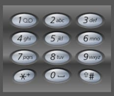
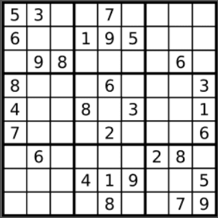
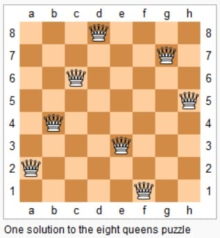
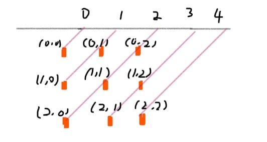

# 算法思想 - 回溯算法

> Backtracking(回溯)属于 DFS, 本文主要介绍算法中Backtracking算法的思想。回溯算法实际上一个类似枚举的搜索尝试过程，主要是在搜索尝试过程中寻找问题的解，当发现已不满足求解条件时，就“回溯”返回，尝试别的路径。回溯法是一种选优搜索法，按选优条件向前搜索，以达到目标。但当探索到某一步时，发现原先选择并不优或达不到目标，就退回一步重新选择，这种走不通就退回再走的技术为回溯法


## Backtracking

- 普通 DFS 主要用在 **可达性问题** ，这种问题只需要执行到特点的位置然后返回即可。
- 而 Backtracking 主要用于求解 **排列组合** 问题，例如有 { 'a','b','c' } 三个字符，求解所有由这三个字符排列得到的字符串，这种问题在执行到特定的位置返回之后还会继续执行求解过程。

因为 Backtracking 不是立即就返回，而要继续求解，因此在程序实现时，需要注意对元素的标记问题:

- 在访问一个新元素进入新的递归调用时，需要将新元素标记为已经访问，这样才能在继续递归调用时不用重复访问该元素；
- 但是在递归返回时，需要将元素标记为未访问，因为只需要保证在一个递归链中不同时访问一个元素，可以访问已经访问过但是不在当前递归链中的元素。

### 数字键盘组合

[17. Letter Combinations of a Phone Number (Medium)在新窗口打开](https://leetcode.com/problems/letter-combinations-of-a-phone-number/description/)



```
Input:Digit string "23"
Output: ["ad", "ae", "af", "bd", "be", "bf", "cd", "ce", "cf"].
```

```java
private static final String[] KEYS = {"", "", "abc", "def", "ghi", "jkl", "mno", "pqrs", "tuv", "wxyz"};

public List<String> letterCombinations(String digits) {
    List<String> combinations = new ArrayList<>();
    if (digits == null || digits.length() == 0) {
        return combinations;
    }
    doCombination(new StringBuilder(), combinations, digits);
    return combinations;
}

private void doCombination(StringBuilder prefix, List<String> combinations, final String digits) {
    if (prefix.length() == digits.length()) {
        combinations.add(prefix.toString());
        return;
    }
    int curDigits = digits.charAt(prefix.length()) - '0';
    String letters = KEYS[curDigits];
    for (char c : letters.toCharArray()) {
        prefix.append(c);                         // 添加
        doCombination(prefix, combinations, digits);
        prefix.deleteCharAt(prefix.length() - 1); // 删除
    }
}
```


### IP 地址划分

[93. Restore IP Addresses(Medium)在新窗口打开](https://leetcode.com/problems/restore-ip-addresses/description/)

```
Given "25525511135",
return ["255.255.11.135", "255.255.111.35"].
```

```java
public List<String> restoreIpAddresses(String s) {
    List<String> addresses = new ArrayList<>();
    StringBuilder tempAddress = new StringBuilder();
    doRestore(0, tempAddress, addresses, s);
    return addresses;
}

private void doRestore(int k, StringBuilder tempAddress, List<String> addresses, String s) {
    if (k == 4 || s.length() == 0) {
        if (k == 4 && s.length() == 0) {
            addresses.add(tempAddress.toString());
        }
        return;
    }
    for (int i = 0; i < s.length() && i <= 2; i++) {
        if (i != 0 && s.charAt(0) == '0') {
            break;
        }
        String part = s.substring(0, i + 1);
        if (Integer.valueOf(part) <= 255) {
            if (tempAddress.length() != 0) {
                part = "." + part;
            }
            tempAddress.append(part);
            doRestore(k + 1, tempAddress, addresses, s.substring(i + 1));
            tempAddress.delete(tempAddress.length() - part.length(), tempAddress.length());
        }
    }
}


```


### 在矩阵中寻找字符串

[79. Word Search (Medium)在新窗口打开](https://leetcode.com/problems/word-search/description/)

```
For example,
Given board =
[
  ['A','B','C','E'],
  ['S','F','C','S'],
  ['A','D','E','E']
]
word = "ABCCED", -> returns true,
word = "SEE", -> returns true,
word = "ABCB", -> returns false.
```

```Java
private final static int[][] direction = {{1, 0}, {-1, 0}, {0, 1}, {0, -1}};
private int m;
private int n;

public boolean exist(char[][] board, String word) {
    if (word == null || word.length() == 0) {
        return true;
    }
    if (board == null || board.length == 0 || board[0].length == 0) {
        return false;
    }

    m = board.length;
    n = board[0].length;
    boolean[][] hasVisited = new boolean[m][n];

    for (int r = 0; r < m; r++) {
        for (int c = 0; c < n; c++) {
            if (backtracking(0, r, c, hasVisited, board, word)) {
                return true;
            }
        }
    }

    return false;
}

private boolean backtracking(int curLen, int r, int c, boolean[][] visited, final char[][] board, final String word) {
    if (curLen == word.length()) {
        return true;
    }
    if (r < 0 || r >= m || c < 0 || c >= n
            || board[r][c] != word.charAt(curLen) || visited[r][c]) {

        return false;
    }

    visited[r][c] = true;

    for (int[] d : direction) {
        if (backtracking(curLen + 1, r + d[0], c + d[1], visited, board, word)) {
            return true;
        }
    }

    visited[r][c] = false;

    return false;
}
```


### 输出二叉树中所有从根到叶子的路径

[257. Binary Tree Paths (Easy)在新窗口打开](https://leetcode.com/problems/binary-tree-paths/description/)

```
  1
 /  \
2    3
 \
  5
```

```
["1->2->5", "1->3"]
```

```java
public List<String> binaryTreePaths(TreeNode root) {
    List<String> paths = new ArrayList<>();
    if (root == null) {
        return paths;
    }
    List<Integer> values = new ArrayList<>();
    backtracking(root, values, paths);
    return paths;
}

private void backtracking(TreeNode node, List<Integer> values, List<String> paths) {
    if (node == null) {
        return;
    }
    values.add(node.val);
    if (isLeaf(node)) {
        paths.add(buildPath(values));
    } else {
        backtracking(node.left, values, paths);
        backtracking(node.right, values, paths);
    }
    values.remove(values.size() - 1);
}

private boolean isLeaf(TreeNode node) {
    return node.left == null && node.right == null;
}

private String buildPath(List<Integer> values) {
    StringBuilder str = new StringBuilder();
    for (int i = 0; i < values.size(); i++) {
        str.append(values.get(i));
        if (i != values.size() - 1) {
            str.append("->");
        }
    }
    return str.toString();
}
```


### 排列

[46. Permutations (Medium)在新窗口打开](https://leetcode.com/problems/permutations/description/)

```
[1,2,3] have the following permutations:
[
  [1,2,3],
  [1,3,2],
  [2,1,3],
  [2,3,1],
  [3,1,2],
  [3,2,1]
]
```

```java
public List<List<Integer>> permute(int[] nums) {
    List<List<Integer>> permutes = new ArrayList<>();
    List<Integer> permuteList = new ArrayList<>();
    boolean[] hasVisited = new boolean[nums.length];
    backtracking(permuteList, permutes, hasVisited, nums);
    return permutes;
}

private void backtracking(List<Integer> permuteList, List<List<Integer>> permutes, boolean[] visited, final int[] nums) {
    if (permuteList.size() == nums.length) {
        permutes.add(new ArrayList<>(permuteList)); // 重新构造一个 List
        return;
    }
    for (int i = 0; i < visited.length; i++) {
        if (visited[i]) {
            continue;
        }
        visited[i] = true;
        permuteList.add(nums[i]);
        backtracking(permuteList, permutes, visited, nums);
        permuteList.remove(permuteList.size() - 1);
        visited[i] = false;
    }
}
```


### 含有相同元素求排列

[47. Permutations II (Medium)在新窗口打开](https://leetcode.com/problems/permutations-ii/description/)

```html
[1,1,2] have the following unique permutations:
[[1,1,2], [1,2,1], [2,1,1]]
```

数组元素可能含有相同的元素，进行排列时就有可能出现重复的排列，要求重复的排列只返回一个。

在实现上，和 Permutations 不同的是要先排序，然后在添加一个元素时，判断这个元素是否等于前一个元素，如果等于，并且前一个元素还未访问，那么就跳过这个元素。

```java
public List<List<Integer>> permuteUnique(int[] nums) {
    List<List<Integer>> permutes = new ArrayList<>();
    List<Integer> permuteList = new ArrayList<>();
    Arrays.sort(nums);  // 排序
    boolean[] hasVisited = new boolean[nums.length];
    backtracking(permuteList, permutes, hasVisited, nums);
    return permutes;
}

private void backtracking(List<Integer> permuteList, List<List<Integer>> permutes, boolean[] visited, final int[] nums) {
    if (permuteList.size() == nums.length) {
        permutes.add(new ArrayList<>(permuteList));
        return;
    }

    for (int i = 0; i < visited.length; i++) {
        if (i != 0 && nums[i] == nums[i - 1] && !visited[i - 1]) {
            continue;  // 防止重复
        }
        if (visited[i]){
            continue;
        }
        visited[i] = true;
        permuteList.add(nums[i]);
        backtracking(permuteList, permutes, visited, nums);
        permuteList.remove(permuteList.size() - 1);
        visited[i] = false;
    }
}
```


### 组合

[77. Combinations (Medium)在新窗口打开](https://leetcode.com/problems/combinations/description/)

```
If n = 4 and k = 2, a solution is:
[
  [2,4],
  [3,4],
  [2,3],
  [1,2],
  [1,3],
  [1,4],
]
```

```java
public List<List<Integer>> combine(int n, int k) {
    List<List<Integer>> combinations = new ArrayList<>();
    List<Integer> combineList = new ArrayList<>();
    backtracking(combineList, combinations, 1, k, n);
    return combinations;
}

private void backtracking(List<Integer> combineList, List<List<Integer>> combinations, int start, int k, final int n) {
    if (k == 0) {
        combinations.add(new ArrayList<>(combineList));
        return;
    }
    for (int i = start; i <= n - k + 1; i++) {  // 剪枝
        combineList.add(i);
        backtracking(combineList, combinations, i + 1, k - 1, n);
        combineList.remove(combineList.size() - 1);
    }
}
```


### 组合求和

[39. Combination Sum (Medium)在新窗口打开](https://leetcode.com/problems/combination-sum/description/)

given candidate set [2, 3, 6, 7] and target 7,
A solution set is:
[[7],[2, 2, 3]]

```java
public List<List<Integer>> combinationSum(int[] candidates, int target) {
    List<List<Integer>> combinations = new ArrayList<>();
    backtracking(new ArrayList<>(), combinations, 0, target, candidates);
    return combinations;
}

private void backtracking(List<Integer> tempCombination, List<List<Integer>> combinations,
                          int start, int target, final int[] candidates) {

    if (target == 0) {
        combinations.add(new ArrayList<>(tempCombination));
        return;
    }
    for (int i = start; i < candidates.length; i++) {
        if (candidates[i] <= target) {
            tempCombination.add(candidates[i]);
            backtracking(tempCombination, combinations, i, target - candidates[i], candidates);
            tempCombination.remove(tempCombination.size() - 1);
        }
    }
}
```


### 含有相同元素的求组合求和

[40. Combination Sum II (Medium)在新窗口打开](https://leetcode.com/problems/combination-sum-ii/description/)

```
For example, given candidate set [10, 1, 2, 7, 6, 1, 5] and target 8,
A solution set is:
[
  [1, 7],
  [1, 2, 5],
  [2, 6],
  [1, 1, 6]
]
```

```java
public List<List<Integer>> combinationSum2(int[] candidates, int target) {
    List<List<Integer>> combinations = new ArrayList<>();
    Arrays.sort(candidates);
    backtracking(new ArrayList<>(), combinations, new boolean[candidates.length], 0, target, candidates);
    return combinations;
}

private void backtracking(List<Integer> tempCombination, List<List<Integer>> combinations,
                          boolean[] hasVisited, int start, int target, final int[] candidates) {

    if (target == 0) {
        combinations.add(new ArrayList<>(tempCombination));
        return;
    }
    for (int i = start; i < candidates.length; i++) {
        if (i != 0 && candidates[i] == candidates[i - 1] && !hasVisited[i - 1]) {
            continue;
        }
        if (candidates[i] <= target) {
            tempCombination.add(candidates[i]);
            hasVisited[i] = true;
            backtracking(tempCombination, combinations, hasVisited, i + 1, target - candidates[i], candidates);
            hasVisited[i] = false;
            tempCombination.remove(tempCombination.size() - 1);
        }
    }
}


```


### 1-9 数字的组合求和

[216. Combination Sum III (Medium)在新窗口打开](https://leetcode.com/problems/combination-sum-iii/description/)

```html
Input: k = 3, n = 9

Output:

[[1,2,6], [1,3,5], [2,3,4]]
```

从 1-9 数字中选出 k 个数不重复的数，使得它们的和为 n。

```java
public List<List<Integer>> combinationSum3(int k, int n) {
    List<List<Integer>> combinations = new ArrayList<>();
    List<Integer> path = new ArrayList<>();
    backtracking(k, n, 1, path, combinations);
    return combinations;
}

private void backtracking(int k, int n, int start,
                          List<Integer> tempCombination, List<List<Integer>> combinations) {

    if (k == 0 && n == 0) {
        combinations.add(new ArrayList<>(tempCombination));
        return;
    }
    if (k == 0 || n == 0) {
        return;
    }
    for (int i = start; i <= 9; i++) {
        tempCombination.add(i);
        backtracking(k - 1, n - i, i + 1, tempCombination, combinations);
        tempCombination.remove(tempCombination.size() - 1);
    }
}
```


### 子集

[78. Subsets (Medium)在新窗口打开](https://leetcode.com/problems/subsets/description/)

找出集合的所有子集，子集不能重复，[1, 2] 和 [2, 1] 这种子集算重复

```java
public List<List<Integer>> subsets(int[] nums) {
    List<List<Integer>> subsets = new ArrayList<>();
    List<Integer> tempSubset = new ArrayList<>();
    for (int size = 0; size <= nums.length; size++) {
        backtracking(0, tempSubset, subsets, size, nums); // 不同的子集大小
    }
    return subsets;
}

private void backtracking(int start, List<Integer> tempSubset, List<List<Integer>> subsets,
                          final int size, final int[] nums) {

    if (tempSubset.size() == size) {
        subsets.add(new ArrayList<>(tempSubset));
        return;
    }
    for (int i = start; i < nums.length; i++) {
        tempSubset.add(nums[i]);
        backtracking(i + 1, tempSubset, subsets, size, nums);
        tempSubset.remove(tempSubset.size() - 1);
    }
}
```


### 含有相同元素求子集

[90. Subsets II (Medium)在新窗口打开](https://leetcode.com/problems/subsets-ii/description/)

```
For example,
If nums = [1,2,2], a solution is:

[
  [2],
  [1],
  [1,2,2],
  [2,2],
  [1,2],
  []
]
```

```java
public List<List<Integer>> subsetsWithDup(int[] nums) {
    Arrays.sort(nums);
    List<List<Integer>> subsets = new ArrayList<>();
    List<Integer> tempSubset = new ArrayList<>();
    boolean[] hasVisited = new boolean[nums.length];
    for (int size = 0; size <= nums.length; size++) {
        backtracking(0, tempSubset, subsets, hasVisited, size, nums); // 不同的子集大小
    }
    return subsets;
}

private void backtracking(int start, List<Integer> tempSubset, List<List<Integer>> subsets, boolean[] hasVisited,
                          final int size, final int[] nums) {

    if (tempSubset.size() == size) {
        subsets.add(new ArrayList<>(tempSubset));
        return;
    }
    for (int i = start; i < nums.length; i++) {
        if (i != 0 && nums[i] == nums[i - 1] && !hasVisited[i - 1]) {
            continue;
        }
        tempSubset.add(nums[i]);
        hasVisited[i] = true;
        backtracking(i + 1, tempSubset, subsets, hasVisited, size, nums);
        hasVisited[i] = false;
        tempSubset.remove(tempSubset.size() - 1);
    }
}


```


### 分割字符串使得每个部分都是回文数

[131. Palindrome Partitioning (Medium)在新窗口打开](https://leetcode.com/problems/palindrome-partitioning/description/)

```
For example, given s = "aab",
Return

[
  ["aa","b"],
  ["a","a","b"]
]
```

```java
public List<List<String>> partition(String s) {
    List<List<String>> partitions = new ArrayList<>();
    List<String> tempPartition = new ArrayList<>();
    doPartition(s, partitions, tempPartition);
    return partitions;
}

private void doPartition(String s, List<List<String>> partitions, List<String> tempPartition) {
    if (s.length() == 0) {
        partitions.add(new ArrayList<>(tempPartition));
        return;
    }
    for (int i = 0; i < s.length(); i++) {
        if (isPalindrome(s, 0, i)) {
            tempPartition.add(s.substring(0, i + 1));
            doPartition(s.substring(i + 1), partitions, tempPartition);
            tempPartition.remove(tempPartition.size() - 1);
        }
    }
}

private boolean isPalindrome(String s, int begin, int end) {
    while (begin < end) {
        if (s.charAt(begin++) != s.charAt(end--)) {
            return false;
        }
    }
    return true;
}

```


### 数独

[37. Sudoku Solver (Hard)在新窗口打开](https://leetcode.com/problems/sudoku-solver/description/)



```java
private boolean[][] rowsUsed = new boolean[9][10];
private boolean[][] colsUsed = new boolean[9][10];
private boolean[][] cubesUsed = new boolean[9][10];
private char[][] board;

public void solveSudoku(char[][] board) {
    this.board = board;
    for (int i = 0; i < 9; i++)
        for (int j = 0; j < 9; j++) {
            if (board[i][j] == '.') {
                continue;
            }
            int num = board[i][j] - '0';
            rowsUsed[i][num] = true;
            colsUsed[j][num] = true;
            cubesUsed[cubeNum(i, j)][num] = true;
        }

    for (int i = 0; i < 9; i++) {
        for (int j = 0; j < 9; j++) {
            backtracking(i, j);
        }
    }
}

private boolean backtracking(int row, int col) {
    while (row < 9 && board[row][col] != '.') {
        row = col == 8 ? row + 1 : row;
        col = col == 8 ? 0 : col + 1;
    }
    if (row == 9) {
        return true;
    }
    for (int num = 1; num <= 9; num++) {
        if (rowsUsed[row][num] || colsUsed[col][num] || cubesUsed[cubeNum(row, col)][num]) {
            continue;
        }
        rowsUsed[row][num] = colsUsed[col][num] = cubesUsed[cubeNum(row, col)][num] = true;
        board[row][col] = (char) (num + '0');
        if (backtracking(row, col)) {
            return true;
        }
        board[row][col] = '.';
        rowsUsed[row][num] = colsUsed[col][num] = cubesUsed[cubeNum(row, col)][num] = false;
    }
    return false;
}

private int cubeNum(int i, int j) {
    int r = i / 3;
    int c = j / 3;
    return r * 3 + c;
}
```


### N 皇后

[51. N-Queens (Hard)在新窗口打开](https://leetcode.com/problems/n-queens/description/)



在 n*n 的矩阵中摆放 n 个皇后，并且每个皇后不能在同一行，同一列，同一对角线上，求所有的 n 皇后的解。

一行一行地摆放，在确定一行中的那个皇后应该摆在哪一列时，需要用三个标记数组来确定某一列是否合法，这三个标记数组分别为: 列标记数组、45 度对角线标记数组和 135 度对角线标记数组。

45 度对角线标记数组的维度为 2 * n - 1，通过下图可以明确 (r, c) 的位置所在的数组下标为 r + c。



135 度对角线标记数组的维度也是 2 * n - 1，(r, c) 的位置所在的数组下标为 n - 1 - (r - c)。


```java
private List<List<String>> solutions;
private char[][] nQueens;
private boolean[] colUsed;
private boolean[] diagonals45Used;
private boolean[] diagonals135Used;
private int n;

public List<List<String>> solveNQueens(int n) {
    solutions = new ArrayList<>();
    nQueens = new char[n][n];
    for (int i = 0; i < n; i++) {
        Arrays.fill(nQueens[i], '.');
    }
    colUsed = new boolean[n];
    diagonals45Used = new boolean[2 * n - 1];
    diagonals135Used = new boolean[2 * n - 1];
    this.n = n;
    backtracking(0);
    return solutions;
}

private void backtracking(int row) {
    if (row == n) {
        List<String> list = new ArrayList<>();
        for (char[] chars : nQueens) {
            list.add(new String(chars));
        }
        solutions.add(list);
        return;
    }

    for (int col = 0; col < n; col++) {
        int diagonals45Idx = row + col;
        int diagonals135Idx = n - 1 - (row - col);
        if (colUsed[col] || diagonals45Used[diagonals45Idx] || diagonals135Used[diagonals135Idx]) {
            continue;
        }
        nQueens[row][col] = 'Q';
        colUsed[col] = diagonals45Used[diagonals45Idx] = diagonals135Used[diagonals135Idx] = true;
        backtracking(row + 1);
        colUsed[col] = diagonals45Used[diagonals45Idx] = diagonals135Used[diagonals135Idx] = false;
        nQueens[row][col] = '.';
    }
}
```

